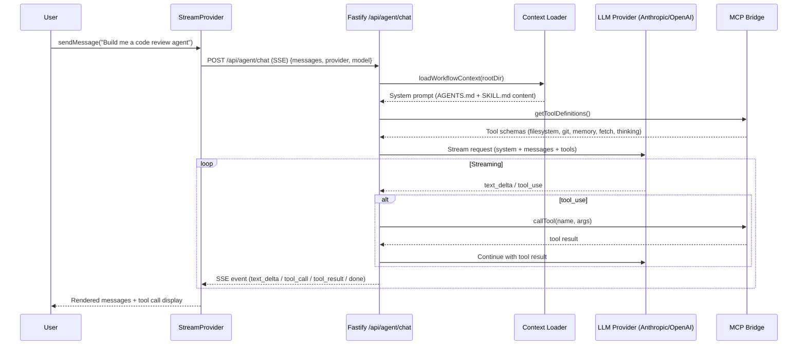
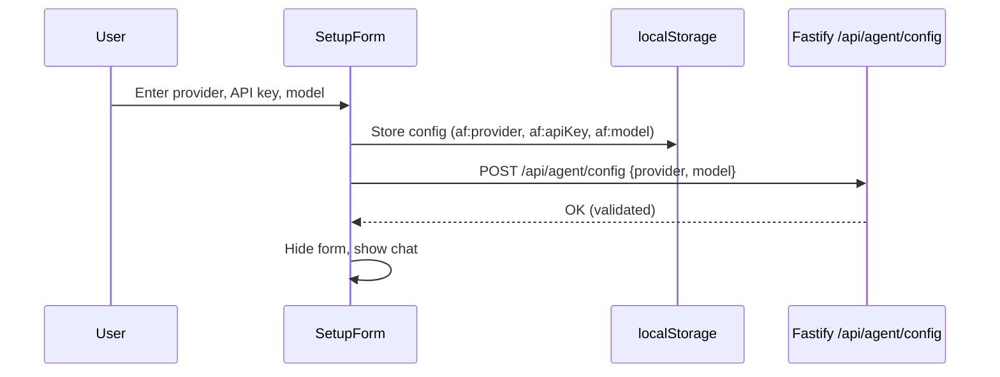

# Design Document: Agent Runtime (LangSmith Studio-Style)

## Overview

This spec replaces the custom orchestrator service with a LangSmith Studio-style agent runtime. Instead of building a custom agent with hardcoded prompts and a custom parser, we create a thin LLM proxy that:

1. Lets users configure their own LLM provider (Anthropic, OpenAI, etc.)
2. Injects AgentFlow workflow context (AGENTS.md, SKILL.md files) as system prompt — the LLM reads the markdown directly, no custom parser needed
3. Bridges official MCP servers from the registry (`@modelcontextprotocol/server-filesystem`, `server-git`, `server-memory`, `server-fetch`, `server-sequentialthinking`) so the LLM has real tools — zero custom tools built from scratch
4. Streams responses back via SSE, following the same patterns as LangChain's `agent-chat-ui`

The frontend adapts the `agent-chat-ui` (MIT) architecture: a StreamProvider context, Thread component with stick-to-bottom scroll, tool call visualization, and a setup form for provider configuration. This mimics what a user would experience in LangSmith Studio when consuming our workflows, which is exactly the dogfooding goal.

## Architecture

### System Architecture

```
┌─────────────────────────────────────────────────────────┐
│                    Frontend (React/Vite)                  │
│                                                          │
│  ┌──────────┐  ┌──────────────┐  ┌───────────────────┐  │
│  │ SetupForm│  │StreamProvider│  │  Thread + Messages │  │
│  │(provider │  │(SSE context, │  │  (tool calls,     │  │
│  │ config)  │  │ messages,    │  │   markdown render, │  │
│  └──────────┘  │ submit/stop) │  │   stick-to-bottom) │  │
│                └──────┬───────┘  └───────────────────┘  │
│                       │ POST /api/agent/chat (SSE)       │
└───────────────────────┼──────────────────────────────────┘
                        │
┌───────────────────────┼──────────────────────────────────┐
│              Backend (Fastify)                            │
│                       │                                  │
│  ┌────────────────────▼─────────────────────┐            │
│  │         Agent Chat Handler               │            │
│  │  1. Load workflow context from disk      │            │
│  │  2. Build system prompt from AGENTS.md   │            │
│  │  3. Attach MCP tool definitions          │            │
│  │  4. Call LLM provider API (streaming)    │            │
│  │  5. Handle tool_use → call MCP server    │            │
│  │  6. Stream SSE events back to client     │            │
│  └──────────┬───────────────────────────────┘            │
│             │                                            │
│  ┌──────────▼───────────────────────────────┐            │
│  │         MCP Bridge                        │            │
│  │  Spawns & manages official MCP servers:   │            │
│  │  • @modelcontextprotocol/server-filesystem│            │
│  │  • @modelcontextprotocol/server-git       │            │
│  │  • @modelcontextprotocol/server-memory    │            │
│  │  • @modelcontextprotocol/server-fetch     │            │
│  │  • @modelcontextprotocol/server-sequentialthinking    │
│  │  Communicates via stdio JSON-RPC          │            │
│  └───────────────────────────────────────────┘            │
│                                                          │
│  ┌───────────────────────────────────────────┐            │
│  │  Existing Services (unchanged)            │            │
│  │  • workflow-service (parse/validate)       │            │
│  │  • scaffold-gen-service (create workspace) │            │
│  │  • git-service, template-service           │            │
│  │  • dry-run, tokens, export (utility routes)│            │
│  └───────────────────────────────────────────┘            │
└──────────────────────────────────────────────────────────┘
```

### Chat Request Flow



### Provider Configuration Flow



## Components and Interfaces

### Component 1: Agent Config Service (Backend)

**Purpose**: Manages LLM provider configuration. Stores provider/model selection server-side (in-memory for the session), validates API keys by making a test call.

**Interface**:
```javascript
// agentflow/src/services/agent-config-service.js
function createAgentConfigService(ctx) {
  return {
    getConfig()           // → { provider, model, hasApiKey }
    setConfig(params)     // → ServiceResult<config>  (validates key with test call)
    getProviders()        // → [{ id, name, models[] }]
  }
}
```

**Supported Providers**:
- `anthropic` — Claude models (claude-sonnet-4-20250514, etc.)
- `openai` — GPT models (gpt-4o, gpt-4o-mini, etc.)

API keys are passed per-request from the client (stored in localStorage, never persisted server-side).

### Component 2: MCP Bridge (Backend)

**Purpose**: Spawns and manages official MCP servers as child processes. Communicates via stdio JSON-RPC. Exposes tool definitions to the LLM and routes tool calls to the correct server.

**Interface**:
```javascript
// agentflow/src/services/mcp-bridge.js
function createMCPBridge(ctx) {
  return {
    async initialize()                    // Spawn MCP server processes
    async getToolDefinitions()            // → tool schemas for LLM function calling
    async callTool(serverName, toolName, args)  // → tool result
    async shutdown()                      // Kill child processes
  }
}
```

**MCP Servers (all from `@modelcontextprotocol` official registry)**:

| Server | Package | Tools | Purpose |
|--------|---------|-------|---------|
| filesystem | `@modelcontextprotocol/server-filesystem` | read_file, write_file, edit_file, list_directory, search_files, create_directory, move_file, get_file_info | File operations within workspace |
| git | `@modelcontextprotocol/server-git` | git_status, git_diff, git_log, git_commit, git_branch, git_checkout | Git operations |
| memory | `@modelcontextprotocol/server-memory` | create_entities, create_relations, search_nodes, open_nodes, add_observations | Persistent memory across conversations |
| fetch | `@modelcontextprotocol/server-fetch` | fetch | Web content fetching |
| sequentialthinking | `@modelcontextprotocol/server-sequentialthinking` | sequentialthinking | Structured reasoning |

Each server is spawned via `npx @modelcontextprotocol/server-<name>` with stdio transport. The bridge translates between the MCP JSON-RPC protocol and our internal tool call format.

### Component 3: Agent Chat Handler (Backend)

**Purpose**: The core chat endpoint. Loads workflow context, builds system prompt, calls LLM with tool definitions, handles the tool-use loop, and streams SSE events.

**Interface**:
```javascript
// agentflow/src/services/agent-chat-service.js
function createAgentChatService(ctx) {
  return {
    async *chat(params)   // AsyncGenerator<SSEEvent>
    // params: { messages, provider, model, apiKey, workflowId? }
  }
}
```

**System Prompt Construction**:
The system prompt is built by reading the actual workflow files from disk:
1. Read root `AGENTS.md` — identity, role, constraints
2. Read workflow `AGENTS.md` — node summaries, edges
3. Read each node's `SKILL.md` — instructions, refs
4. Read referenced tools/skills/templates from the workspace
5. Concatenate into a structured system prompt

The LLM reads the markdown directly — no custom parser. This is exactly how a user would consume our workflows in any agent platform.

**SSE Event Types**:
```typescript
type AgentSSEEvent =
  | { type: 'text_delta'; content: string }
  | { type: 'tool_call'; id: string; name: string; input: Record<string, unknown> }
  | { type: 'tool_result'; id: string; name: string; result: string; isError: boolean }
  | { type: 'error'; message: string; recoverable: boolean }
  | { type: 'done' }
```

**Tool Use Loop**:
When the LLM returns a `tool_use` block:
1. Route the call to the appropriate MCP server via the bridge
2. Send the result back to the LLM as a `tool_result` message
3. Continue streaming until the LLM produces a final text response
4. Emit `done` event

### Component 4: Setup Form (Frontend)

**Purpose**: Configuration form shown when provider settings are missing. Adapted from `agent-chat-ui`'s setup form pattern. Collects provider, API key, and model.

**Interface**:
```typescript
// ui/src/components/agent/SetupForm.tsx
interface SetupFormProps {
  onConfigured: () => void
}

// Stores in localStorage:
// af:provider  — 'anthropic' | 'openai'
// af:apiKey    — API key string
// af:model     — model identifier
```

**Fields**:
- Provider selector (Anthropic / OpenAI dropdown)
- API Key (password input, stored in localStorage)
- Model selector (populated based on provider)
- "Connect" button — validates by calling `/api/agent/config`

### Component 5: StreamProvider (Frontend)

**Purpose**: React context managing the SSE connection to `/api/agent/chat`. Adapted from `agent-chat-ui`'s `StreamProvider` pattern. Provides messages, streaming state, and submit/cancel actions.

**Interface**:
```typescript
// ui/src/components/agent/StreamProvider.tsx
interface StreamContextValue {
  messages: AgentMessage[]
  isStreaming: boolean
  error: string | null
  submit: (text: string) => Promise<void>
  stop: () => void
  reset: () => void
}

interface AgentMessage {
  id: string
  role: 'user' | 'assistant' | 'tool'
  content: string
  timestamp: number
  toolCalls?: ToolCallDisplay[]
}

interface ToolCallDisplay {
  id: string
  name: string
  input: Record<string, unknown>
  result?: string
  status: 'pending' | 'success' | 'error'
}
```

**Responsibilities**:
- Opens SSE connection to `/api/agent/chat` on submit
- Parses SSE events: text_delta, tool_call, tool_result, error, done
- Accumulates assistant text from text_delta events
- Tracks tool calls with their results for visualization
- Handles cancel via AbortController
- Preserves message history across errors

### Component 6: Thread Component (Frontend)

**Purpose**: Renders the message list with stick-to-bottom scroll. Adapted from `agent-chat-ui`'s Thread component. Shows user messages, assistant messages with markdown, and tool call/result displays.

**Interface**:
```typescript
// ui/src/components/agent/Thread.tsx
// Uses useStream() context — no props needed

// Message renderers:
// - UserMessage: right-aligned bubble
// - AssistantMessage: left-aligned, markdown via react-markdown
// - ToolCallMessage: collapsible tool call with name, input JSON, result
```

**Features**:
- Stick-to-bottom scroll via `use-stick-to-bottom`
- Scroll-to-bottom button when scrolled up
- Streaming indicator (animated dots)
- Tool call visualization: collapsible cards showing tool name, input, and result
- Markdown rendering via react-markdown + remark-gfm

### Component 7: Agent Routes (Backend)

**Purpose**: Fastify routes for the agent runtime.

**Endpoints**:
```
GET  /api/agent/config          — Get current provider config
POST /api/agent/config          — Set provider config (validate key)
GET  /api/agent/providers       — List available providers + models
POST /api/agent/chat            — SSE streaming chat endpoint
GET  /api/agent/tools           — List available MCP tools
```

The existing utility routes (dry-run, tokens, export) stay in `orchestrator-routes.js` but are renamed to `/api/tools/*` to avoid confusion.

## Data Models

### Model 1: Provider Config

```typescript
interface ProviderConfig {
  provider: 'anthropic' | 'openai'
  model: string
  apiKey: string  // Only in-transit, never persisted server-side
}

const PROVIDERS = {
  anthropic: {
    name: 'Anthropic',
    models: ['claude-sonnet-4-20250514', 'claude-haiku-35-20241022'],
    defaultModel: 'claude-sonnet-4-20250514',
    baseUrl: 'https://api.anthropic.com',
  },
  openai: {
    name: 'OpenAI',
    models: ['gpt-4o', 'gpt-4o-mini', 'gpt-4.1'],
    defaultModel: 'gpt-4o',
    baseUrl: 'https://api.openai.com',
  },
}
```

### Model 2: MCP Tool Definition

```typescript
// Translated from MCP JSON-RPC tool schema to LLM function calling format
interface MCPToolDefinition {
  server: string           // Which MCP server owns this tool
  name: string             // Tool name (e.g., 'read_file')
  description: string      // Human-readable description
  inputSchema: object      // JSON Schema for parameters
}
```

### Model 3: Agent Message

```typescript
interface AgentMessage {
  id: string
  role: 'user' | 'assistant' | 'tool'
  content: string
  timestamp: number
  toolCalls?: ToolCallDisplay[]
}

interface ToolCallDisplay {
  id: string
  name: string
  serverName: string
  input: Record<string, unknown>
  result?: string
  status: 'pending' | 'success' | 'error'
}
```

## What Gets Scrapped

| File | Action | Reason |
|------|--------|--------|
| `orchestrator-service.js` | **REPLACE** | `buildWorkspaceContext()` replaced by direct file reading; LLM calls replaced by agent-chat-service |
| `orchestrator-routes.js` | **SIMPLIFY** | Remove chat endpoint; keep utility routes (dry-run, tokens, export) |
| `builder-chat-service.js` | **DELETE** | Already gutted; fully superseded by agent-chat-service |
| `builder-prompt.js` | Already deleted | — |
| `ui/src/components/chat/StreamProvider.tsx` | **REWRITE** | New agent-style StreamProvider |
| `ui/src/components/chat/use-sse-parser.ts` | **REWRITE** | Simpler SSE parser for new event types |
| `ui/src/components/chat/Thread.tsx` | **REWRITE** | New Thread with tool call visualization |
| `ui/src/components/chat/MessageInput.tsx` | **KEEP** | Minor updates |
| `ui/src/store/slices/builder-slice.ts` | **REPLACE** | New agent-slice with simpler state |

## What Stays

- `workflow-service.js`, `scaffold-gen-service.js`, `template-service.js`, `git-service.js` — unchanged
- `validation-service.js` — unchanged
- Visual graph editor (Graph Mode) — unchanged
- Library browser — unchanged
- All workflows in `library/workflows/` — unchanged
- Onboarding — unchanged
- Utility routes (dry-run, tokens, export) — moved but unchanged
- `AgentPreviewSidebar.tsx`, `ChatMode.tsx` — updated to use new StreamProvider

## MCP Server Configuration

The MCP servers are configured via a `protocols.json` file in the workspace root (aligns with Spec 4 — Protocol Layer):

```json
{
  "mcp": {
    "servers": {
      "filesystem": {
        "command": "npx",
        "args": ["@modelcontextprotocol/server-filesystem", "{rootDir}"],
        "enabled": true
      },
      "git": {
        "command": "npx",
        "args": ["@modelcontextprotocol/server-git"],
        "env": { "GIT_DIR": "{rootDir}" },
        "enabled": true
      },
      "memory": {
        "command": "npx",
        "args": ["@modelcontextprotocol/server-memory"],
        "enabled": true
      },
      "fetch": {
        "command": "npx",
        "args": ["@modelcontextprotocol/server-fetch"],
        "enabled": true
      },
      "sequentialthinking": {
        "command": "npx",
        "args": ["@modelcontextprotocol/server-sequentialthinking"],
        "enabled": true
      }
    }
  }
}
```

Users can add/remove MCP servers via this config. The MCP Bridge reads this on startup and spawns the enabled servers.

## Dependencies

### New Dependencies
- `@modelcontextprotocol/sdk` — MCP client SDK for communicating with MCP servers via stdio
- `@anthropic-ai/sdk` — Direct Anthropic API client (streaming + tool use)
- `openai` — Direct OpenAI API client (streaming + tool use)
- `use-stick-to-bottom` — Chat scroll behavior (already in ui/package.json)

### Removed Dependencies
- `@langchain/anthropic`, `@langchain/openai`, `langchain` — replaced by direct SDK calls (simpler, fewer abstractions)

### Kept Dependencies
- `react-markdown`, `remark-gfm` — markdown rendering in chat
- `zod` — schema validation
- `fastify` — API server
- All shadcn/ui components from Spec 1

## Security Considerations

- API keys are stored in localStorage on the client, passed per-request, never persisted server-side
- MCP servers are sandboxed to the workspace directory (filesystem server gets `rootDir` as allowed directory)
- No secrets written to workflow files
- MCP server processes are killed on server shutdown

## Performance Considerations

- MCP servers are spawned once on startup, reused across requests (not per-request)
- Tool definitions are cached after first `tools/list` call to each MCP server
- SSE streaming avoids buffering — chunks sent as they arrive from LLM
- Workflow context is loaded once per chat request (file reads are fast for small markdown files)
