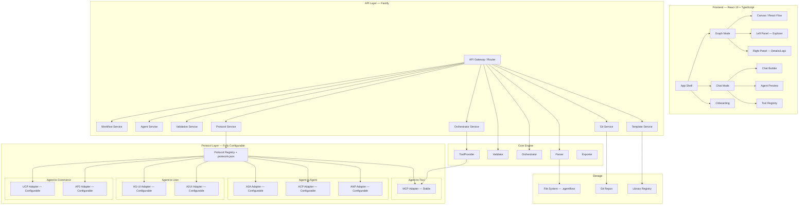
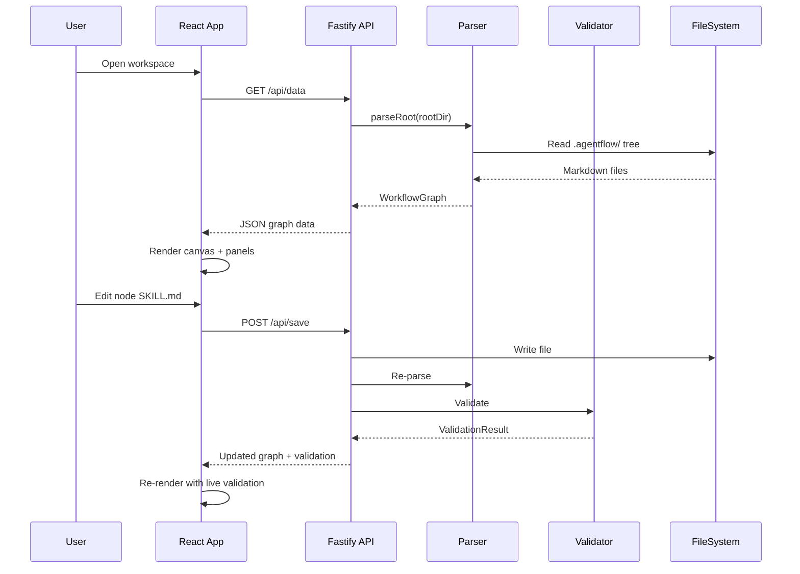
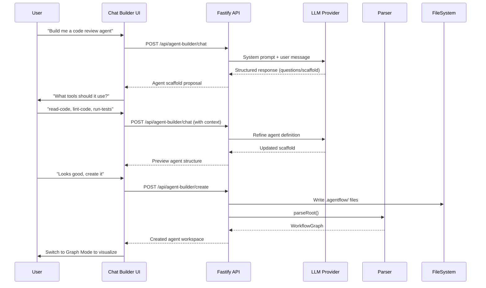

# Design Document: AgentFlow Production-Ready Overhaul

## Overview

AgentFlow is an open-source visual agent workflow builder that uses a directory-as-architecture approach — markdown files in folders define agent workflows consumable by any AI system. The current codebase has a working parser, orchestrator, MCP integration, validation, Git sync, and a React-based visual editor with ~45 components. However, the UI needs a complete redesign, the backend needs production hardening, and the entire codebase needs standardization for open-source readiness.

This overhaul transforms AgentFlow from a functional prototype into a production-grade, extensible platform. The design draws from industry patterns observed in LangGraph Studio (graph + chat dual modes), LangSmith Agent Builder (chat-first agent creation), OpenAI Agent Builder (visual canvas with typed nodes), and n8n (clean flat UI, template marketplace). The core philosophy remains: directory-is-architecture, progressive strictness, platform agnostic, zero code dependency for the format itself.

The overhaul spans seven domains: (1) Backend Architecture — modular service layer, error handling, observability, rate limiting; (2) UI Redesign — three-panel layout, dual-mode (Graph/Chat), flat modern design system; (3) Agent Creation Chat — conversational agent builder inspired by LangSmith; (4) Onboarding — progressive walkthrough system; (5) Template & Library System — standardized templates across all six categories; (6) Protocol Extensibility — fully configurable, protocol-agnostic adapter layer supporting all known agent protocols (MCP, A2A, ACP, ANP, AG-UI, A2UI, UCP, AP2, and any future protocol) via a generic registry and `protocols.json` config; (7) DRY Cleanup — shared utilities, consistent patterns, comprehensive commenting.

## Architecture

### System Architecture (Current → Target)



### Request Flow — Graph Mode



### Request Flow — Chat Agent Builder




## Components and Interfaces

### Component 1: Service Layer (Backend Refactor)

**Purpose**: Replace the monolithic `server.js` with a modular service architecture. Each domain gets its own service module with consistent error handling, input validation, and logging.

**Interface**:

```typescript
// src/services/base-service.ts — All services extend this
interface ServiceContext {
  rootDir: string
  logger: Logger
  parser: ParserModule
  validator: ValidatorModule
}

interface ServiceResult<T> {
  success: boolean
  data?: T
  error?: ServiceError
}

interface ServiceError {
  code: string           // e.g. 'VALIDATION_FAILED', 'FILE_NOT_FOUND'
  message: string
  details?: unknown
  statusCode: number     // HTTP status code
}

// src/services/workflow-service.ts
interface WorkflowService {
  getData(): Promise<ServiceResult<WorkflowGraph>>
  save(edits: FileEdit[]): Promise<ServiceResult<WorkflowGraph>>
  create(path: string, content: string): Promise<ServiceResult<WorkflowGraph>>
  delete(path: string): Promise<ServiceResult<WorkflowGraph>>
  move(from: string, to: string): Promise<ServiceResult<TreeNode>>
  validate(options?: ValidateOptions): Promise<ServiceResult<ValidationResult>>
  getTree(): Promise<ServiceResult<TreeNode>>
  dryRun(options: DryRunOptions): Promise<ServiceResult<DryRunResult>>
  calculateTokens(options: TokenOptions): Promise<ServiceResult<TokenResult>>
  exportWorkflow(options: ExportOptions): Promise<ServiceResult<ExportBundle | Blob>>
}

// src/services/agent-builder-service.ts
interface AgentBuilderService {
  chat(messages: ChatMessage[], context: BuilderContext): Promise<ServiceResult<BuilderResponse>>
  createAgent(scaffold: AgentScaffold): Promise<ServiceResult<WorkflowGraph>>
  listTemplates(category?: string): Promise<ServiceResult<AgentTemplate[]>>
  previewAgent(scaffold: AgentScaffold): Promise<ServiceResult<PreviewResult>>
}

// src/services/protocol-service.ts
interface ProtocolService {
  listAdapters(): Promise<ServiceResult<ProtocolAdapter[]>>
  getAdapter(protocol: string): Promise<ServiceResult<ProtocolAdapter>>
  executeToolCall(protocol: string, call: ToolCall): Promise<ServiceResult<ToolResult>>
}
```

**Responsibilities**:
- Centralized error handling with typed error codes
- Input validation via Zod schemas at the service boundary
- Consistent `ServiceResult<T>` return type across all services
- Logging with structured context (request ID, operation, duration)

### Component 2: UI Design System

**Purpose**: Rip out all current MUI components and rebuild the entire UI from scratch using shadcn/ui + Tailwind CSS + Radix UI primitives. Every single element — buttons, panels, tabs, inputs, cards, modals, dropdowns, trees, badges, alerts, switches, tooltips — comes from shadcn/ui. No MUI, no custom CSS components. The aesthetic follows v0/Cursor/LangGraph Studio: flat, tight spacing, semantic color tokens via CSS variables, Inter + JetBrains Mono fonts, 3-5 color palette max.

**Tech Stack (replaces MUI entirely)**:
- `shadcn/ui` — component library (Button, Card, Tabs, Dialog, Sheet, Badge, Alert, Switch, Input, Command, Tooltip, Popover, ScrollArea, Separator, etc.)
- `tailwindcss` v4 — utility-first CSS (already in project)
- `@radix-ui/*` — accessible primitives (installed by shadcn)
- `lucide-react` — icons (already in project, replaces MUI icons)
- `cmdk` — command palette (via shadcn Command component)
- `@xyflow/react` — canvas (keep, it's good)
- `zustand` — state (keep)
- `class-variance-authority` + `clsx` + `tailwind-merge` — variant management (shadcn standard)

**What gets removed**:
- `@mui/material` — entire package
- All `Dialog`, `DialogTitle`, `DialogContent`, `DialogActions` from MUI
- All `TextField`, `Button`, `ToggleButton`, `ToggleButtonGroup` from MUI
- All `Typography`, `Box`, `CircularProgress` from MUI
- All `sx` prop usage — replaced by Tailwind classes
- All MUI theme provider — replaced by Tailwind CSS variables + shadcn theming

**Interface**:

```typescript
// ui/src/design-system/tokens.ts
interface DesignTokens {
  colors: {
    // Semantic colors
    surface: { base: string; raised: string; overlay: string }
    border: { subtle: string; default: string; strong: string }
    text: { primary: string; secondary: string; muted: string }
    // Status colors
    status: {
      running: string    // blue
      success: string    // green
      error: string      // red
      waiting: string    // amber
      idle: string       // gray
    }
    // Node type colors
    nodeType: {
      step: string       // blue
      router: string     // purple
      subWorkflow: string // teal
      agent: string      // indigo
    }
  }
  spacing: Record<'xs' | 'sm' | 'md' | 'lg' | 'xl', number>
  radius: Record<'sm' | 'md' | 'lg' | 'full', number>
  shadows: Record<'sm' | 'md' | 'lg', string>
  typography: {
    mono: string         // Code font
    sans: string         // UI font
    sizes: Record<'xs' | 'sm' | 'md' | 'lg' | 'xl', string>
  }
}

// ui/src/design-system/components.ts — Shared primitives
interface PanelProps {
  title: string
  icon?: ReactNode
  actions?: ReactNode
  collapsible?: boolean
  children: ReactNode
}

interface StatusBadgeProps {
  status: 'running' | 'success' | 'error' | 'waiting' | 'idle'
  label?: string
  size?: 'sm' | 'md'
}

interface NodeChipProps {
  nodeType: 'step' | 'router' | 'sub-workflow'
  label: string
  onClick?: () => void
}
```

**Responsibilities**:
- Single source of truth for all visual tokens (colors, spacing, typography)
- Reusable primitive components (Panel, StatusBadge, NodeChip, RefTag)
- Dark/light mode via CSS custom properties (not runtime theme switching)
- Consistent node type color coding across canvas, panels, and chat

### Component 3: Three-Panel Layout (Graph Mode)

**Purpose**: Implement the industry-standard three-panel layout for agent workflow editing. Left panel for navigation/context, center for the canvas, right panel for details/actions/logs.

**Interface**:

```typescript
// ui/src/components/layout/ThreePanelLayout.tsx
interface ThreePanelLayoutProps {
  mode: 'graph' | 'chat'
  leftPanel: {
    tabs: PanelTab[]          // Explorer, Elements, Templates
    defaultTab: string
    width: number             // Resizable
    collapsible: boolean
  }
  centerContent: ReactNode    // Canvas or Chat
  rightPanel: {
    tabs: PanelTab[]          // Details, Validation, Logs, MCP
    defaultTab: string
    width: number
    collapsible: boolean
  }
  statusBar: ReactNode
}

interface PanelTab {
  id: string
  label: string
  icon: ReactNode
  content: ReactNode
  badge?: number              // e.g. error count
}

// Mode switcher at top
interface ModeSwitcherProps {
  currentMode: 'graph' | 'chat'
  onModeChange: (mode: 'graph' | 'chat') => void
}
```

**Responsibilities**:
- Resizable panels with drag handles (persist widths to localStorage)
- Collapsible panels with keyboard shortcuts (Cmd+B left, Cmd+J right)
- Mode switcher between Graph Mode and Chat Mode
- Status bar at bottom showing: workspace path, validation status, node count, connection status

### Component 4: Agent Builder Chat

**Purpose**: Chat-first agent creation interface inspired by LangSmith's "Turn any chat into an agent" pattern. Users describe what they want conversationally; the system scaffolds the `.agentflow/` workspace.

**Interface**:

```typescript
// ui/src/components/chat/AgentBuilderChat.tsx
interface AgentBuilderChatProps {
  onAgentCreated: (graph: WorkflowGraph) => void
  templates: AgentTemplate[]
}

interface BuilderContext {
  conversationHistory: ChatMessage[]
  currentScaffold?: AgentScaffold
  availableTools: LibraryEntry[]
  availableSkills: LibraryEntry[]
  selectedPattern?: AgentPattern
}

// The four core components (inspired by LangSmith)
interface AgentScaffold {
  name: string
  description: string
  identity: {
    name: string
    role: string
    constraints: string[]
  }
  pattern: AgentPattern           // Single, Supervisor, Router, Handoff, Pipeline
  tools: string[]                 // Selected from library
  skills: string[]                // Selected from library
  interactions: string[]
  memory: string[]
  nodes: ScaffoldNode[]
  edges: ScaffoldEdge[]
}

type AgentPattern =
  | 'single'        // One agent, one job
  | 'supervisor'    // Central orchestrator delegates
  | 'router'        // Lightweight dispatcher
  | 'handoff'       // Sequential chain
  | 'blackboard'    // Shared memory store
  | 'pipeline'      // Mechanical transform chain

interface ChatMessage {
  role: 'user' | 'assistant' | 'system'
  content: string
  metadata?: {
    scaffoldUpdate?: Partial<AgentScaffold>
    suggestedTools?: string[]
    suggestedPattern?: AgentPattern
  }
}
```

**Responsibilities**:
- Guided conversation flow: purpose → pattern → tools → nodes → review → create
- Live preview panel showing the agent structure as it's built
- Tool/skill picker integrated into chat (suggest from library)
- Pattern selection with visual previews of the six agent patterns
- One-click creation that writes all `.agentflow/` files

### Component 5: Universal Protocol Adapter Layer

**Purpose**: Fully configurable, protocol-agnostic architecture where ANY agent protocol can be registered, enabled, or disabled via `protocols.json`. The system ships with MCP as the only stable adapter; all others are configurable and opt-in. Nothing is enforced — users enable what they need.

**Protocol Taxonomy** (5 categories, 10+ protocols):

| Category | Protocol | By | Purpose | Status |
|----------|----------|----|---------|--------|
| Agent-to-Tool | **MCP** | Anthropic / Linux Foundation | Connect agents to tools, data, APIs via JSON-RPC servers | Stable (shipped) |
| Agent-to-Agent | **A2A** | Google | Peer-to-peer agent discovery (Agent Cards), task delegation, SSE streaming | Configurable |
| Agent-to-Agent | **ACP** | IBM BeeAI / Linux Foundation | REST-native async agent messaging, multimodal, no SDK required | Configurable |
| Agent-to-Agent | **ANP** | W3C Community Group | Decentralized identity (W3C DID), end-to-end encryption, semantic discovery via JSON-LD | Configurable |
| Agent-to-User | **AG-UI** | CopilotKit | Event-based SSE streaming protocol (16 event types) for agent↔frontend communication | Configurable |
| Agent-to-User | **A2UI** | Google | Declarative JSON UI — agents emit component trees, clients render natively (18 primitives) | Configurable |
| Agent-to-Commerce | **UCP** | Google | Universal commerce lifecycle — catalog discovery, checkout, fulfillment | Configurable |
| Agent-to-Commerce | **AP2** | Google | Cryptographic payment mandates — intent, authorization, audit trail | Configurable |
| Legacy | **FIPA** | IEEE | Academic multi-agent communication language | Not planned |
| Emerging | **LMOS** | Eclipse Foundation | Agent OS — discovery, identity, networking | Watch only |
| Emerging | **Agora** | Community | Decentralized agent-to-agent with central controller | Watch only |

**Configuration file** — `.agentflow/protocols.json`:

```json
{
  "protocols": {
    "mcp": {
      "enabled": true,
      "config": { "servers": { "...": "same as mcp.json" } }
    },
    "a2a": {
      "enabled": false,
      "config": {
        "agentCards": [],
        "discoveryEndpoints": [],
        "publishCard": false,
        "cardPath": ".well-known/agent-card.json"
      }
    },
    "acp": {
      "enabled": false,
      "config": {
        "endpoints": [],
        "registryUrl": null
      }
    },
    "anp": {
      "enabled": false,
      "config": {
        "did": null,
        "discoveryMethod": "dns",
        "encryptionEnabled": true
      }
    },
    "ag-ui": {
      "enabled": false,
      "config": {
        "transport": "sse",
        "eventTypes": ["TEXT_MESSAGE_CONTENT", "TOOL_CALL_START", "TOOL_CALL_RESULT", "RUN_STARTED", "RUN_FINISHED"]
      }
    },
    "a2ui": {
      "enabled": false,
      "config": {
        "renderer": "react",
        "allowedComponents": ["Card", "Column", "Row", "Text", "Button", "TextField", "CheckBox", "DateTimeInput"]
      }
    },
    "ucp": {
      "enabled": false,
      "config": {
        "discoveryUrl": null,
        "merchantProfile": null
      }
    },
    "ap2": {
      "enabled": false,
      "config": {
        "mandatePolicy": "require_approval",
        "spendingLimit": null,
        "allowedMerchants": []
      }
    }
  }
}
```

**Interface**:

```typescript
// src/protocols/protocol-adapter.ts — Generic interface for ANY protocol
interface ProtocolAdapter {
  readonly name: string           // Any string — 'mcp', 'a2a', 'acp', 'anp', 'ag-ui', 'a2ui', 'ucp', 'ap2', or custom
  readonly version: string
  readonly category: ProtocolCategory
  readonly status: 'stable' | 'experimental' | 'planned' | 'custom'

  initialize(config: Record<string, unknown>): Promise<void>
  shutdown(): Promise<void>
  healthCheck(): Promise<HealthStatus>
}

type ProtocolCategory =
  | 'agent-to-tool'       // MCP
  | 'agent-to-agent'      // A2A, ACP, ANP
  | 'agent-to-user'       // AG-UI, A2UI
  | 'agent-to-commerce'   // UCP, AP2
  | 'custom'              // User-defined

// Category-specific interfaces — adapters implement the ones they need

interface ToolProtocolAdapter extends ProtocolAdapter {
  category: 'agent-to-tool'
  listTools(): Promise<ToolDefinition[]>
  executeTool(name: string, input: unknown): Promise<ToolResult>
}

interface AgentProtocolAdapter extends ProtocolAdapter {
  category: 'agent-to-agent'
  discoverAgents(query?: string): Promise<RemoteAgentCard[]>
  sendMessage(agentId: string, message: AgentMessage): Promise<AgentResponse>
  publishCard?(card: AgentCard): Promise<void>
}

interface UserProtocolAdapter extends ProtocolAdapter {
  category: 'agent-to-user'
  streamEvents(handler: EventHandler): void
  emitEvent(event: UIEvent): void
}

interface CommerceProtocolAdapter extends ProtocolAdapter {
  category: 'agent-to-commerce'
  createCheckout(items: CheckoutItem[]): Promise<CheckoutSession>
  authorizePayment(mandate: PaymentMandate): Promise<PaymentReceipt>
}

// src/protocols/mcp-adapter.ts — Stable, ships with AgentFlow
interface MCPAdapter extends ToolProtocolAdapter {
  readonly name: 'mcp'
  readonly status: 'stable'
  connectServer(config: MCPServerConfig): Promise<void>
  disconnectServer(name: string): Promise<void>
  listServers(): MCPServerStatus[]
}

// src/protocols/a2a-adapter.ts — Configurable, opt-in
interface A2AAdapter extends AgentProtocolAdapter {
  readonly name: 'a2a'
  discoverAgents(query?: string): Promise<RemoteAgentCard[]>
  sendMessage(agentId: string, message: A2AMessage): Promise<A2AResponse>
  publishCard(card: A2AAgentCard): Promise<void>
}

// src/protocols/acp-adapter.ts — Configurable, opt-in
interface ACPAdapter extends AgentProtocolAdapter {
  readonly name: 'acp'
  // REST-native — no SDK required, uses standard HTTP
  sendMessage(agentId: string, message: ACPMessage): Promise<ACPResponse>
}

// src/protocols/anp-adapter.ts — Configurable, opt-in
interface ANPAdapter extends AgentProtocolAdapter {
  readonly name: 'anp'
  // W3C DID-based identity + end-to-end encryption
  resolveDID(did: string): Promise<DIDDocument>
  sendEncrypted(agentDID: string, message: ANPMessage): Promise<ANPResponse>
}

// src/protocols/ag-ui-adapter.ts — Configurable, opt-in
interface AGUIAdapter extends UserProtocolAdapter {
  readonly name: 'ag-ui'
  // 16 event types: TEXT_MESSAGE_CONTENT, TOOL_CALL_START, etc.
  streamEvents(handler: (event: AGUIEvent) => void): void
  emitEvent(event: AGUIEvent): void
}

// src/protocols/a2ui-adapter.ts — Configurable, opt-in
interface A2UIAdapter extends UserProtocolAdapter {
  readonly name: 'a2ui'
  // Declarative JSON UI — 18 component primitives
  beginRendering(surfaceId: string, root: string): void
  updateSurface(surfaceId: string, components: A2UIComponent[]): void
  updateData(surfaceId: string, data: Record<string, unknown>): void
}

// src/protocols/protocol-registry.ts — Generic registry, accepts ANY adapter
interface ProtocolRegistry {
  register(adapter: ProtocolAdapter): void
  unregister(name: string): void
  get(name: string): ProtocolAdapter | undefined
  getByCategory(category: ProtocolCategory): ProtocolAdapter[]
  list(): ProtocolAdapter[]
  listEnabled(): ProtocolAdapter[]
  loadFromConfig(configPath: string): Promise<void>  // Reads protocols.json
  getToolProvider(protocols?: string[]): UnifiedToolProvider
}
```

**Responsibilities**:
- Wrap existing MCP code (`tool-provider.js`, `server-lifecycle.js`) into the MCPAdapter — this is the only adapter that ships fully implemented
- Generic `ProtocolRegistry` that accepts ANY adapter via `register()` — no hardcoded protocol list
- `protocols.json` config file alongside `mcp.json` — users enable/disable/configure any protocol
- Category-specific interfaces (`ToolProtocolAdapter`, `AgentProtocolAdapter`, `UserProtocolAdapter`, `CommerceProtocolAdapter`) so adapters only implement what's relevant
- Adapter stubs for A2A, ACP, ANP, AG-UI, A2UI, UCP, AP2 — each with the correct interface shape but `throw new Error('Not yet implemented')` bodies
- Custom adapter support — users can write their own adapter implementing `ProtocolAdapter` and register it
- UI panel shows all registered protocols with enable/disable toggles and health status
- Nothing is enforced — all protocols except MCP are disabled by default


## Data Models

### Model 1: Onboarding State

```typescript
interface OnboardingState {
  completed: boolean
  currentStep: number
  totalSteps: number
  steps: OnboardingStep[]
  dismissedAt?: string          // ISO timestamp
  completedAt?: string
}

interface OnboardingStep {
  id: string
  title: string
  description: string
  target: string                // CSS selector or component ID
  placement: 'top' | 'bottom' | 'left' | 'right'
  action?: 'click' | 'hover' | 'none'
  completed: boolean
}

// Persisted to localStorage
interface UserOnboardingProgress {
  version: string               // Schema version for migrations
  tours: Record<string, {       // Tour ID → completion state
    completed: boolean
    stepsCompleted: string[]
    lastSeenAt: string
  }>
  tooltipsDismissed: string[]   // Tooltip IDs user has dismissed
  featureDiscovery: Record<string, boolean>  // Feature → discovered
}
```

**Validation Rules**:
- `currentStep` must be >= 0 and < `totalSteps`
- `steps` array length must equal `totalSteps`
- `completedAt` must be set when `completed` is true
- `version` must follow semver format

### Model 2: Agent Builder Scaffold

```typescript
interface AgentScaffold {
  name: string                  // kebab-case, 1-64 chars
  description: string           // 1-500 chars
  identity: AgentIdentity
  pattern: AgentPattern
  tools: ToolSelection[]
  skills: string[]
  interactions: string[]
  memory: string[]
  nodes: ScaffoldNode[]
  edges: ScaffoldEdge[]
  metadata: {
    createdVia: 'chat' | 'template' | 'manual'
    templateId?: string
    conversationId?: string
  }
}

interface AgentIdentity {
  name: string                  // Display name
  role: string                  // One-line role description
  constraints: string[]         // Behavioral constraints
}

interface ToolSelection {
  name: string
  source: 'library' | 'mcp' | 'custom'
  mcpServer?: string            // If source is 'mcp'
}

interface ScaffoldNode {
  id: string
  name: string
  nodeType: 'step' | 'router' | 'sub-workflow'
  entry: boolean
  description: string
  tools: string[]
  skills: string[]
  instructions: string          // Markdown content for SKILL.md
}

interface ScaffoldEdge {
  from: string
  to: string
  condition?: string            // Template name for conditional edges
}
```

**Validation Rules**:
- `name` must be kebab-case, unique within workspace
- At least one node must have `entry: true`
- All edge `from`/`to` must reference existing node IDs
- Conditional edges must reference existing template names
- `pattern` must be one of the six defined patterns
- Tools with `source: 'mcp'` must have `mcpServer` defined

### Model 3: Protocol Configuration

```typescript
// Top-level config — loaded from .agentflow/protocols.json
interface ProtocolsConfig {
  protocols: Record<string, ProtocolEntry>
}

interface ProtocolEntry {
  enabled: boolean
  config: Record<string, unknown>   // Protocol-specific, validated by each adapter
}

// MCP-specific (stable, primary)
interface MCPConfig {
  servers: Record<string, MCPServerConfig>
}

interface MCPServerConfig {
  command: string
  args: string[]
  env?: Record<string, string>
  required: boolean
  description?: string
}

// A2A-specific (Google, agent-to-agent)
interface A2AConfig {
  agentCards: AgentCardReference[]
  discoveryEndpoints: string[]
  publishCard: boolean
  cardPath: string                  // Default: .well-known/agent-card.json
}

interface AgentCardReference {
  url: string                       // .well-known/agent-card.json URL
  name: string
  capabilities: string[]
  lastDiscovered: string            // ISO timestamp
}

// ACP-specific (IBM BeeAI, REST-native agent messaging)
interface ACPConfig {
  endpoints: ACPEndpoint[]
  registryUrl: string | null
}

interface ACPEndpoint {
  url: string
  name: string
  methods: ('GET' | 'POST' | 'PUT' | 'DELETE')[]
  mimeTypes?: string[]              // Multimodal support
}

// ANP-specific (W3C DID, decentralized)
interface ANPConfig {
  did: string | null                // W3C Decentralized Identifier
  discoveryMethod: 'dns' | 'registry' | 'manual'
  encryptionEnabled: boolean
  peers: ANPPeer[]
}

interface ANPPeer {
  did: string
  name: string
  endpoint: string
}

// AG-UI-specific (CopilotKit, event-based streaming)
interface AGUIConfig {
  transport: 'sse' | 'websocket'
  eventTypes: string[]              // Subset of 16 AG-UI event types to emit
  path: string                      // SSE endpoint path, default: /ag-ui/events
}

// A2UI-specific (Google, declarative JSON UI)
interface A2UIConfig {
  renderer: 'react' | 'lit' | 'flutter' | 'angular' | 'custom'
  allowedComponents: string[]       // Subset of 18 A2UI primitives
  maxSurfaces: number               // Max concurrent rendering surfaces
}

// UCP-specific (Universal Commerce Protocol)
interface UCPConfig {
  discoveryUrl: string | null       // .well-known/ucp endpoint
  merchantProfile: string | null
}

// AP2-specific (Agent Payment Protocol)
interface AP2Config {
  mandatePolicy: 'require_approval' | 'auto_under_limit' | 'always_auto'
  spendingLimit: number | null      // Max auto-approve amount
  currency: string                  // ISO 4217
  allowedMerchants: string[]
}

// Remote agent card (shared across A2A, ACP, ANP)
interface RemoteAgentCard {
  name: string
  description: string
  url: string
  capabilities: string[]
  protocol: string                  // Which protocol discovered this agent
  lastSeen: string
}
```

**Validation Rules**:
- MCP servers with `required: true` must be connectable at startup
- A2A agent card URLs must be valid HTTPS URLs
- ANP DIDs must follow W3C DID syntax (`did:wba:...` or `did:web:...`)
- AG-UI event types must be from the 16 defined AG-UI events
- A2UI components must be from the 18 defined A2UI primitives
- AP2 spending limits must be non-negative when set
- Environment variable references (`${env:VAR}`) must resolve at runtime
- Protocol names must be registered in the ProtocolRegistry
- Disabled protocols are loaded but not initialized — zero runtime cost

### Model 4: Notification / Status System

```typescript
// Unified status model for nodes during orchestration
interface NodeExecutionStatus {
  nodeId: string
  state: 'idle' | 'planning' | 'retrieving' | 'executing' | 'waiting' | 'needs_approval' | 'completed' | 'failed'
  startedAt?: string
  completedAt?: string
  duration?: number             // ms
  confidence?: number           // 0-1, shown as badge
  risk?: 'low' | 'medium' | 'high'
  output?: {
    isDraft: boolean            // Default to drafts, not actions
    content: string
    approvedAt?: string
  }
  error?: {
    code: string
    message: string
    retryable: boolean
    retryCount: number
  }
}

// Approval queue (not inline chat approvals)
interface ApprovalQueueItem {
  id: string
  nodeId: string
  workflowId: string
  type: 'tool_call' | 'transition' | 'output' | 'destructive'
  description: string
  risk: 'low' | 'medium' | 'high'
  createdAt: string
  status: 'pending' | 'approved' | 'rejected'
  metadata: unknown
}
```

**Validation Rules**:
- `confidence` must be between 0 and 1 inclusive
- `completedAt` must be after `startedAt`
- `retryCount` must be non-negative
- `state` transitions must follow valid state machine (idle → planning → retrieving → executing → completed/failed)

## Algorithmic Pseudocode

### Main Processing Algorithm: Agent Builder Chat Flow

```typescript
/**
 * ALGORITHM: processAgentBuilderChat
 * 
 * Guides the user through conversational agent creation.
 * Each message refines the AgentScaffold until the user confirms creation.
 * 
 * INPUT: messages: ChatMessage[], context: BuilderContext
 * OUTPUT: BuilderResponse with updated scaffold or created workspace
 */
async function processAgentBuilderChat(
  messages: ChatMessage[],
  context: BuilderContext
): Promise<BuilderResponse> {
  // ASSERT: messages.length > 0
  // ASSERT: last message is from user

  const lastMessage = messages[messages.length - 1]
  const currentPhase = determinePhase(context.currentScaffold)

  // Phase 1: No scaffold yet — extract purpose and suggest pattern
  if (!context.currentScaffold) {
    const intent = await extractIntent(lastMessage.content, context.availableTools)
    const suggestedPattern = inferPattern(intent)
    const initialScaffold: Partial<AgentScaffold> = {
      name: generateName(intent),
      description: intent.summary,
      pattern: suggestedPattern,
    }
    return {
      message: formatPatternSuggestion(suggestedPattern, intent),
      scaffoldUpdate: initialScaffold,
      phase: 'pattern_selection',
    }
  }

  // Phase 2: Pattern confirmed — suggest tools and skills
  if (currentPhase === 'pattern_confirmed' && !context.currentScaffold.tools?.length) {
    const suggestedTools = matchToolsToIntent(
      context.currentScaffold.description,
      context.availableTools
    )
    return {
      message: formatToolSuggestions(suggestedTools),
      suggestedTools: suggestedTools.map(t => t.name),
      phase: 'tool_selection',
    }
  }

  // Phase 3: Tools selected — generate node structure
  if (currentPhase === 'tools_selected' && !context.currentScaffold.nodes?.length) {
    const nodes = generateNodesForPattern(
      context.currentScaffold.pattern!,
      context.currentScaffold.tools!,
      context.currentScaffold.skills || []
    )
    const edges = generateEdgesForPattern(context.currentScaffold.pattern!, nodes)
    return {
      message: formatNodePreview(nodes, edges),
      scaffoldUpdate: { nodes, edges },
      phase: 'review',
    }
  }

  // Phase 4: User confirms — create the workspace
  if (currentPhase === 'review' && isConfirmation(lastMessage.content)) {
    const graph = await createAgentWorkspace(context.currentScaffold)
    return {
      message: 'Agent workspace created. Switching to Graph Mode.',
      createdGraph: graph,
      phase: 'complete',
    }
  }

  // Default: Refine based on user feedback
  const refinement = await refineScaffold(lastMessage.content, context.currentScaffold)
  return {
    message: refinement.explanation,
    scaffoldUpdate: refinement.changes,
    phase: currentPhase,
  }
}
```

**Preconditions:**
- `messages` array is non-empty
- Last message has `role: 'user'`
- `context.availableTools` and `context.availableSkills` are loaded from library registry

**Postconditions:**
- Returns a `BuilderResponse` with either a scaffold update or a created graph
- If `phase === 'complete'`, `createdGraph` is a valid `WorkflowGraph`
- Scaffold updates are additive — never removes previously confirmed selections
- All suggested tools exist in the library registry

**Loop Invariants:**
- `context.currentScaffold` grows monotonically through phases
- Phase progression: `pattern_selection` → `tool_selection` → `review` → `complete`
- User can always go back by providing contradicting input (handled by `refineScaffold`)

### Onboarding Walkthrough Algorithm

```typescript
/**
 * ALGORITHM: progressOnboarding
 * 
 * Advances the onboarding tour by one step, handling skip, complete, and dismiss.
 * Uses progressive disclosure — each step focuses on ONE action.
 * 
 * INPUT: state: OnboardingState, action: OnboardingAction
 * OUTPUT: Updated OnboardingState
 */
function progressOnboarding(
  state: OnboardingState,
  action: OnboardingAction
): OnboardingState {
  // ASSERT: state.currentStep >= 0
  // ASSERT: state.currentStep < state.totalSteps || action.type === 'dismiss'

  switch (action.type) {
    case 'next': {
      const nextStep = state.currentStep + 1
      if (nextStep >= state.totalSteps) {
        return {
          ...state,
          completed: true,
          currentStep: state.totalSteps - 1,
          completedAt: new Date().toISOString(),
          steps: state.steps.map(s => ({ ...s, completed: true })),
        }
      }
      return {
        ...state,
        currentStep: nextStep,
        steps: state.steps.map((s, i) =>
          i <= state.currentStep ? { ...s, completed: true } : s
        ),
      }
    }

    case 'skip': {
      // Skip marks current as completed but doesn't trigger action
      return progressOnboarding(state, { type: 'next' })
    }

    case 'dismiss': {
      return {
        ...state,
        completed: true,
        dismissedAt: new Date().toISOString(),
      }
    }

    case 'reset': {
      return {
        ...state,
        completed: false,
        currentStep: 0,
        completedAt: undefined,
        dismissedAt: undefined,
        steps: state.steps.map(s => ({ ...s, completed: false })),
      }
    }

    default:
      return state
  }
}

type OnboardingAction =
  | { type: 'next' }
  | { type: 'skip' }
  | { type: 'dismiss' }
  | { type: 'reset' }
```

**Preconditions:**
- `state` is a valid `OnboardingState` with `steps.length === totalSteps`
- `action.type` is one of the defined action types

**Postconditions:**
- `next`: `currentStep` increments by 1, or `completed` becomes true if at end
- `skip`: Equivalent to `next` (step marked completed, advances)
- `dismiss`: `completed` becomes true, `dismissedAt` is set
- `reset`: All progress cleared, `currentStep` back to 0
- State transitions are pure — no side effects

**Loop Invariants:**
- `currentStep` is always within `[0, totalSteps)`
- All steps with index < `currentStep` have `completed: true`
- Once `completed` is true, `completedAt` or `dismissedAt` is set


## Key Functions with Formal Specifications

### Function 1: createServiceLayer()

```typescript
function createServiceLayer(rootDir: string, logger: Logger): ServiceLayer
```

**Preconditions:**
- `rootDir` is an absolute path to an existing directory
- `rootDir` contains a valid `.agentflow/` subdirectory (or will be created)
- `logger` implements the `Logger` interface with `info`, `warn`, `error`, `debug` methods

**Postconditions:**
- Returns a `ServiceLayer` object with all service instances initialized
- Each service shares the same `rootDir` and `logger` references
- No file system mutations occur during initialization
- Parser and validator modules are loaded and ready

**Loop Invariants:** N/A

### Function 2: scaffoldAgentWorkspace()

```typescript
async function scaffoldAgentWorkspace(
  scaffold: AgentScaffold,
  rootDir: string
): Promise<WorkflowGraph>
```

**Preconditions:**
- `scaffold` passes Zod validation (valid name, at least one entry node, valid edges)
- `rootDir` is writable
- `scaffold.tools` with `source: 'library'` exist in the library registry
- `scaffold.nodes` form a connected graph (no orphan nodes)

**Postconditions:**
- Creates `.agentflow/` directory structure under `rootDir`
- Writes `AGENTS.md` with identity and workflow discovery
- Writes one `SKILL.md` per node with instructions and refs
- Writes tool/skill/template/interaction/memory files as referenced
- Returns a valid `WorkflowGraph` from parsing the created workspace
- All `{{ref}}` syntax in generated files resolves to existing files
- Created workspace passes `validate()` with zero errors

**Loop Invariants:**
- For each node written: all referenced tools/skills exist as files before the node file is written

### Function 3: registerProtocolAdapter()

```typescript
function registerProtocolAdapter(
  registry: ProtocolRegistry,
  adapter: ProtocolAdapter
): void
```

**Preconditions:**
- `adapter.name` is a non-empty string
- No adapter with the same `name` is already registered
- `adapter` implements all required `ProtocolAdapter` methods

**Postconditions:**
- `registry.get(adapter.name)` returns the registered adapter
- `registry.list()` includes the new adapter
- No existing adapters are modified
- Adapter is not initialized (caller must call `adapter.initialize()` separately)

**Loop Invariants:** N/A

### Function 4: resolveToolsForNode()

```typescript
function resolveToolsForNode(
  node: NodeDef,
  graph: WorkflowGraph,
  registry: ProtocolRegistry
): ResolvedTool[]
```

**Preconditions:**
- `node` exists in `graph.workflows[*].nodes`
- `graph` is a valid parsed `WorkflowGraph`
- `registry` has at least the MCP adapter registered

**Postconditions:**
- Returns array of `ResolvedTool` objects, one per tool reference in the node
- Each `ResolvedTool` has a valid `execute` function bound to the correct protocol
- Tools from `type: builtin` are resolved to built-in implementations
- Tools from `type: mcp` are resolved via the MCP adapter
- Tools from `type: script` are resolved to shell execution wrappers
- Unresolvable tools return a `ResolvedTool` with `execute` that throws `ToolNotFoundError`

**Loop Invariants:**
- For each tool ref processed: the resolved tool's `name` matches the ref's `name`

### Function 5: validateAndReport()

```typescript
async function validateAndReport(
  graph: WorkflowGraph,
  options: ValidateOptions
): Promise<ValidationResult>
```

**Preconditions:**
- `graph` is a non-null `WorkflowGraph` from `parseRoot()`
- `options.strict` is a boolean (defaults to false)

**Postconditions:**
- Returns `ValidationResult` with `errors` and `warnings` arrays
- In strict mode: additional checks for context budgets, token estimates, and ref timing
- Each `ValidationIssue` has a `type`, `message`, and optional `filePath`
- No mutations to the `graph` object
- Errors are deterministic — same input always produces same output
- Zero errors means the workspace is valid for orchestration

**Loop Invariants:**
- For each file checked: validation issues are appended, never removed from previous checks

## Example Usage

### Example 1: Setting up the service layer

```typescript
import { createServiceLayer } from './services'
import { createLogger } from './utils/logger'

const logger = createLogger({ level: 'info', format: 'json' })
const services = createServiceLayer('/path/to/.agentflow', logger)

// Use workflow service
const result = await services.workflow.getData()
if (result.success) {
  console.log(`Loaded ${Object.keys(result.data.workflows).length} workflows`)
} else {
  console.error(`Failed: ${result.error.code} — ${result.error.message}`)
}
```

### Example 2: Chat-based agent creation

```typescript
import { AgentBuilderService } from './services/agent-builder-service'

const builder = new AgentBuilderService(services, library)

// User starts conversation
const response1 = await builder.chat(
  [{ role: 'user', content: 'Build me a code review agent that checks for security issues' }],
  { conversationHistory: [], availableTools: library.tools, availableSkills: library.skills }
)
// response1.phase === 'pattern_selection'
// response1.scaffoldUpdate.pattern === 'single'

// User confirms pattern, asks for tools
const response2 = await builder.chat(
  [...messages, { role: 'user', content: 'Yes, single agent is fine. What tools?' }],
  { ...context, currentScaffold: mergedScaffold }
)
// response2.suggestedTools === ['read-code', 'search-codebase', 'lint-code']

// User confirms and creates
const response3 = await builder.chat(
  [...messages, { role: 'user', content: 'Looks good, create it' }],
  { ...context, currentScaffold: finalScaffold }
)
// response3.createdGraph is a valid WorkflowGraph
```

### Example 3: Protocol adapter registration

```typescript
import { ProtocolRegistry } from './protocols/protocol-registry'
import { MCPAdapter } from './protocols/mcp-adapter'
import { A2AAdapter } from './protocols/a2a-adapter'

const registry = new ProtocolRegistry()

// Register MCP (primary)
const mcp = new MCPAdapter()
registry.register(mcp)
await mcp.initialize({ servers: mcpConfig.mcpServers })

// Register A2A (experimental)
const a2a = new A2AAdapter()
registry.register(a2a)
// a2a.status === 'experimental' — not initialized until explicitly enabled

// Get unified tool provider
const toolProvider = registry.getToolProvider(['mcp'])
const tools = await toolProvider.listTools()
```

### Example 4: Onboarding flow

```typescript
import { OnboardingProvider, useOnboarding } from './components/onboarding'

// In App.tsx
function App() {
  return (
    <OnboardingProvider>
      <Layout />
    </OnboardingProvider>
  )
}

// In any component
function Canvas() {
  const { currentStep, next, dismiss } = useOnboarding('welcome-tour')

  return (
    <div>
      <CanvasContent />
      {currentStep && (
        <Spotlight
          target={currentStep.target}
          title={currentStep.title}
          description={currentStep.description}
          onNext={next}
          onDismiss={dismiss}
        />
      )}
    </div>
  )
}
```


## Correctness Properties

The following properties must hold universally across the system. These are expressed as universal quantification statements suitable for property-based testing with fast-check.

### Property 1: Scaffold Roundtrip Integrity

For all valid `AgentScaffold` inputs, `scaffoldAgentWorkspace(scaffold, dir)` followed by `parseRoot(dir)` produces a `WorkflowGraph` where:
- Every node in `scaffold.nodes` exists in the parsed graph
- Every edge in `scaffold.edges` exists in the parsed graph
- The parsed graph passes `validate()` with zero errors
- All tool/skill references in the scaffold resolve to files on disk

```typescript
// ∀ scaffold ∈ ValidAgentScaffold:
//   let graph = parseRoot(scaffoldAgentWorkspace(scaffold, tmpDir))
//   graph.workflows[scaffold.name].nodes.keys() ⊇ scaffold.nodes.map(n => n.id)
//   validate(graph).errors.length === 0
```

### Property 2: Service Result Consistency

For all service method calls, the result is either `{ success: true, data: T }` or `{ success: false, error: ServiceError }`, never both, never neither.

```typescript
// ∀ result ∈ ServiceResult<T>:
//   (result.success === true ∧ result.data !== undefined ∧ result.error === undefined)
//   ∨ (result.success === false ∧ result.error !== undefined ∧ result.data === undefined)
```

### Property 3: Protocol Adapter Isolation

For all registered protocol adapters, calling `executeTool()` on one adapter never affects the state of another adapter. Tool execution is isolated per protocol.

```typescript
// ∀ adapter1, adapter2 ∈ ProtocolRegistry.list() where adapter1.name ≠ adapter2.name:
//   let state2_before = snapshot(adapter2)
//   adapter1.executeTool(anyTool, anyInput)
//   let state2_after = snapshot(adapter2)
//   state2_before === state2_after
```

### Property 4: Onboarding State Machine Validity

For all onboarding states and valid actions, `progressOnboarding(state, action)` produces a state where:
- `currentStep` is within `[0, totalSteps)`
- If `completed` is true, either `completedAt` or `dismissedAt` is set
- Steps with index < `currentStep` all have `completed: true`
- `totalSteps` and `steps.length` are invariant (never change)

```typescript
// ∀ state ∈ OnboardingState, action ∈ OnboardingAction:
//   let next = progressOnboarding(state, action)
//   next.currentStep >= 0 ∧ next.currentStep < next.totalSteps
//   next.completed ⟹ (next.completedAt ≠ undefined ∨ next.dismissedAt ≠ undefined)
//   next.steps.length === state.steps.length
```

### Property 5: Validation Determinism

For all valid `WorkflowGraph` inputs, `validate(graph, options)` called twice with the same inputs produces identical `ValidationResult` outputs.

```typescript
// ∀ graph ∈ WorkflowGraph, options ∈ ValidateOptions:
//   validate(graph, options) === validate(graph, options)
//   // (deep equality on errors and warnings arrays)
```

### Property 6: Node Execution State Machine

For all node execution status transitions, the state machine follows valid transitions only:
- `idle` → `planning`
- `planning` → `retrieving` | `executing` | `failed`
- `retrieving` → `executing` | `failed`
- `executing` → `waiting` | `needs_approval` | `completed` | `failed`
- `waiting` → `executing` | `failed`
- `needs_approval` → `executing` | `failed`
- `completed` and `failed` are terminal states

```typescript
// ∀ transition(from, to) ∈ NodeExecutionStatus:
//   (from, to) ∈ VALID_TRANSITIONS
//   from ∈ {'completed', 'failed'} ⟹ false  // no transitions from terminal states
```

## Error Handling

### Error Scenario 1: MCP Server Connection Failure

**Condition**: A required MCP server fails to connect during orchestrator startup or becomes unreachable during execution.
**Response**: 
- If `required: true` in `mcp.json`: Fail fast with `MCP_SERVER_UNAVAILABLE` error, prevent workflow execution.
- If `required: false`: Log warning, mark server as degraded, tools from that server return `ToolUnavailableError` when called.
**Recovery**: 
- Automatic retry with exponential backoff (3 attempts, 1s/2s/4s delays).
- UI shows server status in MCP panel with reconnect button.
- Orchestrator continues with available tools if server is optional.

### Error Scenario 2: Agent Builder Scaffold Validation Failure

**Condition**: User confirms agent creation but the scaffold has validation errors (orphan nodes, missing entry point, invalid refs).
**Response**: Return `SCAFFOLD_INVALID` error with specific validation issues. Do not write any files.
**Recovery**: 
- Chat UI highlights the specific issues in the preview panel.
- Suggest fixes conversationally ("Your workflow has a node 'review' that isn't connected to anything. Should I add an edge from 'analyze' to 'review'?").
- User can fix via chat or switch to Graph Mode for manual editing.

### Error Scenario 3: File System Write Failure

**Condition**: `save()`, `create()`, or `scaffoldAgentWorkspace()` fails due to permissions, disk space, or path issues.
**Response**: Return `FS_WRITE_ERROR` with the specific path and OS error. Roll back any partial writes from the current operation.
**Recovery**:
- Atomic writes: write to `.tmp` file first, then rename. If rename fails, `.tmp` is cleaned up.
- UI shows error notification with the specific file path.
- For scaffold creation: clean up the entire created directory if any file write fails.

### Error Scenario 4: LLM Provider Failure in Chat Builder

**Condition**: Anthropic or OpenAI API returns an error during agent builder chat.
**Response**: Return `LLM_PROVIDER_ERROR` with provider name, status code, and sanitized error message (no API keys in error).
**Recovery**:
- Retry once with the same request.
- If retry fails, offer to switch provider (if both are configured).
- Preserve conversation history so user doesn't lose progress.
- UI shows "Having trouble connecting to [provider]. Retrying..." with manual retry button.

### Error Scenario 5: Concurrent Edit Conflict

**Condition**: Two browser tabs or the CLI and UI modify the same file simultaneously.
**Response**: Detect via file modification timestamp comparison before write. Return `CONCURRENT_EDIT` error.
**Recovery**:
- Last-write-wins with notification to the user.
- UI re-parses the workspace after any external change detection (file watcher via polling).
- Show diff of what changed externally.

## Testing Strategy

### Unit Testing Approach

All new service modules, protocol adapters, and utility functions get unit tests. Target: 80%+ line coverage for new code.

Key test areas:
- `ServiceResult` wrapper: verify success/error exclusivity
- `scaffoldAgentWorkspace`: verify file creation for each agent pattern
- `progressOnboarding`: verify all state transitions
- `ProtocolRegistry`: verify registration, lookup, and isolation
- Zod schemas: verify validation accepts valid input, rejects invalid input
- Design token resolution: verify dark/light mode token values

Test runner: Vitest (already configured). Mocking: Vitest built-in mocks for file system and network calls.

### Property-Based Testing Approach

Extend existing fast-check property tests to cover new modules.

**Property Test Library**: fast-check (already in devDependencies)

Key properties to test:
1. **Scaffold roundtrip**: Generate random valid scaffolds → create workspace → parse → validate → zero errors
2. **Onboarding state machine**: Generate random action sequences → verify state invariants hold after every action
3. **Service result exclusivity**: Generate random service calls → verify success XOR error, never both
4. **Validation determinism**: Generate random graphs → validate twice → results identical
5. **Protocol isolation**: Generate random tool calls across adapters → verify no cross-contamination

Generators needed:
- `arbitraryAgentScaffold()`: Valid scaffold with random nodes, edges, tools
- `arbitraryOnboardingState()`: Valid state with random step counts and progress
- `arbitraryWorkflowGraph()`: Valid graph with random workflows, nodes, refs

### Integration Testing Approach

Integration tests verify the full stack: API → Service → Parser → FileSystem.

Key integration tests:
- Agent builder chat flow: send messages → verify scaffold evolution → create workspace → verify files
- MCP adapter: connect to a mock MCP server → list tools → execute tool → verify result
- Onboarding persistence: complete steps → reload → verify progress persisted
- Export roundtrip: create workspace → export → import → verify identical graph

Test infrastructure: Vitest with temporary directories for file system tests. Mock MCP server using `@modelcontextprotocol/sdk` test utilities.

## Performance Considerations

- **Parser caching**: Cache `parseRoot()` results and invalidate on file change. Current implementation re-parses the entire workspace on every API call. Add a file watcher (polling-based, not native fs.watch for cross-platform reliability) that tracks modification timestamps and only re-parses changed files.
- **Lazy panel rendering**: Right panel tabs (Validation, Logs, MCP) should render lazily — only compute validation results when the Validation tab is active, not on every graph change.
- **Canvas virtualization**: React Flow already virtualizes nodes, but ensure custom `NodeCard` components don't trigger unnecessary re-renders. Memoize with `React.memo` and stable callback references.
- **Library registry**: Cache the library index in memory on server startup. The registry JSON is static — no need to re-read from disk on every `/api/library` call.
- **Chat streaming**: Agent builder chat should use Server-Sent Events (SSE) for streaming LLM responses, not wait for complete response. This matches the existing `OrchestratorChat` pattern.
- **Bundle size**: shadcn/ui components are copy-pasted source (not a package), so tree-shaking is automatic — only imported components are bundled. Target: <400KB gzipped initial bundle (significantly smaller than MUI).

## Security Considerations

- **Path traversal prevention**: Current `server.js` checks `path.resolve(fp).startsWith(rootDir)` — this is correct but should be extracted to a shared `validatePath()` utility used by all file operations. Add symlink resolution check.
- **API key handling**: LLM API keys must never appear in error messages, logs, or API responses. Sanitize all error outputs from `callAnthropic()` and `callOpenAI()`. Store keys in environment variables only, never in config files.
- **MCP server sandboxing**: MCP servers run as child processes. Validate `command` and `args` in `mcp.json` against an allowlist of known safe commands. Log all MCP server process spawns.
- **Input validation**: All API endpoints must validate input with Zod schemas before processing. Current implementation has schemas for some endpoints but not all. Add schemas for `/api/tokens`, `/api/dry-run`, and all git endpoints.
- **CORS configuration**: Current CORS is `origin: '*'` — acceptable for local development but should be configurable via environment variable for production deployments.
- **Content Security Policy**: UI should set CSP headers to prevent XSS. Particularly important since the UI renders user-authored markdown content.
- **Rate limiting**: Add basic rate limiting to the API layer (e.g., 100 requests/minute per IP) to prevent abuse in shared deployments. Use Fastify's `@fastify/rate-limit` plugin.

## Dependencies

### Existing (Keep)
- `fastify` + `@fastify/cors` + `@fastify/static` — HTTP server
- `@xyflow/react` (React Flow) — Canvas visualization
- `zustand` — State management
- `gray-matter` — YAML frontmatter parsing
- `glob` — File discovery
- `zod` — Schema validation
- `@modelcontextprotocol/sdk` — MCP client
- `@langchain/anthropic` + `@langchain/openai` — LLM providers
- `simple-git` — Git operations
- `vitest` + `fast-check` — Testing
- `lucide-react` — Icons
- `@dnd-kit` — Drag and drop
- `tiptap` — Rich text editing
- `tailwindcss` v4 — Utility CSS (already in ui/)

### New (Add)
- `shadcn/ui` — Component library (not an npm package — components are copied into `ui/src/components/ui/` via `npx shadcn@latest init` and `npx shadcn@latest add`)
- `@radix-ui/*` — Accessible primitives (installed automatically by shadcn)
- `class-variance-authority` — Component variant management (shadcn dependency)
- `clsx` + `tailwind-merge` — Class name utilities (shadcn dependency)
- `cmdk` — Command palette (via shadcn Command component)
- `@fastify/rate-limit` — API rate limiting for production
- `pino` — Structured logging (Fastify's native logger, just enable it)
- `nanoid` — ID generation for approval queue items, conversation IDs

### Remove
- `@mui/material` — Entire package, replaced by shadcn/ui
- `@mui/icons-material` — If present, replaced by lucide-react
- `@emotion/react` + `@emotion/styled` — MUI's CSS-in-JS runtime, no longer needed
- `serve-handler` — Replace with `@fastify/static` (already present, redundant)

### Future (Not v1)
- A2A SDK (when Google publishes official client library)
- `ag-ui` SDK (when protocol stabilizes)
- `@fastify/websocket` — For real-time collaboration (future feature)

