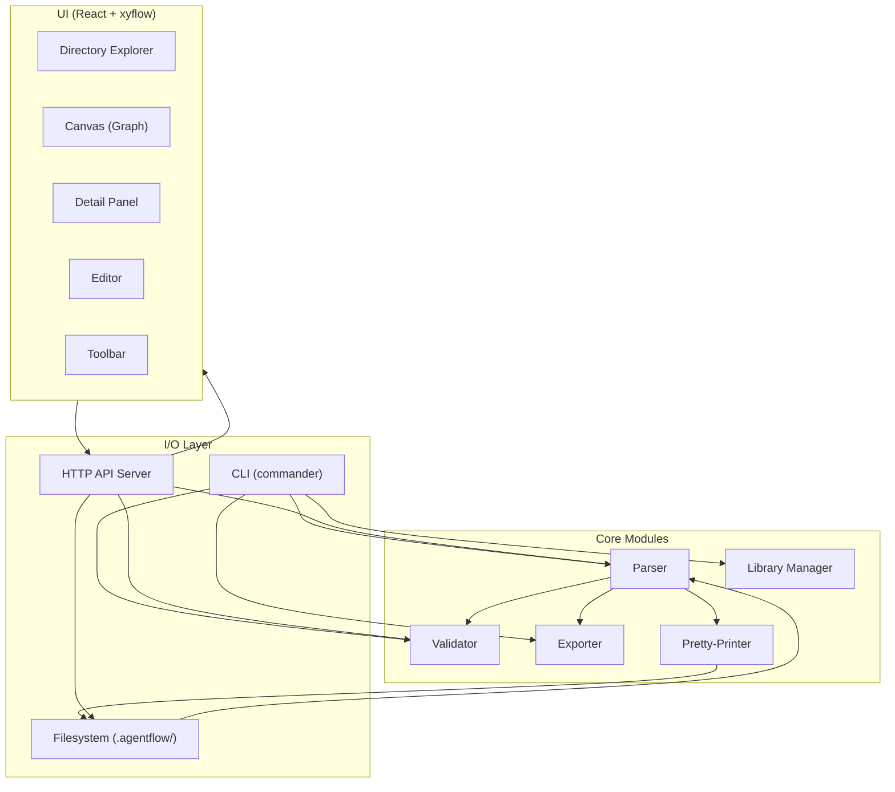
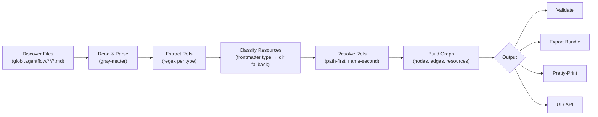
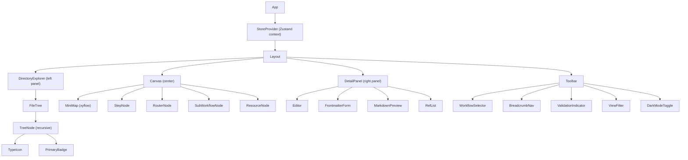

# AgentFlow v2 — Design Document

## Overview

AgentFlow v2 is a platform-agnostic, directory-based framework for defining AI agent workflows using markdown and YAML frontmatter. This design rebuilds the existing POC with:

- A formalized reference system where syntax prefixes encode semantic intent (mentions, edges, conditional edges, data flow)
- Optional frontmatter with type-based resource identification and schema validation
- A self-contained JSON export format with fully resolved references
- MCP-compatible tool definitions with builtin mapping for portability
- A curated library of reusable components with CLI-based discovery and installation
- Round-trip markdown parsing and pretty-printing
- A three-panel UI with a VS Code-style directory explorer

The system is permissive by default — any `.md` file works immediately, frontmatter adds structure when desired, and strict validation is opt-in.

## Architecture

### System Module Diagram



### Data Flow Pipeline



### Module Responsibilities

| Module | Responsibility |
|--------|---------------|
| **Parser** | Reads `.agentflow/` directory tree, extracts frontmatter + content + refs, classifies resources, resolves refs, builds `WorkflowGraph` |
| **Validator** | Checks broken refs, invalid syntax, schema violations, cycles, unreachable nodes. Permissive by default, strict opt-in |
| **Exporter** | Resolves all refs inline, produces self-contained `ExportBundle` JSON |
| **Pretty-Printer** | Serializes `WorkflowGraph` back to markdown files preserving format |
| **Library Manager** | Manages `library/registry.json`, handles `add`, `search`, `library index` commands |
| **CLI** | Exposes all modules via commander commands |
| **API Server** | HTTP endpoints for UI communication, wraps Parser/Validator/FS operations |
| **UI** | React app with Directory Explorer, Canvas, Detail Panel, Editor |

## Components and Interfaces

### Parser Module

The Parser is the core module. It replaces the current `parseRoot` / `parseWorkflow` / `parseNode` pipeline with syntax-aware ref parsing and frontmatter-based classification.

#### Reference Grammar

Four ref types, distinguished by syntax prefix:

| Syntax | Semantic Type | Regex | Purpose |
|--------|--------------|-------|---------|
| `{{category/name}}` | `mention` | `/\{\{(?!->)(?!<<)([^}\|]+)\}\}/` | Informational reference |
| `{{-> category/name}}` | `edge` | `/\{\{->\s*([^}\|]+)\}\}/` | Structural edge |
| `{{-> category/name \| templates/cond}}` | `edge` (conditional) | `/\{\{->\s*([^}\|]+)\|\s*([^}]+)\}\}/` | Conditional routing |
| `{{<< output.nodeName}}` | `data_flow` | `/\{\{<<\s*output\.([^}]+)\}\}/` | Data dependency |

The combined regex for extraction (applied in order, conditional edge first to avoid partial match):

```javascript
const REF_PATTERNS = [
  // Conditional edge: {{-> target | condition}}
  { pattern: /\{\{->\s*([^}|]+?)\s*\|\s*([^}]+?)\s*\}\}/g, type: 'conditional_edge' },
  // Edge: {{-> target}}
  { pattern: /\{\{->\s*([^}|]+?)\s*\}\}/g, type: 'edge' },
  // Data flow: {{<< output.nodeName}}
  { pattern: /\{\{<<\s*output\.([^}]+?)\s*\}\}/g, type: 'data_flow' },
  // Mention: {{category/name}} (no prefix)
  { pattern: /\{\{(?!->)(?!<<)([^}]+?)\}\}/g, type: 'mention' },
];
```

#### Key Functions

```javascript
/**
 * Parse a single ref token and return a structured Ref object.
 * Semantic type is determined ONLY by syntax prefix.
 */
function parseRef(token: string): Ref

/**
 * Extract all refs from markdown content with positions.
 * Applies REF_PATTERNS in order (conditional_edge → edge → data_flow → mention).
 */
function extractRefs(content: string): Ref[]

/**
 * Parse a single markdown file: frontmatter + content + refs.
 * Supports metadata-only mode (skips body/refs).
 */
function parseMarkdownFile(filePath: string, mode?: 'full' | 'metadata-only'): ParsedFile

/**
 * Classify a parsed file's resource type.
 * Priority: frontmatter.type > directory inference > untyped
 */
function classifyResource(file: ParsedFile, dirPath: string): ResourceType | null

/**
 * Identify the primary file in a node directory.
 * Priority: primary:true frontmatter > main.md > alphabetical first
 */
function identifyPrimaryFile(files: ParsedFile[]): ParsedFile

/**
 * Parse a node directory: all .md files, identify primary, classify context files.
 * Determines node type from frontmatter (default: step).
 */
function parseNode(dirPath: string, workflowRoot: string): NodeDef

/**
 * Recursively parse a workflow directory.
 * Finds node dirs, builds edges from Edge_Refs, handles sub-workflows.
 */
function parseWorkflow(workflowDir: string, mode?: 'full' | 'metadata-only'): WorkflowDef

/**
 * Resolve a ref token to a target resource.
 * Resolution order: exact path match → frontmatter name match.
 * Returns null if unresolved, error if ambiguous.
 */
function resolveRef(ref: Ref, graph: WorkflowGraph): ResolvedRef | null

/**
 * Top-level parser: scans .agentflow/ root, parses all resources and workflows.
 */
function parseRoot(rootDir: string, mode?: 'full' | 'metadata-only'): WorkflowGraph
```

#### Parsing Pipeline

1. **Discover**: Glob all `.md` files under `.agentflow/`
2. **Read**: For each file, read raw content via `gray-matter`
3. **Parse Frontmatter**: Extract YAML metadata (or empty object if absent)
4. **Extract Refs**: Apply `REF_PATTERNS` in order, collect all refs with offsets and semantic types
5. **Classify**: Determine `ResourceType` per file (frontmatter `type` → directory inference → untyped)
6. **Group**: Organize files into node directories vs. resource directories vs. root-level
7. **Build Nodes**: For each node directory, identify primary file, collect context files, determine node type
8. **Build Edges**: Construct edges from `edge` and `conditional_edge` refs only (not mentions or data_flow)
9. **Resolve**: For each ref, attempt path-first then name-second resolution
10. **Assemble Graph**: Produce the final `WorkflowGraph` with nodes, edges, resources, entry points

### Validator Module

```javascript
/**
 * Validate a WorkflowGraph. Returns errors and warnings.
 * In permissive mode (default), schema violations are warnings.
 * In strict mode, warnings become errors.
 */
function validate(graph: WorkflowGraph, options?: { strict: boolean }): ValidationResult

/**
 * Validate frontmatter against the schema for a given resource type.
 */
function validateSchema(frontmatter: object, resourceType: ResourceType): SchemaError[]

/**
 * Detect cycles in the directed graph. Returns warning with cycle nodes.
 */
function detectCycles(nodes: NodeDef[], edges: EdgeDef[]): CycleWarning[]

/**
 * Find unreachable nodes (no incoming edges, not entry nodes).
 */
function findUnreachable(nodes: NodeDef[], edges: EdgeDef[], entryNodes: string[]): string[]

/**
 * Validate variable substitution tokens match ${env:VARIABLE_NAME} format.
 */
function validateVariables(content: string): VariableError[]
```

#### Validation Rules

| Check | Severity (permissive) | Severity (strict) |
|-------|----------------------|-------------------|
| Broken ref (target not found) | error | error |
| Invalid ref syntax prefix | error | error |
| Data flow ref to non-existent node | error | error |
| Missing condition template in conditional edge | error | error |
| Frontmatter schema violation | warning | error |
| Cycle in edge graph | warning | error |
| Unreachable node (not entry, no incoming) | warning | error |
| Unknown category prefix | warning | error |
| Malformed variable token | error | error |
| Router node with non-conditional edge | error | error |
| Ambiguous name-based ref resolution | error | error |

### Exporter Module

```javascript
/**
 * Export a workflow as a self-contained ExportBundle.
 * Resolves all refs inline per type-specific strategy.
 */
function exportWorkflow(graph: WorkflowGraph, workflowId: string): ExportBundle

/**
 * Resolve a single ref for export.
 * - Edge → node identifier in graph section
 * - Conditional edge → node identifier + resolved check field
 * - Mention → inline markdown body of target
 * - Data flow → structured placeholder [output from: nodeName]
 * - Unresolved → [UNRESOLVED: {{original}}] marker
 */
function resolveForExport(ref: Ref, graph: WorkflowGraph): string
```

### Pretty-Printer Module

```javascript
/**
 * Serialize a ParsedFile back to markdown string.
 * Produces valid YAML frontmatter (if fields present) + markdown body.
 */
function serialize(file: ParsedFile): string

/**
 * Serialize a full node (primary + context files) back to directory.
 */
function serializeNode(node: NodeDef, targetDir: string): void

/**
 * Serialize an entire WorkflowGraph back to .agentflow/ directory.
 */
function serializeGraph(graph: WorkflowGraph, rootDir: string): void
```

### Library Manager

```javascript
/**
 * Search the library registry by query (matches name, description, tags).
 */
function search(registry: LibraryRegistry, query: string): LibraryEntry[]

/**
 * Add a library resource to the user's .agentflow/ workspace.
 * Copies files from library path to target directory.
 */
function add(registry: LibraryRegistry, type: string, name: string, targetRoot: string): void

/**
 * Regenerate library/registry.json by scanning the library directory tree.
 */
function index(libraryDir: string): LibraryRegistry
```

### CLI Commands

| Command | Flags | Behavior |
|---------|-------|----------|
| `agentflow parse [dir]` | `--output <file>`, `--metadata-only` | Parse and output JSON |
| `agentflow validate [dir]` | `--strict` | Validate, exit 0 (ok) or 1 (errors) |
| `agentflow export [dir]` | `--output <file>`, `--workflow <name>` | Export self-contained bundle |
| `agentflow graph [dir]` | — | Print ASCII graph |
| `agentflow ui [dir]` | `--port <port>` | Launch UI server |
| `agentflow init [dir]` | — | Scaffold workspace |
| `agentflow add <type> <name>` | — | Install from library |
| `agentflow search <query>` | — | Search library |
| `agentflow library index` | — | Regenerate registry.json |

### API Endpoints

| Method | Path | Description |
|--------|------|-------------|
| `GET` | `/api/data` | Return parsed WorkflowGraph as JSON |
| `GET` | `/api/validate` | Return validation results |
| `GET` | `/api/tree` | Return directory tree structure for explorer |
| `POST` | `/api/save` | Save file edits (array of {path, content}) |
| `POST` | `/api/create` | Create file or directory |
| `POST` | `/api/delete` | Delete file or directory |
| `POST` | `/api/move` | Move/rename file (for drag-and-drop) |
| `POST` | `/api/export` | Export workflow bundle |

### UI Architecture



#### Layout

Three-panel layout replacing the current Sidebar with a Directory Explorer:

```
┌──────────────────────────────────────────────────────────────┐
│  Toolbar: [Workflow ▾] [Breadcrumbs] [Validate] [Filter] [◐]│
├────────────┬─────────────────────────────┬───────────────────┤
│            │                             │                   │
│ Directory  │        Canvas               │   Detail Panel    │
│ Explorer   │     (xyflow graph)          │   (Editor /       │
│            │                             │    Properties)    │
│ .agentflow/│                             │                   │
│ ├─ tools/  │    ┌───┐    ┌───┐          │   Frontmatter     │
│ │  ├─ ...  │    │ A │───▸│ B │          │   Form            │
│ ├─ skills/ │    └───┘    └─┬─┘          │                   │
│ │  ├─ ...  │               │             │   Markdown        │
│ ├─ fix-bug/│            ┌──▼──┐          │   Editor          │
│ │  ├─ ...  │            │  C  │          │                   │
│ └─ ...     │            └─────┘          │   Refs            │
│            │                             │                   │
├────────────┴─────────────────────────────┴───────────────────┤
│  Status bar                                                  │
└──────────────────────────────────────────────────────────────┘
```

- **Directory Explorer** (left, ~240px): VS Code-style file tree mirroring `.agentflow/` filesystem. Shows type icons, primary file markers, node directory indicators. Supports drag-and-drop between directories.
- **Canvas** (center, flex): xyflow graph with custom node types (StepNode, RouterNode, SubWorkflowNode). Includes minimap. Edges show conditions. Clicking a node selects it in the detail panel.
- **Detail Panel** (right, ~360px): Shows editor for selected file. Split view: frontmatter form (top) + markdown editor (bottom). Ref autocomplete in editor. Shows validation errors inline.

#### State Management

Extend the current Zustand-style context store:

```typescript
interface Store {
  // Existing
  data: WorkflowGraph | null
  loading: boolean
  dark: boolean
  activeWf: string
  selection: Selection | null
  viewFilter: ViewFilter

  // New
  directoryTree: TreeNode | null    // Filesystem tree for explorer
  expandedDirs: Set<string>         // Which dirs are expanded in explorer
  validationResult: ValidationResult | null
  breadcrumbs: string[]             // For sub-workflow navigation

  // Actions
  reload: () => Promise<void>
  selectFile: (path: string) => void
  toggleDir: (path: string) => void
  moveFile: (from: string, to: string) => Promise<void>
  validate: () => Promise<ValidationResult>
}
```

## Data Models

### Core Types

```typescript
/** Semantic type derived from ref syntax prefix */
type SemanticType = 'mention' | 'edge' | 'data_flow'

/** Ref parsed from markdown content */
interface Ref {
  raw: string              // Original token content (without {{ }})
  semanticType: SemanticType
  category: string         // First path segment (tools, skills, nodes, etc.)
  name: string             // Remainder after category/
  condition?: string       // For conditional edges: the template ref
  offset: number           // Character offset in source content
  line: number             // Line number in source file
}

/** Resource type classification */
type ResourceType = 'tool' | 'skill' | 'template' | 'interaction' | 'memory' | 'node' | 'agents' | null

/** Parsed markdown file */
interface ParsedFile {
  filePath: string
  relativePath: string     // Relative to .agentflow/ root
  frontmatter: Record<string, unknown>
  title: string
  content: string          // Markdown body (empty in metadata-only mode)
  rawContent: string
  refs: Ref[]              // Empty in metadata-only mode
  resourceType: ResourceType
}

/** Node definition */
interface NodeDef {
  id: string               // Directory path relative to workflow root
  name: string             // From primary file title or frontmatter name
  description?: string
  nodeType: 'step' | 'router' | 'sub-workflow'
  entry: boolean           // Explicit entry:true
  entryInferred: boolean   // Inferred from no incoming edges
  primaryFile: ParsedFile
  contextFiles: ParsedFile[]
  allRefs: Ref[]
  frontmatter: Record<string, unknown>
  // For sub-workflow nodes
  subWorkflow?: WorkflowDef
}

/** Edge definition */
interface EdgeDef {
  from: string             // Source node id
  to: string               // Target node id
  condition?: string       // Template ref for conditional edges
  sourceRef: Ref           // The ref that created this edge
}

/** Workflow definition */
interface WorkflowDef {
  id: string               // Directory name
  name: string
  description?: string
  dir: string
  descriptorFile?: ParsedFile  // AGENTS.md or type:agents file
  nodes: Record<string, NodeDef>
  edges: EdgeDef[]
  entryPoints: string[]    // Node ids marked as entry
}

/** Tool-specific fields */
interface ToolDef {
  toolType: 'builtin' | 'script' | 'mcp' | 'package'
  command?: string         // Required for script
  mcp?: string             // Required for mcp
  package?: string         // Required for package
  parameters?: Record<string, ParameterDef>
  builtinMapping?: string
}

interface ParameterDef {
  type: string
  description?: string
  required?: boolean
}

/** Top-level parsed result */
interface WorkflowGraph {
  rootDir: string
  descriptorFile?: ParsedFile
  tools: Record<string, ParsedFile & ToolDef>
  skills: Record<string, ParsedFile>
  interactions: Record<string, ParsedFile>
  templates: Record<string, ParsedFile>
  memory: Record<string, ParsedFile>
  workflows: Record<string, WorkflowDef>
  allFiles: ParsedFile[]   // Every .md file discovered
}
```

### Export Bundle Format

```typescript
interface ExportBundle {
  /** Workflow graph with resolved edges */
  graph: {
    nodes: Record<string, ExportNode>
    edges: ExportEdge[]
  }
  /** All referenced resources with resolved content */
  resources: {
    tools: Record<string, ExportTool>
    skills: Record<string, ExportResource>
    interactions: Record<string, ExportResource>
    templates: Record<string, ExportResource>
    memory: Record<string, ExportResource>
  }
  /** Workflow metadata */
  metadata: {
    name: string
    description?: string
    exportedAt: string     // ISO 8601 timestamp
    agentflowVersion: string
  }
  /** Entry points for the workflow */
  entry_points: ExportEntryPoint[]
  /** Unresolved refs and validation errors */
  errors: ExportError[]
}

interface ExportNode {
  id: string
  name: string
  description?: string
  type: 'step' | 'router' | 'sub-workflow'
  content: string          // Primary file content with refs resolved inline
  contextContent: string[] // Context file contents with refs resolved
  frontmatter: Record<string, unknown>
  /** Summary for progressive disclosure */
  summary: {
    name: string
    description?: string
    type: string
    outgoingEdges: string[] // Target node ids
  }
}

interface ExportEdge {
  from: string
  to: string
  condition?: {
    templateRef: string
    check: string          // Resolved check field from template
  }
}

interface ExportTool {
  name: string
  description?: string
  type: 'builtin' | 'script' | 'mcp' | 'package'
  command?: string
  mcp?: string
  package?: string
  parameters?: Record<string, ParameterDef>
  builtinMapping?: string
  content: string
}

interface ExportResource {
  name: string
  description?: string
  content: string
  frontmatter: Record<string, unknown>
}

interface ExportEntryPoint {
  nodeId: string
  name: string
  description?: string
  explicit: boolean        // true if entry:true, false if inferred
}

interface ExportError {
  type: 'unresolved_ref' | 'validation_error'
  source: string           // File path
  ref?: string             // Original ref string
  message: string
}
```

### Frontmatter Schemas

#### Tool Schema
```yaml
name: string              # required
type: enum [builtin, script, mcp, package]  # optional, default: builtin
command: string            # required when type=script
mcp: string               # required when type=mcp
package: string            # required when type=package
parameters: object         # optional, keys are param names
description: string        # optional
builtin_mapping: string    # optional
```

#### Skill Schema
```yaml
name: string              # optional
description: string        # optional
domain: string             # optional
max_tokens: integer        # optional
tags: string[]             # optional
```

#### Template Schema
```yaml
name: string              # required
check: string             # required
type: string              # optional, default: "condition"
```

#### Interaction Schema
```yaml
name: string              # required
type: enum [approval, freeform, choice, confirm]  # required
timeout: integer           # optional
```

#### Memory Schema
```yaml
name: string              # optional
description: string        # optional
editable: boolean          # optional, default: true
```

#### Node Schema
```yaml
name: string              # optional
description: string        # optional
type: enum [step, router, sub-workflow]  # optional, default: step
agent: string              # optional
model: string              # optional
entry: boolean             # optional, default: false
primary: boolean           # optional, default: false
```

#### Agents Descriptor Schema
```yaml
type: agents              # identifies this as a workflow descriptor
name: string              # optional
description: string        # optional
```

### Library Registry Format

```typescript
interface LibraryRegistry {
  version: string          // Registry format version
  entries: LibraryEntry[]
}

interface LibraryEntry {
  name: string
  type: 'workflow' | 'skill' | 'tool' | 'template' | 'interaction'
  path: string             // Relative to library root
  description: string
  tags: string[]
}
```

### Variable Substitution

Variable tokens follow the pattern `${env:VARIABLE_NAME}` where `VARIABLE_NAME` is alphanumeric plus underscores.

```javascript
const VAR_REGEX = /\$\{env:([A-Za-z_][A-Za-z0-9_]*)\}/g;
```

Variables are:
- **Recorded** at parse time (stored as-is, not resolved)
- **Preserved** at export time (passed through to consuming agent)
- **Validated** for format correctness (alphanumeric + underscores only)

### Directory Tree (for UI Explorer)

```typescript
interface TreeNode {
  name: string
  path: string             // Relative to .agentflow/ root
  type: 'directory' | 'file'
  resourceType?: ResourceType
  isPrimary?: boolean      // For files in node directories
  isNodeDir?: boolean      // For directories that are nodes
  isReservedDir?: boolean  // For tools/, skills/, etc.
  children?: TreeNode[]
  validationErrors?: number
}
```


## Correctness Properties

*A property is a characteristic or behavior that should hold true across all valid executions of a system — essentially, a formal statement about what the system should do. Properties serve as the bridge between human-readable specifications and machine-verifiable correctness guarantees.*

### Property 1: Syntax prefix determines semantic type

*For any* ref token string and *for any* position within a markdown document, the semantic type assigned by the parser shall be determined solely by the syntax prefix (`->` → edge, `<<` → data_flow, no prefix → mention), and shall be identical regardless of where the token appears in the document.

**Validates: Requirements 1.1, 1.2, 1.3, 1.4, 1.5**

### Property 2: Edges constructed only from edge refs

*For any* WorkflowGraph produced by the parser, every edge in the graph shall trace back to an Edge_Ref or Conditional_Edge_Ref. No Mention_Ref or Data_Flow_Ref shall produce an edge.

**Validates: Requirements 1.7**

### Property 3: Resource type classification priority

*For any* markdown file with a frontmatter `type` field, the parser shall assign that value as the ResourceType regardless of directory. *For any* file without a `type` field in a reserved directory, the parser shall infer the type from the directory. *For any* file without a `type` field outside reserved directories, the parser shall assign no ResourceType.

**Validates: Requirements 2.1, 2.2, 2.3, 2.4**

### Property 4: Schema validation conditional on type field

*For any* markdown file, schema validation shall be applied if and only if the frontmatter contains a `type` field. *For any* file with a `type` field, the validator shall check the frontmatter against the schema for that resource type, accepting valid frontmatter and rejecting invalid frontmatter (missing required fields, wrong types, invalid enum values).

**Validates: Requirements 2.6, 2.7, 2.8, 2.9, 2.10, 2.11, 2.12**

### Property 5: Schema violation error detail

*For any* frontmatter schema violation detected by the validator, the error message shall contain the file path, the field name, and the nature of the violation.

**Validates: Requirements 2.13**

### Property 6: Complete file discovery

*For any* `.agentflow/` directory tree, the parser shall discover and parse every `.md` file regardless of filename or directory location.

**Validates: Requirements 3.1, 3.2, 3.8**

### Property 7: Primary file selection

*For any* node directory containing multiple `.md` files, the parser shall select the primary file by priority: (1) file with `primary: true` in frontmatter, (2) file named `main.md`, (3) alphabetically first file. When only one `.md` file exists, it shall be the primary.

**Validates: Requirements 3.3, 3.4**

### Property 8: Context files included in node and export

*For any* node directory with multiple `.md` files, all non-primary files shall appear as context files in the parsed node, and the exporter shall include all context file content in the export bundle alongside the primary file content.

**Validates: Requirements 3.5, 3.10**

### Property 9: Ref resolution path-first, name-second

*For any* ref token, the parser shall first attempt exact path resolution (`category/name.md` relative to root). Only when no path match exists shall it fall back to frontmatter `name` matching. When both a path match and a name match exist on different files, the path match shall win.

**Validates: Requirements 4.1, 4.2, 4.3, 4.5**

### Property 10: Ambiguous name resolution produces error

*For any* ref token that has no exact path match and matches multiple files by frontmatter `name`, the validator shall return an error listing all matching files.

**Validates: Requirements 4.4**

### Property 11: Export resolves each ref type correctly

*For any* Edge_Ref, the exporter shall include the edge in the graph section. *For any* Conditional_Edge_Ref, the exporter shall include the edge with the resolved `check` field from the template. *For any* Mention_Ref, the exporter shall replace the token with the target's inline markdown body. *For any* Data_Flow_Ref, the exporter shall replace the token with a structured placeholder `[output from: nodeName]`.

**Validates: Requirements 5.1, 5.2, 5.3, 5.4**

### Property 12: Unresolved refs produce marker and error

*For any* ref that cannot be resolved (target does not exist), the exporter shall insert an `[UNRESOLVED: {{original_ref}}]` marker in the output and add the ref to the export bundle's errors array.

**Validates: Requirements 5.5**

### Property 13: Export bundle structural completeness

*For any* exported workflow, the ExportBundle shall contain a `graph` object (with nodes and edges), a `resources` object, a `metadata` object (with name and timestamp), an `entry_points` array, and an `errors` array.

**Validates: Requirements 5.6**

### Property 14: Node type classification

*For any* node, the parser shall assign the node type from frontmatter `type` field when present (`step`, `router`, `sub-workflow`). When no `type` field exists, the node type shall default to `step`.

**Validates: Requirements 6.1, 6.4**

### Property 15: Router nodes require conditional edges

*For any* node with type `router`, the validator shall return an error if any outgoing edge was created from a plain Edge_Ref rather than a Conditional_Edge_Ref.

**Validates: Requirements 6.2, 6.5**

### Property 16: Sub-workflow recursive parsing

*For any* node with type `sub-workflow` that contains a workflow descriptor and subdirectories with node files, the parser shall recursively parse the sub-workflow and produce a nested WorkflowDef within the parent node.

**Validates: Requirements 6.3**

### Property 17: Tool definition preservation

*For any* tool resource, the parser shall preserve the tool type (`builtin`, `script`, `mcp`, `package`), all type-specific fields (`command`, `mcp`, `package`), `builtin_mapping`, and `parameters` with their name, type, description, and required status. The exporter shall include the full tool definition in the export bundle.

**Validates: Requirements 7.1, 7.2, 7.3, 7.4, 7.5, 7.6**

### Property 18: Broken ref detection

*For any* ref whose target does not exist after both path-based and name-based resolution, the validator shall return an error specifying the source file, the ref string, and the missing target. This applies to all ref types including data flow refs to non-existent nodes and conditional edge refs to missing templates.

**Validates: Requirements 8.1, 8.3, 8.4**

### Property 19: Cycle detection

*For any* workflow graph containing a cycle in its directed edges, the validator shall return a warning listing the nodes involved in the cycle.

**Validates: Requirements 8.5**

### Property 20: Unreachable node detection

*For any* node with no incoming edges that is not an entry node (explicit or inferred), the validator shall return a warning indicating the node may be unreachable.

**Validates: Requirements 8.6**

### Property 21: Strict mode promotes warnings to errors

*For any* validation result, running in permissive mode shall classify schema violations and structural issues as warnings. Running the same graph in strict mode shall classify those same issues as errors.

**Validates: Requirements 8.9**

### Property 22: Library search

*For any* query string and library registry, the search function shall return all entries where the query matches the entry's name, description, or tags (case-insensitive substring match).

**Validates: Requirements 9.5**

### Property 23: Library add copies to workspace

*For any* library entry of type `workflow`, the add command shall copy the entire workflow directory. *For any* entry of other types, the add command shall copy the resource file to the corresponding directory in the workspace.

**Validates: Requirements 9.2, 9.3**

### Property 24: Library index round-trip

*For any* library directory tree, running the `library index` command shall produce a `registry.json` that contains an entry for every resource file in the library, with correct name, type, path, description, and tags.

**Validates: Requirements 9.6**

### Property 25: Parse → pretty-print → parse round-trip

*For any* valid markdown file (node or resource, with or without frontmatter), parsing with the Parser then serializing with the Pretty-Printer then parsing again shall produce a structured object equivalent to the original parse.

**Validates: Requirements 10.1, 10.3, 10.5, 10.6, 10.7**

### Property 26: Variable preservation through pipeline

*For any* `${env:VARIABLE_NAME}` token in a markdown file, the parser shall record it without resolving, and the exporter shall preserve it as-is in the export bundle.

**Validates: Requirements 11.1, 11.2**

### Property 27: Variable format validation

*For any* string matching the `${env:...}` pattern, the validator shall accept it if the variable name contains only alphanumeric characters and underscores, and shall reject it otherwise.

**Validates: Requirements 11.3**

### Property 28: Metadata-only mode

*For any* markdown file, parsing in `metadata-only` mode shall produce frontmatter fields and title, but shall not include the markdown body content or extracted refs.

**Validates: Requirements 12.1, 12.2**

### Property 29: Export summary per node

*For any* node in the export bundle, the `summary` field shall contain the node's name, description, type, and list of outgoing edge targets.

**Validates: Requirements 12.4**

### Property 30: Entry point detection

*For any* workflow, nodes with `entry: true` in frontmatter shall be marked as explicit entry points. When no explicit entries exist and no descriptor file exists, nodes with no incoming edges shall be inferred as entry points with `inferred: true`. The export bundle's `entry_points` array shall list all entries with correct explicit/inferred flags.

**Validates: Requirements 13.1, 13.2, 13.4, 13.5, 13.6**

### Property 31: Directory tree mirrors filesystem

*For any* `.agentflow/` directory structure, the directory tree API shall return a tree that mirrors the filesystem, with correct `resourceType` annotations (from frontmatter type or directory inference), `isPrimary` flags for primary files in node directories, and `isNodeDir` flags for node directories.

**Validates: Requirements 14.1, 14.4, 14.5, 14.6**

### Property 32: File move updates filesystem

*For any* file move operation (from path A to path B), the move API shall relocate the file on the filesystem and the subsequent directory tree shall reflect the new location.

**Validates: Requirements 14.7**

## Error Handling

### Parser Errors

| Error | Behavior |
|-------|----------|
| File read failure (permissions, encoding) | Skip file, log warning, continue parsing |
| Invalid YAML frontmatter | Treat as no frontmatter (empty metadata), log warning |
| Malformed ref token (unclosed `{{ }}`) | Ignore token, do not include in refs list |
| Circular sub-workflow reference | Detect during recursive parsing, return error |

### Validator Errors vs Warnings

In permissive mode (default):
- **Errors** (always block): broken refs, invalid ref syntax, malformed variables, ambiguous name resolution, router with non-conditional edges
- **Warnings** (informational): schema violations, cycles, unreachable nodes, unknown category prefix

In strict mode (`--strict`):
- All warnings are promoted to errors

### Exporter Errors

| Error | Behavior |
|-------|----------|
| Unresolved ref | Insert `[UNRESOLVED: {{original}}]` marker, add to errors array |
| Missing template check field | Include edge without condition, add to errors array |
| Circular mention resolution | Detect depth limit (max 10), insert `[CIRCULAR: {{ref}}]` marker |

### CLI Error Handling

| Scenario | Behavior |
|----------|----------|
| Directory not found | Print error, exit 1 |
| No `.agentflow/` structure | Print helpful message suggesting `agentflow init` |
| Validation errors | Print each error, exit 1 |
| Validation warnings only | Print warnings, exit 0 |
| Export with unresolved refs | Complete export, print warnings, exit 0 |

### API Error Handling

| Status | Condition |
|--------|-----------|
| 200 | Success |
| 400 | Invalid request body, malformed JSON |
| 404 | Unknown endpoint |
| 500 | Internal error (file system failure, parse crash) |

All API errors return `{ error: string }` JSON body.

## Testing Strategy

### Dual Testing Approach

AgentFlow v2 uses both unit tests and property-based tests:

- **Unit tests**: Verify specific examples, edge cases, integration points, and error conditions
- **Property-based tests**: Verify universal properties across randomly generated inputs

Both are complementary — unit tests catch concrete bugs with known inputs, property tests verify general correctness across the input space.

### Property-Based Testing Configuration

- **Library**: [fast-check](https://github.com/dubzzz/fast-check) (JavaScript/TypeScript PBT library)
- **Minimum iterations**: 100 per property test
- **Tag format**: Each test tagged with `Feature: agentflow-v2, Property {N}: {title}`
- **Each correctness property maps to exactly one property-based test**

### Test Organization

```
tests/
├── unit/
│   ├── parser.test.js          # Specific parsing examples
│   ├── validator.test.js       # Specific validation scenarios
│   ├── exporter.test.js        # Specific export examples
│   ├── pretty-printer.test.js  # Specific serialization examples
│   ├── library.test.js         # Library operations
│   └── cli.test.js             # CLI integration tests
├── property/
│   ├── ref-parsing.property.js       # Properties 1-2
│   ├── classification.property.js    # Properties 3-4
│   ├── schema.property.js            # Properties 4-5
│   ├── discovery.property.js         # Properties 6-8
│   ├── resolution.property.js        # Properties 9-10
│   ├── export.property.js            # Properties 11-13
│   ├── node-types.property.js        # Properties 14-16
│   ├── tools.property.js             # Property 17
│   ├── validation.property.js        # Properties 18-21
│   ├── library.property.js           # Properties 22-24
│   ├── round-trip.property.js        # Property 25
│   ├── variables.property.js         # Properties 26-27
│   ├── progressive.property.js       # Properties 28-29
│   ├── entry-points.property.js      # Property 30
│   └── directory-tree.property.js    # Properties 31-32
└── generators/
    ├── markdown.gen.js         # Generate random markdown files with/without frontmatter
    ├── refs.gen.js             # Generate random ref tokens of all 4 types
    ├── frontmatter.gen.js      # Generate valid/invalid frontmatter per schema
    ├── directory.gen.js        # Generate random .agentflow/ directory structures
    └── workflow.gen.js         # Generate random workflow graphs
```

### Key Generators

- **Markdown generator**: Produces random `.md` files with optional YAML frontmatter, random content, and embedded ref tokens at random positions
- **Ref generator**: Produces random ref tokens across all 4 syntax types with random category/name values
- **Frontmatter generator**: Produces valid and invalid frontmatter objects for each resource type schema
- **Directory generator**: Produces random `.agentflow/` directory trees with node dirs, resource dirs, and arbitrary files
- **Workflow generator**: Produces random workflow graphs with nodes, edges, and resources for testing graph properties

### Unit Test Focus Areas

- Specific parsing examples from the `examples/.agentflow/` directory
- Edge cases: empty files, files with only frontmatter, deeply nested directories
- Error conditions: malformed YAML, unclosed ref tokens, circular references
- CLI integration: command output, exit codes, flag handling
- API integration: request/response format, error responses
- UI component rendering: tree structure, node types, selection behavior
