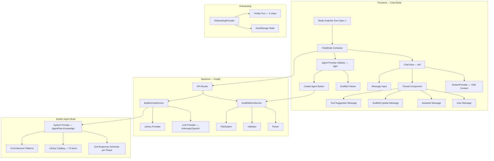
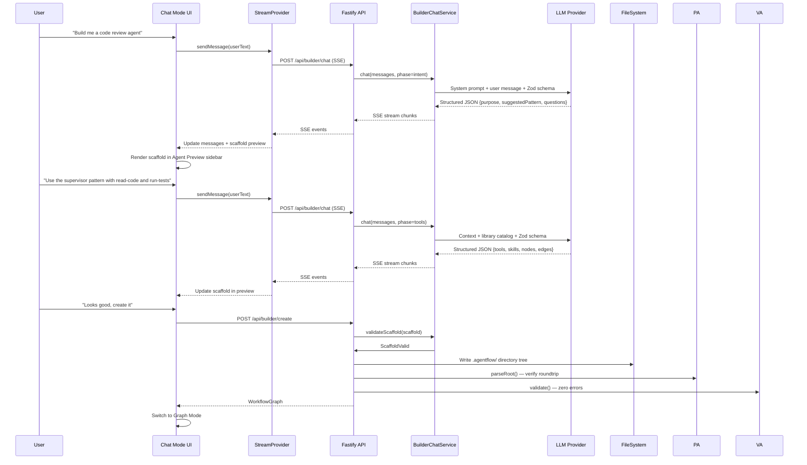
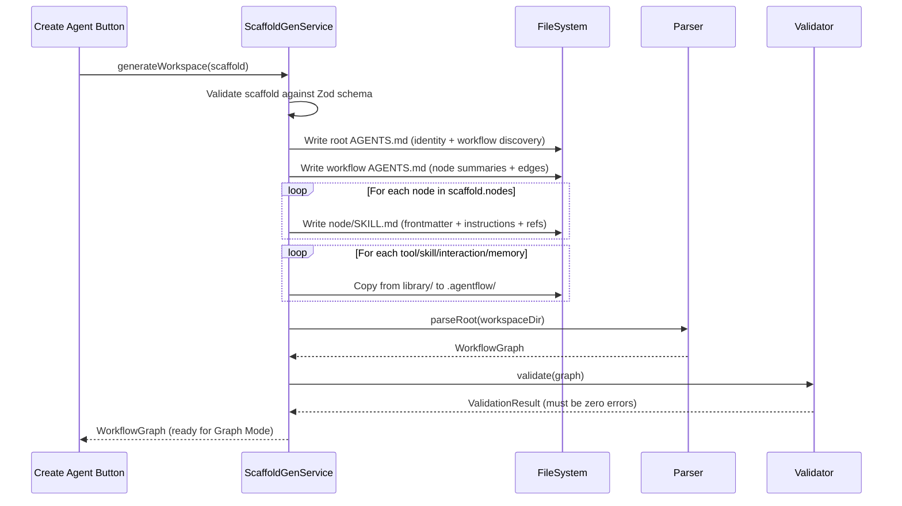
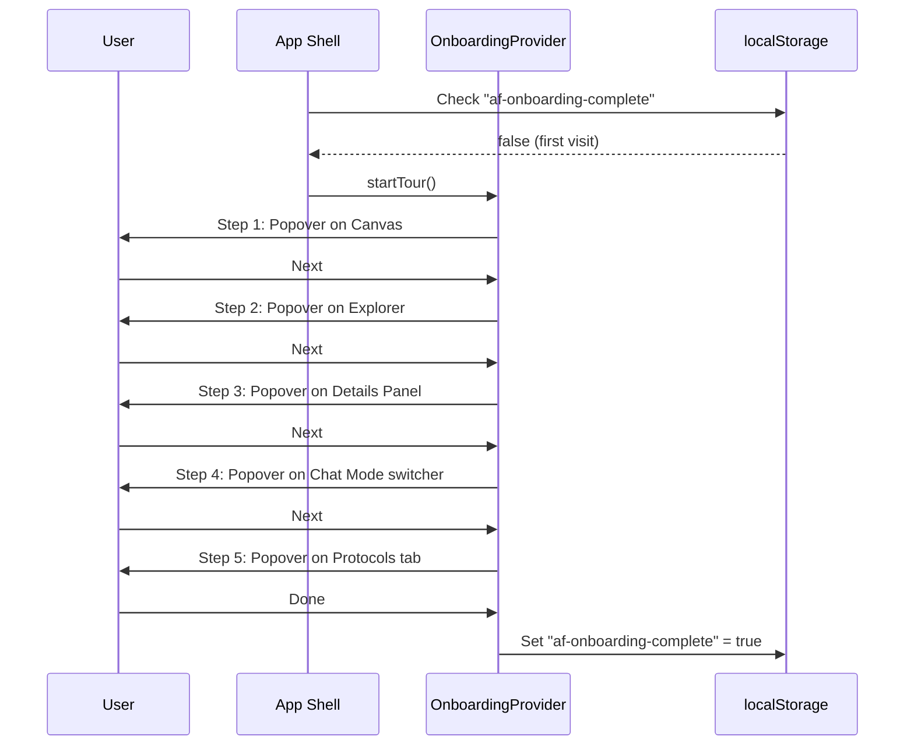

# Design Document: Chat Builder + Onboarding (Spec 2 of 4)

> **⚠️ PARTIALLY SUPERSEDED**: The backend agent components (Components 5, 6 — Builder System Prompt, BuilderChatService) and the orchestrator chat endpoint are **superseded** by the new Agent Runtime spec (`.kiro/specs/agent-runtime/`). The orchestrator is replaced by a LangSmith Studio-style agent that uses official MCP tools and lets the LLM read workflow markdown directly — no custom parser or hardcoded prompts.
>
> **What remains valid from this spec**:
> - Chat Mode UI layout (Component 1: ChatMode container) — ✅ COMPLETE
> - Thread component (Component 3) — ✅ COMPLETE (will be updated by agent-runtime spec)
> - Agent Preview Sidebar (Component 4) — ✅ COMPLETE
> - ScaffoldGenService (Component 7) — ✅ COMPLETE
> - Onboarding (Component 8) — ✅ COMPLETE
> - StreamProvider (Component 2) — ✅ COMPLETE but **rewritten** by agent-runtime spec to call `/api/agent/chat` instead of `/api/orchestrator/chat`
>
> **What is superseded**:
> - Component 5 (Builder Agent System Prompt) → Superseded by `library/workflows/agent-builder/` workflow + agent-runtime's context loading
> - Component 6 (BuilderChatService) → Superseded by agent-runtime's `agent-chat-service.js`
> - The `/api/builder/chat` SSE endpoint → Superseded by `/api/agent/chat`
> - The `/api/orchestrator/chat` endpoint → Superseded by `/api/agent/chat`
> - Phase-based conversation management → The LLM handles phases naturally via the `agent-builder` workflow

## Overview

This spec builds on top of Spec 1 (foundation-core-ui) to deliver Chat Mode — the second primary mode alongside Graph Mode — and a lightweight onboarding walkthrough. Chat Mode is a conversational agent builder that guides users through creating `.agentflow/` workspaces via a structured multi-phase conversation. The builder agent uses a carefully crafted system prompt that understands the full AgentFlow format (directory structure, ref syntax, five-layer context model, six architecture patterns, and the complete library catalog of 23 tools, 20 skills, 17 templates, 9 interactions, and 4 memory items). The LLM returns structured JSON conforming to Zod schemas at each phase — not free text.

The Chat Mode UI follows patterns from LangChain's `agent-chat-ui` (MIT): a Thread component with streaming SSE, a StreamProvider React context, stick-to-bottom scroll, and message rendering with tool call display. The layout is split into a chat area (left) and an Agent Preview sidebar (right) that shows the evolving `AgentScaffold` live as the conversation progresses. When the user confirms, the scaffold is validated and written to disk as a complete `.agentflow/` workspace, then the UI switches to Graph Mode.

The onboarding system is deliberately simple: a 5-step tooltip tour using shadcn Popover, triggered on first visit or via a help button, with state stored as an array index + localStorage boolean. No custom spotlight/overlay system — just popovers pointing at key UI elements.

## Architecture

### Chat Mode System Architecture



### Chat Mode Request Flow



### Scaffold-to-Workspace Generation Flow



### Onboarding Flow



## Components and Interfaces

### Component 1: Chat Mode Container

**Purpose**: The top-level container for Chat Mode, rendered when the mode switcher (from Spec 1) is set to "chat". Splits into a chat area (left, ~60%) and an Agent Preview sidebar (right, ~40%) using `react-resizable-panels`.

**Interface**:

```typescript
// ui/src/components/chat/ChatMode.tsx
interface ChatModeProps {
  onAgentCreated: (graph: WorkflowGraph) => void  // Switch to Graph Mode
}

// Internal layout: PanelGroup with two panels
// Left: ChatArea (StreamProvider + Thread + MessageInput)
// Right: AgentPreviewSidebar (scaffold viewer + create button)
```

**Responsibilities**:
- Wraps `StreamProvider` context around the chat area
- Manages the `AgentScaffold` state that both panels share
- Handles the "Create Agent" action: calls API, receives WorkflowGraph, calls `onAgentCreated`
- Provides escape hatch: "Start from template" button bypasses conversation

### Component 2: StreamProvider (SSE Context)

**Purpose**: React context that manages the SSE connection to `/api/builder/chat`. Inspired by LangChain's `agent-chat-ui` StreamProvider pattern. Provides message state, send/cancel actions, and connection status to all child components.

**Interface**:

```typescript
// ui/src/components/chat/StreamProvider.tsx
interface StreamContextValue {
  messages: ChatMessage[]
  isStreaming: boolean
  error: string | null
  currentPhase: BuilderPhase
  scaffold: AgentScaffold | null

  sendMessage: (text: string) => Promise<void>
  cancelStream: () => void
  resetConversation: () => void
}

type BuilderPhase = 'intent' | 'pattern' | 'tools' | 'nodes' | 'review' | 'complete'

interface ChatMessage {
  id: string
  role: 'user' | 'assistant' | 'system'
  content: string
  timestamp: number
  metadata?: {
    phase?: BuilderPhase
    scaffoldDelta?: Partial<AgentScaffold>
    suggestedTools?: string[]
    suggestedPattern?: AgentPattern
    toolCalls?: ToolCallDisplay[]
    patternSuggestions?: PatternSuggestion[]
  }
}

interface ToolCallDisplay {
  name: string
  input: Record<string, unknown>
  result?: string
  status: 'pending' | 'success' | 'error'
}

interface PatternSuggestion {
  pattern: AgentPattern
  reason: string
  confidence: number  // 0-1
}
```

**Responsibilities**:
- Opens SSE connection to `/api/builder/chat` on `sendMessage`
- Parses SSE events: `text_delta`, `scaffold_update`, `tool_suggestion`, `phase_change`, `error`, `done`
- Accumulates `AgentScaffold` from incremental `scaffold_update` events
- Tracks conversation phase for UI hints (progress indicator)
- Preserves full conversation history — user never loses progress
- Handles abort via `AbortController` on `cancelStream`

### Component 3: Thread Component

**Purpose**: Renders the message list with stick-to-bottom scroll behavior. Reuses the pattern from LangChain's `agent-chat-ui` Thread component. Different message types get different renderers.

**Interface**:

```typescript
// ui/src/components/chat/Thread.tsx
interface ThreadProps {
  messages: ChatMessage[]
  isStreaming: boolean
}

// Message type renderers
// UserMessage: simple text bubble (right-aligned)
// AssistantTextMessage: markdown-rendered text (left-aligned)
// ScaffoldUpdateMessage: shows what changed in the scaffold (collapsible diff)
// ToolSuggestionMessage: clickable tool/skill chips from library
// PatternSuggestionMessage: pattern cards with visual icons
```

**Responsibilities**:
- Stick-to-bottom scroll: auto-scrolls when new content arrives, stops when user scrolls up
- Scroll-to-bottom button appears when not at bottom (same as `agent-chat-ui`)
- Markdown rendering via `react-markdown` + `remark-gfm` for assistant messages
- Streaming indicator (animated dots) while `isStreaming` is true
- Message grouping: consecutive assistant messages merge visually

### Component 4: Agent Preview Sidebar

**Purpose**: Right panel showing the evolving `AgentScaffold` as the conversation progresses. Inspired by LangChain's `open-agent-platform` ConfigurationSidebar pattern. Updates live as the LLM refines the scaffold.

**Interface**:

```typescript
// ui/src/components/chat/AgentPreviewSidebar.tsx
interface AgentPreviewSidebarProps {
  scaffold: AgentScaffold | null
  phase: BuilderPhase
  onCreateAgent: () => void
  onStartFromTemplate: () => void
  isCreating: boolean
}

// Sections displayed (progressive — only show what's been defined):
// 1. Name + Description (always, editable inline)
// 2. Pattern (with visual icon — graph diagram per pattern)
// 3. Identity (name, role, constraints)
// 4. Nodes list (with type badges: step/router/sub-workflow)
// 5. Tools list (with source badges: library/mcp/custom)
// 6. Skills list
// 7. Edges (from → to, with conditions)
// 8. "Create Agent" button (bottom, primary action)
```

**Responsibilities**:
- Renders scaffold sections progressively as they're populated
- Each section is collapsible (shadcn Collapsible)
- Inline editing: user can click to edit name, description, constraints directly
- Pattern visualization: small mermaid-style diagram showing the selected pattern's topology
- Node list shows type-colored badges (blue step, purple router, teal sub-workflow)
- Tool/skill items are removable (click X to remove from scaffold)
- "Create Agent" button is disabled until scaffold passes validation
- "Start from template" link as escape hatch

### Component 5: Builder Agent System Prompt

**Purpose**: The brain of Chat Mode. A carefully crafted system prompt that teaches the LLM how to scaffold AgentFlow workspaces. Uses structured output (Zod schemas) at each phase.

**Interface**:

```typescript
// src/services/builder-prompt.ts

// The system prompt is a template string that includes:
// 1. AgentFlow format knowledge (directory structure, ref syntax, frontmatter)
// 2. Five-layer context model explanation
// 3. Six architecture patterns with when-to-use guidance
// 4. Full library catalog (injected from registry.json)
// 5. Phase-specific instructions and output schema
// 6. Examples of good scaffolds

interface BuilderPromptContext {
  libraryCatalog: LibraryCatalogSummary
  currentPhase: BuilderPhase
  currentScaffold?: AgentScaffold
  conversationHistory: ChatMessage[]
}

interface LibraryCatalogSummary {
  tools: Array<{ name: string; description: string }>       // 23 items
  skills: Array<{ name: string; description: string }>      // 20 items
  templates: Array<{ name: string; description: string }>   // 17 items
  interactions: Array<{ name: string; description: string }> // 9 items
  memory: Array<{ name: string; description: string }>      // 4 items
  workflows: Array<{ name: string; description: string }>   // 5 example workflows
}

function buildSystemPrompt(ctx: BuilderPromptContext): string
// Returns the full system prompt string with phase-specific instructions
```

**Responsibilities**:
- Encodes complete AgentFlow format knowledge so the LLM can generate valid workspaces
- Includes the full library catalog so the LLM suggests real tools/skills (not hallucinated ones)
- Phase-specific output schemas ensure structured JSON responses
- Pattern selection guidance: maps user intent to the best architecture pattern
- Includes examples of well-structured scaffolds for few-shot learning
- Prompt engineering best practices from v0's system prompt: clear instructions, structured output, examples

### Component 6: BuilderChatService (Backend)

**Purpose**: Backend service that handles the conversational agent creation flow. Manages conversation state, calls the LLM with the builder system prompt, validates responses against Zod schemas, and streams results via SSE.

**Interface**:

```typescript
// src/services/builder-chat-service.ts
interface BuilderChatService {
  chat(params: BuilderChatParams): AsyncGenerator<BuilderSSEEvent>
  validateScaffold(scaffold: AgentScaffold): ServiceResult<ValidatedScaffold>
}

interface BuilderChatParams {
  messages: Array<{ role: 'user' | 'assistant'; content: string }>
  phase: BuilderPhase
  currentScaffold?: AgentScaffold
  provider: string        // 'anthropic' | 'openai'
  model?: string
  apiKey?: string
}

// SSE event types streamed to the client
type BuilderSSEEvent =
  | { type: 'text_delta'; content: string }
  | { type: 'scaffold_update'; delta: Partial<AgentScaffold> }
  | { type: 'tool_suggestion'; tools: string[]; reason: string }
  | { type: 'pattern_suggestion'; pattern: AgentPattern; reason: string; confidence: number }
  | { type: 'phase_change'; from: BuilderPhase; to: BuilderPhase }
  | { type: 'error'; message: string; recoverable: boolean }
  | { type: 'done'; finalScaffold?: AgentScaffold }
```

**Responsibilities**:
- Builds the system prompt via `buildSystemPrompt()` with current phase and scaffold context
- Calls LLM via LangChain (`@langchain/anthropic` or `@langchain/openai` — already in `package.json`)
- Streams response chunks as SSE events
- Parses LLM structured output against phase-specific Zod schemas
- Error recovery: if LLM returns invalid JSON, retries once with a "please return valid JSON" nudge
- Filters tool suggestions against the real library catalog — removes hallucinated tools with a warning
- Tracks conversation phase transitions

### Component 7: ScaffoldGenService (Backend)

**Purpose**: Takes a validated `AgentScaffold` and writes the complete `.agentflow/` directory. Ensures the roundtrip property: scaffold → write → parse → validate = zero errors.

**Interface**:

```typescript
// src/services/scaffold-gen-service.ts
interface ScaffoldGenService {
  generateWorkspace(
    scaffold: ValidatedScaffold,
    targetDir: string
  ): Promise<ServiceResult<WorkflowGraph>>
}

interface ValidatedScaffold extends AgentScaffold {
  _validated: true  // Brand type — only produced by validateScaffold()
}
```

**Responsibilities**:
- Generates root `AGENTS.md` with identity block, workflow discovery, tool/skill/memory refs
- Generates workflow `AGENTS.md` with node summaries and edge refs
- Generates one `SKILL.md` per node with frontmatter (name, type, entry, context budget), instructions, and refs
- Copies tool/skill/template/interaction/memory files from `library/` to `.agentflow/`
- Generates template files for conditional edges
- After writing, calls `parseRoot()` and `validate()` to verify zero errors (roundtrip property)
- If validation fails, returns error with details — does not leave partial workspace on disk

### Component 8: Onboarding Walkthrough

**Purpose**: A simple 5-step tooltip tour triggered on first visit or via help button. Uses shadcn Popover positioned relative to target elements. No custom spotlight/overlay system.

**Interface**:

```typescript
// ui/src/components/onboarding/OnboardingProvider.tsx
interface OnboardingContextValue {
  isActive: boolean
  currentStep: number
  totalSteps: number
  startTour: () => void
  nextStep: () => void
  prevStep: () => void
  skipTour: () => void
  resetTour: () => void  // Available from settings
}

interface OnboardingStep {
  id: string
  title: string
  description: string
  targetSelector: string   // CSS selector for the anchor element
  placement: 'top' | 'bottom' | 'left' | 'right'
}

const TOUR_STEPS: OnboardingStep[] = [
  { id: 'canvas',    title: 'Canvas',         description: 'This is where your agent workflow graph lives. Drag to pan, scroll to zoom, click nodes to inspect.',                targetSelector: '[data-tour="canvas"]',    placement: 'bottom' },
  { id: 'explorer',  title: 'Explorer',       description: 'Browse your tools, skills, templates, and other resources. Drag items onto nodes to add references.',                 targetSelector: '[data-tour="explorer"]',  placement: 'right'  },
  { id: 'details',   title: 'Details Panel',  description: 'Select a node to see its SKILL.md content, frontmatter properties, and references here.',                             targetSelector: '[data-tour="details"]',   placement: 'left'   },
  { id: 'chat',      title: 'Chat Mode',      description: 'Switch to Chat Mode to build agents conversationally. Describe what you want and the builder will scaffold it for you.', targetSelector: '[data-tour="mode-switch"]', placement: 'bottom' },
  { id: 'protocols', title: 'Protocols',      description: 'Configure which agent protocols are enabled — MCP for tools, A2A for agent-to-agent, and more.',                      targetSelector: '[data-tour="protocols"]', placement: 'left'   },
]
```

**Responsibilities**:
- `OnboardingProvider` wraps the app and provides context
- On first visit (`localStorage "af-onboarding-complete"` is absent), auto-starts the tour
- Each step renders a shadcn Popover anchored to the target element via CSS selector
- Navigation: Next, Previous, Skip buttons in each popover
- Dismissable at any point — sets `af-onboarding-complete` in localStorage
- Resetable from settings (help button in action bar)
- No spotlight/overlay — just popovers with a subtle backdrop blur on the target area

## Data Models

### Model 1: AgentScaffold

```typescript
interface AgentScaffold {
  name: string                    // kebab-case, 1-64 chars
  description: string             // 1-500 chars
  identity: {
    name: string                  // Display name for the agent persona
    role: string                  // One-line role description
    constraints: string[]         // Behavioral constraints
  }
  pattern: AgentPattern
  tools: ToolSelection[]
  skills: string[]                // Names from library catalog
  interactions: string[]          // Names from library catalog
  memory: string[]                // Names from library catalog
  nodes: ScaffoldNode[]
  edges: ScaffoldEdge[]
  metadata: {
    createdVia: 'chat' | 'template' | 'manual'
    templateId?: string
    conversationId?: string
  }
}

type AgentPattern =
  | 'single'        // One agent, one workflow, linear steps
  | 'supervisor'    // Central orchestrator delegates to specialized sub-agents
  | 'router'        // Lightweight dispatcher routes to the right handler
  | 'handoff'       // Sequential chain — each agent hands off to the next
  | 'blackboard'    // Shared memory store — agents read/write a common state
  | 'pipeline'      // Mechanical transform chain — data flows through stages

interface ToolSelection {
  name: string
  source: 'library' | 'mcp' | 'custom'
  mcpServer?: string              // Required if source is 'mcp'
}

interface ScaffoldNode {
  id: string                      // kebab-case
  name: string                    // Display name
  nodeType: 'step' | 'router' | 'sub-workflow'
  entry: boolean
  description: string
  tools: string[]                 // Tool names referenced by this node
  skills: string[]                // Skill names referenced by this node
  instructions: string            // Markdown content for SKILL.md body
}

interface ScaffoldEdge {
  from: string                    // Node ID
  to: string                      // Node ID
  condition?: string              // Template name for conditional edges
}
```

**Validation Rules**:
- `name` must be kebab-case, 1-64 chars, unique within workspace
- Exactly one node must have `entry: true`
- All edge `from`/`to` must reference existing node IDs
- Conditional edges must reference template names that exist in the library or are generated
- `pattern` must be one of the six defined patterns
- Tools with `source: 'mcp'` must have `mcpServer` defined
- Tools with `source: 'library'` must exist in `registry.json`
- Router nodes must have zero tools and zero skills (per authoring guide)
- Node instructions must be non-empty strings

### Model 2: Builder Phase Response Schemas (Zod)

```typescript
// src/schemas/builder-schemas.ts
import { z } from 'zod'

// Phase 1: Intent extraction
const IntentResponseSchema = z.object({
  purpose: z.string().min(1).max(500),
  suggestedPattern: z.enum(['single', 'supervisor', 'router', 'handoff', 'blackboard', 'pipeline']),
  patternReason: z.string(),
  clarifyingQuestions: z.array(z.string()).max(3),
  suggestedName: z.string().regex(/^[a-z0-9-]+$/).max(64),
})

// Phase 2: Pattern confirmation + tool/skill selection
const ToolSelectionResponseSchema = z.object({
  confirmedPattern: z.enum(['single', 'supervisor', 'router', 'handoff', 'blackboard', 'pipeline']),
  tools: z.array(z.object({
    name: z.string(),
    source: z.enum(['library', 'mcp', 'custom']),
    reason: z.string(),
  })),
  skills: z.array(z.object({
    name: z.string(),
    reason: z.string(),
  })),
  interactions: z.array(z.string()).optional(),
  memory: z.array(z.string()).optional(),
})

// Phase 3: Node structure generation
const NodeStructureResponseSchema = z.object({
  nodes: z.array(z.object({
    id: z.string().regex(/^[a-z0-9-]+$/),
    name: z.string(),
    nodeType: z.enum(['step', 'router', 'sub-workflow']),
    entry: z.boolean(),
    description: z.string(),
    tools: z.array(z.string()),
    skills: z.array(z.string()),
    instructions: z.string(),
  })),
  edges: z.array(z.object({
    from: z.string(),
    to: z.string(),
    condition: z.string().optional(),
  })),
  identity: z.object({
    name: z.string(),
    role: z.string(),
    constraints: z.array(z.string()),
  }),
})

// Phase 4: Final review confirmation
const ReviewResponseSchema = z.object({
  approved: z.boolean(),
  modifications: z.array(z.object({
    target: z.enum(['node', 'edge', 'tool', 'skill', 'identity']),
    action: z.enum(['add', 'remove', 'modify']),
    details: z.string(),
  })).optional(),
})
```

**Validation Rules**:
- Each phase has a strict Zod schema — LLM output must conform
- If parsing fails, the service retries once with a JSON correction nudge
- Tool/skill names in phases 2-3 are validated against the library catalog
- Node IDs must be unique within the scaffold
- Edge references must point to valid node IDs

### Model 3: SSE Event Stream

```typescript
// Shared between frontend StreamProvider and backend BuilderChatService
type BuilderSSEEvent =
  | { type: 'text_delta'; content: string }
  | { type: 'scaffold_update'; delta: Partial<AgentScaffold> }
  | { type: 'tool_suggestion'; tools: string[]; reason: string }
  | { type: 'pattern_suggestion'; pattern: AgentPattern; reason: string; confidence: number }
  | { type: 'phase_change'; from: BuilderPhase; to: BuilderPhase }
  | { type: 'error'; message: string; recoverable: boolean }
  | { type: 'done'; finalScaffold?: AgentScaffold }

// Wire format: each event is a JSON line prefixed with "data: "
// Example: data: {"type":"text_delta","content":"I suggest the supervisor pattern because..."}
// Stream ends with: data: {"type":"done","finalScaffold":{...}}
```

**Validation Rules**:
- Every SSE event must have a `type` field
- `scaffold_update` deltas are merged into the accumulated scaffold (deep merge)
- `error` events with `recoverable: true` don't terminate the stream
- `done` event always terminates the stream
- Client must handle partial JSON (buffering across SSE chunks)

### Model 4: Onboarding State

```typescript
// Stored in localStorage as "af-onboarding"
interface OnboardingState {
  completed: boolean
  currentStep: number       // 0-4 index into TOUR_STEPS
  dismissedAt?: string      // ISO timestamp
  completedAt?: string      // ISO timestamp
  version: string           // Schema version for future migrations
}

// Default state (first visit)
const DEFAULT_ONBOARDING: OnboardingState = {
  completed: false,
  currentStep: 0,
  version: '1.0.0',
}
```

**Validation Rules**:
- `currentStep` must be >= 0 and < 5
- `completed` is true only when all 5 steps have been seen or user clicked "Skip"
- `version` enables future migrations if tour steps change

## Algorithmic Pseudocode

### Algorithm 1: Builder Chat Pipeline

```typescript
/**
 * ALGORITHM: handleBuilderChat
 *
 * Core pipeline for the conversational agent builder. Takes user messages,
 * determines the current phase, builds the system prompt with phase-specific
 * Zod schema, calls the LLM, parses structured output, and streams SSE events.
 *
 * INPUT: params (BuilderChatParams)
 * OUTPUT: AsyncGenerator<BuilderSSEEvent>
 */
async function* handleBuilderChat(
  params: BuilderChatParams
): AsyncGenerator<BuilderSSEEvent> {
  const { messages, phase, currentScaffold, provider, model, apiKey } = params

  // Step 1: Load library catalog for tool/skill suggestions
  const catalog = await loadLibraryCatalog()

  // Step 2: Build phase-specific system prompt
  const systemPrompt = buildSystemPrompt({
    libraryCatalog: catalog,
    currentPhase: phase,
    currentScaffold,
    conversationHistory: messages,
  })

  // Step 3: Call LLM with structured output instruction
  const llm = createLLMClient(provider, model, apiKey)
  let rawResponse = ''

  try {
    for await (const chunk of llm.stream(systemPrompt, messages)) {
      rawResponse += chunk.content
      yield { type: 'text_delta', content: chunk.content }
    }
  } catch (err) {
    yield { type: 'error', message: err.message, recoverable: false }
    return
  }

  // Step 4: Extract structured JSON from response
  const jsonBlock = extractJsonBlock(rawResponse)
  if (!jsonBlock) {
    // Retry once with JSON correction nudge
    const retryResponse = await retryWithJsonNudge(llm, systemPrompt, messages, rawResponse)
    if (!retryResponse) {
      yield { type: 'error', message: 'Could not parse structured response', recoverable: true }
      yield { type: 'done' }
      return
    }
  }

  // Step 5: Validate against phase-specific Zod schema
  const schema = getSchemaForPhase(phase)
  const parseResult = schema.safeParse(jsonBlock)

  if (!parseResult.success) {
    yield { type: 'error', message: `Invalid response structure: ${parseResult.error.message}`, recoverable: true }
    yield { type: 'done' }
    return
  }

  // Step 6: Filter tool suggestions against real library catalog
  const validated = parseResult.data
  if ('tools' in validated) {
    const { validTools, invalidTools } = filterAgainstCatalog(validated.tools, catalog)
    if (invalidTools.length > 0) {
      yield {
        type: 'error',
        message: `Filtered out unknown tools: ${invalidTools.join(', ')}. These are not in the library.`,
        recoverable: true,
      }
    }
    validated.tools = validTools
  }

  // Step 7: Compute scaffold delta and emit
  const scaffoldDelta = computeScaffoldDelta(phase, validated, currentScaffold)
  yield { type: 'scaffold_update', delta: scaffoldDelta }

  // Step 8: Determine next phase
  const nextPhase = determineNextPhase(phase, validated)
  if (nextPhase !== phase) {
    yield { type: 'phase_change', from: phase, to: nextPhase }
  }

  // Step 9: Emit done with accumulated scaffold
  const finalScaffold = mergeScaffold(currentScaffold, scaffoldDelta)
  yield { type: 'done', finalScaffold }
}
```

**Preconditions:**
- `params.messages` contains at least one user message
- `params.provider` is 'anthropic' or 'openai'
- `params.phase` is a valid `BuilderPhase`
- LLM API key is available (from params or environment)

**Postconditions:**
- Always emits a `done` event as the last event
- If LLM returns invalid JSON, retries exactly once before yielding recoverable error
- Tool suggestions are always filtered against the real library catalog
- Scaffold deltas are valid partial `AgentScaffold` objects
- Phase transitions follow the defined order: intent → pattern → tools → nodes → review → complete

### Algorithm 2: Scaffold-to-Workspace Generation

```typescript
/**
 * ALGORITHM: generateWorkspace
 *
 * Takes a validated AgentScaffold and writes the complete .agentflow/ directory.
 * Ensures the roundtrip property: scaffold → write → parse → validate = zero errors.
 *
 * INPUT: scaffold (ValidatedScaffold), targetDir (string)
 * OUTPUT: ServiceResult<WorkflowGraph>
 */
async function generateWorkspace(
  scaffold: ValidatedScaffold,
  targetDir: string
): Promise<ServiceResult<WorkflowGraph>> {
  const agentflowDir = path.join(targetDir, '.agentflow')

  // Step 1: Create directory structure
  await fs.mkdir(agentflowDir, { recursive: true })
  const workflowDir = path.join(agentflowDir, scaffold.name)
  await fs.mkdir(workflowDir, { recursive: true })

  // Step 2: Generate and write root AGENTS.md
  const rootAgentsMd = generateRootAgentsMd(scaffold)
  await atomicWrite(path.join(agentflowDir, 'AGENTS.md'), rootAgentsMd)

  // Step 3: Generate and write workflow AGENTS.md
  const workflowAgentsMd = generateWorkflowAgentsMd(scaffold)
  await atomicWrite(path.join(workflowDir, 'AGENTS.md'), workflowAgentsMd)

  // Step 4: Generate and write node SKILL.md files
  for (const node of scaffold.nodes) {
    const nodeDir = path.join(workflowDir, node.id)
    await fs.mkdir(nodeDir, { recursive: true })
    const skillMd = generateSkillMd(node, scaffold)
    await atomicWrite(path.join(nodeDir, 'SKILL.md'), skillMd)
  }

  // Step 5: Copy library resources
  const resourceDirs = ['tools', 'skills', 'templates', 'interactions', 'memory']
  for (const dir of resourceDirs) {
    const items = getResourcesForDir(dir, scaffold)
    if (items.length > 0) {
      const destDir = path.join(agentflowDir, dir)
      await fs.mkdir(destDir, { recursive: true })
      for (const item of items) {
        const src = path.join(libraryDir, dir, `${item}.md`)
        const dest = path.join(destDir, `${item}.md`)
        await fs.copyFile(src, dest)
      }
    }
  }

  // Step 6: Generate template files for conditional edges
  for (const edge of scaffold.edges) {
    if (edge.condition) {
      const templateDir = path.join(agentflowDir, 'templates')
      await fs.mkdir(templateDir, { recursive: true })
      const templatePath = path.join(templateDir, `${edge.condition}.md`)
      // Only generate if not already copied from library
      if (!await fileExists(templatePath)) {
        const templateMd = generateTemplateMd(edge.condition)
        await atomicWrite(templatePath, templateMd)
      }
    }
  }

  // Step 7: Roundtrip verification — parse and validate
  const graph = await parseRoot(agentflowDir)
  const validation = await validate(graph)

  if (validation.errors.length > 0) {
    // Rollback: remove the generated directory
    await fs.rm(agentflowDir, { recursive: true, force: true })
    return {
      success: false,
      error: {
        code: ErrorCode.SCAFFOLD_INVALID,
        message: `Generated workspace has ${validation.errors.length} validation errors`,
        details: validation.errors,
        statusCode: 422,
      },
    }
  }

  return { success: true, data: graph }
}
```

**Preconditions:**
- `scaffold` has been validated by `validateScaffold()` (branded type)
- `targetDir` is a writable directory
- Library directory exists with the referenced resources
- Parser and validator modules are available

**Postconditions:**
- On success: complete `.agentflow/` directory exists with zero validation errors
- On failure: no partial workspace on disk (rolled back)
- All files written atomically (tmp-then-rename via `atomicWrite`)
- Roundtrip property holds: parse(write(scaffold)) validates with zero errors

### Algorithm 3: SSE Stream Parsing (Client-Side)

```typescript
/**
 * ALGORITHM: parseSSEStream
 *
 * Client-side SSE parser for the builder chat endpoint.
 * Handles buffering, JSON parsing, and scaffold accumulation.
 *
 * INPUT: response (ReadableStream from fetch)
 * OUTPUT: Updates to messages[], scaffold, phase via callbacks
 */
async function parseSSEStream(
  response: Response,
  callbacks: {
    onTextDelta: (content: string) => void
    onScaffoldUpdate: (delta: Partial<AgentScaffold>) => void
    onPhaseChange: (from: BuilderPhase, to: BuilderPhase) => void
    onError: (message: string, recoverable: boolean) => void
    onDone: (finalScaffold?: AgentScaffold) => void
  }
): Promise<void> {
  const reader = response.body!.getReader()
  const decoder = new TextDecoder()
  let buffer = ''

  while (true) {
    const { done, value } = await reader.read()
    if (done) break

    buffer += decoder.decode(value, { stream: true })
    const lines = buffer.split('\n')
    buffer = lines.pop() || ''  // Keep incomplete line in buffer

    for (const line of lines) {
      if (!line.startsWith('data: ')) continue
      const jsonStr = line.slice(6).trim()
      if (!jsonStr) continue

      let event: BuilderSSEEvent
      try {
        event = JSON.parse(jsonStr)
      } catch {
        continue  // Skip malformed JSON lines
      }

      switch (event.type) {
        case 'text_delta':
          callbacks.onTextDelta(event.content)
          break
        case 'scaffold_update':
          callbacks.onScaffoldUpdate(event.delta)
          break
        case 'phase_change':
          callbacks.onPhaseChange(event.from, event.to)
          break
        case 'error':
          callbacks.onError(event.message, event.recoverable)
          break
        case 'done':
          callbacks.onDone(event.finalScaffold)
          return
      }
    }
  }
}
```

**Preconditions:**
- `response.body` is a readable stream (SSE)
- Callbacks are defined and handle state updates

**Postconditions:**
- All SSE events are parsed and dispatched to appropriate callbacks
- Malformed JSON lines are silently skipped (no crash)
- Function returns when `done` event is received or stream ends
- Buffer handles partial lines across chunks correctly

### Algorithm 4: Error Recovery Pipeline

```typescript
/**
 * ALGORITHM: handleBuilderError
 *
 * Error recovery for the builder agent. Handles invalid JSON, unknown tools,
 * bad pattern suggestions, and general LLM failures.
 *
 * INPUT: error type, context
 * OUTPUT: Recovery action or fallback message
 */
function handleBuilderError(
  errorType: 'invalid_json' | 'unknown_tools' | 'bad_pattern' | 'llm_failure',
  context: { rawResponse?: string; tools?: string[]; pattern?: string; error?: Error }
): BuilderRecoveryAction {
  switch (errorType) {
    case 'invalid_json':
      // Retry once with JSON correction nudge
      if (!context._retried) {
        return {
          action: 'retry',
          nudgeMessage: 'Your previous response was not valid JSON. Please return a JSON object matching the schema I provided.',
          _retried: true,
        }
      }
      // Second failure: offer template fallback
      return {
        action: 'fallback',
        userMessage: "I'm having trouble generating a structured response. Would you like to start from a template instead?",
        showTemplateSelector: true,
      }

    case 'unknown_tools':
      // Filter out unknown tools, warn user
      const knownTools = context.tools!.filter(t => catalogHas('tools', t))
      const unknownTools = context.tools!.filter(t => !catalogHas('tools', t))
      return {
        action: 'filter_and_warn',
        validTools: knownTools,
        warningMessage: `I suggested some tools that aren't in the library: ${unknownTools.join(', ')}. I've removed them. Here are the available alternatives...`,
      }

    case 'bad_pattern':
      // Explain why the pattern doesn't fit and suggest alternative
      return {
        action: 'suggest_alternative',
        userMessage: `The "${context.pattern}" pattern might not be the best fit here. Let me explain why and suggest an alternative...`,
      }

    case 'llm_failure':
      // General LLM error — preserve conversation, offer retry or template
      return {
        action: 'fallback',
        userMessage: "I'm having trouble right now. Your conversation is saved — you can try again or start from a template.",
        preserveHistory: true,
        showTemplateSelector: true,
      }
  }
}
```

**Preconditions:**
- Error type is one of the four defined categories
- Context contains relevant data for the error type

**Postconditions:**
- Always returns a recovery action — never leaves the user stuck
- Conversation history is always preserved
- JSON retry happens at most once per message
- Unknown tools are filtered against the real catalog
- Template fallback is always available as escape hatch

## Key Functions with Formal Specifications

### Function 1: buildSystemPrompt()

```typescript
function buildSystemPrompt(ctx: BuilderPromptContext): string
```

**Preconditions:**
- `ctx.libraryCatalog` contains the full library (73 items across 6 categories)
- `ctx.currentPhase` is a valid `BuilderPhase`
- `ctx.conversationHistory` is an array (may be empty for first message)

**Postconditions:**
- Returns a string containing the complete system prompt
- Prompt includes AgentFlow format knowledge (directory structure, ref syntax, frontmatter fields)
- Prompt includes the five-layer context model explanation
- Prompt includes all six architecture patterns with when-to-use guidance
- Prompt includes the full library catalog (names + descriptions)
- Prompt includes phase-specific output schema as JSON example
- Prompt includes 2-3 few-shot examples of good scaffolds
- If `ctx.currentScaffold` is provided, prompt includes it as current state
- Total prompt size is under 8000 tokens (fits in context with conversation history)

### Function 2: validateScaffold()

```typescript
function validateScaffold(scaffold: AgentScaffold): ServiceResult<ValidatedScaffold>
```

**Preconditions:**
- `scaffold` is a plain object (not yet validated)

**Postconditions:**
- If valid: returns `{ success: true, data: scaffold as ValidatedScaffold }` with brand type
- If invalid: returns `{ success: false, error }` with specific validation failures
- Validates: name is kebab-case, exactly one entry node, all edge refs valid, tools exist in catalog, router nodes have no tools/skills
- Does not mutate the input scaffold
- Does not perform file system operations

### Function 3: generateRootAgentsMd()

```typescript
function generateRootAgentsMd(scaffold: ValidatedScaffold): string
```

**Preconditions:**
- `scaffold` is a validated scaffold (branded type)

**Postconditions:**
- Returns valid markdown string with YAML frontmatter
- Frontmatter contains: `type: agents`, `name`, `description`, `identity` block
- Body contains: workflow discovery ref (`{{-> nodes/<workflow-name>}}`), tool refs, skill refs, memory refs
- Identity block contains: name, role, constraints array
- All refs use correct `{{category/name}}` syntax
- Output is under 800 tokens (per authoring guide budget for root AGENTS.md)

### Function 4: generateSkillMd()

```typescript
function generateSkillMd(node: ScaffoldNode, scaffold: ValidatedScaffold): string
```

**Preconditions:**
- `node` is a valid scaffold node
- `scaffold` is the parent validated scaffold

**Postconditions:**
- Returns valid markdown string with YAML frontmatter
- Frontmatter contains: `name`, `type` (step/router/sub-workflow), `entry` (if true), `context.max_tokens`
- Body contains: Context Budget section with token estimates, Instructions section, Next section with edge refs
- Tool refs use `{{tools/name}}` syntax, skill refs use `{{skills/name}}` syntax
- Edge refs use `{{-> nodes/target}}` or `{{-> nodes/target | templates/condition}}` syntax
- Router nodes have zero tool/skill refs and only routing logic
- Output fits within the 2k-8k token budget per node (per authoring guide)

### Function 5: StreamProvider.sendMessage()

```typescript
async function sendMessage(text: string): Promise<void>
```

**Preconditions:**
- `text` is a non-empty string
- No stream is currently active (`isStreaming === false`)

**Postconditions:**
- Adds user message to `messages` array
- Sets `isStreaming` to true
- Opens SSE connection to `/api/builder/chat`
- Parses SSE events and updates `messages`, `scaffold`, `currentPhase`
- On `done` event: sets `isStreaming` to false
- On network error: sets `error` state, sets `isStreaming` to false
- Conversation history is preserved regardless of outcome

### Function 6: OnboardingProvider.startTour()

```typescript
function startTour(): void
```

**Preconditions:**
- Tour is not currently active (`isActive === false`)

**Postconditions:**
- Sets `isActive` to true, `currentStep` to 0
- First tour step popover is rendered at the target element
- If target element doesn't exist in DOM, skips to next step
- localStorage is updated with current state

## Example Usage

### Example 1: Complete Chat-to-Agent Flow

```typescript
// User opens Chat Mode via mode switcher
// StreamProvider initializes with empty state

// Phase 1: User describes intent
await sendMessage("Build me a code review agent that reads code, runs linters, and produces a report")

// LLM responds with structured output:
// {
//   purpose: "Automated code review with linting and reporting",
//   suggestedPattern: "pipeline",
//   patternReason: "Code review is a linear transform chain: read → lint → analyze → report",
//   clarifyingQuestions: ["Should it also run tests?", "What languages?"],
//   suggestedName: "code-review-agent"
// }

// Agent Preview sidebar shows: name="code-review-agent", pattern="pipeline"

// Phase 2: User confirms and answers questions
await sendMessage("Yes, run tests too. Focus on TypeScript and Python.")

// LLM responds with tool/skill selections:
// {
//   confirmedPattern: "pipeline",
//   tools: [
//     { name: "read-code", source: "library", reason: "Read source files" },
//     { name: "lint-code", source: "library", reason: "Run linters" },
//     { name: "run-tests", source: "library", reason: "Execute test suite" },
//   ],
//   skills: [
//     { name: "code-review-skill", reason: "Systematic review methodology" },
//     { name: "test-analysis", reason: "Analyze test results" },
//   ],
// }

// Agent Preview sidebar updates with tools and skills lists

// Phase 3: LLM generates node structure
// {
//   nodes: [
//     { id: "scan-code", name: "Scan Code", nodeType: "step", entry: true, ... },
//     { id: "run-linters", name: "Run Linters", nodeType: "step", ... },
//     { id: "run-tests", name: "Run Tests", nodeType: "step", ... },
//     { id: "review-gate", name: "Review Gate", nodeType: "router", ... },
//     { id: "generate-report", name: "Generate Report", nodeType: "step", ... },
//   ],
//   edges: [
//     { from: "scan-code", to: "run-linters" },
//     { from: "run-linters", to: "run-tests" },
//     { from: "run-tests", to: "review-gate" },
//     { from: "review-gate", to: "generate-report", condition: "tests-pass" },
//     { from: "review-gate", to: "run-tests", condition: "tests-fail" },
//   ],
// }

// Phase 4: User reviews and creates
await sendMessage("Looks good, create it")
// → POST /api/builder/create with full scaffold
// → .agentflow/ directory written
// → Parse + validate = zero errors
// → Switch to Graph Mode showing the new workflow
```

### Example 2: Error Recovery — Invalid JSON

```typescript
// LLM returns malformed response
// Builder detects: JSON parse failure

// Automatic retry with nudge:
// "Your previous response was not valid JSON. Please return a JSON object matching the schema."

// If retry also fails:
// User sees: "I'm having trouble generating a structured response.
//             Would you like to start from a template instead?"
// [Start from Template] button appears
// Conversation history is preserved
```

### Example 3: Error Recovery — Unknown Tools

```typescript
// LLM suggests: ["read-code", "lint-code", "magic-analyzer", "ai-reviewer"]
// "magic-analyzer" and "ai-reviewer" are not in the library catalog

// Builder filters them out and warns:
// "I suggested some tools that aren't in the library: magic-analyzer, ai-reviewer.
//  I've removed them. Here are similar tools you might want:
//  - search-codebase: Search for patterns across the codebase
//  - validate-schema: Validate data against schemas"

// Agent Preview shows only: read-code, lint-code (the valid ones)
```

### Example 4: Onboarding Tour

```typescript
// First visit — localStorage has no "af-onboarding" key
// OnboardingProvider auto-starts tour

// Step 1: Popover appears on canvas area
// "Canvas — This is where your agent workflow graph lives.
//  Drag to pan, scroll to zoom, click nodes to inspect."
// [Next] [Skip]

// User clicks Next → Step 2: Popover on Explorer panel
// User clicks Next → Step 3: Popover on Details panel
// User clicks Next → Step 4: Popover on Chat Mode switcher
// User clicks Next → Step 5: Popover on Protocols tab
// User clicks Done → localStorage set, tour complete

// Later: user clicks Help button in action bar → tour restarts
```

### Example 5: Escape Hatch — Template Selection

```typescript
// User doesn't want to chat, clicks "Start from template"
// Template selector appears with 5 workflow templates:
// - code-review, data-analysis, deploy, onboarding, sales-outreach

// User selects "code-review"
// → Scaffold pre-populated from library/workflows/code-review/
// → Agent Preview shows the template's structure
// → User can modify in preview or just click "Create Agent"
```

## Correctness Properties

*A property is a characteristic or behavior that should hold true across all valid executions of a system — essentially, a formal statement about what the system should do. Properties serve as the bridge between human-readable specifications and machine-verifiable correctness guarantees.*

### Property 1: Scaffold Roundtrip Integrity

*For any* validated AgentScaffold, writing it to disk as a `.agentflow/` directory and then parsing and validating the result should produce zero validation errors.

**Validates: Requirements 8.6**

### Property 2: Library Catalog Filtering

*For any* list of tool names (mix of real and hallucinated), filtering against the Library_Catalog should produce a subset where every tool exists in `registry.json`, and no valid tools are removed.

**Validates: Requirements 6.5, 7.4, 10.2**

### Property 3: Phase Monotonicity

*For any* sequence of automatic phase transitions in a builder conversation, the phases should form a subsequence of [intent, pattern, tools, nodes, review, complete] — never regressing to an earlier phase.

**Validates: Requirement 9.2**

### Property 4: Entry Node Uniqueness

*For any* validated AgentScaffold, the number of nodes with `entry: true` should be exactly one.

**Validates: Requirement 7.2**

### Property 5: Edge Reference Validity

*For any* edge in a validated AgentScaffold, both the `from` and `to` fields should reference node IDs that exist in the scaffold's node list.

**Validates: Requirement 7.3**

### Property 6: Router Node Purity

*For any* node in a validated AgentScaffold where `nodeType` is "router", the node should have zero tools and zero skills.

**Validates: Requirement 7.6**

### Property 7: Conversation History Preservation

*For any* sequence of operations on the builder conversation (including send, cancel, error, retry), the message count should never decrease — messages only accumulate.

**Validates: Requirements 2.5, 10.3, 10.6**

### Property 8: SSE Stream Termination

*For any* SSE stream from the builder chat endpoint, the last event should be either a `done` event or a non-recoverable `error` event.

**Validates: Requirements 6.7, 12.2**

### Property 9: Onboarding State Machine Consistency

*For any* sequence of onboarding operations (start, next, prev, skip, reset, start, skip), the final state should always have `completed: true` and `currentStep` within valid bounds (0 to 4).

**Validates: Requirements 11.3, 11.7**

### Property 10: Token Budget Compliance

*For any* validated AgentScaffold, the generated root AGENTS.md should fit within 800 tokens, and the builder system prompt should fit within 8000 tokens.

**Validates: Requirements 5.7, 8.9**

### Property 11: Scaffold Validation Completeness

*For any* AgentScaffold with a known invalid property (non-kebab-case name, MCP tool without mcpServer, empty node instructions), `validateScaffold()` should return a failed ServiceResult with error code `SCAFFOLD_INVALID` and details listing the specific failures.

**Validates: Requirements 7.1, 7.5, 7.7, 7.8**

### Property 12: SSE Chunked Parsing Correctness

*For any* valid SSE event stream split into arbitrary chunk boundaries, the client-side parser should produce the same sequence of parsed events regardless of chunking, and should silently skip any malformed JSON lines without crashing.

**Validates: Requirements 12.5, 12.6**

### Property 13: Scaffold Delta Deep Merge

*For any* existing AgentScaffold and any valid partial scaffold delta, deep-merging the delta should produce a scaffold where all delta fields are present and all non-overlapping fields from the original are preserved.

**Validates: Requirement 2.3**

### Property 14: System Prompt Completeness

*For any* BuilderPromptContext with a valid phase and library catalog, the generated system prompt should contain: AgentFlow format knowledge, all six architecture pattern names, every item name from the library catalog, and the phase-specific output schema.

**Validates: Requirements 5.1, 5.2, 5.3, 5.4, 5.6**

## Error Handling

### Error Scenario 1: LLM Returns Invalid JSON

**Condition**: LLM response does not contain valid JSON matching the phase schema
**Response**: Retry once with a correction nudge appended to the conversation: "Your previous response was not valid JSON. Please return a JSON object matching the schema I provided."
**Recovery**: If retry also fails, show user-friendly message: "I'm having trouble generating a structured response. Would you like to start from a template instead?" with template selector. Conversation history preserved.

### Error Scenario 2: LLM Suggests Non-Existent Tools

**Condition**: LLM suggests tool names not present in `registry.json`
**Response**: Filter out unknown tools silently, show warning to user listing the removed tools and suggesting alternatives from the catalog
**Recovery**: Scaffold is updated with only valid tools. User can manually add tools from the library picker.

### Error Scenario 3: LLM Suggests Inappropriate Pattern

**Condition**: LLM suggests a pattern that doesn't match the user's described use case (e.g., pipeline for a highly interactive agent)
**Response**: The system prompt includes pattern selection guidance, but if the user disagrees, they can override. The assistant explains the trade-offs.
**Recovery**: User says "use supervisor instead" → phase resets to pattern confirmation with the new choice.

### Error Scenario 4: SSE Connection Drops

**Condition**: Network error during SSE streaming
**Response**: StreamProvider sets `error` state, shows reconnect option
**Recovery**: User clicks "Retry" → resends the last message. Conversation history and accumulated scaffold are preserved in React state.

### Error Scenario 5: Scaffold Validation Fails on Create

**Condition**: `validateScaffold()` returns errors when user clicks "Create Agent"
**Response**: Show validation errors in the Agent Preview sidebar with specific fix suggestions
**Recovery**: User can edit the scaffold inline in the preview panel, or continue the conversation to fix issues. No partial workspace is written to disk.

### Error Scenario 6: Roundtrip Verification Fails

**Condition**: Generated workspace parses with validation errors (should be rare if scaffold validation is correct)
**Response**: Roll back the generated directory, return error with validation details
**Recovery**: Show errors to user, suggest modifications. The scaffold is still in memory — user can adjust and retry.

### Error Scenario 7: Onboarding Target Element Missing

**Condition**: Tour step's CSS selector doesn't match any element in the DOM (e.g., panel is collapsed)
**Response**: Skip to the next tour step automatically
**Recovery**: Skipped steps are not marked as completed. User can reset tour from settings to see all steps.

## Testing Strategy

### Unit Testing Approach

- `buildSystemPrompt()`: verify prompt contains all required sections (format knowledge, patterns, catalog, schema)
- `validateScaffold()`: test all validation rules — kebab-case name, single entry node, valid edge refs, router purity
- `generateRootAgentsMd()`: verify output is valid markdown with correct frontmatter and refs
- `generateSkillMd()`: verify frontmatter fields, context budget section, instruction section, edge refs
- `computeScaffoldDelta()`: verify delta merging for each phase transition
- `filterAgainstCatalog()`: verify known/unknown tool separation
- `handleBuilderError()`: verify each error type produces correct recovery action
- Onboarding state machine: verify step transitions, skip, reset, localStorage persistence

### Property-Based Testing Approach

**Property Test Library**: `fast-check` (already in `devDependencies`)

- Roundtrip property: generate random valid scaffolds → write → parse → validate = zero errors
- Scaffold validation: random scaffolds with known invalid properties → `validateScaffold()` catches them
- SSE parsing: random chunked SSE streams → parser produces correct events without crashes
- Library catalog filtering: random tool lists → filter always produces subset of catalog
- Onboarding state: random sequences of start/next/prev/skip/reset → state is always consistent

### Integration Testing Approach

- End-to-end chat flow: mock LLM responses → verify scaffold accumulation across phases
- Workspace generation: create scaffold → generate → verify file structure matches expected layout
- SSE streaming: start real Fastify server → POST to `/api/builder/chat` → verify SSE events
- Mode switching: create agent in Chat Mode → verify Graph Mode renders the workflow correctly

## Performance Considerations

- System prompt is built once per conversation start, cached for subsequent messages in the same conversation
- Library catalog is loaded once at service startup, cached in memory (~73 entries, negligible size)
- SSE streaming avoids buffering the full response — chunks are sent as they arrive from the LLM
- Scaffold delta merging is O(n) where n is the number of fields changed (typically < 20)
- Workspace generation writes files sequentially to avoid file system contention
- Onboarding uses CSS selectors resolved at render time — no DOM polling or mutation observers
- Agent Preview sidebar uses React.memo to avoid re-renders when scaffold hasn't changed

## Security Considerations

- API keys for LLM providers are passed per-request or read from environment variables — never stored in the scaffold or workspace files
- User input in chat messages is not interpolated into the system prompt template — it's passed as a separate user message to the LLM
- Generated workspace files are written within the validated `rootDir` boundary (uses `validatePath()` from Spec 1)
- Library file copying uses `validatePath()` to prevent path traversal
- Scaffold names are validated as kebab-case to prevent directory traversal via node/workflow names
- SSE endpoint requires the same authentication as other API endpoints
- No secrets or API keys are written to `.agentflow/` files

## Dependencies

### Existing (already in package.json)
- `@langchain/anthropic`, `@langchain/openai`, `langchain` — LLM providers for builder chat
- `zod` — Schema validation for structured LLM output and scaffold validation
- `fastify`, `@fastify/cors`, `@fastify/static` — API server with SSE support
- `gray-matter` — YAML frontmatter parsing for generated markdown files
- `react-markdown`, `remark-gfm` — Markdown rendering in chat messages (already used in OrchestratorChat)

### New Dependencies
- `react-resizable-panels` — Chat area / preview sidebar split (same as Spec 1's three-panel layout)
- `deep-merge` or manual implementation — Merging scaffold deltas (small utility, can be hand-written)

### Reused from Spec 1
- Mode switcher component (action bar) — switches between Graph Mode and Chat Mode
- `ServiceResult<T>` pattern — consistent error handling for BuilderChatService and ScaffoldGenService
- `atomicWrite()` — Safe file writing for workspace generation
- `validatePath()` — Path validation for generated files
- shadcn/ui components — Button, Card, Badge, Popover, Collapsible, ScrollArea, Separator, Tooltip
- Zustand store — new `builderSlice` for chat state (scaffold, messages, phase)
- `sonner` — Toast notifications for scaffold creation success/failure

### Reused Patterns from LangChain Open Source (MIT)

**From `langchain-ai/agent-chat-ui` (active, MIT)** — copy and adapt these files:
- `src/features/chat/components/thread.tsx` → adapt for our `Thread` component (message rendering, streaming text, tool call display)
- `src/features/chat/providers/Stream.tsx` → adapt for our `StreamProvider` (SSE connection management, React context)
- `src/features/chat/components/thread-history-sidebar.tsx` → reference for our Agent Preview sidebar pattern
- `src/features/chat/components/configuration-sidebar.tsx` → reference for config panel pattern
- Stick-to-bottom scroll behavior (`use-stick-to-bottom` package) — use directly

**From `langchain-ai/open-agent-platform` (archived, MIT)**:
- `apps/web/src/features/agents/components/` → reference for agent creation form patterns (we adapt to conversational flow)
- `apps/web/src/components/ui/*` → shadcn components already copied in Spec 1

**What we DON'T reuse from these repos** (must build ourselves):
- Builder agent system prompt — completely custom to AgentFlow's format
- Scaffold-to-workspace generation — unique to our directory-as-architecture approach
- Phase-based Zod schemas — specific to our conversational flow
- Onboarding walkthrough — simple custom implementation
