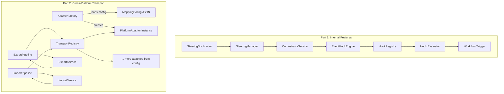
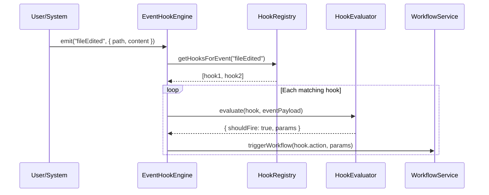
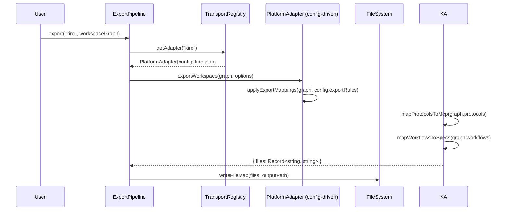
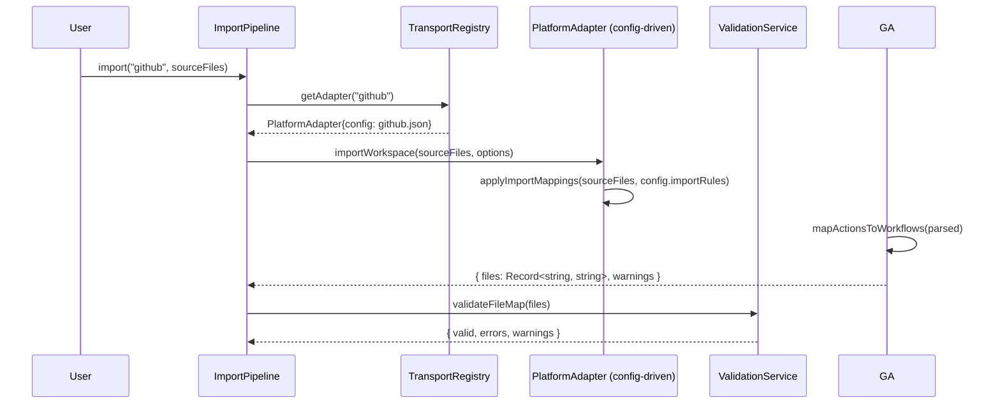

# Design Document: Cross-Platform Transport

## Overview

Cross-Platform Transport adds two major capabilities to AgentFlow. First, it fills gaps in AgentFlow's internal feature set by introducing user-configurable event hooks (analogous to Kiro's `fileEdited`/`preToolUse` hooks or GitHub Actions triggers) and a steering docs convention (analogous to Kiro's `.kiro/steering/*.md` with auto/manual inclusion). Second, it builds an extensible adapter-based format translator that can export AgentFlow workspace concepts to other platform formats (Kiro, GitHub Actions) and import from those platforms back into AgentFlow.

The design leverages AgentFlow's existing adapter pattern from the protocol layer (`ProtocolAdapter` → `ProtocolRegistry`) as architectural inspiration, but creates a separate `PlatformAdapter` hierarchy specifically for format translation. The event hook system integrates with the existing Fastify lifecycle and workspace orchestrator. Steering docs extend the identity system alongside `AGENTS.md`.

## Architecture



## Sequence Diagrams

### Event Hook Lifecycle



### Export to Kiro Format



### Import from GitHub



## Components and Interfaces

### Component 1: EventHookEngine

**Purpose**: Manages user-configurable event hooks that trigger actions when workspace events occur.

**Interface**:
```javascript
class EventHookEngine {
  constructor(hookRegistry, workflowService, logger) {}
  
  /** Emit an event — evaluates all registered hooks and fires matching ones */
  async emit(eventName, payload) {}
  
  /** Register a built-in event type with its schema */
  registerEventType(name, payloadSchema) {}
  
  /** Get all registered event types */
  listEventTypes() {}
}
```

**Responsibilities**:
- Receive events from system components (file changes, tool invocations, workflow completions)
- Match events against registered hooks using the HookEvaluator
- Trigger configured actions (workflow start, notification, script execution)
- Provide event type registry for validation

### Component 2: HookRegistry

**Purpose**: Loads, stores, and queries hook configurations from individual `.json` files in `.agentflow/hooks/`.

**Interface**:
```javascript
class HookRegistry {
  constructor(rootDir) {}
  
  /** Load all hook JSON files from .agentflow/hooks/ directory */
  loadAll() {}
  
  /** Reload hooks from disk */
  reload() {}
  
  /** Get all hooks that listen for a given event */
  getHooksForEvent(eventName) {}
  
  /** Add a new hook — writes a .json file to .agentflow/hooks/ */
  addHook(hook) {}
  
  /** Remove a hook — deletes the .json file from .agentflow/hooks/ */
  removeHook(hookName) {}
  
  /** Update a hook — rewrites the .json file */
  updateHook(hookName, changes) {}
  
  /** List all hooks */
  list() {}
}
```

### Component 3: SteeringManager

**Purpose**: Loads and manages steering documents from `.agentflow/steering/` with auto/manual inclusion modes.

**Interface**:
```javascript
class SteeringManager {
  constructor(rootDir, logger) {}
  
  /** Load all steering docs, respecting inclusion mode */
  loadAll() {}
  
  /** Get steering content for context injection (auto-included only unless names specified) */
  getSteeringContext(requestedNames) {}
  
  /** List available steering docs with their metadata */
  list() {}
  
  /** Add a new steering doc */
  add(name, content, options) {}
  
  /** Remove a steering doc */
  remove(name) {}
}
```

### Component 4: TransportRegistry

**Purpose**: Registry for platform adapters, analogous to ProtocolRegistry but for format translation.

**Interface**:
```javascript
class TransportRegistry {
  constructor() {}
  
  /** Register a platform adapter */
  register(adapter) {}
  
  /** Get adapter by platform name */
  get(platformName) {}
  
  /** List all registered adapters */
  list() {}
  
  /** Check if a platform is supported */
  supports(platformName) {}
}
```

### Component 5: PlatformAdapter (Config-Driven Engine)

**Purpose**: A single generic adapter class that applies declarative mapping rules from a JSON config. No subclasses — every platform (Kiro, GitHub, Cursor, Claude Code, etc.) is just a different config file fed into the same engine.

**Interface**:
```javascript
class PlatformAdapter {
  /**
   * @param {PlatformMappingConfig} config - Declarative mapping config loaded from JSON
   */
  constructor(config) {
    this.name = config.name;              // e.g. 'kiro', 'github'
    this.displayName = config.displayName; // e.g. 'Kiro', 'GitHub Actions'
    this.version = config.version;
    this.capabilities = config.capabilities; // ['export', 'import'] or subset
    this.config = config;
  }
  
  /** Export AgentFlow workspace to this platform's format — driven by config.exportRules */
  async exportWorkspace(graph, options) {
    return applyExportRules(graph, this.config.exportRules, options);
  }
  
  /** Import from this platform's format — driven by config.importRules */
  async importWorkspace(sourceFiles, options) {
    return applyImportRules(sourceFiles, this.config.importRules, options);
  }
  
  /** Validate source files before import — driven by config.importRules expected patterns */
  validateImportSource(sourceFiles) {
    return validateAgainstRules(sourceFiles, this.config.importRules);
  }
  
  /** Get mapping description — derived directly from config rules */
  getMappingInfo() {
    return {
      platform: this.name,
      exportMappings: this.config.exportRules.map(r => ({
        source: r.source, target: r.target, fidelity: r.fidelity, note: r.note
      })),
      importMappings: this.config.importRules.map(r => ({
        source: r.source, target: r.target, fidelity: r.fidelity, note: r.note
      })),
    };
  }
}
```

### Component 6: AdapterFactory

**Purpose**: Loads platform mapping configs from built-in defaults + user overrides, creates `PlatformAdapter` instances, and registers them in the `TransportRegistry`.

**Interface**:
```javascript
class AdapterFactory {
  /**
   * @param {string} builtInDir - Path to built-in configs (e.g. src/transport/platforms/)
   * @param {string} [userDir]  - Path to user overrides (e.g. .agentflow/transport/)
   */
  constructor(builtInDir, userDir) {}
  
  /** Load all platform configs and create adapter instances */
  loadAll() {}
  
  /** Load a single platform config (user override wins over built-in) */
  loadPlatform(name) {}
  
  /** Register all loaded adapters into a TransportRegistry */
  registerAll(transportRegistry) {}
}
```

**Config resolution order** (user overrides built-in):
1. Built-in: `src/transport/platforms/{name}.json` — ships with AgentFlow
2. User override: `.agentflow/transport/{name}.json` — per-workspace customization
3. If both exist, deep-merge with user config winning on conflicts

**Adding a new platform** = drop a new `.json` config file. Zero code changes.

## Data Models

### Hook Definition (individual `.json` files)

Hooks are individual `.json` files in `.agentflow/hooks/`. This matches the industry standard — Kiro uses `.kiro/hooks/*.json`, Claude Code uses `hooks[]` in `.claude/settings.json`. Hooks are structured machine-executable config, not documentation, so JSON is the right format.

```json
// Example: .agentflow/hooks/validate-on-save.json
{
  "name": "validate-on-save",
  "version": "1.0.0",
  "description": "Triggers build-feature workflow when a .md file is edited",
  "event": "fileEdited",
  "condition": {
    "field": "path",
    "operator": "endsWith",
    "value": ".md"
  },
  "action": {
    "type": "trigger-workflow",
    "target": "build-feature",
    "params": {}
  },
  "enabled": true,
  "priority": 100
}
```

```javascript
/**
 * @typedef {Object} HookDefinition
 * @property {string} name - Filename stem (e.g. 'validate-on-save')
 * @property {string} version - Semver version
 * @property {string} [description] - Human-readable description
 * @property {string} event - Event name to listen for
 * @property {HookCondition} [condition] - Optional filter condition
 * @property {HookAction} action - What to do when hook fires
 * @property {boolean} enabled - Whether hook is active
 * @property {number} [priority] - Execution order (lower = first, default 100)
 */

const HookDefinitionSchema = z.object({
  name: z.string().min(1).max(100),
  version: z.string().default('1.0.0'),
  description: z.string().optional(),
  event: z.string().min(1),
  condition: z.object({
    field: z.string(),
    operator: z.enum(['equals', 'contains', 'matches', 'startsWith', 'endsWith']),
    value: z.union([z.string(), z.number(), z.boolean()]),
  }).optional(),
  action: z.object({
    type: z.enum(['trigger-workflow', 'run-script', 'notify', 'log']),
    target: z.string(),
    params: z.record(z.unknown()).default({}),
  }),
  enabled: z.boolean().default(true),
  priority: z.number().int().min(0).max(1000).default(100),
});
```

**Validation Rules**:
- `name` is the filename stem (e.g. `validate-on-save` from `validate-on-save.json`)
- `event` must match a registered event type
- `action.target` must reference a valid workflow/script when type is `trigger-workflow` or `run-script`
- `priority` range: 0-1000

**Why `.json` instead of `.md`**: Cross-platform research confirms hooks are structured config, not documentation. Kiro uses individual `.json` files per hook, Claude Code embeds hooks in a JSON settings file. No platform uses `.md` for hooks. Keeping hooks as JSON means they don't pollute the markdown parser, don't appear as "resources" in the Explorer (they're config, not content), and export cleanly to other platforms' JSON formats.

### Event Types

```javascript
const BUILT_IN_EVENTS = {
  'fileEdited':        { fields: ['path', 'content', 'oldContent'] },
  'fileCreated':       { fields: ['path', 'content'] },
  'fileDeleted':       { fields: ['path'] },
  'preToolUse':        { fields: ['toolName', 'args', 'source'] },
  'postToolUse':       { fields: ['toolName', 'args', 'result', 'source'] },
  'workflowStarted':  { fields: ['workflowId', 'trigger'] },
  'workflowCompleted': { fields: ['workflowId', 'result', 'duration'] },
  'workflowFailed':   { fields: ['workflowId', 'error'] },
  'nodeEntered':       { fields: ['workflowId', 'nodeId', 'nodeType'] },
  'nodeCompleted':     { fields: ['workflowId', 'nodeId', 'result'] },
  'memoryUpdated':     { fields: ['category', 'key', 'value'] },
  'protocolToggled':   { fields: ['protocolName', 'enabled'] },
};
```

### Steering Document

```javascript
/**
 * @typedef {Object} SteeringDoc
 * @property {string} name - Filename without extension (e.g. 'code-style')
 * @property {'auto'|'manual'} inclusion - auto = always injected, manual = on-demand
 * @property {string} content - Markdown content
 * @property {string[]} [tags] - Optional categorization tags
 * @property {string} [description] - Brief description
 */

// Frontmatter format for .agentflow/steering/*.md:
// ---
// inclusion: auto
// description: Code style guidelines
// tags: [style, conventions]
// ---
// # Code Style
// - Use single quotes
// - 2-space indentation
// ...
```

### Platform Mapping Config (Declarative)

Each platform is defined by a single JSON config file. No code needed per platform — the `PlatformAdapter` engine reads these rules and applies them generically.

**Config file locations**:
- Built-in: `src/transport/platforms/kiro.json`, `src/transport/platforms/github.json`
- User overrides: `.agentflow/transport/kiro.json` (deep-merged, user wins)
- Custom platforms: `.agentflow/transport/my-platform.json` (auto-discovered)

```json
// Example: src/transport/platforms/kiro.json
{
  "name": "kiro",
  "displayName": "Kiro",
  "version": "1.0.0",
  "capabilities": ["export", "import"],
  "exportRules": [
    {
      "source": "identity",
      "target": ".kiro/steering/identity.md",
      "type": "single-file",
      "fidelity": "lossy",
      "note": "AGENTS.md identity mapped to steering doc — Kiro has no separate identity concept",
      "transform": "markdown-passthrough"
    },
    {
      "source": "protocols.mcp",
      "target": ".kiro/settings/mcp.json",
      "type": "single-file",
      "fidelity": "transform",
      "note": "Extracts mcpServers from protocols.json MCP section",
      "transform": "mcp-extract-servers"
    },
    {
      "source": "steering/*",
      "target": ".kiro/steering/{name}.md",
      "type": "glob-copy",
      "fidelity": "direct",
      "transform": "markdown-passthrough"
    },
    {
      "source": "hooks/*",
      "target": ".kiro/hooks/{name}.json",
      "type": "glob-copy",
      "fidelity": "direct",
      "transform": "json-passthrough"
    },
    {
      "source": "workflows/*",
      "target": ".kiro/specs/{name}/design.md",
      "type": "glob-transform",
      "fidelity": "lossy",
      "note": "Workflow nodes mapped to spec tasks — structural loss",
      "transform": "workflow-to-kiro-spec"
    },
    {
      "source": "tools/*",
      "target": null,
      "type": "skip",
      "fidelity": "skip",
      "note": "Tool descriptors have no direct Kiro equivalent"
    },
    {
      "source": "memory/*",
      "target": null,
      "type": "skip",
      "fidelity": "skip",
      "note": "Memory files have no direct Kiro equivalent"
    }
  ],
  "importRules": [
    {
      "source": ".kiro/steering/identity.md",
      "target": "AGENTS.md",
      "type": "single-file",
      "fidelity": "lossy",
      "note": "Kiro steering identity mapped back to AGENTS.md",
      "transform": "kiro-steering-to-identity"
    },
    {
      "source": ".kiro/steering/*.md",
      "target": "steering/{name}.md",
      "type": "glob-copy",
      "fidelity": "direct",
      "exclude": ["identity.md"],
      "transform": "ensure-steering-frontmatter"
    },
    {
      "source": ".kiro/hooks/*.json",
      "target": "hooks/{name}.json",
      "type": "glob-copy",
      "fidelity": "direct",
      "transform": "json-passthrough"
    },
    {
      "source": ".kiro/settings/mcp.json",
      "target": ".agentflow/mcp.json",
      "type": "single-file",
      "fidelity": "transform",
      "transform": "kiro-mcp-to-protocols"
    },
    {
      "source": ".kiro/specs/*/",
      "target": "workflows/{name}/",
      "type": "glob-transform",
      "fidelity": "lossy",
      "note": "Kiro specs imported as workflow scaffolds — manual refinement needed",
      "transform": "kiro-spec-to-workflow"
    }
  ]
}
```

```json
// Example: src/transport/platforms/github.json
{
  "name": "github",
  "displayName": "GitHub Actions",
  "version": "1.0.0",
  "capabilities": ["export", "import"],
  "exportRules": [
    {
      "source": "identity",
      "target": ".github/copilot-instructions.md",
      "type": "single-file",
      "fidelity": "transform",
      "transform": "identity-to-copilot-instructions"
    },
    {
      "source": "steering/*",
      "target": ".github/instructions/{name}.md",
      "type": "glob-copy",
      "fidelity": "direct",
      "transform": "markdown-passthrough"
    },
    {
      "source": "workflows/*",
      "target": ".github/workflows/{name}.yml",
      "type": "glob-transform",
      "fidelity": "lossy",
      "note": "AgentFlow workflows mapped to GitHub Actions YAML — structural loss",
      "transform": "workflow-to-github-actions"
    },
    {
      "source": "hooks/*",
      "target": null,
      "type": "merge-into",
      "mergeTarget": ".github/workflows/{workflow}.yml",
      "fidelity": "transform",
      "note": "Hook triggers merged into workflow YAML on: section",
      "transform": "hooks-to-github-triggers"
    },
    {
      "source": "tools/*",
      "target": null,
      "type": "skip",
      "fidelity": "skip",
      "note": "Tool descriptors referenced as step comments"
    },
    {
      "source": "memory/*",
      "target": null,
      "type": "skip",
      "fidelity": "skip"
    }
  ],
  "importRules": [
    {
      "source": ".github/workflows/*.yml",
      "target": "workflows/{name}/",
      "type": "glob-transform",
      "fidelity": "lossy",
      "transform": "github-actions-to-workflow"
    },
    {
      "source": ".github/workflows/*.yml",
      "target": "hooks/{name}-{trigger}.json",
      "type": "glob-transform",
      "fidelity": "transform",
      "note": "on: triggers extracted as individual hook JSON files",
      "transform": "github-triggers-to-hooks"
    },
    {
      "source": ".github/copilot-instructions.md",
      "target": "AGENTS.md",
      "type": "single-file",
      "fidelity": "transform",
      "transform": "copilot-instructions-to-identity"
    },
    {
      "source": ".github/instructions/*.md",
      "target": "steering/{name}.md",
      "type": "glob-copy",
      "fidelity": "direct",
      "transform": "ensure-steering-frontmatter"
    }
  ]
}
```

**Mapping Rule Schema**:

```javascript
const MappingRuleSchema = z.object({
  source: z.string(),                    // AgentFlow concept or glob (e.g. 'identity', 'steering/*', 'hooks/*')
  target: z.string().nullable(),         // Target path pattern (null for skip/merge-into)
  type: z.enum([
    'single-file',    // One source → one target file
    'glob-copy',      // Pattern match → copy with name substitution
    'glob-transform', // Pattern match → transform each file
    'merge-into',     // Merge source into another target file
    'skip',           // No equivalent on target platform
  ]),
  fidelity: z.enum(['direct', 'transform', 'lossy', 'skip']),
  note: z.string().optional(),           // Human-readable explanation
  transform: z.string(),                 // Transform function name (registered in TransformRegistry)
  exclude: z.array(z.string()).optional(), // Files to exclude from glob
  mergeTarget: z.string().optional(),    // For merge-into type: which file to merge into
});

const PlatformMappingConfigSchema = z.object({
  name: z.string().min(1),
  displayName: z.string(),
  version: z.string().default('1.0.0'),
  capabilities: z.array(z.enum(['export', 'import'])),
  exportRules: z.array(MappingRuleSchema),
  importRules: z.array(MappingRuleSchema),
});
```

**Transform Registry** — Named transform functions are registered once and referenced by string name in configs:

```javascript
// src/transport/transforms.js
const TRANSFORMS = {
  // Passthrough transforms
  'markdown-passthrough':        (content) => content,
  'json-passthrough':            (content) => content,
  'ensure-steering-frontmatter': (content) => ensureFrontmatter(content, { inclusion: 'manual' }),
  
  // Kiro-specific transforms
  'mcp-extract-servers':         (protocolsJson) => extractMcpServers(protocolsJson),
  'kiro-mcp-to-protocols':       (mcpJson) => buildProtocolsFromMcp(mcpJson),
  'kiro-steering-to-identity':   (steeringMd) => buildAgentsMdFromSteering(steeringMd),
  'workflow-to-kiro-spec':       (workflow) => buildKiroSpecFromWorkflow(workflow),
  'kiro-spec-to-workflow':       (specFiles) => buildWorkflowFromKiroSpec(specFiles),
  
  // GitHub-specific transforms
  'identity-to-copilot-instructions': (agentsMd) => buildCopilotInstructions(agentsMd),
  'copilot-instructions-to-identity': (copilotMd) => buildAgentsMdFromCopilot(copilotMd),
  'workflow-to-github-actions':       (workflow) => buildGitHubActionsYaml(workflow),
  'github-actions-to-workflow':       (yaml) => buildWorkflowFromActions(yaml),
  'hooks-to-github-triggers':         (hooks) => mergeHooksIntoYamlTriggers(hooks),
  'github-triggers-to-hooks':         (yaml) => extractHooksFromTriggers(yaml),
};
```

Users can register custom transforms via `.agentflow/transport/transforms.js` (loaded dynamically if present). This keeps the engine fully extensible without forking.

### Platform Mapping Manifest (Runtime Output)

The `getMappingInfo()` output is derived from the config at runtime — not a separate data model:

```javascript
/**
 * @typedef {Object} MappingInfo
 * @property {string} platform - Platform name
 * @property {MappingEntry[]} exportMappings - AgentFlow → Platform (from config.exportRules)
 * @property {MappingEntry[]} importMappings - Platform → AgentFlow (from config.importRules)
 */

/**
 * @typedef {Object} MappingEntry
 * @property {string} source - Source path/concept
 * @property {string} target - Target path/concept
 * @property {'direct'|'transform'|'lossy'|'skip'} fidelity
 * @property {string} [note] - Explanation of any data loss or transformation
 */
```

## Algorithmic Pseudocode

### Event Hook Evaluation Algorithm

```javascript
/**
 * ALGORITHM: evaluateAndFireHooks
 * INPUT: eventName (string), payload (object)
 * OUTPUT: results (array of { hookId, fired, result | error })
 */
async function evaluateAndFireHooks(eventName, payload, hookRegistry, actionExecutor) {
  // PRECONDITION: eventName is a registered event type
  // PRECONDITION: payload matches the event's field schema
  
  const hooks = hookRegistry.getHooksForEvent(eventName);
  
  // Sort by priority (lower number = higher priority)
  hooks.sort((a, b) => a.priority - b.priority);
  
  const results = [];
  
  for (const hook of hooks) {
    // LOOP INVARIANT: all previously evaluated hooks have a result entry
    
    if (!hook.enabled) {
      results.push({ hookId: hook.id, fired: false, reason: 'disabled' });
      continue;
    }
    
    // Evaluate condition if present
    if (hook.condition) {
      const fieldValue = payload[hook.condition.field];
      const matches = evaluateCondition(fieldValue, hook.condition.operator, hook.condition.value);
      if (!matches) {
        results.push({ hookId: hook.id, fired: false, reason: 'condition-not-met' });
        continue;
      }
    }
    
    // Fire the action
    try {
      const result = await actionExecutor.execute(hook.action, payload);
      results.push({ hookId: hook.id, fired: true, result });
    } catch (error) {
      results.push({ hookId: hook.id, fired: true, error: error.message });
    }
  }
  
  // POSTCONDITION: results.length === hooks.length
  // POSTCONDITION: every hook has exactly one result entry
  return results;
}

/**
 * ALGORITHM: evaluateCondition
 * INPUT: fieldValue (any), operator (string), expected (any)
 * OUTPUT: boolean
 */
function evaluateCondition(fieldValue, operator, expected) {
  // PRECONDITION: operator is one of: equals, contains, matches, startsWith, endsWith
  
  if (fieldValue === undefined || fieldValue === null) return false;
  
  const strValue = String(fieldValue);
  const strExpected = String(expected);
  
  switch (operator) {
    case 'equals':     return strValue === strExpected;
    case 'contains':   return strValue.includes(strExpected);
    case 'matches':    return new RegExp(strExpected).test(strValue);
    case 'startsWith': return strValue.startsWith(strExpected);
    case 'endsWith':   return strValue.endsWith(strExpected);
    default:           return false;
  }
  
  // POSTCONDITION: returns boolean, no side effects
}
```

### Steering Doc Loading Algorithm

```javascript
/**
 * ALGORITHM: loadSteeringContext
 * INPUT: rootDir (string), requestedNames (string[] | null)
 * OUTPUT: steeringContext (string) — concatenated steering content for LLM injection
 */
function loadSteeringContext(rootDir, requestedNames) {
  // PRECONDITION: rootDir is a valid directory path
  
  const steeringDir = path.join(rootDir, 'steering');
  
  if (!fs.existsSync(steeringDir)) {
    return '';  // No steering docs configured
  }
  
  const files = fs.readdirSync(steeringDir).filter(f => f.endsWith('.md'));
  const docs = [];
  
  for (const file of files) {
    // LOOP INVARIANT: docs contains only parsed, valid steering documents
    
    const content = fs.readFileSync(path.join(steeringDir, file), 'utf8');
    const parsed = parseFrontmatter(content);
    
    const doc = {
      name: path.basename(file, '.md'),
      inclusion: parsed.frontmatter?.inclusion || 'manual',
      content: parsed.body,
      tags: parsed.frontmatter?.tags || [],
      description: parsed.frontmatter?.description || '',
    };
    
    // Include if: auto-included, or explicitly requested by name
    const shouldInclude = doc.inclusion === 'auto' 
      || (requestedNames && requestedNames.includes(doc.name));
    
    if (shouldInclude) {
      docs.push(doc);
    }
  }
  
  // Build context string
  const context = docs.map(d => 
    `<steering name="${d.name}">\n${d.content}\n</steering>`
  ).join('\n\n');
  
  // POSTCONDITION: returned string contains only auto-included or explicitly requested docs
  // POSTCONDITION: each doc is wrapped in <steering> tags for LLM parsing
  return context;
}
```

### Export Pipeline Algorithm

```javascript
/**
 * ALGORITHM: exportToPlatform
 * INPUT: platformName (string), workspaceGraph (object), options (object)
 * OUTPUT: ServiceResult<{ files, warnings, mappingReport }>
 */
async function exportToPlatform(platformName, workspaceGraph, options, transportRegistry) {
  // PRECONDITION: platformName is registered in transportRegistry
  // PRECONDITION: workspaceGraph is a valid parsed workspace
  
  const adapter = transportRegistry.get(platformName);
  if (!adapter) {
    return fail(ErrorCode.INVALID_INPUT, `Unknown platform: ${platformName}`);
  }
  
  if (!adapter.capabilities.includes('export')) {
    return fail(ErrorCode.INVALID_INPUT, `Platform "${platformName}" does not support export`);
  }
  
  try {
    const result = await adapter.exportWorkspace(workspaceGraph, options);
    
    // ASSERT: result.files is a Record<string, string>
    // ASSERT: every file path is relative (no absolute paths, no ..)
    
    for (const filePath of Object.keys(result.files)) {
      if (path.isAbsolute(filePath) || filePath.includes('..')) {
        return fail(ErrorCode.INVALID_INPUT, `Adapter produced invalid path: ${filePath}`);
      }
    }
    
    return ok({
      files: result.files,
      warnings: result.warnings || [],
      mappingReport: adapter.getMappingInfo(),
    });
  } catch (err) {
    return fail(ErrorCode.UNKNOWN, `Export to ${platformName} failed: ${err.message}`);
  }
  
  // POSTCONDITION: on success, result.files contains valid relative paths
  // POSTCONDITION: mappingReport describes fidelity of each mapping
}
```

### Import Pipeline Algorithm

```javascript
/**
 * ALGORITHM: importFromPlatform
 * INPUT: platformName (string), sourceFiles (Record<string, string>), options (object)
 * OUTPUT: ServiceResult<{ files, warnings, mappingReport }>
 */
async function importFromPlatform(platformName, sourceFiles, options, transportRegistry) {
  // PRECONDITION: platformName is registered in transportRegistry
  // PRECONDITION: sourceFiles is a non-empty Record<string, string>
  
  const adapter = transportRegistry.get(platformName);
  if (!adapter) {
    return fail(ErrorCode.INVALID_INPUT, `Unknown platform: ${platformName}`);
  }
  
  if (!adapter.capabilities.includes('import')) {
    return fail(ErrorCode.INVALID_INPUT, `Platform "${platformName}" does not support import`);
  }
  
  // Step 1: Validate source files against platform expectations
  const validation = adapter.validateImportSource(sourceFiles);
  if (!validation.valid) {
    return fail(ErrorCode.INVALID_INPUT, validation.errors.join('; '));
  }
  
  // Step 2: Transform to AgentFlow format
  try {
    const result = await adapter.importWorkspace(sourceFiles, options);
    
    // Step 3: Validate output as valid AgentFlow file map
    // Reuse existing ImportService.validateFileMap logic
    for (const filePath of Object.keys(result.files)) {
      if (path.isAbsolute(filePath) || filePath.includes('..')) {
        return fail(ErrorCode.INVALID_INPUT, `Adapter produced invalid path: ${filePath}`);
      }
    }
    
    return ok({
      files: result.files,
      warnings: [...(validation.warnings || []), ...(result.warnings || [])],
      mappingReport: adapter.getMappingInfo(),
    });
  } catch (err) {
    return fail(ErrorCode.UNKNOWN, `Import from ${platformName} failed: ${err.message}`);
  }
  
  // POSTCONDITION: result.files is a valid AgentFlow file map
  // POSTCONDITION: warnings include both validation and transformation warnings
}
```

## Key Functions with Formal Specifications

### PlatformAdapter.exportWorkspace() (Config-Driven Engine)

```javascript
/**
 * Generic export — iterates config.exportRules, resolves sources from graph,
 * applies named transforms, produces file map + warnings.
 * Works for ANY platform — Kiro, GitHub, Cursor, Claude Code, etc.
 */
async exportWorkspace(graph, options = {}) {
  const files = {};
  const warnings = [];
  const transforms = loadTransforms(options.customTransformsDir);
  
  for (const rule of this.config.exportRules) {
    // LOOP INVARIANT: files contains only valid relative paths so far
    
    if (rule.type === 'skip') {
      const sourceData = resolveGraphSource(graph, rule.source);
      if (sourceData && Object.keys(sourceData).length > 0) {
        warnings.push(rule.note || `${rule.source}: skipped (no equivalent on ${this.name})`);
      }
      continue;
    }
    
    const sourceData = resolveGraphSource(graph, rule.source);
    if (!sourceData) continue; // source concept not present in workspace
    
    const transformFn = transforms[rule.transform];
    if (!transformFn) {
      warnings.push(`Transform "${rule.transform}" not found — skipping ${rule.source}`);
      continue;
    }
    
    switch (rule.type) {
      case 'single-file': {
        const content = transformFn(sourceData, graph, options);
        if (content) files[rule.target] = content;
        break;
      }
      case 'glob-copy':
      case 'glob-transform': {
        const entries = Object.entries(sourceData);
        for (const [name, data] of entries) {
          if (rule.exclude?.includes(`${name}.md`) || rule.exclude?.includes(`${name}.json`)) continue;
          const targetPath = rule.target.replace('{name}', name);
          files[targetPath] = transformFn(data, graph, options);
        }
        break;
      }
      case 'merge-into': {
        // Merge source data into an existing target file (e.g. hooks → YAML on: section)
        const mergedContent = transformFn(sourceData, graph, options);
        if (mergedContent) {
          // mergeTarget may reference another file already in the map
          const mergeKey = rule.mergeTarget || rule.target;
          files[mergeKey] = mergeIntoExisting(files[mergeKey], mergedContent);
        }
        break;
      }
    }
    
    if (rule.fidelity === 'lossy' && rule.note) {
      warnings.push(rule.note);
    }
  }
  
  return { files, warnings };
}
```

**Preconditions:**
- `graph` is a valid parsed AgentFlow workspace (from `parseRoot()`)
- `this.config.exportRules` is a valid array of `MappingRule` objects
- All referenced transforms exist in the transform registry

**Postconditions:**
- All returned file paths are relative (no absolute, no `..`)
- Warnings list all lossy or skipped mappings with notes from config
- The same engine produces Kiro output, GitHub output, or any other platform — determined entirely by config

### PlatformAdapter.importWorkspace() (Config-Driven Engine)

```javascript
/**
 * Generic import — iterates config.importRules, matches source files,
 * applies named transforms, produces AgentFlow file map + warnings.
 */
async importWorkspace(sourceFiles, options = {}) {
  const files = {};
  const warnings = [];
  const transforms = loadTransforms(options.customTransformsDir);
  
  for (const rule of this.config.importRules) {
    if (rule.type === 'skip') continue;
    
    const transformFn = transforms[rule.transform];
    if (!transformFn) {
      warnings.push(`Transform "${rule.transform}" not found — skipping ${rule.source}`);
      continue;
    }
    
    switch (rule.type) {
      case 'single-file': {
        const content = sourceFiles[rule.source];
        if (!content) continue;
        const result = transformFn(content, sourceFiles, options);
        if (result) files[rule.target] = result;
        break;
      }
      case 'glob-copy':
      case 'glob-transform': {
        const matched = matchGlob(sourceFiles, rule.source);
        for (const [sourcePath, content] of Object.entries(matched)) {
          const name = extractName(sourcePath, rule.source);
          if (rule.exclude?.includes(`${name}.md`) || rule.exclude?.includes(`${name}.json`)) continue;
          const targetPath = rule.target.replace('{name}', name);
          files[targetPath] = transformFn(content, sourceFiles, options);
        }
        break;
      }
      case 'merge-into': {
        const matched = matchGlob(sourceFiles, rule.source);
        const mergedContent = transformFn(matched, sourceFiles, options);
        if (mergedContent) {
          const mergeKey = rule.mergeTarget || rule.target;
          files[mergeKey] = mergeIntoExisting(files[mergeKey], mergedContent);
        }
        break;
      }
    }
    
    if (rule.fidelity === 'lossy' && rule.note) {
      warnings.push(rule.note);
    }
  }
  
  return { files, warnings };
}
```

**Preconditions:**
- `sourceFiles` keys are relative paths from the source platform workspace root
- `this.config.importRules` is a valid array of `MappingRule` objects

**Postconditions:**
- Output file paths are relative to AgentFlow workspace root
- Warnings include notes from all lossy rules that matched
- The same engine handles Kiro import, GitHub import, or any other platform

### resolveGraphSource() — Graph Concept Resolver

```javascript
/**
 * Maps a rule's `source` string to the actual data in the parsed graph.
 * Handles both singular concepts ('identity', 'protocols.mcp') and
 * glob patterns ('steering/*', 'hooks/*', 'workflows/*').
 */
function resolveGraphSource(graph, source) {
  // Singular concepts
  if (source === 'identity') return graph.identity;
  if (source === 'protocols.mcp') return graph.protocols?.mcp;
  
  // Glob patterns → return the matching graph section as Record<name, data>
  const globMatch = source.match(/^(\w+)\/\*$/);
  if (globMatch) {
    const section = globMatch[1]; // e.g. 'steering', 'hooks', 'workflows', 'tools', 'memory'
    return graph[section] || null;
  }
  
  return null;
}
```

### AdapterFactory.loadAll() — Config Discovery & Instantiation

```javascript
/**
 * Discovers platform configs from built-in + user dirs, merges overrides,
 * creates PlatformAdapter instances.
 */
loadAll() {
  const adapters = [];
  
  // 1. Scan built-in configs
  const builtInConfigs = fs.readdirSync(this.builtInDir)
    .filter(f => f.endsWith('.json'))
    .map(f => ({ name: path.basename(f, '.json'), path: path.join(this.builtInDir, f) }));
  
  // 2. Scan user overrides / custom configs
  const userConfigs = this.userDir && fs.existsSync(this.userDir)
    ? fs.readdirSync(this.userDir)
        .filter(f => f.endsWith('.json'))
        .map(f => ({ name: path.basename(f, '.json'), path: path.join(this.userDir, f) }))
    : [];
  
  // 3. Merge: user config overrides built-in for same platform name
  const allNames = new Set([...builtInConfigs.map(c => c.name), ...userConfigs.map(c => c.name)]);
  
  for (const name of allNames) {
    const builtIn = builtInConfigs.find(c => c.name === name);
    const user = userConfigs.find(c => c.name === name);
    
    let config;
    if (builtIn && user) {
      // Deep merge — user wins on conflicts
      const base = JSON.parse(fs.readFileSync(builtIn.path, 'utf8'));
      const override = JSON.parse(fs.readFileSync(user.path, 'utf8'));
      config = deepMerge(base, override);
    } else {
      const configPath = (user || builtIn).path;
      config = JSON.parse(fs.readFileSync(configPath, 'utf8'));
    }
    
    // Validate
    const parsed = PlatformMappingConfigSchema.safeParse(config);
    if (!parsed.success) {
      console.warn(`Invalid platform config "${name}": ${parsed.error.message}`);
      continue;
    }
    
    adapters.push(new PlatformAdapter(parsed.data));
  }
  
  return adapters;
}
```

**Preconditions:**
- `this.builtInDir` exists and contains valid JSON config files
- `this.userDir` may not exist (optional)

**Postconditions:**
- Returns one `PlatformAdapter` per unique platform name
- User configs override built-in configs via deep merge
- Invalid configs are skipped with a warning (graceful degradation)

## Example Usage

```javascript
// === Part 1: Event Hooks ===

// Configure a hook in .agentflow/hooks/validate-markdown.json
// {
//   "name": "validate-markdown",
//   "version": "1.0.0",
//   "event": "fileEdited",
//   "condition": { "field": "path", "operator": "endsWith", "value": ".md" },
//   "action": { "type": "trigger-workflow", "target": "build-feature", "params": {} },
//   "enabled": true,
//   "priority": 100
// }

// Configure another hook in .agentflow/hooks/log-tool-usage.json
// {
//   "name": "log-tool-usage",
//   "version": "1.0.0",
//   "event": "postToolUse",
//   "action": { "type": "log", "target": "memory/tool-usage.md", "params": {} },
//   "enabled": true,
//   "priority": 200
// }

// Emit an event programmatically
await eventHookEngine.emit('fileEdited', {
  path: 'workflows/build-feature/step-1/SKILL.md',
  content: '...',
  oldContent: '...',
});


// === Part 1: Steering Docs ===

// .agentflow/steering/code-style.md
// ---
// inclusion: auto
// description: Code style conventions
// tags: [style]
// ---
// # Code Style
// - Use single quotes
// - 2-space indentation

// Load steering context for LLM injection
const steeringContext = steeringManager.getSteeringContext();
// Returns all auto-included docs wrapped in <steering> tags

// Load specific manual doc
const specific = steeringManager.getSteeringContext(['security-guidelines']);


// === Part 2: Export to Kiro ===

const transportRegistry = new TransportRegistry();
// Factory loads all platform configs (built-in + user overrides) and creates adapters
const factory = new AdapterFactory('src/transport/platforms', '.agentflow/transport');
factory.registerAll(transportRegistry);
// That's it — kiro, github, and any custom .json configs are now registered

const graph = parseRoot(rootDir);
const result = await exportToPlatform('kiro', graph, {}, transportRegistry);
// result.data.files = {
//   '.kiro/steering/identity.md': '...',
//   '.kiro/mcp.json': '{ "mcpServers": { ... } }',
//   '.kiro/specs/build-feature/design.md': '...',
// }


// === Part 2: Import from GitHub ===

const githubFiles = {
  '.github/workflows/ci.yml': 'name: CI\non:\n  push:\n    branches: [main]\njobs: ...',
  '.github/copilot-instructions.md': '# Instructions\nYou are a helpful assistant...',
};

const importResult = await importFromPlatform('github', githubFiles, {}, transportRegistry);
// importResult.data.files = {
//   'workflow-ci/SKILL.md': '...',
//   'AGENTS.md': '---\nname: ...\n---\n...',
//   'hooks/ci-push.json': '{ "name": "ci-push", "event": "fileEdited", ... }',
// }
```

## Correctness Properties

The following properties must hold for all valid inputs:

1. **Hook evaluation completeness**: For any event emission, every enabled hook registered for that event type must be evaluated exactly once, and the results array length must equal the number of matching hooks.

2. **Hook condition determinism**: `evaluateCondition(value, op, expected)` must be a pure function — same inputs always produce the same boolean output with no side effects.

3. **Steering inclusion correctness**: `getSteeringContext(null)` must return only docs with `inclusion: 'auto'`. `getSteeringContext(['x'])` must return auto-included docs plus doc named 'x' if it exists.

4. **Export-import round-trip (identity preservation)**: For any AgentFlow workspace `W`, `import(platform, export(platform, W))` must produce a workspace `W'` where: (a) `W'.identity` is semantically equivalent to `W.identity`, (b) `W'.protocols.mcp` is identical to `W.protocols.mcp`, (c) `W'.workflows` has the same number of workflows as `W.workflows`.

5. **Path safety invariant**: No adapter (export or import) may produce file paths that are absolute or contain `..` traversal. This must be validated by the pipeline after every adapter call.

6. **Platform adapter isolation**: The `PlatformAdapter` engine operates only on its input data (graph or sourceFiles) and its declarative config. No adapter call may directly read from or write to the filesystem.

7. **Registry uniqueness**: `TransportRegistry` must reject registration of an adapter whose `name` matches an already-registered adapter.

8. **Mapping fidelity reporting**: Every export/import operation must return a `mappingReport` derived from the config rules, listing each concept mapping with its fidelity level (`direct`, `transform`, `lossy`, `skip`).

9. **Config schema validity**: Every platform config file (built-in or user) must pass `PlatformMappingConfigSchema` validation. Invalid configs are skipped with a warning, never silently loaded.

10. **Transform registry completeness**: Every `transform` name referenced in a platform config must exist in the transform registry. Missing transforms produce a warning and skip the rule — never a crash.

11. **User override precedence**: When both a built-in and user config exist for the same platform name, the user config deep-merges over the built-in, with user values winning on conflicts.

## Error Handling

### Error Scenario 1: Unknown Platform

**Condition**: User requests export/import for an unregistered platform name
**Response**: Return `fail(ErrorCode.INVALID_INPUT, "Unknown platform: {name}")` with HTTP 400
**Recovery**: List available platforms in error message

### Error Scenario 2: Invalid Hook Configuration

**Condition**: A hook `.json` file fails Zod schema validation on load
**Response**: Log warning, skip that hook file (graceful degradation)
**Recovery**: Expose validation errors via `GET /api/hooks/validate` endpoint

### Error Scenario 3: Adapter Export Produces Invalid Paths

**Condition**: A platform adapter returns file paths with `..` or absolute paths
**Response**: Return `fail(ErrorCode.INVALID_INPUT, "Adapter produced invalid path")` — reject entire export
**Recovery**: This is a bug in the adapter; adapter author must fix

### Error Scenario 4: YAML Parse Failure on GitHub Import

**Condition**: GitHub Actions YAML file is malformed
**Response**: Skip that file, add warning to result, continue processing other files
**Recovery**: User can fix YAML and re-import

### Error Scenario 5: Missing AGENTS.md on Kiro Import

**Condition**: Kiro workspace has no steering/identity.md
**Response**: Generate a default AGENTS.md with minimal frontmatter
**Recovery**: User can edit the generated AGENTS.md

### Error Scenario 6: Conflicting Hook Names

**Condition**: Two hook files in `.agentflow/hooks/` have the same `name` field
**Response**: Reject the duplicate with validation warning, keep the first loaded
**Recovery**: User must rename or remove the duplicate hook file

## Testing Strategy

### Unit Testing Approach

- Test each `evaluateCondition` operator independently with edge cases (null values, empty strings, regex special chars)
- Test `HookRegistry` CRUD operations (add, remove, getHooksForEvent, persistence)
- Test `SteeringManager` loading with various frontmatter combinations (auto/manual, missing frontmatter, invalid YAML)
- Test each `PlatformAdapter` export/import independently with fixture data — same engine, different configs (kiro.json, github.json)
- Test `AdapterFactory` config loading, deep-merge override behavior, and invalid config rejection
- Test `TransformRegistry` — each named transform independently with edge cases
- Test `TransportRegistry` registration, deduplication, and lookup
- Test path safety validation in export/import pipelines

### Property-Based Testing Approach

**Property Test Library**: fast-check

- **Hook evaluation**: For any randomly generated list of hooks and event payload, the number of results equals the number of hooks, and every hook ID appears exactly once in results.
- **Condition evaluation purity**: For any random (value, operator, expected) triple, calling `evaluateCondition` twice produces the same result.
- **Path safety**: For any adapter output (regardless of which platform config drives it), no file path in the result is absolute or contains `..`.
- **Round-trip fidelity**: For any generated AgentFlow workspace graph, exporting to a platform and importing back preserves the MCP server configuration exactly.
- **Config-driven determinism**: For any valid `PlatformMappingConfig`, the same graph input always produces the same file map output (no hidden state in the engine).

### Integration Testing Approach

- End-to-end export: parse example workspace → export to Kiro → verify output file structure matches expected Kiro layout
- End-to-end import: load Kiro fixture files → import → verify resulting AgentFlow workspace is valid (passes `validateFileMap`)
- Hook lifecycle: register hook → emit matching event → verify action was triggered
- Steering injection: create steering docs → call `getContext()` → verify steering content appears in orchestrator context

## Performance Considerations

- Hook evaluation is synchronous per-event; hooks are sorted by priority once on load, not per-emission
- Steering docs are loaded once and cached; cache invalidated on file change (via `fileEdited` hook if configured)
- Platform adapters process file maps in memory — no streaming needed for typical workspace sizes (<1000 files)
- YAML parsing for GitHub import uses `js-yaml` which is fast for typical workflow files (<100KB each)

## Security Considerations

- Hook `action.type: 'run-script'` must be sandboxed or restricted to approved script paths within the workspace
- `evaluateCondition` with `matches` operator uses `new RegExp()` — must guard against ReDoS with timeout or complexity limit
- Import pipeline validates all paths for traversal attacks (existing `validateFileMap` logic)
- Platform adapters must not leak sensitive config (API keys, tokens) during export — MCP server `env` values with `${env:...}` patterns should be exported as placeholders, not resolved values
- Steering docs with `inclusion: 'auto'` are injected into LLM context — users must be aware this affects all conversations

## UI Components

The UI integrates into the existing taxonomy rather than adding new panels. The three new concepts map to existing UI patterns based on their nature:

- **Steering docs** → new resource category in the Explorer (`.md` files, same pattern as `tools/`, `skills/`, `memory/`)
- **Hooks** → new section in the ProtocolPanel (hooks are JSON config, not markdown resources — they don't belong in the Explorer)
- **Transport** → new "Platform" tab in the existing ExportDialog

No new floating panels, no new panel events, no new StatusBar buttons.

### Architecture Overview

```mermaid
graph TD
    subgraph "Existing Explorer"
        EX[ExplorerPanel] --> S1[Tools section]
        EX --> S2[Skills section]
        EX --> S3[Memory section]
        EX --> S4["Steering section ← NEW"]
    end

    subgraph "Existing ProtocolPanel"
        PP[ProtocolPanel] --> C1[agent-to-tool]
        PP --> C2[agent-to-agent]
        PP --> C3[agent-to-user]
        PP --> C4["Event Hooks section ← NEW"]
    end

    subgraph "Existing ExportDialog"
        ED[ExportDialog] --> T1[Raw / Parsed tabs]
        ED --> T2["Platform tab ← NEW"]
        T2 --> PA1[Kiro adapter]
        T2 --> PA2[GitHub adapter]
    end

    subgraph "API Endpoints"
        S4 -->|GET/POST/DELETE| API2[/api/steering]
        C4 -->|GET/POST/DELETE| API1[/api/hooks]
        T2 -->|POST| API3[/api/transport/export]
        T2 -->|POST| API4[/api/transport/import]
        T2 -->|GET| API5[/api/transport/platforms]
    end
```

### Change 1: Steering as a Resource Category

Steering docs are `.md` files in `.agentflow/steering/` — structurally identical to `tools/`, `skills/`, `memory/`. They get the same treatment.

**`ui/src/constants.ts`** — Add to `CATEGORIES`:

```typescript
import { Compass, Webhook } from 'lucide-react'

steering: { icon: Compass, label: 'Steering',
  light: { primaryColor: '#00838F', containerColor: '#E0F7FA', onColor: '#006064' },
  dark:  { primaryColor: '#4DD0E1', containerColor: 'rgba(77,208,225,0.15)', onColor: '#4DD0E1' },
},
hooks: { icon: Webhook, label: 'Hook',
  light: { primaryColor: '#E65100', containerColor: '#FFF3E0', onColor: '#BF360C' },
  dark:  { primaryColor: '#FFB74D', containerColor: 'rgba(255,183,77,0.15)', onColor: '#FFB74D' },
},
```

**`ui/src/constants.ts`** — Add to `SIDEBAR_SECTIONS`:

```typescript
{ key: 'steering', label: 'Steering' },
{ key: 'hooks', label: 'Hooks' },
```

**`ui/src/types.ts`** — Add `'steering'` and `'hooks'` to `ResourceCategory` union type.

**`ui/src/utils/buildExplorerSections.ts`** — Add both to `RESOURCE_CATEGORIES` array:

```typescript
const RESOURCE_CATEGORIES: ResourceCategory[] = ['tools', 'skills', 'templates', 'interactions', 'memory', 'steering', 'hooks']
```

**Backend parser (`src/parser.js`)** — Add to constants:

```javascript
const RESERVED_DIRS = ['tools', 'skills', 'interactions', 'templates', 'memory', 'steering'];

const RESERVED_DIR_TYPE_MAP = {
  tools: 'tool',
  skills: 'skill',
  templates: 'template',
  interactions: 'interaction',
  memory: 'memory',
  steering: 'steering',
};
```

This makes the parser walk `.agentflow/steering/` and include parsed docs in `graph.steering`, same shape as `graph.tools` / `graph.memory`.

**Hooks in the graph** — Hooks are NOT parsed by the markdown parser (they're `.json`). Instead, `parseRoot()` gets a small addition: after parsing `.md` resources, scan `.agentflow/hooks/` for `*.json` files, `JSON.parse` each, validate against `HookDefinitionSchema`, and attach to `graph.hooks` as `Record<string, HookDefinition>`. This keeps hooks in the graph for the Explorer and export adapters to consume, without polluting the markdown parser.

**Explorer behavior**: Steering docs appear as a collapsible section in the Explorer with the Compass icon. Clicking a doc opens it in the ResourceCard (existing pattern). The ResourceCard already renders frontmatter + markdown body — steering docs with `inclusion`/`tags` frontmatter display naturally.

**Steering-specific detail**: The ResourceCard should show an "AUTO" or "MANUAL" badge based on the `inclusion` frontmatter field. Small addition to the existing ResourceCard — check `frontmatter.inclusion` and render a badge.

**File management**: Users need to create, rename, and delete steering docs directly from the Explorer. The Explorer section header gets an "Add" button (same pattern as other resource sections). Clicking it opens an inline form or small dialog to name the doc and set inclusion mode. Each item in the section gets a context menu (right-click or `...` button) with Rename and Delete actions. These call the existing `POST /api/steering`, `PATCH /api/steering/:name`, and `DELETE /api/steering/:name` endpoints. The backend handles the actual file I/O in `.agentflow/steering/`.

### Change 1b: Explorer-Wide CRUD Actions

The Explorer currently has no create/rename/delete for any resource section. This is a cross-cutting improvement: add CRUD to the `SectionGroup` component once, and all resource categories benefit (tools, skills, memory, steering, hooks — everything).

**SectionGroup enhancement** — Add an "Add" (`+`) button to each section header. Clicking it calls the existing `POST /api/create` endpoint with the appropriate path prefix (e.g. `steering/new-doc.md`, `tools/new-tool.md`, `hooks/new-hook.json`). For `.md` resources, the created file gets minimal frontmatter scaffolding. For `.json` hooks, it gets a valid `HookDefinitionSchema` scaffold.

**Item context menu** — Each Explorer item gets a lightweight context menu (right-click or `...` overflow button) with:
- **Rename** → calls `POST /api/move` with `{ from, to }` (existing endpoint)
- **Delete** → calls `POST /api/delete` with `{ path }` (existing endpoint)
- **Duplicate** → calls `POST /api/create` with content copied from the original

The context menu is a single shared component used by all sections. No per-category special-casing — the category determines the file extension (`.md` vs `.json`) and the default scaffold content.

**Backend**: No new endpoints needed. The existing `/api/create`, `/api/delete`, `/api/move`, `/api/save` cover all operations. The UI just needs to construct the right paths.

### Change 2: Hooks Section in ProtocolPanel

Hooks are workspace configuration (JSON files), not markdown resources. They belong in the ProtocolPanel alongside protocol config. The ProtocolPanel already groups by category — hooks become a new section at the top.

**`ui/src/components/ProtocolPanel.tsx`** — Add a `HooksSection` above the existing category sections:

```typescript
function HooksSection() {
  const [hooks, setHooks] = useState<HookDefinition[]>([])
  const [eventTypes, setEventTypes] = useState<string[]>([])
  const [adding, setAdding] = useState(false)

  useEffect(() => {
    fetch('/api/hooks').then(r => r.json()).then(d => setHooks(d.data?.hooks || []))
    fetch('/api/hooks/event-types').then(r => r.json()).then(d => setEventTypes(d.data || []))
  }, [])

  return (
    <CategorySection label="Event Hooks" icon={Webhook} protocols={[]} onToggle={() => {}}>
      {hooks.map(hook => <HookCard key={hook.name} hook={hook} onToggle={...} onDelete={...} />)}
      {hooks.length === 0 && <EmptyState message="No hooks configured" />}
      {adding ? <HookForm eventTypes={eventTypes} onSave={...} onCancel={...} /> : null}
      <AddButton onClick={() => setAdding(true)} label="Add Hook" />
    </CategorySection>
  )
}
```

**HookCard** — Each hook displays as a card (same visual pattern as `ProtocolCard`):
- Name + enabled toggle switch
- Event type badge (e.g. `fileEdited`, `preToolUse`)
- Condition summary: `path endsWith .md`
- Action: `trigger-workflow → build-feature`
- Delete button

**HookForm** — Inline add/edit form (slides down within the section):
- Name input
- Event type dropdown (populated from `/api/hooks/event-types`)
- Condition builder (field, operator, value) — optional, with operator dropdown pre-filled from schema
- Action type dropdown + target input (target autocompletes workflow names when type is `trigger-workflow`)
- Priority number input (default 100)
- Save / Cancel

**Hook management**: Each HookCard gets edit and delete actions. Edit opens the HookForm pre-filled with the hook's current values. Delete calls `DELETE /api/hooks/:name`. The "Add Hook" button at the bottom of the section opens a blank HookForm. The form validates against `HookDefinitionSchema` before saving. The backend writes/updates the `.json` file in `.agentflow/hooks/`.

Hooks also appear in the Explorer under a "Hooks" section (using the Explorer-wide CRUD from Change 1b). The Explorer shows hook names with an enabled/disabled badge. Clicking a hook in the Explorer opens the HookForm in the ProtocolPanel for editing. This gives users two paths to manage hooks: quick toggle/view in ProtocolPanel, full CRUD in Explorer.

**ProtocolPanel render** — Insert `<HooksSection />` before the existing category sections:

```tsx
function ProtocolPanel() {
  // ... existing state ...
  return (
    <div className="p-3 space-y-4">
      <HooksSection />           {/* ← NEW */}
      <CategorySection label="Agent → Tool" ...>
        {/* existing protocol cards */}
      </CategorySection>
      {/* ... other categories ... */}
    </div>
  )
}
```

### Change 3: Platform Tab in ExportDialog

The ExportDialog already handles workspace export (raw/parsed formats). Cross-platform transport is another export format — it belongs here as a new tab.

**`ui/src/components/ExportDialog.tsx`** — Add a "Platform" tab alongside existing format options:

```typescript
// Existing: format selector with 'raw' | 'parsed'
// New: add 'platform' option

const [format, setFormat] = useState<'raw' | 'parsed' | 'platform'>('raw')
const [platforms, setPlatforms] = useState<PlatformInfo[]>([])
const [selectedPlatform, setSelectedPlatform] = useState('')

useEffect(() => {
  fetch('/api/transport/platforms').then(r => r.json()).then(d => setPlatforms(d.data || []))
}, [])
```

**Platform tab content**:
- Platform selector dropdown (Kiro, GitHub, etc.)
- Each platform shows: display name, capabilities (export/import badges), fidelity summary
- "Preview" button → shows file map preview (reuse existing `FileTreeNode` from ExportDialog)
- "Export" button → triggers export, shows result:
  - File count + warnings list
  - Mapping report with fidelity badges (direct/transform/lossy/skip)
  - Download as ZIP
- "Import" section (below export):
  - File upload (ZIP) or paste JSON
  - "Validate" → dry-run showing warnings/errors
  - "Import" → writes files, shows result

**FidelityBadge** — Small inline component within ExportDialog:

```typescript
function FidelityBadge({ level }: { level: 'direct' | 'transform' | 'lossy' | 'skip' }) {
  const styles = {
    direct:    'bg-emerald-500/10 text-emerald-500 border-emerald-500/20',
    transform: 'bg-amber-500/10 text-amber-500 border-amber-500/20',
    lossy:     'bg-orange-500/10 text-orange-500 border-orange-500/20',
    skip:      'bg-muted text-muted-foreground border-border',
  }
  return (
    <span className={`text-[10px] px-1.5 py-0.5 rounded-full border ${styles[level]}`}>
      {level}
    </span>
  )
}
```

### API Endpoints (Backend)

New routes to add in `src/server.js`:

```javascript
// ── Hooks API ────────────────────────────────────────────────────────
GET  /api/hooks                → hookRegistry.list()
GET  /api/hooks/event-types    → eventHookEngine.listEventTypes()
POST /api/hooks                → hookRegistry.addHook(body)
PATCH /api/hooks/:name         → hookRegistry.updateHook(name, body)
DELETE /api/hooks/:name        → hookRegistry.removeHook(name)

// ── Steering API ─────────────────────────────────────────────────────
GET  /api/steering             → steeringManager.list()
POST /api/steering             → steeringManager.add(name, content, options)
DELETE /api/steering/:name     → steeringManager.remove(name)
PATCH /api/steering/:name      → steeringManager.update(name, changes)

// ── Transport API ────────────────────────────────────────────────────
GET  /api/transport/platforms  → transportRegistry.list() with capabilities
POST /api/transport/export     → exportToPlatform(platform, graph, options)
POST /api/transport/import     → importFromPlatform(platform, sourceFiles, options)
```

### Summary of UI Changes

| Concept   | Where it lives                          | Pattern reused                    | New files        |
|-----------|-----------------------------------------|-----------------------------------|------------------|
| Steering  | Explorer section + ResourceCard         | Same as tools/skills/memory       | None (extend existing) |
| Hooks     | Explorer section + ProtocolPanel detail | Explorer CRUD + inline form       | None (extend existing) |
| Transport | ExportDialog tab                        | Same as raw/parsed format tabs    | None (extend existing) |
| CRUD      | All Explorer sections                   | Shared SectionGroup + context menu| None (extend existing) |

Zero new floating panels. Zero new panel events. Zero new StatusBar buttons.

## Dependencies

- `zod` — Schema validation for hook JSON, steering frontmatter, platform mapping configs (already in project)
- `js-yaml` — YAML parsing/generation for GitHub Actions transforms (new dependency)
- `gray-matter` — Frontmatter parsing for steering docs (or reuse existing frontmatter parser from AgentFlow parser)
- `deepmerge` or manual deep-merge util — for merging user config overrides over built-in platform configs
- Existing: `ExportService`, `ImportService`, `OrchestratorService`, `ProtocolRegistry`, `parseRoot()`, `ExplorerPanel`, `ProtocolPanel`, `ExportDialog`, `ResourceCard`, `CATEGORY_CONFIG`

## Cross-Platform Research & Unified Model

### Industry Config File Survey

Research across major AI coding platforms reveals three universal concepts with consistent format choices:

| Concept | Kiro | Claude Code | Cursor | Windsurf | Cline | Roo Code | GitHub Copilot |
|---------|------|-------------|--------|----------|-------|----------|----------------|
| Identity/Rules | `.kiro/steering/*.md` | `CLAUDE.md` | `.cursor/rules/*.mdc` | `.windsurfrules` | `.clinerules` | `.roo/rules/*.md` | `.github/copilot-instructions.md` |
| Hooks/Automation | `.kiro/hooks/*.json` | `hooks[]` in `.claude/settings.json` | — | — | — | — | `.github/workflows/*.yml` |
| Tool Config (MCP) | `.kiro/settings/mcp.json` | `.mcp.json` | `.cursor/mcp.json` | — | `cline_mcp_settings.json` | `.roo/mcp.json` | — |
| Agent Identity | — | `CLAUDE.md` | — | — | — | — | `AGENTS.md` |

Key findings:
- **Identity/rules → always markdown** (every platform)
- **Hooks → always JSON** (only Kiro + Claude Code support them; GitHub uses YAML workflows)
- **Tool config → always JSON** (MCP standard)
- **`AGENTS.md` → emerging cross-tool standard** (GitHub Copilot)

### AgentFlow Unified Internal Model

Based on the research, AgentFlow's workspace structure maps cleanly:

```
.agentflow/
  AGENTS.md                        → identity (exports to CLAUDE.md, copilot-instructions.md, etc.)
  steering/*.md                    → rules/instructions (exports to .kiro/steering/, .cursor/rules/, etc.)
  hooks/*.json                     → event automation (exports to .kiro/hooks/, .claude/settings.json, etc.)
  .agentflow/mcp.json              → tool config (exports to .kiro/settings/mcp.json, .mcp.json, etc.)
  .agentflow/protocols.json        → full protocol config (AgentFlow-specific, superset of MCP)
```

### Per-Platform Export Mappings

| AgentFlow Source | → Kiro | → Claude Code | → Cursor | → GitHub | → Cline/Roo |
|-----------------|--------|---------------|----------|----------|-------------|
| `AGENTS.md` | `.kiro/steering/identity.md` | `CLAUDE.md` | `.cursor/rules/identity.mdc` | `.github/copilot-instructions.md` | `.clinerules` / `.roo/rules/identity.md` |
| `steering/*.md` | `.kiro/steering/*.md` | Appended to `CLAUDE.md` | `.cursor/rules/*.mdc` | `.github/instructions/*.md` | `.clinerules/*.md` / `.roo/rules/*.md` |
| `hooks/*.json` | `.kiro/hooks/*.json` | `.claude/settings.json` `hooks[]` | _(skip — no support)_ | `on:` triggers in workflow YAML | _(skip — no support)_ |
| `.agentflow/mcp.json` | `.kiro/settings/mcp.json` | `.mcp.json` | `.cursor/mcp.json` | _(skip)_ | `cline_mcp_settings.json` / `.roo/mcp.json` |
| `workflows/` | `.kiro/specs/*/` | _(skip — no equivalent)_ | _(skip)_ | `.github/workflows/*.yml` (lossy) | _(skip)_ |
| `tools/*.md` | Referenced in steering | _(skip)_ | _(skip)_ | Step comments | _(skip)_ |
| `memory/*.md` | _(skip)_ | _(skip)_ | _(skip)_ | _(skip)_ | _(skip)_ |

### Parser Impact

- `steering` is added to `RESERVED_DIRS` and `RESERVED_DIR_TYPE_MAP` — steering docs are `.md` files parsed by the standard parser, appearing in `graph.steering`
- `hooks` is **NOT** added to `RESERVED_DIRS` — hooks are `.json` files, not parsed by the markdown parser. The `HookRegistry` loads them separately via `fs.readdir` + `JSON.parse`
