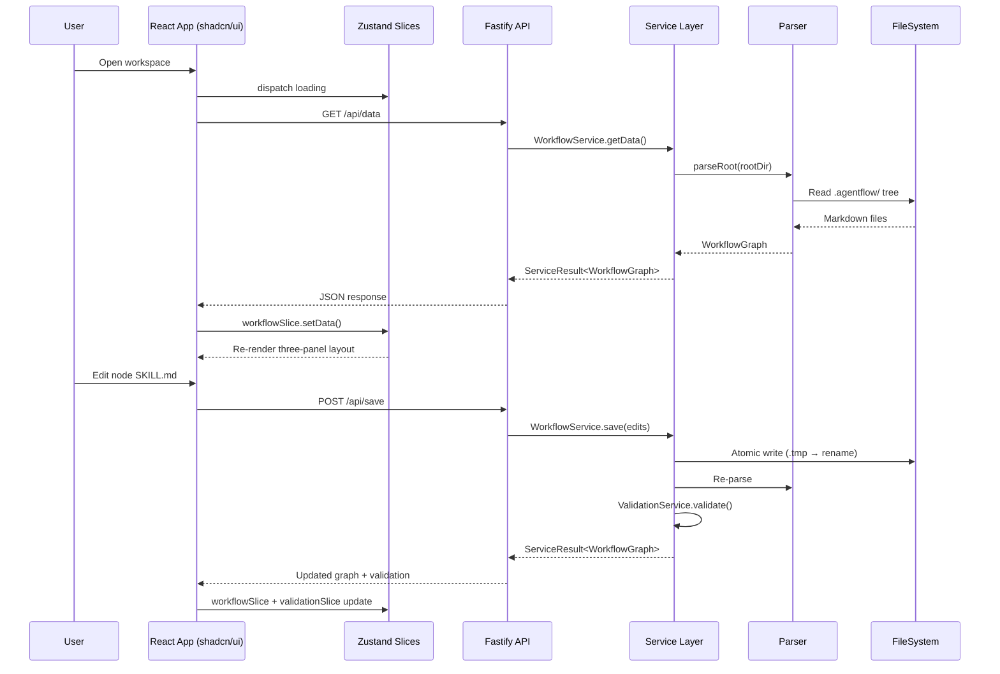
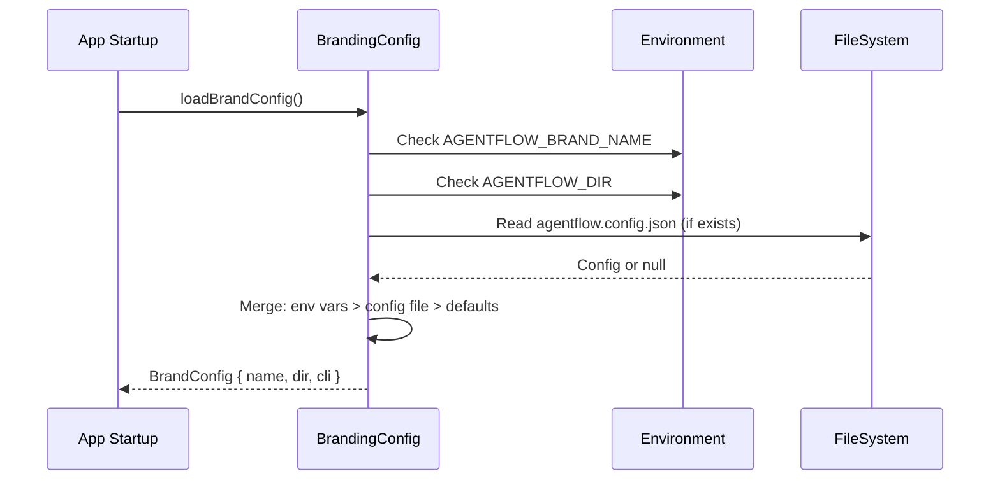

# Design Document: Foundation + Core UI (Spec 1 of 4)

## Overview

This spec covers the foundational layer and core UI redesign for the AgentFlow production overhaul. It is scoped to seven domains: (1) white-label branding configuration, (2) backend service layer refactor from monolithic `server.js` to modular services, (3) complete MUI → shadcn/ui migration, (4) three-panel resizable layout for Graph Mode, (5) canvas node redesign with custom React Flow components, (6) Zustand store splitting into domain slices, and (7) shared utility extraction (DRY cleanup).

This spec does NOT cover Chat Mode, Agent Builder, Library enrichment, Protocol layer, or Onboarding — those are handled by Specs 2–4. The master design is at `.kiro/specs/agentflow-production-overhaul/design.md`.

The current codebase has a working parser, orchestrator, ~44 React components using MUI (`@mui/material`), a monolithic Zustand store (881 lines), and a monolithic Fastify server (1344 lines). This spec transforms the foundation into a production-grade, extensible platform.

## Architecture

### System Architecture (Spec 1 Scope)

```mermaid
graph TD
    subgraph "Frontend — React 19 + TypeScript"
        UI[App Shell]
        UI --> GM[Graph Mode — Three-Panel Layout]
        GM --> LP[Left Panel — Explorer/Elements/Library]
        GM --> CV[Center — React Flow Canvas]
        GM --> RP[Right Panel — Details/Validation/Logs/Protocols]
        GM --> SB[Status Bar]
        GM --> CP[Command Palette — cmdk]
        GM --> TN[Toast Notifications — sonner]
    end

    subgraph "State — Zustand Slices"
        WS[workflowSlice]
        USS[uiSlice]
        VS[validationSlice]
        ES[executionSlice]
        LS[librarySlice]
    end

    subgraph "API Layer — Fastify"
        GW[API Router]
        GW --> WFS[WorkflowService]
        GW --> VAS[ValidationService]
        GW --> TS[TemplateService]
        GW --> OS[OrchestratorService]
        GW --> GS[GitService]
        GW --> PS[ProtocolService]
    end

    subgraph "Shared Utilities"
        VP[validatePath]
        EC[Error Codes]
        ZS[Zod Schemas]
        FIO[File I/O Helpers]
        BC[Branding Config]
    end

    UI --> WS
    UI --> USS
    GW --> VP
    GW --> EC
    GW --> ZS
```



### Request Flow — Graph Mode (Spec 1)



### Branding Config Resolution Flow



## Components and Interfaces

### Component 1: White-Label Branding Config

**Purpose**: Make the product name, directory name, and CLI command fully configurable so open-source adopters can white-label AgentFlow. Config is resolved once at startup with a clear precedence: env vars > config file > defaults.

**Interface**:

```typescript
// src/branding.ts
interface BrandConfig {
  name: string        // Display name, default: "AgentFlow"
  dir: string         // Workspace directory name, default: ".agentflow"
  cli: string         // CLI command name, default: "agentflow"
  logo?: string       // Optional path to logo asset
}

const DEFAULTS: BrandConfig = {
  name: 'AgentFlow',
  dir: '.agentflow',
  cli: 'agentflow',
}

function loadBrandConfig(rootDir?: string): BrandConfig {
  // 1. Start with defaults
  // 2. Overlay agentflow.config.json if it exists at rootDir
  // 3. Overlay env vars: AGENTFLOW_BRAND_NAME, AGENTFLOW_DIR, AGENTFLOW_CLI
  // Returns frozen BrandConfig
}
```

**Responsibilities**:
- Single source of truth for all brand-sensitive strings
- Backend: `server.js`, `cli.js`, `parser.js` read `dir` from BrandConfig instead of hardcoding `.agentflow`
- Frontend: UI reads brand config from `/api/brand` endpoint and renders configured name/logo
- Config file is optional — zero-config works with defaults

### Component 2: Backend Service Layer

**Purpose**: Replace the monolithic `server.js` (1344 lines, all route handlers inline) with modular services. Each domain gets its own service with consistent error handling via `ServiceResult<T>`, Zod validation on all inputs, and structured logging via pino.

**Interface**:

```typescript
// src/services/types.ts
interface ServiceResult<T> {
  success: boolean
  data?: T
  error?: ServiceError
}
// Invariant: (success === true && data !== undefined && error === undefined)
//         || (success === false && error !== undefined && data === undefined)

interface ServiceError {
  code: ErrorCode       // From src/errors.ts enum
  message: string
  details?: unknown
  statusCode: number    // HTTP status
}

interface ServiceContext {
  rootDir: string
  logger: pino.Logger
  brandConfig: BrandConfig
}

// src/services/workflow-service.ts
interface WorkflowService {
  getData(): Promise<ServiceResult<WorkflowGraph>>
  save(edits: FileEdit[]): Promise<ServiceResult<WorkflowGraph>>
  create(path: string, content: string): Promise<ServiceResult<WorkflowGraph>>
  delete(path: string): Promise<ServiceResult<WorkflowGraph>>
  move(from: string, to: string): Promise<ServiceResult<TreeNode>>
  getTree(): Promise<ServiceResult<TreeNode>>
}

// src/services/validation-service.ts
interface ValidationService {
  validate(options?: { strict?: boolean }): Promise<ServiceResult<ValidationResult>>
}

// src/services/template-service.ts
interface TemplateService {
  getLibrary(): Promise<ServiceResult<{ entries: LibraryEntry[] }>>
  addFromLibrary(type: string, name: string): Promise<ServiceResult<WorkflowGraph>>
}

// src/services/orchestrator-service.ts
interface OrchestratorService {
  getInfo(): Promise<ServiceResult<OrchestratorInfo>>
  getContext(): Promise<ServiceResult<{ context: string }>>
  run(params: RunParams): Promise<ServiceResult<RunResult>>
  chat(params: ChatParams): Promise<ServiceResult<ChatResult>>
}

// src/services/git-service.ts
interface GitService {
  getStatus(repo?: string): Promise<ServiceResult<GitStatus>>
  init(params: GitInitParams): Promise<ServiceResult<GitInitResult>>
  sync(params: GitSyncParams): Promise<ServiceResult<GitSyncResult>>
  getConflicts(): Promise<ServiceResult<SyncConflict[]>>
  resolve(path: string, strategy: string): Promise<ServiceResult<void>>
  getConfig(): Promise<ServiceResult<GitSyncConfig>>
  updateConfig(config: Partial<GitSyncConfig>): Promise<ServiceResult<GitSyncConfig>>
}
```

**Responsibilities**:
- Each service is a class instantiated with `ServiceContext`
- All public methods return `ServiceResult<T>` — never throw
- Zod schemas in `src/schemas/` validate all inputs at the service boundary
- Structured logging with pino (Fastify's native logger, currently disabled with `logger: false`)
- Rate limiting via `@fastify/rate-limit` on all API routes
- Remove `serve-handler` dependency (redundant with `@fastify/static`)
- Route registration extracted to `src/routes/` directory (one file per service domain)

### Component 3: shadcn/ui Design System (MUI Replacement)

**Purpose**: Remove ALL `@mui/material` components and rebuild the UI with shadcn/ui + Tailwind CSS + Radix UI primitives. Design tokens live as CSS variables in `globals.css` following shadcn's built-in token system — NOT a custom TypeScript `DesignTokens` interface.

**What gets removed**:
- `@mui/material`, `@mui/icons-material` — entire packages
- `@emotion/react`, `@emotion/styled` — MUI's CSS-in-JS runtime
- All `Dialog`, `DialogTitle`, `DialogContent`, `DialogActions` from MUI
- All `TextField`, `Button`, `ToggleButton`, `ToggleButtonGroup` from MUI
- All `Typography`, `Box`, `CircularProgress` from MUI
- All `sx` prop usage — replaced by Tailwind classes
- `ui/src/theme.ts` — MUI theme builder, replaced by CSS variables
- `ThemeProvider` wrapping MUI's `createTheme` — replaced by `next-themes` pattern (CSS class toggle)

**What gets added**:
- shadcn/ui components (copied to `ui/src/components/ui/`): Button, Card, Tabs, Dialog, Sheet, Badge, Alert, Switch, Input, Command, Tooltip, Popover, ScrollArea, Separator, Skeleton, DropdownMenu, Select
- `sonner` for toast notifications (replaces `SnackbarQueue`)
- `cmdk` for command palette (via shadcn Command)
- `react-resizable-panels` for three-panel layout
- `next-themes` pattern for dark/light mode (CSS class toggle on `<html>`)
- Inter + JetBrains Mono fonts (replace Roboto + Roboto Mono)

**Theme System** — minimal CSS, maximum extensibility:
- ALL colors are CSS variables — zero hardcoded colors anywhere in the codebase
- Built-in themes: `light` (default) and `dark` — defined as CSS variable sets in `globals.css`
- Theme switching: CSS class toggle on `<html>` via `next-themes` pattern — zero JS runtime cost, zero React re-renders
- Custom themes: additional `.css` files in `ui/src/themes/` that override the CSS variables (e.g., `themes/midnight.css`, `themes/solarized.css`)
- White-label themes: the branding config (`agentflow.config.json`) can specify a `theme` field pointing to a custom CSS file
- Community themes: users can drop a `.css` file into the workspace and reference it in config
- Theme structure is just CSS variable overrides — no TypeScript `DesignTokens` interface, no runtime theme objects

```css
/* Example: themes/midnight.css — a custom dark theme */
.midnight {
  --background: 222 47% 6%;
  --foreground: 210 40% 98%;
  --card: 222 47% 8%;
  --primary: 250 76% 67%;
  --node-step: 210 91% 65%;
  --node-router: 280 91% 70%;
  /* ... override any CSS variable ... */
}
```

```json
// agentflow.config.json — white-label with custom theme
{
  "name": "MyPlatform",
  "dir": ".myplatform",
  "theme": "./themes/corporate.css"
}
```

**Design Tokens** (CSS variables in `globals.css`):

```css
/* globals.css — shadcn token system */
@layer base {
  :root {
    /* Neutral gray scale */
    --background: 0 0% 100%;
    --foreground: 240 10% 3.9%;
    --card: 0 0% 100%;
    --card-foreground: 240 10% 3.9%;
    --popover: 0 0% 100%;
    --popover-foreground: 240 10% 3.9%;
    --muted: 240 4.8% 95.9%;
    --muted-foreground: 240 3.8% 46.1%;
    --border: 240 5.9% 90%;
    --input: 240 5.9% 90%;
    --ring: 238 76% 67%;

    /* Indigo accent */
    --primary: 238 76% 67%;
    --primary-foreground: 0 0% 100%;
    --secondary: 240 4.8% 95.9%;
    --secondary-foreground: 240 5.9% 10%;
    --accent: 240 4.8% 95.9%;
    --accent-foreground: 240 5.9% 10%;

    /* Status colors */
    --destructive: 0 84.2% 60.2%;
    --destructive-foreground: 0 0% 98%;
    --success: 142 76% 36%;
    --warning: 38 92% 50%;

    /* Node type colors */
    --node-step: 217 91% 60%;       /* blue */
    --node-router: 271 91% 65%;     /* purple */
    --node-sub-workflow: 172 66% 50%; /* teal */

    /* Layout */
    --radius: 0.5rem;
    --font-sans: 'Inter', sans-serif;
    --font-mono: 'JetBrains Mono', monospace;
  }

  .dark {
    --background: 240 10% 3.9%;
    --foreground: 0 0% 98%;
    --card: 240 10% 7%;
    --card-foreground: 0 0% 98%;
    --muted: 240 3.7% 15.9%;
    --muted-foreground: 240 5% 64.9%;
    --border: 240 3.7% 15.9%;
    --input: 240 3.7% 15.9%;
    --primary: 238 76% 67%;
    --primary-foreground: 0 0% 100%;
    --node-step: 217 91% 65%;
    --node-router: 271 91% 70%;
    --node-sub-workflow: 172 66% 55%;
  }
}
```

**Interface** (shared component props):

```typescript
// ui/src/components/ui/status-badge.tsx
interface StatusBadgeProps {
  status: 'running' | 'success' | 'error' | 'waiting' | 'idle'
  label?: string
  size?: 'sm' | 'md'
}

// ui/src/components/ui/node-chip.tsx
interface NodeChipProps {
  nodeType: 'step' | 'router' | 'sub-workflow'
  label: string
  onClick?: () => void
}
```

### Component 4: Three-Panel Layout (Graph Mode)

**Purpose**: Implement the industry-standard three-panel resizable layout using `react-resizable-panels` (same library as LangChain's open-agent-platform). Left panel for navigation, center for canvas, right panel for details/actions.

**Interface**:

```typescript
// ui/src/components/layout/ThreePanelLayout.tsx
import { Panel, PanelGroup, PanelResizeHandle } from 'react-resizable-panels'

interface ThreePanelLayoutProps {
  leftPanel: {
    tabs: PanelTab[]          // Explorer, Elements, Library
    defaultTab: string
    minSize?: number          // percentage, default 15
    defaultSize?: number      // percentage, default 20
    collapsible: boolean
  }
  centerContent: React.ReactNode  // Canvas
  rightPanel: {
    tabs: PanelTab[]          // Details, Validation, Logs, Protocols
    defaultTab: string
    minSize?: number
    defaultSize?: number
    collapsible: boolean
  }
  statusBar: React.ReactNode
}

interface PanelTab {
  id: string
  label: string
  icon: React.ReactNode       // lucide-react icon
  content: React.ReactNode
  badge?: number              // e.g. error count on Validation tab
}
```

**Layout Structure**:

```
┌─────────────────────────────────────────────────────────────┐
│  Action Bar (brand name, mode switcher, global actions)     │
├──────────┬──────────────────────────────┬───────────────────┤
│ Left     │                              │ Right             │
│ Panel    │     Center — Canvas          │ Panel             │
│          │     (React Flow)             │                   │
│ [Explorer│                              │ [Details]         │
│  Elements│                              │  Validation]      │
│  Library]│                              │  Logs]            │
│          │                              │  Protocols]       │
├──────────┴──────────────────────────────┴───────────────────┤
│  Status Bar (workspace path, validation, node count)        │
└─────────────────────────────────────────────────────────────┘
```

**Keyboard Shortcuts**:
- `Cmd+B` / `Ctrl+B` — Toggle left panel
- `Cmd+J` / `Ctrl+J` — Toggle right panel
- `Cmd+K` / `Ctrl+K` — Open command palette
- Panel widths persist to `localStorage`

**Responsibilities**:
- Resizable panels with drag handles via `react-resizable-panels`
- Collapsible panels with smooth animation via `framer-motion`
- Tab switching within each panel (shadcn Tabs component)
- Status bar at bottom: workspace path, validation status (error/warning counts), node count, brand name
- Command palette via shadcn Command component (cmdk) — search nodes, resources, actions
- Toast notifications via `sonner` (replaces MUI Snackbar)

### Component 5: Canvas Node Redesign

**Purpose**: Replace the current `NodeCard.tsx` with new custom React Flow node components built entirely with shadcn primitives. Three distinct node types with visual differentiation via colored accent bars.

**Interface**:

```typescript
// ui/src/components/canvas/WorkflowNode.tsx
import { type NodeProps } from '@xyflow/react'

interface WorkflowNodeData {
  id: string
  name: string
  nodeType: 'step' | 'router' | 'sub-workflow'
  description?: string
  toolCount: number
  status: 'idle' | 'running' | 'success' | 'error' | 'waiting'
  isEntry: boolean
}

// Single component handles all three node types via nodeType discriminator
function WorkflowNode({ data, selected }: NodeProps<WorkflowNodeData>): JSX.Element

// ui/src/components/canvas/WorkflowEdge.tsx
interface WorkflowEdgeData {
  condition?: string        // If present, edge is conditional
  label?: string
}

// Solid line for unconditional, dashed for conditional with label
function WorkflowEdge(props: EdgeProps<WorkflowEdgeData>): JSX.Element
```

**Node Visual Design**:
- Left accent bar: blue (step), purple (router), teal (sub-workflow) — uses `--node-step`, `--node-router`, `--node-sub-workflow` CSS vars
- Header: lucide icon + name + type badge (shadcn Badge)
- Body: tool count indicator, status dot
- Hover: description tooltip (shadcn Tooltip)
- Selected: ring border (`ring-2 ring-primary`), populates right panel Details tab
- Compact: ~120px wide, ~60px tall — flat, minimal chrome

**Edge Visual Design**:
- Unconditional: solid stroke, neutral color
- Conditional: dashed stroke with condition label badge on midpoint

### Component 6: Zustand Store Splitting

**Purpose**: Split the monolithic `store.ts` (881 lines, single `create()` call) into domain-specific slices. Each slice is independently testable and has a clear responsibility boundary.

**Interface**:

```typescript
// ui/src/store/index.ts — re-exports combined store
export { useAppStore } from './create-store'

// ui/src/store/slices/workflow-slice.ts
interface WorkflowSlice {
  // State
  data: WorkflowGraph | null
  activeWf: string
  selection: Selection | null
  breadcrumbs: string[]

  // Actions
  reload: () => Promise<WorkflowGraph>
  save: (filePath: string, content: string) => Promise<void>
  select: (s: Selection | null) => void
  setActiveWf: (id: string) => void
  drillIntoSubWorkflow: (workflowId: string) => void
  navigateBreadcrumb: (index: number) => void
  createNode: (workflowId: string, name: string, nodeType?: string) => Promise<void>
  deleteNode: (workflowId: string, nodeId: string) => Promise<void>
  // ... other CRUD
}

// ui/src/store/slices/ui-slice.ts
interface UISlice {
  // State
  panelWidths: { left: number; right: number }
  leftPanelTab: string
  rightPanelTab: string
  leftPanelCollapsed: boolean
  rightPanelCollapsed: boolean
  theme: 'light' | 'dark' | 'system'
  commandPaletteOpen: boolean
  zoomLevel: number

  // Actions
  toggleLeftPanel: () => void
  toggleRightPanel: () => void
  setLeftPanelTab: (tab: string) => void
  setRightPanelTab: (tab: string) => void
  setTheme: (theme: 'light' | 'dark' | 'system') => void
  setCommandPaletteOpen: (open: boolean) => void
}

// ui/src/store/slices/validation-slice.ts
interface ValidationSlice {
  validationResult: ValidationResult | null
  validate: () => Promise<ValidationResult>
}

// ui/src/store/slices/execution-slice.ts
interface ExecutionSlice {
  nodeStatuses: Record<string, NodeExecutionStatus>
  approvalQueue: ApprovalQueueItem[]
  setNodeStatus: (nodeId: string, status: NodeExecutionStatus) => void
  approveItem: (id: string) => void
  rejectItem: (id: string) => void
}

// ui/src/store/slices/library-slice.ts
interface LibrarySlice {
  entries: LibraryEntry[]
  search: string
  loading: boolean
  loadLibrary: () => Promise<void>
  setSearch: (q: string) => void
  addFromLibrary: (type: string, name: string) => Promise<void>
}

// ui/src/store/create-store.ts
// Combines all slices using zustand's slice pattern
// Undo/redo via zundo temporal middleware on workflowSlice only
```

**Migration Strategy**:
- Create new slice files alongside existing `store.ts`
- Move state + actions from monolithic store into slices one at a time
- Keep backward-compatible `useAppStore` export that combines all slices
- Existing components continue working — selectors don't change
- Remove old `store.ts` once all state is migrated

### Component 7: Shared Utilities (DRY)

**Purpose**: Extract duplicated logic into shared modules. Currently `validatePath()` is inline in `server.js`, error codes are ad-hoc strings, and Zod schemas are scattered.

**Interface**:

```typescript
// src/utils/validate-path.ts
function validatePath(filePath: string, rootDir: string): { valid: boolean; resolved: string; error?: string }
// Checks: path.resolve startsWith rootDir, no symlink escape, no null bytes

// src/utils/file-io.ts
async function atomicWrite(filePath: string, content: string): Promise<void>
// Writes to .tmp file, then renames — prevents partial writes on crash

async function safeDelete(filePath: string, rootDir: string): Promise<void>
// Validates path, then rm -rf with rootDir boundary check

// src/errors.ts
enum ErrorCode {
  VALIDATION_FAILED = 'VALIDATION_FAILED',
  FILE_NOT_FOUND = 'FILE_NOT_FOUND',
  PATH_TRAVERSAL = 'PATH_TRAVERSAL',
  INVALID_INPUT = 'INVALID_INPUT',
  FS_WRITE_ERROR = 'FS_WRITE_ERROR',
  CONCURRENT_EDIT = 'CONCURRENT_EDIT',
  MCP_SERVER_UNAVAILABLE = 'MCP_SERVER_UNAVAILABLE',
  LLM_PROVIDER_ERROR = 'LLM_PROVIDER_ERROR',
  SCAFFOLD_INVALID = 'SCAFFOLD_INVALID',
  GIT_SYNC_ERROR = 'GIT_SYNC_ERROR',
  RATE_LIMITED = 'RATE_LIMITED',
}

function toServiceError(code: ErrorCode, message: string, statusCode?: number): ServiceError

// src/schemas/index.ts — re-exports all Zod schemas
export { saveSchema, createSchema, deleteSchema, moveSchema } from './workflow-schemas'
export { gitInitSchema, gitSyncSchema, gitResolveSchema } from './git-schemas'
export { exportSchema, tokensSchema, dryRunSchema } from './tool-schemas'
export { brandConfigSchema } from './brand-schemas'
```

## Data Models

### Model 1: BrandConfig

```typescript
interface BrandConfig {
  name: string        // 1-64 chars, display name
  dir: string         // Valid directory name, no path separators
  cli: string         // Valid CLI command name, kebab-case
  logo?: string       // Optional relative path to logo asset
}
```

**Validation Rules**:
- `name` must be 1-64 characters, no control characters
- `dir` must be a valid directory name (no `/`, `\`, `..`, null bytes)
- `cli` must be kebab-case, 1-32 characters
- `logo` if present must be a relative path within the workspace

### Model 2: ServiceResult<T>

```typescript
type ServiceResult<T> =
  | { success: true; data: T; error?: never }
  | { success: false; error: ServiceError; data?: never }
```

**Validation Rules**:
- `success` and `data` are always paired — if `success` is true, `data` is defined
- `success` and `error` are mutually exclusive — never both present
- `error.code` must be a value from the `ErrorCode` enum
- `error.statusCode` must be a valid HTTP status code (400-599)

### Model 3: Zustand Slice State Shapes

```typescript
// Each slice's state is independently serializable for testing
interface WorkflowSliceState {
  data: WorkflowGraph | null
  activeWf: string
  selection: Selection | null
  breadcrumbs: string[]
}

interface UISliceState {
  panelWidths: { left: number; right: number }
  leftPanelTab: string
  rightPanelTab: string
  leftPanelCollapsed: boolean
  rightPanelCollapsed: boolean
  theme: 'light' | 'dark' | 'system'
  commandPaletteOpen: boolean
  zoomLevel: number
}

interface ValidationSliceState {
  validationResult: ValidationResult | null
}

interface ExecutionSliceState {
  nodeStatuses: Record<string, NodeExecutionStatus>
  approvalQueue: ApprovalQueueItem[]
}

interface LibrarySliceState {
  entries: LibraryEntry[]
  search: string
  loading: boolean
}
```

**Validation Rules**:
- `panelWidths.left` and `panelWidths.right` must be between 0 and 100 (percentages)
- `panelWidths.left + panelWidths.right` must be < 100 (leave room for center)
- `zoomLevel` must be between 25 and 400
- `theme` must be one of `'light' | 'dark' | 'system'`
- `activeWf` must be a key in `data.workflows` when `data` is non-null

## Algorithmic Pseudocode

### Algorithm 1: Service Layer Request Pipeline

```typescript
/**
 * ALGORITHM: handleServiceRequest
 *
 * Every API route follows this pipeline. Zod validates input,
 * the service method runs, and the result is mapped to HTTP response.
 *
 * INPUT: request (Fastify request), schema (Zod schema), serviceMethod (async fn)
 * OUTPUT: HTTP response with ServiceResult shape
 */
async function handleServiceRequest<T>(
  request: FastifyRequest,
  schema: ZodSchema,
  serviceMethod: (validated: unknown) => Promise<ServiceResult<T>>
): Promise<ServiceResult<T>> {
  // Step 1: Validate input
  const parseResult = schema.safeParse(request.body ?? request.query)
  if (!parseResult.success) {
    return {
      success: false,
      error: {
        code: ErrorCode.INVALID_INPUT,
        message: parseResult.error.issues.map(i => i.message).join('; '),
        details: parseResult.error.issues,
        statusCode: 400,
      },
    }
  }

  // Step 2: Execute service method
  try {
    const result = await serviceMethod(parseResult.data)
    return result
  } catch (err) {
    // Step 3: Catch unexpected errors
    logger.error({ err, path: request.url }, 'Unhandled service error')
    return {
      success: false,
      error: {
        code: ErrorCode.VALIDATION_FAILED,
        message: err instanceof Error ? err.message : 'Internal error',
        statusCode: 500,
      },
    }
  }
}
```

**Preconditions:**
- `schema` is a valid Zod schema
- `serviceMethod` returns `ServiceResult<T>` and does not throw for expected errors

**Postconditions:**
- Always returns a `ServiceResult<T>` — never throws
- If input validation fails, returns error with `INVALID_INPUT` code and 400 status
- If service method throws unexpectedly, returns error with 500 status
- All errors are logged with structured context

### Algorithm 2: Atomic File Write

```typescript
/**
 * ALGORITHM: atomicWrite
 *
 * Writes file content atomically using tmp-then-rename pattern.
 * Prevents partial writes if the process crashes mid-write.
 *
 * INPUT: filePath (absolute path), content (string)
 * OUTPUT: void (file written) or throws FS_WRITE_ERROR
 */
async function atomicWrite(filePath: string, content: string): Promise<void> {
  const tmpPath = filePath + '.tmp.' + Date.now()

  // Step 1: Write to temporary file
  try {
    await fs.promises.writeFile(tmpPath, content, 'utf-8')
  } catch (err) {
    // Clean up tmp if write failed
    await fs.promises.unlink(tmpPath).catch(() => {})
    throw toServiceError(ErrorCode.FS_WRITE_ERROR, `Failed to write: ${err.message}`)
  }

  // Step 2: Atomic rename
  try {
    await fs.promises.rename(tmpPath, filePath)
  } catch (err) {
    // Clean up tmp if rename failed
    await fs.promises.unlink(tmpPath).catch(() => {})
    throw toServiceError(ErrorCode.FS_WRITE_ERROR, `Failed to rename: ${err.message}`)
  }
}
```

**Preconditions:**
- `filePath` is an absolute path within the workspace root
- Parent directory of `filePath` exists
- Process has write permissions to the directory

**Postconditions:**
- On success: file at `filePath` contains exactly `content`
- On failure: no partial file exists at `filePath` — either old content or no file
- Temporary file is always cleaned up

### Algorithm 3: Brand Config Resolution

```typescript
/**
 * ALGORITHM: loadBrandConfig
 *
 * Resolves brand configuration with precedence: env vars > config file > defaults.
 * Called once at startup, result is frozen and shared.
 *
 * INPUT: rootDir (optional, for finding config file)
 * OUTPUT: BrandConfig (frozen)
 */
function loadBrandConfig(rootDir?: string): BrandConfig {
  const config = { ...DEFAULTS }

  // Step 1: Try to read agentflow.config.json
  if (rootDir) {
    const configPath = path.join(path.dirname(rootDir), 'agentflow.config.json')
    if (fs.existsSync(configPath)) {
      const fileConfig = JSON.parse(fs.readFileSync(configPath, 'utf-8'))
      const parsed = brandConfigSchema.safeParse(fileConfig)
      if (parsed.success) {
        Object.assign(config, parsed.data)
      }
    }
  }

  // Step 2: Overlay environment variables (highest precedence)
  if (process.env.AGENTFLOW_BRAND_NAME) config.name = process.env.AGENTFLOW_BRAND_NAME
  if (process.env.AGENTFLOW_DIR) config.dir = process.env.AGENTFLOW_DIR
  if (process.env.AGENTFLOW_CLI) config.cli = process.env.AGENTFLOW_CLI

  // Step 3: Validate final config
  const validated = brandConfigSchema.parse(config)
  return Object.freeze(validated)
}
```

**Preconditions:**
- Environment variables, if set, contain valid values
- Config file, if present, is valid JSON

**Postconditions:**
- Returns a frozen `BrandConfig` object
- All fields have valid values (either from config sources or defaults)
- Invalid config file values are silently ignored (defaults used instead)
- Invalid env var values cause a Zod validation error at startup

## Key Functions with Formal Specifications

### Function 1: validatePath()

```typescript
function validatePath(filePath: string, rootDir: string): { valid: boolean; resolved: string; error?: string }
```

**Preconditions:**
- `rootDir` is an absolute path
- `filePath` is a string (may be relative or absolute)

**Postconditions:**
- If valid: `resolved` is the absolute path, starts with `rootDir`
- If invalid: `error` describes the reason (traversal, symlink escape, null bytes)
- No file system mutations
- Resolves symlinks before checking containment

### Function 2: createServiceLayer()

```typescript
function createServiceLayer(ctx: ServiceContext): {
  workflow: WorkflowService
  validation: ValidationService
  template: TemplateService
  orchestrator: OrchestratorService
  git: GitService
}
```

**Preconditions:**
- `ctx.rootDir` is an absolute path to an existing directory
- `ctx.logger` is a valid pino logger instance
- `ctx.brandConfig` is a valid frozen `BrandConfig`

**Postconditions:**
- Returns object with all service instances sharing the same context
- No file system mutations during initialization
- Each service is independently callable
- Services do not hold references to each other (no circular deps)

### Function 3: combineSlices()

```typescript
function createAppStore(): StoreApi<AppStore>
```

**Preconditions:**
- All slice creators are pure functions
- `zundo` temporal middleware is configured for `workflowSlice` only

**Postconditions:**
- Returns a Zustand store combining all five slices
- Each slice's state is accessible via the combined store
- Undo/redo only affects `workflowSlice` state (UI state excluded)
- `localStorage` persistence for UI preferences (theme, panel widths)
- Store is a singleton — one instance per app

### Function 4: registerRoutes()

```typescript
function registerRoutes(app: FastifyInstance, services: ServiceLayer): void
```

**Preconditions:**
- `app` is a configured Fastify instance (CORS, static, rate-limit registered)
- `services` is a fully initialized `ServiceLayer`

**Postconditions:**
- All API routes are registered on the Fastify instance
- Each route has Zod schema validation
- Each route delegates to the appropriate service method
- Error handler is set to return `ServiceResult` shape for all errors
- Rate limiting is active on all routes

## Example Usage

### Example 1: White-label branding

```typescript
// agentflow.config.json at project root
{
  "name": "MyAgentPlatform",
  "dir": ".myagent",
  "cli": "myagent"
}

// Or via environment variables
// AGENTFLOW_BRAND_NAME=MyAgentPlatform
// AGENTFLOW_DIR=.myagent

// In server startup
const brandConfig = loadBrandConfig(rootDir)
// brandConfig.name === "MyAgentPlatform"
// brandConfig.dir === ".myagent"

// In UI — fetched from /api/brand
const { data: brand } = useBrandConfig()
// <h1>{brand.name}</h1> renders "MyAgentPlatform"
```

### Example 2: Service layer usage

```typescript
// In route handler
app.get('/api/data', async (request, reply) => {
  const result = await services.workflow.getData()
  if (result.success) {
    return result.data
  }
  return reply.status(result.error.statusCode).send({ error: result.error.message })
})

// In service implementation
class WorkflowServiceImpl implements WorkflowService {
  async save(edits: FileEdit[]): Promise<ServiceResult<WorkflowGraph>> {
    for (const edit of edits) {
      const pathCheck = validatePath(edit.path, this.ctx.rootDir)
      if (!pathCheck.valid) {
        return { success: false, error: toServiceError(ErrorCode.PATH_TRAVERSAL, pathCheck.error!) }
      }
      await atomicWrite(pathCheck.resolved, edit.content)
    }
    const graph = parseRoot(this.ctx.rootDir)
    return { success: true, data: graph }
  }
}
```

### Example 3: Three-panel layout with shadcn

```tsx
// ui/src/components/layout/GraphMode.tsx
import { Panel, PanelGroup, PanelResizeHandle } from 'react-resizable-panels'
import { Tabs, TabsContent, TabsList, TabsTrigger } from '@/components/ui/tabs'

function GraphMode() {
  const leftCollapsed = useAppStore(s => s.leftPanelCollapsed)
  const rightCollapsed = useAppStore(s => s.rightPanelCollapsed)

  return (
    <PanelGroup direction="horizontal" autoSaveId="agentflow-panels">
      {!leftCollapsed && (
        <>
          <Panel defaultSize={20} minSize={15} maxSize={35}>
            <Tabs defaultValue="explorer">
              <TabsList>
                <TabsTrigger value="explorer">Explorer</TabsTrigger>
                <TabsTrigger value="elements">Elements</TabsTrigger>
                <TabsTrigger value="library">Library</TabsTrigger>
              </TabsList>
              <TabsContent value="explorer"><ExplorerPanel /></TabsContent>
              <TabsContent value="elements"><ElementsView /></TabsContent>
              <TabsContent value="library"><LibraryPanel /></TabsContent>
            </Tabs>
          </Panel>
          <PanelResizeHandle className="w-1 bg-border hover:bg-primary/50" />
        </>
      )}
      <Panel defaultSize={60}>
        <ReactFlowProvider><Canvas /></ReactFlowProvider>
      </Panel>
      {!rightCollapsed && (
        <>
          <PanelResizeHandle className="w-1 bg-border hover:bg-primary/50" />
          <Panel defaultSize={20} minSize={15} maxSize={40}>
            <Tabs defaultValue="details">
              <TabsList>
                <TabsTrigger value="details">Details</TabsTrigger>
                <TabsTrigger value="validation">
                  Validation
                  {errorCount > 0 && <Badge variant="destructive" className="ml-1">{errorCount}</Badge>}
                </TabsTrigger>
                <TabsTrigger value="logs">Logs</TabsTrigger>
                <TabsTrigger value="protocols">Protocols</TabsTrigger>
              </TabsList>
              <TabsContent value="details"><NodeDrawer /></TabsContent>
              <TabsContent value="validation"><ValidationPanel /></TabsContent>
              <TabsContent value="logs"><LogsPanel /></TabsContent>
              <TabsContent value="protocols"><ProtocolsPanel /></TabsContent>
            </Tabs>
          </Panel>
        </>
      )}
    </PanelGroup>
  )
}
```

### Example 4: Zustand slice pattern

```typescript
// ui/src/store/slices/ui-slice.ts
import { type StateCreator } from 'zustand'
import type { AppStore } from '../types'

export interface UISlice { /* ... state + actions ... */ }

export const createUISlice: StateCreator<AppStore, [], [], UISlice> = (set, get) => ({
  panelWidths: { left: 20, right: 20 },
  leftPanelCollapsed: false,
  rightPanelCollapsed: false,
  theme: 'system',
  commandPaletteOpen: false,
  zoomLevel: 100,
  leftPanelTab: 'explorer',
  rightPanelTab: 'details',

  toggleLeftPanel: () => set(s => ({ leftPanelCollapsed: !s.leftPanelCollapsed })),
  toggleRightPanel: () => set(s => ({ rightPanelCollapsed: !s.rightPanelCollapsed })),
  setTheme: (theme) => {
    set({ theme })
    localStorage.setItem('af-theme', theme)
    document.documentElement.classList.toggle('dark',
      theme === 'dark' || (theme === 'system' && window.matchMedia('(prefers-color-scheme: dark)').matches)
    )
  },
  setCommandPaletteOpen: (open) => set({ commandPaletteOpen: open }),
  setLeftPanelTab: (tab) => set({ leftPanelTab: tab }),
  setRightPanelTab: (tab) => set({ rightPanelTab: tab }),
})
```

## Correctness Properties

The following properties must hold universally across the system. Expressed as universal quantification statements suitable for property-based testing with fast-check.

### Property 1: ServiceResult Exclusivity

For all service method calls, the result is either success-with-data or failure-with-error, never both, never neither.

```typescript
// ∀ result ∈ ServiceResult<T>:
//   (result.success === true ∧ result.data !== undefined ∧ result.error === undefined)
//   ∨ (result.success === false ∧ result.error !== undefined ∧ result.data === undefined)
```

### Property 2: Path Validation Soundness

For all file paths, `validatePath()` returns valid only if the resolved path is strictly within rootDir. No path traversal, symlink escape, or null byte injection can produce a valid result pointing outside rootDir.

```typescript
// ∀ filePath ∈ string, rootDir ∈ AbsolutePath:
//   let result = validatePath(filePath, rootDir)
//   result.valid ⟹ result.resolved.startsWith(rootDir + path.sep) ∨ result.resolved === rootDir
//   ¬result.valid ⟹ result.error !== undefined
```

### Property 3: Atomic Write Integrity

For all file write operations via `atomicWrite()`, the target file either contains the complete new content or retains its previous content. No partial writes are observable.

```typescript
// ∀ filePath, content:
//   let contentBefore = readFileOrNull(filePath)
//   atomicWrite(filePath, content)
//   let contentAfter = readFile(filePath)
//   contentAfter === content ∨ contentAfter === contentBefore
//   // No .tmp files remain after operation completes (success or failure)
```

### Property 4: Brand Config Precedence

For all combinations of defaults, config file values, and env vars, the resolution follows strict precedence: env vars > config file > defaults. A value set at a higher precedence level always overrides lower levels.

```typescript
// ∀ defaults, fileConfig, envVars:
//   let result = loadBrandConfig(rootDir)
//   envVars.AGENTFLOW_BRAND_NAME !== undefined ⟹ result.name === envVars.AGENTFLOW_BRAND_NAME
//   envVars.AGENTFLOW_BRAND_NAME === undefined ∧ fileConfig.name !== undefined ⟹ result.name === fileConfig.name
//   envVars.AGENTFLOW_BRAND_NAME === undefined ∧ fileConfig.name === undefined ⟹ result.name === DEFAULTS.name
```

### Property 5: Zustand Slice Isolation

For all actions dispatched to one slice, the state of other slices remains unchanged (unless the action explicitly cross-references another slice).

```typescript
// ∀ action ∈ UISlice.actions:
//   let workflowStateBefore = snapshot(store.workflowSlice)
//   dispatch(action)
//   let workflowStateAfter = snapshot(store.workflowSlice)
//   workflowStateBefore === workflowStateAfter  // deep equality
```

### Property 6: Validation Determinism

For all valid `WorkflowGraph` inputs, `ValidationService.validate()` called twice with the same inputs produces identical results.

```typescript
// ∀ graph ∈ WorkflowGraph, options ∈ ValidateOptions:
//   validate(graph, options) === validate(graph, options)
```

### Property 7: Panel Width Constraints

For all panel resize operations, the combined panel widths never exceed 100% and individual panels respect their min/max bounds.

```typescript
// ∀ state ∈ UISliceState:
//   state.panelWidths.left >= 0 ∧ state.panelWidths.left <= 100
//   state.panelWidths.right >= 0 ∧ state.panelWidths.right <= 100
//   state.panelWidths.left + state.panelWidths.right < 100
```

## Error Handling

### Error Scenario 1: Path Traversal Attempt

**Condition**: API receives a file path containing `..`, symlinks, or null bytes that would resolve outside `rootDir`.
**Response**: Return `ServiceResult` with `PATH_TRAVERSAL` error code and 403 status. Log the attempt with request context.
**Recovery**: No recovery needed — request is rejected. UI shows error toast via sonner.

### Error Scenario 2: Atomic Write Failure

**Condition**: `atomicWrite()` fails during tmp file creation or rename (disk full, permissions, etc.).
**Response**: Clean up `.tmp` file. Return `FS_WRITE_ERROR` with the specific path and OS error message.
**Recovery**: Original file is untouched. UI shows error notification. User can retry the save operation.

### Error Scenario 3: Invalid Brand Config

**Condition**: `agentflow.config.json` contains invalid values (e.g., `dir` with path separators, `name` empty).
**Response**: If config file is invalid, log warning and fall back to defaults. If env vars are invalid, fail at startup with clear error message.
**Recovery**: Config file errors are non-fatal — defaults are used. Env var errors are fatal — user must fix before starting.

### Error Scenario 4: Zod Validation Failure on API Input

**Condition**: Request body or query params fail Zod schema validation.
**Response**: Return `INVALID_INPUT` error with 400 status. Include Zod issue messages in `details` field.
**Recovery**: Client receives structured error with field-level validation messages. UI can highlight specific invalid fields.

### Error Scenario 5: Service Layer Unexpected Error

**Condition**: A service method throws an unexpected error (not a `ServiceError`).
**Response**: Catch at the route handler level. Log full error with stack trace via pino. Return generic 500 error to client (no internal details leaked).
**Recovery**: Error is logged for debugging. Client receives generic error message. No state corruption — services are stateless per request.

## Testing Strategy

### Unit Testing Approach

All new modules get unit tests. Target: 80%+ line coverage for new code in this spec.

Key test areas:
- `validatePath()`: traversal attacks, symlinks, null bytes, valid paths, edge cases (root dir itself, trailing slashes)
- `atomicWrite()`: success path, write failure cleanup, rename failure cleanup
- `loadBrandConfig()`: defaults only, config file only, env vars only, all three with precedence
- `ServiceResult` helpers: `toServiceError()`, success/error factory functions
- `ErrorCode` enum: all codes map to valid HTTP status codes
- Zod schemas: valid input accepted, invalid input rejected with correct error messages
- Each Zustand slice: initial state, each action produces expected state change, slice isolation

Test runner: Vitest (already configured in `vitest.config.js`).

### Property-Based Testing Approach

**Property Test Library**: fast-check (already in devDependencies)

Key properties to test:
1. **ServiceResult exclusivity**: Generate random results → verify success XOR error invariant
2. **Path validation soundness**: Generate random paths (including adversarial) → verify no escape from rootDir
3. **Brand config precedence**: Generate random config combinations → verify precedence order
4. **Zustand slice isolation**: Generate random UI actions → verify workflow state unchanged
5. **Panel width constraints**: Generate random resize operations → verify bounds invariant

Generators needed:
- `arbitraryFilePath()`: Valid and adversarial file paths (with `..`, null bytes, symlinks)
- `arbitraryBrandConfig()`: Random valid brand configs
- `arbitraryServiceResult()`: Random success/error results
- `arbitraryPanelWidths()`: Random panel width combinations

### Integration Testing Approach

Integration tests verify the full API → Service → FileSystem stack.

Key integration tests:
- Full CRUD cycle: create resource → read → update → delete → verify cleanup
- Brand config: set env vars → start server → verify `/api/brand` returns correct values
- Validation pipeline: create invalid workspace → call `/api/validate` → verify errors returned
- Atomic write under concurrent access: two writes to same file → verify no corruption

Test infrastructure: Vitest with temporary directories (`fs.mkdtempSync`) for file system tests.

## Performance Considerations

- **Parser caching**: Current `parseRoot()` is called on every API request. Add in-memory cache with file modification timestamp invalidation. This is the single biggest performance win for the backend.
- **Lazy panel rendering**: Right panel tabs should render lazily — only compute validation when Validation tab is active. Use React `Suspense` or conditional rendering.
- **Canvas memoization**: New `WorkflowNode` component must be wrapped in `React.memo` with stable callback refs to prevent re-renders on unrelated state changes.
- **Bundle size**: Removing MUI (~300KB gzipped) and replacing with shadcn/ui (tree-shaken, ~50KB) is a significant bundle size reduction. Target: <200KB gzipped initial bundle.
- **Store subscriptions**: Zustand slice pattern enables granular subscriptions — components only re-render when their specific slice changes, not on any store change.
- **Panel resize**: `react-resizable-panels` uses CSS-based resizing (no JS layout calculations), so panel resizing is 60fps smooth.

## Security Considerations

- **Path traversal prevention**: Extract `validatePath()` from inline `server.js` checks into shared utility. Add symlink resolution. Add null byte check. Use in ALL file operations across all services.
- **Rate limiting**: Add `@fastify/rate-limit` with configurable limits (default: 100 req/min per IP). Protects against abuse in shared deployments.
- **Input validation**: ALL API endpoints get Zod schemas — currently several endpoints (orchestrator routes, some git routes) lack input validation.
- **Error sanitization**: Service errors never leak internal paths, stack traces, or API keys to the client. Pino logs the full error server-side.
- **CORS configuration**: Make CORS origin configurable via env var `AGENTFLOW_CORS_ORIGIN` (default: `*` for local dev).
- **CSP headers**: Add Content-Security-Policy headers since the UI renders user-authored markdown content.

## Dependencies

### Reuse from Open-Source Repos (MIT Licensed)

The following files and patterns are copied/adapted from LangChain's open-source repositories to save development time. All are MIT licensed.

**From `langchain-ai/open-agent-platform` (archived, MIT)**:
- `apps/web/src/components/ui/*` — All shadcn/ui component files (button, card, tabs, dialog, sheet, badge, alert, switch, input, command, tooltip, popover, scroll-area, separator, skeleton, dropdown-menu, select, sidebar, resizable, slider, table, collapsible). Copy these directly into `ui/src/components/ui/` instead of running `npx shadcn@latest add` for each — they're already configured and tested together.
- `apps/web/package.json` — Reference for exact Radix UI package versions, `class-variance-authority`, `clsx`, `tailwind-merge`, `cmdk`, `react-resizable-panels`, `sonner`, `lucide-react` versions that work together.
- `apps/web/src/components/sidebar/` — Sidebar component pattern with collapsible sections. Adapt for our Explorer/Elements/Library left panel.
- Feature-based folder structure pattern (`src/features/`, `src/components/ui/`, `src/hooks/`, `src/lib/`, `src/providers/`).

**From `langchain-ai/agent-chat-ui` (active, MIT)** — used in Spec 2 but listed here for awareness:
- Thread component pattern, StreamProvider, stick-to-bottom scroll.

**What we DON'T reuse** (must build ourselves):
- Canvas / React Flow nodes — ours are completely different (workflow graph with refs/edges/conditions)
- Parser integration — they talk to LangGraph Cloud API, we talk to local Fastify + file system
- Agent creation flow — theirs is form-based, ours is conversational chat that scaffolds multi-node workflows
- Explorer panel — they don't have one
- Validation panel — doesn't exist in their codebase
- Protocol panel — doesn't exist
- The entire backend service layer — ours is Fastify + custom parser, theirs is Next.js API routes

### Existing (Keep)
- `fastify` + `@fastify/cors` + `@fastify/static` — HTTP server
- `@xyflow/react` — Canvas
- `zustand` + `zundo` — State management + undo
- `zod` — Schema validation
- `lucide-react` — Icons
- `framer-motion` — Animations
- `tailwindcss` v4 — Utility CSS
- `vitest` + `fast-check` — Testing

### New (Add)
- `react-resizable-panels` — Three-panel resizable layout
- `sonner` — Toast notifications
- `cmdk` — Command palette (via shadcn Command)
- `@fastify/rate-limit` — API rate limiting
- `pino` — Structured logging (Fastify native, just enable it)
- `shadcn/ui` components — Copied to `ui/src/components/ui/` via CLI
- `@radix-ui/*` — Accessible primitives (installed by shadcn)
- `class-variance-authority` + `clsx` + `tailwind-merge` — Variant management (shadcn deps)
- `@fontsource/inter` + `@fontsource-variable/jetbrains-mono` — Fonts

### Remove
- `@mui/material` — Entire package
- `@mui/icons-material` — Replaced by lucide-react
- `@emotion/react` + `@emotion/styled` — MUI's CSS-in-JS runtime
- `@fontsource/roboto` + `@fontsource/roboto-mono` — Replaced by Inter + JetBrains Mono
- `serve-handler` — Redundant with `@fastify/static`