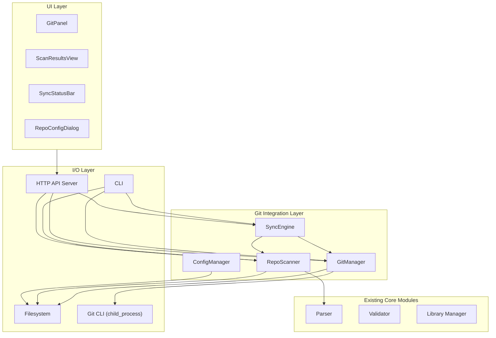
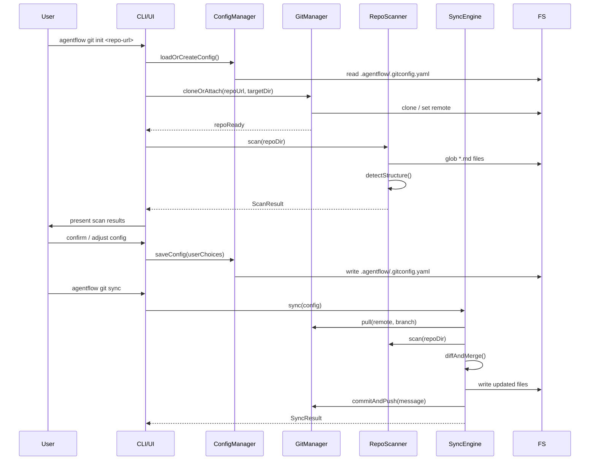
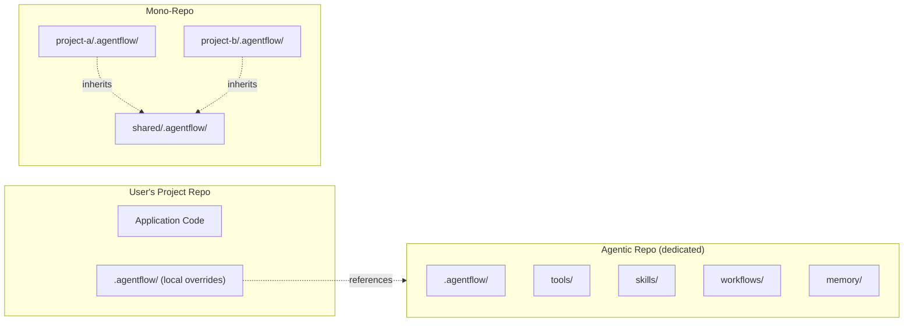

# Design Document: Git Integration for AgentFlow

## Overview

Git Integration adds version-control capabilities to AgentFlow, allowing users to store, sync, and share their `.agentflow/` workspaces (agents, skills, tools, interactions, memory, templates, workflows) via Git repositories. The system supports public repos, private repos, and custom configurations — all user-controlled.

A key concept is the "agentic repo" — a dedicated Git repository solely for agent workflows, separate from the user's application code. This enables mono-repo setups where multiple projects reference a shared agentic repo, and team-wide sharing of workflow definitions without coupling to any single codebase.

The system provides auto-scanning and repo-level structure detection. AgentFlow scans the repository, detects its structure (resource types, workflows, directory layout), and presents findings to the user. The user then decides what to sync, how to configure, and what to share. AgentFlow never dictates repo setup — it provides tools and lets the user configure.

## Architecture

### System Module Diagram



### Data Flow: Repo Connection & Sync



### Mono-Repo & Agentic Repo Topology



## Components and Interfaces

### Component 1: GitManager

**Purpose**: Wraps Git CLI operations. Handles clone, pull, push, status, diff, branch management. All Git operations go through this component.

```pascal
STRUCTURE GitManager
  repoDir: String
  remote: String
  branch: String
END STRUCTURE
```

**Responsibilities**:
- Clone repositories (public and private with credential delegation)
- Pull/push changes to/from remote
- Check repo status (clean, dirty, conflicts)
- List branches and switch branches
- Generate diffs between local and remote
- Delegate authentication to the user's Git credential manager

### Component 2: RepoScanner

**Purpose**: Scans a directory (local or cloned repo) and detects AgentFlow resource structure. Leverages the existing Parser for `.md` file analysis. Produces a structured scan result that the user reviews.

```pascal
STRUCTURE RepoScanner
  rootDir: String
  parser: Parser
END STRUCTURE
```

**Responsibilities**:
- Discover `.agentflow/` directories in a repo (supports nested/mono-repo)
- Detect resource types (tools, skills, workflows, etc.) by directory and frontmatter
- Identify workflows and their node structures
- Produce a ScanResult with categorized resources
- Support incremental re-scanning (only changed files)

### Component 3: SyncEngine

**Purpose**: Orchestrates synchronization between local `.agentflow/` workspace and a remote Git repo. Handles conflict detection and resolution strategies. The user controls what gets synced.

```pascal
STRUCTURE SyncEngine
  gitManager: GitManager
  scanner: RepoScanner
  config: GitSyncConfig
END STRUCTURE
```

**Responsibilities**:
- Pull remote changes and detect conflicts
- Push local changes to remote
- Apply user-defined sync rules (include/exclude patterns)
- Handle merge strategies (local-wins, remote-wins, manual)
- Track sync state (last sync timestamp, dirty files)

### Component 4: ConfigManager

**Purpose**: Manages the `.agentflow/.gitconfig.yaml` configuration file. Stores user preferences for repo type, sync rules, remote mappings, and scan settings.

```pascal
STRUCTURE ConfigManager
  configPath: String
END STRUCTURE
```

**Responsibilities**:
- Load and validate git integration config
- Save user configuration choices
- Provide defaults for new configurations
- Support multiple remote repo mappings (for agentic repo + project repo)

## Data Models

### GitSyncConfig

```pascal
STRUCTURE GitSyncConfig
  version: String                    // Config format version "1.0.0"
  repos: Array of RepoMapping       // One or more repo connections
  syncRules: SyncRules              // What to include/exclude
  conflictStrategy: ConflictStrategy // How to handle conflicts
  autoScan: Boolean                 // Auto-scan on pull (default: true)
  scanDepth: Integer                // Max directory depth for scanning (default: 5)
END STRUCTURE

STRUCTURE RepoMapping
  name: String                      // User-defined label (e.g., "team-shared")
  url: String                       // Git remote URL
  branch: String                    // Branch to sync (default: "main")
  localPath: String                 // Local clone path
  repoType: Enum [public, private, custom]
  role: Enum [primary, agentic, shared]  // primary = same repo, agentic = dedicated, shared = mono-repo
  agentflowPath: String            // Path to .agentflow/ within the repo (default: ".agentflow")
END STRUCTURE

STRUCTURE SyncRules
  include: Array of String          // Glob patterns to include (default: ["**/*.md", "**/*.yaml"])
  exclude: Array of String          // Glob patterns to exclude (default: ["**/output/**", "**/node_modules/**"])
  resourceTypes: Array of String    // Resource types to sync (default: all)
  syncDirection: Enum [bidirectional, push_only, pull_only]
END STRUCTURE

ENUMERATION ConflictStrategy
  local_wins                        // Local changes take precedence
  remote_wins                       // Remote changes take precedence
  manual                            // Prompt user for each conflict
  timestamp                         // Most recent change wins
END ENUMERATION
```

### ScanResult

```pascal
STRUCTURE ScanResult
  repoDir: String
  agentflowPaths: Array of String   // All .agentflow/ dirs found
  resources: ScanResourceMap
  workflows: Array of ScannedWorkflow
  stats: ScanStats
  warnings: Array of ScanWarning
END STRUCTURE

STRUCTURE ScanResourceMap
  tools: Array of ScannedResource
  skills: Array of ScannedResource
  interactions: Array of ScannedResource
  templates: Array of ScannedResource
  memory: Array of ScannedResource
END STRUCTURE

STRUCTURE ScannedResource
  name: String
  path: String                      // Relative to repo root
  resourceType: String
  hasFrontmatter: Boolean
  frontmatterFields: Array of String
END STRUCTURE

STRUCTURE ScannedWorkflow
  name: String
  path: String
  nodeCount: Integer
  hasDescriptor: Boolean
  entryPoints: Array of String
END STRUCTURE

STRUCTURE ScanStats
  totalFiles: Integer
  totalWorkflows: Integer
  totalResources: Integer
  scanDurationMs: Integer
END STRUCTURE

STRUCTURE ScanWarning
  path: String
  message: String
  severity: Enum [info, warning]
END STRUCTURE
```

### SyncResult

```pascal
STRUCTURE SyncResult
  success: Boolean
  direction: Enum [push, pull, bidirectional]
  filesAdded: Array of String
  filesModified: Array of String
  filesDeleted: Array of String
  conflicts: Array of SyncConflict
  timestamp: String                 // ISO 8601
END STRUCTURE

STRUCTURE SyncConflict
  path: String
  localContent: String
  remoteContent: String
  resolution: Enum [pending, local_wins, remote_wins, merged] OR NULL
END STRUCTURE
```

### GitRepoStatus

```pascal
STRUCTURE GitRepoStatus
  isRepo: Boolean
  isClean: Boolean
  branch: String
  ahead: Integer                    // Commits ahead of remote
  behind: Integer                   // Commits behind remote
  modifiedFiles: Array of String
  untrackedFiles: Array of String
  hasRemote: Boolean
  remoteUrl: String OR NULL
END STRUCTURE
```


## Algorithmic Pseudocode

### Algorithm 1: Repository Initialization

```pascal
ALGORITHM initializeRepo(repoUrl, options)
INPUT: repoUrl of type String, options of type InitOptions
OUTPUT: result of type InitResult

BEGIN
  // Step 1: Validate inputs
  IF repoUrl IS EMPTY THEN
    RETURN Error("Repository URL is required")
  END IF

  config ← ConfigManager.loadOrCreate(options.configPath)

  // Step 2: Determine repo role
  IF options.role = "agentic" THEN
    targetDir ← options.localPath OR defaultAgenticDir()
  ELSE IF options.role = "shared" THEN
    targetDir ← options.localPath OR defaultSharedDir()
  ELSE
    targetDir ← currentWorkingDir()
  END IF

  // Step 3: Clone or attach
  IF directoryExists(targetDir) AND isGitRepo(targetDir) THEN
    // Attach to existing repo
    gitManager ← GitManager.attach(targetDir)
    gitManager.addRemote("agentflow", repoUrl)
  ELSE
    // Clone fresh
    gitManager ← GitManager.clone(repoUrl, targetDir, options.branch)
  END IF

  // Step 4: Scan the repo
  scanResult ← RepoScanner.scan(targetDir, config.scanDepth)

  // Step 5: Build repo mapping
  mapping ← CREATE RepoMapping
    name ← options.name OR deriveNameFromUrl(repoUrl)
    url ← repoUrl
    branch ← options.branch OR "main"
    localPath ← targetDir
    repoType ← options.repoType OR "public"
    role ← options.role OR "primary"
    agentflowPath ← scanResult.agentflowPaths[0] OR ".agentflow"
  END CREATE

  // Step 6: Save config
  config.repos.append(mapping)
  ConfigManager.save(config)

  RETURN InitResult(success: true, scanResult: scanResult, mapping: mapping)
END
```

**Preconditions:**
- `repoUrl` is a valid Git remote URL (HTTPS or SSH)
- User has Git installed and accessible via PATH
- User has appropriate credentials for private repos (delegated to Git credential manager)

**Postconditions:**
- A local clone or remote attachment exists at `targetDir`
- `.agentflow/.gitconfig.yaml` contains the new repo mapping
- `scanResult` accurately reflects the repo's AgentFlow structure

### Algorithm 2: Repository Scanning

```pascal
ALGORITHM scanRepository(rootDir, maxDepth)
INPUT: rootDir of type String, maxDepth of type Integer
OUTPUT: scanResult of type ScanResult

BEGIN
  startTime ← currentTimeMs()
  warnings ← EMPTY ARRAY

  // Step 1: Find all .agentflow directories
  agentflowPaths ← EMPTY ARRAY
  FOR EACH dir IN walkDirectories(rootDir, maxDepth) DO
    IF basename(dir) = ".agentflow" THEN
      agentflowPaths.append(relativePath(rootDir, dir))
    END IF
  END FOR

  IF agentflowPaths IS EMPTY THEN
    warnings.append(ScanWarning(rootDir, "No .agentflow directory found", "warning"))
    RETURN ScanResult(repoDir: rootDir, agentflowPaths: [], resources: EMPTY, 
                      workflows: [], stats: EMPTY, warnings: warnings)
  END IF

  // Step 2: For each .agentflow dir, scan resources
  allResources ← CREATE ScanResourceMap (tools: [], skills: [], interactions: [], 
                                          templates: [], memory: [])
  allWorkflows ← EMPTY ARRAY

  FOR EACH afPath IN agentflowPaths DO
    fullPath ← joinPath(rootDir, afPath)

    // Step 2a: Scan reserved directories for resources
    FOR EACH reservedDir IN ["tools", "skills", "interactions", "templates", "memory"] DO
      dirPath ← joinPath(fullPath, reservedDir)
      IF directoryExists(dirPath) THEN
        files ← glob(dirPath, "**/*.md")
        FOR EACH file IN files DO
          parsed ← Parser.parseMarkdownFile(file, "metadata-only")
          resource ← CREATE ScannedResource
            name ← parsed.frontmatter.name OR filenameWithoutExt(file)
            path ← relativePath(rootDir, file)
            resourceType ← reservedDir
            hasFrontmatter ← parsed.frontmatter IS NOT EMPTY
            frontmatterFields ← keys(parsed.frontmatter)
          END CREATE
          allResources[reservedDir].append(resource)
        END FOR
      END IF
    END FOR

    // Step 2b: Scan for workflows (directories with AGENTS.md or type:agents)
    FOR EACH subDir IN listDirectories(fullPath) DO
      IF subDir NOT IN ["tools", "skills", "interactions", "templates", "memory"] THEN
        agentsFile ← findAgentsDescriptor(joinPath(fullPath, subDir))
        IF agentsFile IS NOT NULL THEN
          workflow ← scanWorkflowDir(joinPath(fullPath, subDir), rootDir)
          allWorkflows.append(workflow)
        END IF
      END IF
    END FOR
  END FOR

  // Step 3: Compute stats
  totalResources ← sum(length(allResources[type]) FOR EACH type)
  stats ← CREATE ScanStats
    totalFiles ← totalResources + sum(wf.nodeCount FOR EACH wf IN allWorkflows)
    totalWorkflows ← length(allWorkflows)
    totalResources ← totalResources
    scanDurationMs ← currentTimeMs() - startTime
  END CREATE

  RETURN ScanResult(repoDir: rootDir, agentflowPaths: agentflowPaths,
                    resources: allResources, workflows: allWorkflows,
                    stats: stats, warnings: warnings)
END
```

**Preconditions:**
- `rootDir` exists and is readable
- `maxDepth` is a positive integer

**Postconditions:**
- Every `.agentflow/` directory within `maxDepth` levels is discovered
- Every `.md` file in reserved directories is categorized
- Every workflow directory with a descriptor is identified
- `scanDurationMs` accurately reflects elapsed time

**Loop Invariants:**
- All previously scanned directories remain in `agentflowPaths`
- All previously scanned resources remain categorized in `allResources`
- `warnings` accumulates without losing prior entries

### Algorithm 3: Sync Operation

```pascal
ALGORITHM sync(config, repoName, direction)
INPUT: config of type GitSyncConfig, repoName of type String, direction of type SyncDirection
OUTPUT: syncResult of type SyncResult

BEGIN
  // Step 1: Find the repo mapping
  mapping ← findMapping(config.repos, repoName)
  IF mapping IS NULL THEN
    RETURN Error("No repo mapping found for: " + repoName)
  END IF

  gitManager ← GitManager.attach(mapping.localPath)
  conflicts ← EMPTY ARRAY
  filesAdded ← EMPTY ARRAY
  filesModified ← EMPTY ARRAY
  filesDeleted ← EMPTY ARRAY

  // Step 2: Pull remote changes (if pull or bidirectional)
  IF direction = pull_only OR direction = bidirectional THEN
    status ← gitManager.status()

    IF status.behind > 0 THEN
      pullResult ← gitManager.pull(mapping.branch)

      IF pullResult.hasConflicts THEN
        FOR EACH conflictPath IN pullResult.conflictFiles DO
          // Apply sync rules filter
          IF NOT matchesSyncRules(conflictPath, config.syncRules) THEN
            CONTINUE
          END IF

          conflict ← CREATE SyncConflict
            path ← conflictPath
            localContent ← readFile(joinPath(mapping.localPath, conflictPath))
            remoteContent ← gitManager.showRemote(conflictPath, mapping.branch)
            resolution ← NULL
          END CREATE

          // Apply conflict strategy
          IF config.conflictStrategy = local_wins THEN
            gitManager.checkoutOurs(conflictPath)
            conflict.resolution ← "local_wins"
          ELSE IF config.conflictStrategy = remote_wins THEN
            gitManager.checkoutTheirs(conflictPath)
            conflict.resolution ← "remote_wins"
          ELSE IF config.conflictStrategy = timestamp THEN
            localTime ← fileModifiedTime(conflictPath)
            remoteTime ← gitManager.remoteFileTime(conflictPath, mapping.branch)
            IF localTime > remoteTime THEN
              gitManager.checkoutOurs(conflictPath)
              conflict.resolution ← "local_wins"
            ELSE
              gitManager.checkoutTheirs(conflictPath)
              conflict.resolution ← "remote_wins"
            END IF
          ELSE
            conflict.resolution ← "pending"
          END IF

          conflicts.append(conflict)
        END FOR
      END IF

      // Categorize pulled changes
      FOR EACH change IN pullResult.changes DO
        IF matchesSyncRules(change.path, config.syncRules) THEN
          IF change.type = "added" THEN filesAdded.append(change.path)
          ELSE IF change.type = "modified" THEN filesModified.append(change.path)
          ELSE IF change.type = "deleted" THEN filesDeleted.append(change.path)
          END IF
        END IF
      END FOR
    END IF
  END IF

  // Step 3: Push local changes (if push or bidirectional)
  IF direction = push_only OR direction = bidirectional THEN
    // Stage files matching sync rules
    localChanges ← gitManager.getModifiedFiles()
    FOR EACH filePath IN localChanges DO
      IF matchesSyncRules(filePath, config.syncRules) THEN
        gitManager.stage(filePath)
      END IF
    END FOR

    stagedCount ← gitManager.stagedFileCount()
    IF stagedCount > 0 THEN
      message ← "agentflow sync: " + stagedCount + " file(s) updated"
      gitManager.commit(message)
      gitManager.push(mapping.branch)
    END IF
  END IF

  // Step 4: Re-scan if autoScan enabled
  IF config.autoScan THEN
    RepoScanner.scan(mapping.localPath, config.scanDepth)
  END IF

  RETURN SyncResult(success: true, direction: direction,
                    filesAdded: filesAdded, filesModified: filesModified,
                    filesDeleted: filesDeleted, conflicts: conflicts,
                    timestamp: currentISOTimestamp())
END
```

**Preconditions:**
- `config` is valid and contains at least one repo mapping
- `repoName` matches a mapping in `config.repos`
- Git remote is reachable
- User has push/pull permissions for the configured branch

**Postconditions:**
- If pull: local files reflect remote state (modulo conflict resolution)
- If push: remote reflects local staged changes
- All file changes are categorized in the result
- Conflicts are resolved per `conflictStrategy` or marked as `pending`

**Loop Invariants:**
- `conflicts` array grows monotonically; no conflict is lost
- `filesAdded`, `filesModified`, `filesDeleted` are mutually exclusive for any given path
- Sync rules are applied consistently to every file path

### Algorithm 4: Sync Rules Matching

```pascal
ALGORITHM matchesSyncRules(filePath, syncRules)
INPUT: filePath of type String, syncRules of type SyncRules
OUTPUT: shouldSync of type Boolean

BEGIN
  // Step 1: Check exclude patterns first (exclude takes precedence)
  FOR EACH pattern IN syncRules.exclude DO
    IF globMatch(filePath, pattern) THEN
      RETURN false
    END IF
  END FOR

  // Step 2: Check include patterns
  matchesInclude ← false
  FOR EACH pattern IN syncRules.include DO
    IF globMatch(filePath, pattern) THEN
      matchesInclude ← true
      EXIT FOR
    END IF
  END FOR

  IF NOT matchesInclude THEN
    RETURN false
  END IF

  // Step 3: Check resource type filter (if specified)
  IF syncRules.resourceTypes IS NOT EMPTY THEN
    resourceType ← inferResourceTypeFromPath(filePath)
    IF resourceType IS NOT NULL AND resourceType NOT IN syncRules.resourceTypes THEN
      RETURN false
    END IF
  END IF

  RETURN true
END
```

**Preconditions:**
- `filePath` is a valid relative path
- `syncRules` has valid glob patterns

**Postconditions:**
- Returns `true` if and only if the file matches include patterns, does not match exclude patterns, and passes resource type filter


## Key Functions with Formal Specifications

### GitManager Functions

```pascal
PROCEDURE clone(repoUrl, targetDir, branch)
  INPUT: repoUrl of type String, targetDir of type String, branch of type String
  OUTPUT: GitManager instance
END PROCEDURE
```

**Preconditions:**
- `repoUrl` is a valid Git URL (HTTPS or SSH)
- `targetDir` does not exist or is an empty directory
- `branch` is a valid branch name

**Postconditions:**
- `targetDir` contains a full clone of the repository
- The working tree is checked out to `branch`
- A GitManager instance is returned bound to `targetDir`

---

```pascal
PROCEDURE attach(repoDir)
  INPUT: repoDir of type String
  OUTPUT: GitManager instance
END PROCEDURE
```

**Preconditions:**
- `repoDir` exists and contains a `.git` directory

**Postconditions:**
- Returns a GitManager instance bound to the existing repo
- No modifications to the repo state

---

```pascal
PROCEDURE pull(branch)
  INPUT: branch of type String
  OUTPUT: PullResult (changes, hasConflicts, conflictFiles)
END PROCEDURE
```

**Preconditions:**
- GitManager is attached to a valid repo
- Remote is configured and reachable
- `branch` exists on the remote

**Postconditions:**
- If no conflicts: working tree is updated to latest remote state
- If conflicts: conflicting files are marked, `hasConflicts` is `true`
- `changes` lists all files affected by the pull

---

```pascal
PROCEDURE push(branch)
  INPUT: branch of type String
  OUTPUT: PushResult (success, commitsSent)
END PROCEDURE
```

**Preconditions:**
- GitManager is attached to a valid repo
- There are committed changes to push
- User has push permissions on `branch`

**Postconditions:**
- Remote `branch` contains all local commits
- `commitsSent` reflects the number of commits pushed

---

```pascal
PROCEDURE status()
  INPUT: none
  OUTPUT: GitRepoStatus
END PROCEDURE
```

**Preconditions:**
- GitManager is attached to a valid repo

**Postconditions:**
- Returns accurate snapshot of repo state
- No side effects on the repo

### RepoScanner Functions

```pascal
PROCEDURE scan(rootDir, maxDepth)
  INPUT: rootDir of type String, maxDepth of type Integer
  OUTPUT: ScanResult
END PROCEDURE
```

**Preconditions:**
- `rootDir` exists and is readable
- `maxDepth` >= 1

**Postconditions:**
- All `.agentflow/` directories within depth are discovered
- All resources are categorized by type
- All workflows with descriptors are identified
- Scan duration is recorded

---

```pascal
PROCEDURE scanIncremental(rootDir, changedFiles)
  INPUT: rootDir of type String, changedFiles of type Array of String
  OUTPUT: ScanResult (partial, only changed resources)
END PROCEDURE
```

**Preconditions:**
- `rootDir` exists and is readable
- `changedFiles` contains valid relative paths

**Postconditions:**
- Only files in `changedFiles` are re-scanned
- Previously cached results for unchanged files are preserved
- Result merges incremental changes with cached state

### SyncEngine Functions

```pascal
PROCEDURE sync(config, repoName, direction)
  INPUT: config of type GitSyncConfig, repoName of type String, direction of type SyncDirection
  OUTPUT: SyncResult
END PROCEDURE
```

**Preconditions:**
- `config` is valid with at least one repo mapping
- `repoName` matches a mapping name in `config.repos`
- Remote is reachable

**Postconditions:**
- Local and remote are synchronized per `direction`
- Conflicts are resolved per `config.conflictStrategy`
- All changes are categorized in the result

---

```pascal
PROCEDURE resolveConflict(conflictPath, strategy)
  INPUT: conflictPath of type String, strategy of type ConflictStrategy
  OUTPUT: resolution of type String
END PROCEDURE
```

**Preconditions:**
- `conflictPath` is a file with Git merge conflict markers
- `strategy` is a valid ConflictStrategy value

**Postconditions:**
- Conflict markers are removed from the file
- File content reflects the chosen strategy
- Returns the resolution type applied

### ConfigManager Functions

```pascal
PROCEDURE loadOrCreate(configPath)
  INPUT: configPath of type String
  OUTPUT: GitSyncConfig
END PROCEDURE
```

**Preconditions:**
- `configPath` parent directory exists

**Postconditions:**
- If config file exists: returns parsed and validated config
- If config file does not exist: returns default config with empty repos array
- Returned config always has valid structure

---

```pascal
PROCEDURE save(config)
  INPUT: config of type GitSyncConfig
  OUTPUT: none (writes to filesystem)
END PROCEDURE
```

**Preconditions:**
- `config` is a valid GitSyncConfig
- Config file path is writable

**Postconditions:**
- `.agentflow/.gitconfig.yaml` contains serialized config
- File is valid YAML

## Example Usage

### Example 1: Initialize a shared agentic repo

```pascal
SEQUENCE
  // Connect to a team's shared agentic repo
  result ← initializeRepo(
    "https://github.com/team/agent-workflows.git",
    InitOptions(
      name: "team-shared",
      role: "agentic",
      repoType: "private",
      branch: "main"
    )
  )

  // Review scan results
  DISPLAY "Found " + result.scanResult.stats.totalWorkflows + " workflows"
  DISPLAY "Found " + result.scanResult.stats.totalResources + " resources"

  // User reviews and confirms
  FOR EACH workflow IN result.scanResult.workflows DO
    DISPLAY "  Workflow: " + workflow.name + " (" + workflow.nodeCount + " nodes)"
  END FOR
END SEQUENCE
```

### Example 2: Sync with conflict resolution

```pascal
SEQUENCE
  config ← ConfigManager.loadOrCreate(".agentflow/.gitconfig.yaml")

  // Set conflict strategy to manual for careful review
  config.conflictStrategy ← manual

  // Sync bidirectionally
  syncResult ← SyncEngine.sync(config, "team-shared", bidirectional)

  IF syncResult.conflicts IS NOT EMPTY THEN
    DISPLAY "Conflicts detected:"
    FOR EACH conflict IN syncResult.conflicts DO
      DISPLAY "  " + conflict.path + " — " + conflict.resolution
    END FOR
  ELSE
    DISPLAY "Sync complete: " + length(syncResult.filesModified) + " files updated"
  END IF
END SEQUENCE
```

### Example 3: Selective sync with rules

```pascal
SEQUENCE
  config ← ConfigManager.loadOrCreate(".agentflow/.gitconfig.yaml")

  // Only sync skills and tools, exclude memory
  config.syncRules.resourceTypes ← ["skill", "tool", "template"]
  config.syncRules.exclude ← ["**/memory/**", "**/output/**"]
  config.syncRules.syncDirection ← pull_only

  ConfigManager.save(config)

  syncResult ← SyncEngine.sync(config, "team-shared", pull_only)
  DISPLAY "Pulled " + length(syncResult.filesAdded) + " new files"
END SEQUENCE
```

### Example 4: Mono-repo scanning

```pascal
SEQUENCE
  // Scan a mono-repo with multiple .agentflow directories
  scanResult ← RepoScanner.scan("/path/to/mono-repo", 5)

  DISPLAY "Found " + length(scanResult.agentflowPaths) + " .agentflow directories:"
  FOR EACH afPath IN scanResult.agentflowPaths DO
    DISPLAY "  " + afPath
  END FOR

  // User selects which .agentflow dirs to sync
  selectedPaths ← User_Input("Select directories to sync")

  // Configure repo mapping for each selected path
  FOR EACH selectedPath IN selectedPaths DO
    mapping ← CREATE RepoMapping
      name ← basename(parentDir(selectedPath))
      agentflowPath ← selectedPath
    END CREATE
    config.repos.append(mapping)
  END FOR

  ConfigManager.save(config)
END SEQUENCE
```

## Correctness Properties

### Property 1: Scan completeness

*For any* repository directory containing one or more `.agentflow/` directories within the configured scan depth, the RepoScanner shall discover every such directory. *For any* `.md` file within a discovered `.agentflow/` directory's reserved subdirectories, the scanner shall categorize it as the correct resource type.

### Property 2: Sync rule consistency

*For any* file path and *for any* SyncRules configuration, the `matchesSyncRules` function shall return `true` if and only if the path matches at least one include pattern, matches no exclude patterns, and (if resource type filtering is active) the file's inferred resource type is in the allowed list. Exclude patterns shall always take precedence over include patterns.

### Property 3: Conflict resolution determinism

*For any* sync conflict and *for any* non-manual ConflictStrategy, the resolution shall be deterministic — the same conflict with the same strategy shall always produce the same resolution. *For any* conflict resolved as `local_wins`, the file content after resolution shall equal the local version. *For any* conflict resolved as `remote_wins`, the file content shall equal the remote version.

### Property 4: Config round-trip fidelity

*For any* valid GitSyncConfig, saving the config via `ConfigManager.save()` and immediately loading it via `ConfigManager.loadOrCreate()` shall produce a config object structurally equal to the original. No fields shall be lost, added, or modified during the round-trip.

### Property 5: Repo mapping uniqueness

*For any* GitSyncConfig, no two RepoMapping entries shall have the same `name`. The `initializeRepo` algorithm shall reject a repo name that already exists in the config.

### Property 6: Scan result accuracy

*For any* ScanResult produced by the RepoScanner, the `stats.totalFiles` shall equal the sum of all resources across all types plus the sum of `nodeCount` across all workflows. The `stats.totalWorkflows` shall equal the length of the `workflows` array. The `stats.totalResources` shall equal the sum of resources across all resource type arrays.

### Property 7: Sync idempotency

*For any* sync operation where local and remote are already in sync (no changes on either side), the SyncResult shall report zero files added, modified, or deleted, and zero conflicts. The operation shall not create any new commits.

### Property 8: Git credential delegation

*For any* Git operation (clone, pull, push), the GitManager shall never store, cache, or transmit credentials directly. All authentication shall be delegated to the user's configured Git credential manager. No credentials shall appear in config files, logs, or error messages.

### Property 9: Agentic repo isolation

*For any* repo mapping with role `agentic`, the sync operation shall only read from and write to the configured `agentflowPath` within that repo. No files outside the `agentflowPath` shall be modified, staged, or committed by the SyncEngine.

### Property 10: Incremental scan consistency

*For any* incremental scan result merged with a cached full scan, the merged result shall be identical to what a full scan would produce on the current filesystem state. No stale entries from the cache shall persist for files that have been deleted or modified.

## Error Handling

### Error Scenario 1: Git not installed

**Condition**: User attempts any git operation but `git` is not found in PATH
**Response**: Return clear error: "Git is not installed or not found in PATH. Please install Git and try again."
**Recovery**: No automatic recovery. User must install Git.

### Error Scenario 2: Authentication failure

**Condition**: Clone or push to private repo fails due to credentials
**Response**: Return error: "Authentication failed for <repo-url>. Please check your Git credentials."
**Recovery**: Suggest user configure Git credential manager. Never attempt to collect or store credentials.

### Error Scenario 3: Network unreachable

**Condition**: Remote Git operations fail due to network issues
**Response**: Return error with last successful sync timestamp. Allow user to work with local state.
**Recovery**: Retry on next sync attempt. Local changes are preserved.

### Error Scenario 4: Merge conflicts (manual strategy)

**Condition**: Pull results in merge conflicts with `manual` conflict strategy
**Response**: List all conflicting files with both versions. Mark conflicts as `pending`.
**Recovery**: User resolves each conflict via CLI (`agentflow git resolve <path> --strategy <local|remote>`) or UI.

### Error Scenario 5: Invalid config file

**Condition**: `.agentflow/.gitconfig.yaml` is malformed or has invalid values
**Response**: Return validation errors listing each invalid field. Fall back to defaults for missing fields.
**Recovery**: User can fix the config file manually or run `agentflow git init` to regenerate.

### Error Scenario 6: No .agentflow directory found

**Condition**: Scan finds no `.agentflow/` directory in the repo
**Response**: Return ScanResult with empty resources and a warning.
**Recovery**: User can specify a custom `agentflowPath` in the repo mapping, or initialize one with `agentflow init`.

### Error Scenario 7: Concurrent sync operations

**Condition**: Two sync operations attempt to run simultaneously
**Response**: Second operation fails with "Sync already in progress" error.
**Recovery**: Use a lockfile (`.agentflow/.synclock`) to prevent concurrent syncs. Lock is released on completion or after a timeout.

## Testing Strategy

### Unit Testing Approach

- Test `matchesSyncRules` with various glob patterns, include/exclude combinations, and resource type filters
- Test `ConfigManager` load/save round-trip with valid and malformed YAML
- Test `RepoScanner` structure detection with mock directory trees
- Test `GitManager` command construction (verify correct git CLI arguments without executing)
- Test conflict resolution logic for each strategy

### Property-Based Testing Approach

**Property Test Library**: fast-check (already in project dependencies)

- Generate random file paths and sync rules to verify `matchesSyncRules` consistency
- Generate random GitSyncConfig objects to verify save/load round-trip fidelity
- Generate random directory structures to verify scan completeness
- Generate random conflict scenarios to verify resolution determinism

### Integration Testing Approach

- Use temporary Git repos (created via `git init`) to test clone, pull, push flows
- Test full scan → sync → re-scan cycle with real filesystem operations
- Test mono-repo scenarios with multiple `.agentflow/` directories
- Test agentic repo isolation (verify no files outside `agentflowPath` are touched)

## Performance Considerations

- **Incremental scanning**: After initial full scan, use Git diff to identify changed files and only re-scan those. This avoids re-parsing the entire repo on every sync.
- **Metadata-only parsing**: Use the existing Parser's `metadata-only` mode during scanning to avoid parsing full markdown bodies when only frontmatter is needed for classification.
- **Scan depth limit**: Default `scanDepth: 5` prevents runaway scanning in deeply nested repos. User can adjust.
- **Lockfile for sync**: Prevent concurrent sync operations that could corrupt state.
- **Lazy clone**: For large agentic repos, consider shallow clone (`--depth 1`) as a user-configurable option to reduce initial clone time.

## Security Considerations

- **Credential delegation**: Never store, cache, or log Git credentials. All auth is delegated to the user's Git credential manager (SSH keys, credential helpers, tokens).
- **No credential fields in config**: The `.gitconfig.yaml` schema intentionally has no credential fields. Repo URLs may contain tokens only if the user puts them there (not recommended).
- **Private repo awareness**: The `repoType` field is informational for the user. The system does not enforce access control — Git handles that.
- **Sync rule validation**: Validate glob patterns in sync rules to prevent path traversal (e.g., `../../` patterns should be rejected).
- **Lockfile security**: The `.synclock` file should be ignored by Git (added to `.gitignore`) to prevent leaking sync state.

## Dependencies

- **Git CLI**: Required external dependency. System calls `git` via `child_process.execFile` (not `exec`, to avoid shell injection).
- **gray-matter**: Already in project — used by RepoScanner via the existing Parser for frontmatter extraction.
- **glob**: Already in project — used for file discovery during scanning.
- **js-yaml**: For reading/writing `.gitconfig.yaml` config files. Already a transitive dependency via gray-matter.
- **fast-check**: Already in project — used for property-based testing.

### CLI Commands (New)

| Command | Flags | Behavior |
|---------|-------|----------|
| `agentflow git init <repo-url>` | `--name`, `--role`, `--branch`, `--repo-type` | Clone/attach repo and scan |
| `agentflow git scan [dir]` | `--depth` | Scan repo and display structure |
| `agentflow git sync [repo-name]` | `--direction`, `--dry-run` | Sync local ↔ remote |
| `agentflow git status [repo-name]` | — | Show repo and sync status |
| `agentflow git resolve <path>` | `--strategy` | Resolve a sync conflict |
| `agentflow git config` | `--set`, `--get`, `--list` | View/edit git integration config |

### API Endpoints (New)

| Method | Path | Description |
|--------|------|-------------|
| `GET` | `/api/git/status` | Return git repo status and sync state |
| `POST` | `/api/git/init` | Initialize repo connection |
| `POST` | `/api/git/sync` | Trigger sync operation |
| `GET` | `/api/git/scan` | Scan and return repo structure |
| `GET` | `/api/git/conflicts` | List pending conflicts |
| `POST` | `/api/git/resolve` | Resolve a specific conflict |
| `GET` | `/api/git/config` | Return current git config |
| `PUT` | `/api/git/config` | Update git config |
