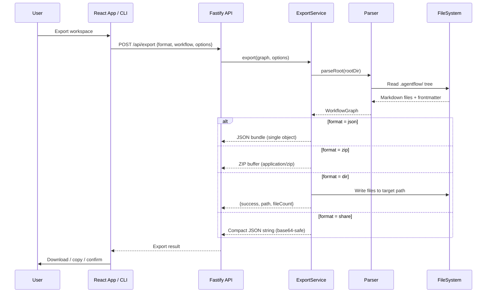
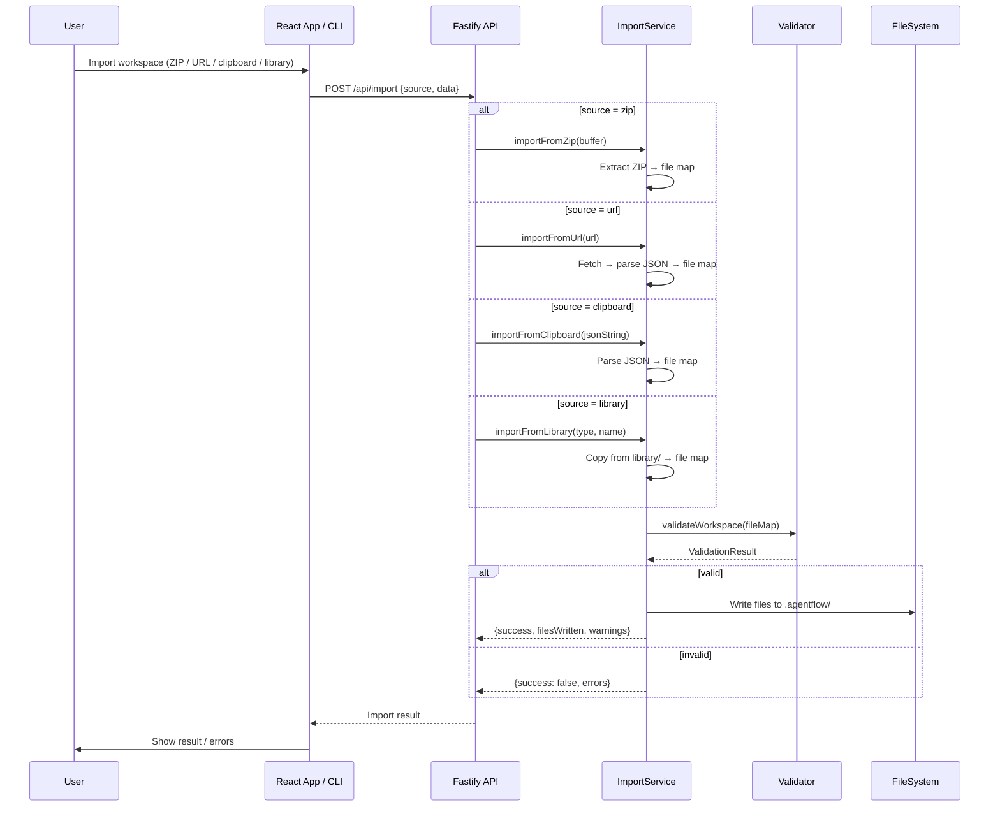

# Design Document: Library, Examples & Export (Spec 3 of 4)

## Overview

This spec transforms AgentFlow's library from a collection of thin shells into a production-quality, immediately usable resource catalog — and adds the export/import infrastructure to share workspaces. It covers six domains: (1) enriching all 78 existing library items (23 tools, 20 skills, 17 templates, 9 interactions, 4 memory, 5 workflows) with real, substantive content — JSON Schema parameters for tools, detailed multi-step instructions for skills, unambiguous `check` fields for templates, real prompts for interactions, structured formats for memory; (2) adding 3 new example workflows (customer-support, content-pipeline, incident-response) that showcase router, pipeline, and supervisor patterns as complete runnable `.agentflow/` workspaces; (3) multi-format export (JSON bundle, ZIP archive, standalone directory, shareable compact format); (4) multi-source import (ZIP, URL, clipboard, library one-click) with workspace validation; (5) a Library Browser UI panel in the left sidebar with search, filter, preview, one-click add, drag-and-drop, and installed indicators; (6) CLI improvements for `export`, `import`, `library search`, and `library list` commands.

This spec does NOT cover the backend service layer refactor, shadcn migration, or three-panel layout (Spec 1), the chat builder or onboarding (Spec 2), or the protocol layer (Spec 4). It builds on top of Spec 1's service layer and UI foundation.

## Architecture

### Spec 3 System Scope

```mermaid
graph TD
    subgraph "Library Enrichment"
        LR[library/registry.json]
        LR --> TL[23 Tools — JSON Schema params, commands, MCP configs]
        LR --> SK[20 Skills — Multi-step instructions, anti-patterns, output format]
        LR --> TP[17 Templates — Unambiguous check fields, narrativeTemplate]
        LR --> IN[9 Interactions — Real prompts, options, timeouts]
        LR --> MM[4 Memory — Structured formats, read/write instructions]
        LR --> WF[5+3 Workflows — Complete node dirs with real SKILL.md files]
    end

    subgraph "Export/Import Engine"
        EX[ExportService]
        EX --> JB[JSON Bundle — single file, full graph]
        EX --> ZA[ZIP Archive — .agentflow/ as ZIP]
        EX --> SD[Standalone Dir — copy to target path]
        EX --> SF[Shareable Format — compact JSON for URL/clipboard]
        IM[ImportService]
        IM --> IZ[From ZIP]
        IM --> IU[From URL]
        IM --> IC[From Clipboard]
        IM --> IL[From Library — one-click add]
        IM --> IV[Workspace Validator]
    end

    subgraph "Library Browser UI"
        LB[LibraryBrowser Panel — Left Sidebar Tab]
        LB --> SB[Search Bar]
        LB --> CF[Category Filters]
        LB --> TF[Tag Filters]
        LB --> PV[Preview Sheet/Dialog]
        LB --> OC[One-Click Add]
        LB --> DD[Drag-and-Drop to Canvas]
        LB --> II[Installed Indicator]
    end

    subgraph "CLI"
        CL[agentflow CLI]
        CL --> CE[export --format json|zip|dir|share]
        CL --> CI[import --from path|url]
        CL --> CS[library search query]
        CL --> CLL[library list --type type]
    end
```

### Export Flow



### Import Flow



## Components and Interfaces

### Component 1: Library Content Enrichment Schema

**Purpose**: Define the enrichment standards for each library item type so every item is immediately usable, not just a description stub.

**Interface**:

```typescript
// Enriched Tool — must have real parameters, real command/MCP config
interface EnrichedTool {
  name: string
  type: 'builtin' | 'script' | 'mcp'
  description: string
  // NEW: JSON Schema parameters — every tool must declare its inputs
  parameters?: Record<string, ToolParameter>
  // Script tools: real, runnable command with {placeholder} tokens
  command?: string
  // MCP tools: real server config with setup instructions
  mcp?: string
  mcpConfig?: {
    server: string
    tool: string
    setupInstructions: string  // How to install/configure the MCP server
  }
  // Builtin tools: mapping to agent runtime capability
  outputs?: string[]
}

interface ToolParameter {
  type: 'string' | 'number' | 'boolean' | 'array' | 'object'
  description: string
  required?: boolean
  default?: unknown
  enum?: unknown[]
  items?: { type: string }  // For array types
}

// Enriched Skill — must have detailed multi-step instructions
interface EnrichedSkill {
  name: string
  domain: string
  description: string
  // Body content must include:
  // 1. Process steps (numbered, detailed)
  // 2. Anti-patterns (what NOT to do)
  // 3. Output format (what the skill produces)
  // 4. Examples (at least one concrete example)
}

// Enriched Template — must have unambiguous check field
interface EnrichedTemplate {
  name: string
  type: 'condition'
  // check: must be specific enough for an LLM to evaluate unambiguously
  check: string
  narrativeTemplate: {
    prefix: string   // e.g. "If all tests pass,"
    suffix: string   // e.g. "proceed to deployment."
  }
}

// Enriched Interaction — must have real prompts and options
interface EnrichedInteraction {
  name: string
  type: 'approval' | 'input' | 'feedback' | 'notification'
  timeout?: number  // seconds, 0 = no timeout
  // Body must include:
  // 1. "What to Present" section — exact prompt text
  // 2. "User Options" section — available responses
  // 3. "Timeout Behavior" — what happens if user doesn't respond
}

// Enriched Memory — must have structured format
interface EnrichedMemory {
  name: string
  editable: boolean
  // Body must include:
  // 1. Purpose — what this memory stores
  // 2. Format — date-prefixed entry template
  // 3. Read instructions — when/how to read
  // 4. Write instructions — when/how to write
  // 5. Example entries
}
```

**Responsibilities**:
- Define enrichment standards per type
- Every tool gets JSON Schema `parameters` in frontmatter
- Every skill gets process steps, anti-patterns, output format
- Every template gets an unambiguous `check` field
- Every interaction gets real prompts and user options
- Every memory gets structured format with examples

### Component 2: Example Workflow Scaffolds

**Purpose**: Add 3 new complete, runnable example workflows that showcase different agent architecture patterns.

**Interface**:

```typescript
// Each example workflow is a complete .agentflow/ workspace
interface ExampleWorkflow {
  name: string
  pattern: 'router' | 'pipeline' | 'supervisor'
  description: string
  // Directory structure
  structure: {
    agentsMd: string           // Workflow AGENTS.md
    nodes: ExampleNode[]       // Complete node directories
    tools: string[]            // Tool refs used
    skills: string[]           // Skill refs used
    templates: string[]        // Template refs used
    interactions: string[]     // Interaction refs used
  }
}

interface ExampleNode {
  name: string
  type: 'step' | 'router'
  skillMd: string              // Full SKILL.md content
  hasOutput: boolean           // Whether node produces output/
}

// The three new workflows:
// 1. customer-support (router pattern)
//    triage → route-gate → billing | technical | general → respond
//
// 2. content-pipeline (pipeline pattern)
//    research → draft → edit → review-gate → publish
//
// 3. incident-response (supervisor pattern)
//    detect → triage → investigate → mitigate → review-gate → postmortem
```

**Responsibilities**:
- Each workflow is a self-contained directory under `library/workflows/`
- Each has a complete AGENTS.md with node summaries and edges
- Each node has a real SKILL.md with frontmatter, context budget, instructions, and edges
- Each workflow uses existing library tools, skills, templates, and interactions via `{{ref}}` syntax
- Each demonstrates a distinct architecture pattern

### Component 3: ExportService

**Purpose**: Extend the existing `exporter.js` and `structured-exporter.js` with multi-format export capabilities. The current export only supports `raw` and `parsed` file maps. This adds JSON bundle, ZIP, standalone directory, and shareable format.

**Interface**:

```typescript
// src/services/export-service.js (or extend src/exporter.js)
interface ExportService {
  // Existing (from exporter.js) — kept as-is
  exportWorkflow(graph: WorkflowGraph, workflowId: string): ExportBundle

  // NEW: Multi-format export
  exportAsJson(graph: WorkflowGraph, options: ExportOptions): JsonBundle
  exportAsZip(graph: WorkflowGraph, options: ExportOptions): Promise<Buffer>
  exportAsDir(graph: WorkflowGraph, options: ExportOptions): { path: string; fileCount: number }
  exportAsShareable(graph: WorkflowGraph, options: ExportOptions): string

  // NEW: Full workspace export (not just one workflow)
  exportFullWorkspace(rootDir: string, options: ExportOptions): Promise<ExportResult>
}

interface ExportOptions {
  format: 'json' | 'zip' | 'dir' | 'share'
  workflowId?: string          // Optional: export specific workflow, or all
  outputPath?: string          // For 'dir' format
  includeResources?: boolean   // Include tools/skills/etc. (default: true)
  resolveRefs?: boolean        // Resolve {{ref}} tokens (default: false)
  minify?: boolean             // For 'json' and 'share' formats
}

// JSON Bundle — single self-contained JSON file
interface JsonBundle {
  version: string              // AgentFlow format version
  exportedAt: string           // ISO timestamp
  workspace: {
    identity?: WorkspaceIdentity
    workflows: Record<string, ExportedWorkflow>
    resources: {
      tools: Record<string, ExportedResource>
      skills: Record<string, ExportedResource>
      templates: Record<string, ExportedResource>
      interactions: Record<string, ExportedResource>
      memory: Record<string, ExportedResource>
    }
  }
  metadata: {
    sourceDir: string
    nodeCount: number
    resourceCount: number
  }
}

// Shareable Format — compact, URL-safe
interface ShareableBundle {
  v: number                    // Schema version (1)
  n: string                    // Workspace name
  f: Record<string, string>    // File map: relativePath → content
  m: {                         // Minimal metadata
    t: string                  // Timestamp
    c: number                  // File count
  }
}
```

**Responsibilities**:
- `exportAsJson`: Builds a self-contained JSON bundle with all workflows, nodes, and resources
- `exportAsZip`: Uses JSZip (already a dependency) to create a downloadable ZIP of the `.agentflow/` directory
- `exportAsDir`: Copies the `.agentflow/` directory to a target path, preserving structure
- `exportAsShareable`: Creates a compact JSON string that can be base64-encoded for URL sharing or clipboard
- `exportFullWorkspace`: Exports the entire workspace (all workflows), not just one
- Preserves all frontmatter, refs, and directory structure
- Preserves `${env:VARIABLE_NAME}` tokens as-is (existing behavior)
- **MCP config conversion on export**: reads `protocols.json` → extracts `protocols.mcp.config.servers` → generates standard `mcp.json` (`{ mcpServers: {...} }`) alongside the exported `.agentflow/` directory. This ensures exported workspaces are compatible with Claude Desktop, Cursor, VS Code, Kiro, and Windsurf.
- Optional `--target` flag: `--target cursor` generates `.cursor/mcp.json`, `--target vscode` generates `.vscode/mcp.json`, `--target kiro` generates `.kiro/settings/mcp.json`
- **On import**: if imported workspace has `mcp.json` but no `protocols.json`, auto-converts `mcp.json` → `protocols.json` (wraps servers into `protocols.mcp.config.servers`)

### Component 4: ImportService

**Purpose**: Import workspaces from multiple sources with validation before writing files.

**Interface**:

```typescript
// src/services/import-service.js
interface ImportService {
  importFromZip(buffer: Buffer, targetRoot: string): Promise<ImportResult>
  importFromUrl(url: string, targetRoot: string): Promise<ImportResult>
  importFromClipboard(jsonString: string, targetRoot: string): Promise<ImportResult>
  importFromLibrary(type: string, name: string, targetRoot: string): ImportResult

  // Shared validation step
  validateImport(fileMap: Record<string, string>): ValidationResult
}

interface ImportResult {
  success: boolean
  filesWritten: string[]       // Relative paths of files written
  warnings: string[]           // Non-fatal issues
  errors: string[]             // Fatal issues (if success=false)
  skipped: string[]            // Files skipped (already exist, etc.)
}

interface ImportOptions {
  overwrite?: boolean          // Overwrite existing files (default: false)
  merge?: boolean              // Merge with existing workspace (default: true)
  dryRun?: boolean             // Validate only, don't write (default: false)
  targetDir?: string           // Subdirectory within .agentflow/ to import into
}
```

**Responsibilities**:
- `importFromZip`: Extract ZIP, find `.agentflow/` root within it, build file map
- `importFromUrl`: Fetch URL, parse as ShareableBundle JSON, build file map
- `importFromClipboard`: Parse JSON string as ShareableBundle, build file map
- `importFromLibrary`: Delegates to existing `library.add()` but returns ImportResult
- `validateImport`: Runs the existing validator against the file map before writing
  - Checks: valid frontmatter, resolvable refs, no orphan nodes, valid directory structure
  - Returns warnings for non-fatal issues (missing optional fields)
  - Returns errors for fatal issues (broken refs, invalid YAML)
- All methods support `dryRun` mode for preview
- Merge mode: only writes files that don't already exist (unless `overwrite: true`)

### Component 5: Library Browser UI

**Purpose**: A new tab in the left panel (alongside Explorer and Elements) that lets users browse, search, preview, and install library items.

**Interface**:

```typescript
// ui/src/components/LibraryBrowser.tsx
interface LibraryBrowserProps {
  // Data from GET /api/library
  entries: LibraryEntry[]
  // Current workspace items (to show "installed" indicator)
  installedItems: Set<string>  // Set of "type:name" keys
  // Callbacks
  onAdd: (type: string, name: string) => Promise<void>
  onPreview: (entry: LibraryEntry) => void
}

interface LibraryEntry {
  name: string
  type: 'workflow' | 'skill' | 'tool' | 'template' | 'interaction' | 'memory'
  path: string
  description: string
  tags: string[]
}

// Filter state
interface LibraryFilters {
  query: string                // Free-text search
  category: string | null      // Type filter (workflow, skill, tool, etc.)
  tags: string[]               // Tag filter (multi-select)
}

// Preview component — shows full content in a sheet/dialog
interface LibraryPreviewProps {
  entry: LibraryEntry
  content: string              // Full markdown content of the item
  isInstalled: boolean
  onAdd: () => Promise<void>
  onClose: () => void
}
```

**Responsibilities**:
- Search bar with debounced filtering (name, description, tags)
- Category filter chips (All, Workflows, Skills, Tools, Templates, Interactions, Memory)
- Tag filter (extracted from registry entries)
- Item cards showing: name, type badge, description, installed indicator
- Click to preview: opens a sheet/dialog with full markdown content rendered
- One-click "Add" button: calls `POST /api/library/add` and refreshes workspace
- Drag-and-drop: library items can be dragged onto canvas nodes to add as refs
- Installed indicator: green checkmark on items already in the workspace
- Empty state: helpful message when no results match filters

### Component 6: CLI Export/Import/Library Commands

**Purpose**: Extend the existing CLI with polished export, import, and library commands.

**Interface**:

```typescript
// CLI command signatures (in src/cli.js)

// agentflow export [dir] --format json|zip|dir|share --output <path> --workflow <name>
interface ExportCommand {
  dir: string                  // .agentflow directory (default: '.agentflow')
  format: 'json' | 'zip' | 'dir' | 'share'  // Export format
  output: string               // Output path
  workflow?: string            // Specific workflow (optional, exports all if omitted)
}

// agentflow import --from <path|url> --overwrite --dry-run
interface ImportCommand {
  from: string                 // Source: file path (ZIP/JSON) or URL
  overwrite: boolean           // Overwrite existing files
  dryRun: boolean              // Preview only
}

// agentflow library search <query> --type <type>
interface LibrarySearchCommand {
  query: string
  type?: string                // Filter by type
}

// agentflow library list [--type <type>] [--tags <tags>]
interface LibraryListCommand {
  type?: string                // Filter by type
  tags?: string[]              // Filter by tags
}
```

**Responsibilities**:
- `agentflow export`: Replaces current limited export with multi-format support
- `agentflow import`: New command for importing from ZIP, JSON file, or URL
- `agentflow library search`: Extends existing `search` command with type filtering
- `agentflow library list`: New command to list all library items with optional filters
- All commands provide clear error messages and exit codes
- `--dry-run` support on import for safe preview

## Data Models

### Model 1: Library Registry (Extended)

```typescript
// library/registry.json — extended with tags and richer metadata
interface LibraryRegistry {
  version: string              // "1.1.0" (bumped for enrichment)
  entries: LibraryEntry[]
}

interface LibraryEntry {
  name: string                 // Unique within type
  type: 'workflow' | 'skill' | 'tool' | 'template' | 'interaction' | 'memory'
  path: string                 // Relative to library root
  description: string          // One-line description
  tags: string[]               // Searchable tags (e.g. ["development", "security"])
  // NEW fields for enriched library
  domain?: string              // Domain category (e.g. "development", "devops", "data")
  complexity?: 'basic' | 'intermediate' | 'advanced'
  pattern?: string             // For workflows: architecture pattern used
}
```

**Validation Rules**:
- `name` must be unique within its `type`
- `path` must resolve to an existing file or directory
- `tags` must be an array of lowercase strings
- `type` must be one of the six defined types

### Model 2: Export Bundle Formats

```typescript
// JSON Bundle format (for API consumption)
interface JsonExportBundle {
  version: '1.0.0'
  exportedAt: string           // ISO 8601
  source: {
    name: string               // Workspace name from AGENTS.md
    agentflowVersion: string   // "2.0.0"
  }
  files: Record<string, string>  // relativePath → content
  graph: {                     // Parsed graph data
    workflows: Record<string, {
      name: string
      nodes: Record<string, { name: string; type: string }>
      edges: Array<{ from: string; to: string; condition?: string }>
      entryPoints: string[]
    }>
    resources: {
      tools: string[]
      skills: string[]
      templates: string[]
      interactions: string[]
      memory: string[]
    }
  }
}

// Shareable format (compact, for URL/clipboard)
interface ShareableFormat {
  v: 1                         // Schema version
  n: string                    // Workspace name
  f: Record<string, string>    // File map (relativePath → content)
  m: { t: string; c: number } // Metadata: timestamp, file count
}
```

**Validation Rules**:
- `version` must be a valid semver string
- `files` keys must be valid relative paths (no `..`, no absolute paths)
- `files` values must be valid UTF-8 strings
- ShareableFormat `v` must be `1` (for forward compatibility)
- Total shareable JSON size should warn if > 1MB

### Model 3: Import Validation Schema

```typescript
interface ImportValidation {
  // Structural checks
  hasAgentsMd: boolean         // Root AGENTS.md exists
  hasValidFrontmatter: boolean // All .md files have valid YAML frontmatter
  hasValidRefs: boolean        // All {{ref}} tokens resolve within the import
  hasValidEdges: boolean       // All edge targets exist as nodes

  // Content checks
  orphanNodes: string[]        // Nodes not reachable from any entry point
  unresolvedRefs: string[]     // Refs that don't resolve
  missingFiles: string[]       // Files referenced but not in the import

  // Warnings (non-fatal)
  missingDescriptions: string[] // Items without descriptions
  emptyNodes: string[]         // Nodes with no SKILL.md content
  largeFiles: string[]         // Files > 10KB (unusual for .agentflow/)
}
```

**Validation Rules**:
- Import MUST have at least one `.md` file
- Import SHOULD have an `AGENTS.md` at root (warning if missing)
- All frontmatter MUST be valid YAML
- Unresolved refs are warnings (not errors) — they may resolve against existing workspace items
- Files with `..` in path are rejected (security)
- Binary files are rejected (only UTF-8 text allowed)


## Key Functions with Formal Specifications

### Function 1: enrichLibraryItem()

```typescript
function enrichLibraryItem(entry: LibraryEntry, libraryDir: string): EnrichedItem
```

**Preconditions:**
- `entry` is a valid LibraryEntry from registry.json
- `entry.path` resolves to an existing file or directory under `libraryDir`
- `entry.type` is one of: 'tool', 'skill', 'template', 'interaction', 'memory', 'workflow'

**Postconditions:**
- Returns the enriched item with all required fields populated per type
- Tool items have `parameters` object with JSON Schema definitions
- Skill items have process steps, anti-patterns, and output format sections
- Template items have non-empty `check` field in frontmatter and `narrativeTemplate` with `prefix`/`suffix`
- Interaction items have "What to Present" and "User Options" sections
- Memory items have "Format", "Read Instructions", and "Write Instructions" sections
- Original file content is preserved — enrichment only adds, never removes

**Loop Invariants:** N/A

### Function 2: exportAsFormat()

```typescript
function exportAsFormat(
  rootDir: string,
  options: ExportOptions
): Promise<ExportResult>
```

**Preconditions:**
- `rootDir` is a valid path to an existing `.agentflow/` directory
- `options.format` is one of: 'json', 'zip', 'dir', 'share'
- If `options.format === 'dir'`, then `options.outputPath` is defined and writable
- If `options.workflowId` is set, it must exist in the parsed graph

**Postconditions:**
- For 'json': returns `{ data: JsonExportBundle }` — valid JSON, all files included
- For 'zip': returns `{ data: Buffer }` — valid ZIP containing `.agentflow/` tree
- For 'dir': writes files to `options.outputPath`, returns `{ path, fileCount }`
- For 'share': returns `{ data: string }` — valid JSON string parseable as ShareableFormat
- All formats preserve: frontmatter, `{{ref}}` tokens, `${env:VAR}` tokens, directory structure
- No files outside `.agentflow/` are included
- `exportedAt` timestamp is set to current time

**Loop Invariants:**
- For file iteration: all previously processed files are valid UTF-8 and included in output

### Function 3: importFromSource()

```typescript
function importFromSource(
  source: ImportSource,
  targetRoot: string,
  options: ImportOptions
): Promise<ImportResult>
```

**Preconditions:**
- `source` is one of: `{ type: 'zip', data: Buffer }`, `{ type: 'url', url: string }`, `{ type: 'clipboard', json: string }`, `{ type: 'library', itemType: string, name: string }`
- `targetRoot` is a valid, writable directory path
- For URL source: URL is reachable and returns valid JSON
- For ZIP source: buffer is a valid ZIP file

**Postconditions:**
- If `options.dryRun`: no files are written, only validation result returned
- If validation passes and not dryRun: files are written to `targetRoot`
- `result.filesWritten` contains all files that were created or updated
- `result.skipped` contains files that already existed (when `overwrite: false`)
- `result.errors` is empty when `result.success === true`
- No files with `..` in path are written (path traversal prevention)
- All written files are valid UTF-8

**Loop Invariants:**
- For file writing: all previously written files exist on disk and match the source content

### Function 4: validateImportFileMap()

```typescript
function validateImportFileMap(
  fileMap: Record<string, string>
): ValidationResult
```

**Preconditions:**
- `fileMap` is a non-empty object
- All keys are relative paths (no absolute paths, no `..` segments)
- All values are strings (UTF-8 content)

**Postconditions:**
- Returns `{ valid: boolean, errors: string[], warnings: string[] }`
- `valid === true` if and only if `errors.length === 0`
- Errors include: invalid YAML frontmatter, missing required files
- Warnings include: unresolved refs, missing descriptions, empty nodes
- Does not modify `fileMap`

**Loop Invariants:**
- For file validation: all previously checked files have been categorized as valid or invalid

### Function 5: searchLibrary()

```typescript
function searchLibrary(
  registry: LibraryRegistry,
  query: string,
  filters: { type?: string; tags?: string[] }
): LibraryEntry[]
```

**Preconditions:**
- `registry` has a valid `entries` array
- `query` is a string (may be empty)
- `filters.type`, if set, is a valid library type
- `filters.tags`, if set, is an array of strings

**Postconditions:**
- Returns entries matching ALL active filters (AND logic)
- Empty query returns all entries (filtered by type/tags if set)
- Results are sorted by relevance: exact name match first, then description match, then tag match
- No duplicates in results
- Original registry is not modified

**Loop Invariants:**
- For filtering: all previously checked entries either match all criteria or have been excluded

## Algorithmic Pseudocode

### Algorithm 1: Library Enrichment Pipeline

```pascal
ALGORITHM enrichLibrary(libraryDir, registry)
INPUT: libraryDir — path to library root, registry — LibraryRegistry
OUTPUT: enrichedRegistry — LibraryRegistry with all items enriched

BEGIN
  enrichedEntries ← []

  FOR EACH entry IN registry.entries DO
    ASSERT entry.type IN {'tool', 'skill', 'template', 'interaction', 'memory', 'workflow'}

    sourcePath ← resolve(libraryDir, entry.path)
    ASSERT exists(sourcePath)

    IF entry.type = 'tool' THEN
      content ← readFile(sourcePath)
      frontmatter ← parseFrontmatter(content)

      // Ensure parameters with JSON Schema
      IF frontmatter.parameters IS EMPTY THEN
        frontmatter.parameters ← inferParametersFromContent(content)
      END IF

      // Ensure command for script tools
      IF frontmatter.type = 'script' AND frontmatter.command IS EMPTY THEN
        WARN "Script tool missing command: " + entry.name
      END IF

      // Ensure MCP config for MCP tools
      IF frontmatter.type = 'mcp' AND frontmatter.mcp IS EMPTY THEN
        WARN "MCP tool missing server config: " + entry.name
      END IF

      writeEnrichedFile(sourcePath, frontmatter, content)

    ELSE IF entry.type = 'skill' THEN
      content ← readFile(sourcePath)
      sections ← parseSections(content)

      ASSERT sections CONTAINS 'process steps' OR 'instructions'
      ASSERT sections CONTAINS 'anti-patterns'
      ASSERT sections CONTAINS 'output format'

    ELSE IF entry.type = 'template' THEN
      content ← readFile(sourcePath)
      frontmatter ← parseFrontmatter(content)

      ASSERT frontmatter.check IS NOT EMPTY
      ASSERT frontmatter.narrativeTemplate IS NOT EMPTY
      ASSERT frontmatter.narrativeTemplate.prefix IS NOT EMPTY
      ASSERT frontmatter.narrativeTemplate.suffix IS NOT EMPTY

    ELSE IF entry.type = 'interaction' THEN
      content ← readFile(sourcePath)
      sections ← parseSections(content)

      ASSERT sections CONTAINS 'What to Present'
      ASSERT sections CONTAINS 'User Options'

    ELSE IF entry.type = 'memory' THEN
      content ← readFile(sourcePath)
      sections ← parseSections(content)

      ASSERT sections CONTAINS 'Format'
      ASSERT sections CONTAINS 'Read Instructions' OR 'When to Read'
      ASSERT sections CONTAINS 'Write Instructions' OR 'When to Write'

    ELSE IF entry.type = 'workflow' THEN
      agentsMd ← readFile(join(sourcePath, 'AGENTS.md'))
      nodes ← listDirectories(sourcePath)

      FOR EACH node IN nodes DO
        skillPath ← join(sourcePath, node, 'SKILL.md')
        ASSERT exists(skillPath)

        skillContent ← readFile(skillPath)
        ASSERT length(skillContent) > 200  // Not a stub
        ASSERT skillContent CONTAINS 'Instructions' OR 'Steps'
        ASSERT skillContent CONTAINS 'Next'  // Has edges
      END FOR
    END IF

    enrichedEntries.add(entry)
  END FOR

  RETURN { version: '1.1.0', entries: enrichedEntries }
END
```

### Algorithm 2: Multi-Format Export

```pascal
ALGORITHM exportAsFormat(rootDir, options)
INPUT: rootDir — path to .agentflow/, options — ExportOptions
OUTPUT: ExportResult

BEGIN
  // Step 1: Parse the workspace
  graph ← parseRoot(rootDir)
  ASSERT graph IS NOT NULL

  // Step 2: Build file map (preserving directory structure)
  fileMap ← {}

  IF options.workflowId IS NOT NULL THEN
    // Export specific workflow
    files ← exportRaw(graph, options.workflowId)
    fileMap ← files
  ELSE
    // Export entire workspace — walk the directory
    FOR EACH file IN walkDirectory(rootDir) DO
      relativePath ← relative(rootDir, file.path)
      // Skip output/ directories (runtime artifacts)
      IF relativePath CONTAINS '/output/' THEN CONTINUE
      fileMap[relativePath] ← readFile(file.path)
    END FOR
  END IF

  ASSERT size(fileMap) > 0

  // Step 3: Format-specific output
  CASE options.format OF
    'json':
      bundle ← {
        version: '1.0.0',
        exportedAt: now(),
        source: { name: graph.identity.name, agentflowVersion: '2.0.0' },
        files: fileMap,
        graph: buildGraphSummary(graph)
      }
      RETURN { data: JSON.stringify(bundle, null, 2) }

    'zip':
      zip ← new JSZip()
      FOR EACH [path, content] IN fileMap DO
        zip.file(path, content)
      END FOR
      buffer ← zip.generateAsync({ type: 'nodebuffer' })
      RETURN { data: buffer }

    'dir':
      ASSERT options.outputPath IS NOT NULL
      FOR EACH [path, content] IN fileMap DO
        fullPath ← join(options.outputPath, path)
        mkdirSync(dirname(fullPath), { recursive: true })
        writeFileSync(fullPath, content)
      END FOR
      RETURN { path: options.outputPath, fileCount: size(fileMap) }

    'share':
      compact ← {
        v: 1,
        n: graph.identity.name OR basename(rootDir),
        f: fileMap,
        m: { t: now(), c: size(fileMap) }
      }
      RETURN { data: JSON.stringify(compact) }
  END CASE
END
```

### Algorithm 3: Import with Validation

```pascal
ALGORITHM importFromSource(source, targetRoot, options)
INPUT: source — ImportSource, targetRoot — path, options — ImportOptions
OUTPUT: ImportResult

BEGIN
  // Step 1: Extract file map from source
  fileMap ← {}

  CASE source.type OF
    'zip':
      zip ← JSZip.loadAsync(source.data)
      FOR EACH entry IN zip.files DO
        IF entry.dir THEN CONTINUE
        // Find .agentflow/ root within ZIP
        content ← entry.async('string')
        relativePath ← stripAgentflowPrefix(entry.name)
        fileMap[relativePath] ← content
      END FOR

    'url':
      response ← fetch(source.url)
      ASSERT response.ok
      json ← response.json()
      // Parse as ShareableFormat or JsonExportBundle
      IF json.v IS NOT NULL THEN
        // ShareableFormat
        fileMap ← json.f
      ELSE IF json.files IS NOT NULL THEN
        // JsonExportBundle
        fileMap ← json.files
      ELSE
        RETURN { success: false, errors: ['Unrecognized import format'] }
      END IF

    'clipboard':
      json ← JSON.parse(source.json)
      IF json.v IS NOT NULL THEN
        fileMap ← json.f
      ELSE IF json.files IS NOT NULL THEN
        fileMap ← json.files
      ELSE
        RETURN { success: false, errors: ['Unrecognized import format'] }
      END IF

    'library':
      // Delegate to existing library.add()
      add(registry, source.itemType, source.name, targetRoot)
      RETURN { success: true, filesWritten: [source.name], warnings: [], errors: [] }
  END CASE

  // Step 2: Security validation
  FOR EACH path IN keys(fileMap) DO
    IF path CONTAINS '..' THEN
      RETURN { success: false, errors: ['Path traversal detected: ' + path] }
    END IF
    IF isAbsolute(path) THEN
      RETURN { success: false, errors: ['Absolute path not allowed: ' + path] }
    END IF
  END FOR

  // Step 3: Content validation
  validation ← validateImportFileMap(fileMap)
  IF NOT validation.valid THEN
    RETURN { success: false, errors: validation.errors, warnings: validation.warnings }
  END IF

  // Step 4: Dry run check
  IF options.dryRun THEN
    RETURN { success: true, filesWritten: keys(fileMap), warnings: validation.warnings, errors: [] }
  END IF

  // Step 5: Write files
  written ← []
  skipped ← []

  FOR EACH [relativePath, content] IN fileMap DO
    fullPath ← join(targetRoot, relativePath)

    IF exists(fullPath) AND NOT options.overwrite THEN
      skipped.add(relativePath)
      CONTINUE
    END IF

    mkdirSync(dirname(fullPath), { recursive: true })
    writeFileSync(fullPath, content)
    written.add(relativePath)
  END FOR

  RETURN { success: true, filesWritten: written, skipped: skipped, warnings: validation.warnings, errors: [] }
END
```

## Example Usage

### Export via CLI

```bash
# Export as JSON bundle
agentflow export .agentflow --format json --output ./export/workspace.json

# Export as ZIP archive
agentflow export .agentflow --format zip --output ./export/workspace.zip

# Export to standalone directory
agentflow export .agentflow --format dir --output ./export/my-workspace/

# Export as shareable format (outputs to stdout)
agentflow export .agentflow --format share > share.json

# Export specific workflow only
agentflow export .agentflow --format zip --workflow build-feature --output ./export/build-feature.zip
```

### Import via CLI

```bash
# Import from ZIP
agentflow import --from ./export/workspace.zip

# Import from URL
agentflow import --from https://example.com/share/workspace.json

# Import with dry-run (preview only)
agentflow import --from ./export/workspace.zip --dry-run

# Import with overwrite
agentflow import --from ./export/workspace.zip --overwrite
```

### Library CLI

```bash
# Search library
agentflow library search "debug"
# → [skill] systematic-debugging — A structured 4-phase methodology...
# → [tool] lint-code — Run linters on source files...

# List all tools
agentflow library list --type tool
# → 23 tools found
# → analyze-image (builtin) — Describe, analyze, or extract information from images
# → call-api (script) — Make HTTP requests to REST APIs
# → ...

# List with tag filter
agentflow library list --type skill --tags development
```

### Export via API

```javascript
// JSON bundle export
const response = await fetch('/api/export', {
  method: 'POST',
  headers: { 'Content-Type': 'application/json' },
  body: JSON.stringify({ format: 'json', workflow: 'build-feature' })
});
const bundle = await response.json();

// ZIP download
const response = await fetch('/api/export', {
  method: 'POST',
  headers: { 'Content-Type': 'application/json' },
  body: JSON.stringify({ format: 'zip' })
});
const blob = await response.blob();
const url = URL.createObjectURL(blob);
// trigger download...

// Shareable format for clipboard
const response = await fetch('/api/export', {
  method: 'POST',
  headers: { 'Content-Type': 'application/json' },
  body: JSON.stringify({ format: 'share' })
});
const { data } = await response.json();
navigator.clipboard.writeText(data);
```

### Import via API

```javascript
// Import from ZIP upload
const formData = new FormData();
formData.append('file', zipFile);
formData.append('source', 'zip');
const result = await fetch('/api/import', {
  method: 'POST',
  body: formData
});

// Import from clipboard (shareable format)
const clipboardText = await navigator.clipboard.readText();
const result = await fetch('/api/import', {
  method: 'POST',
  headers: { 'Content-Type': 'application/json' },
  body: JSON.stringify({ source: 'clipboard', data: clipboardText })
});

// Import from library (one-click add)
const result = await fetch('/api/library/add', {
  method: 'POST',
  headers: { 'Content-Type': 'application/json' },
  body: JSON.stringify({ type: 'workflow', name: 'customer-support' })
});
```

### Library Browser UI Usage

```typescript
// In the left panel, LibraryBrowser is a tab alongside Explorer and Elements
<PanelTab id="library" label="Library" icon={<BookOpen />}>
  <LibraryBrowser
    entries={libraryEntries}
    installedItems={installedSet}
    onAdd={handleAddItem}
    onPreview={handlePreview}
  />
</PanelTab>

// Drag-and-drop from library to canvas node
// When a library item is dropped on a node, it adds a {{ref}} to that node's SKILL.md
function handleDrop(libraryEntry: LibraryEntry, targetNodeId: string) {
  const refSyntax = `{{${libraryEntry.type}s/${libraryEntry.name}}}`;
  appendRefToNode(targetNodeId, refSyntax);
}
```

## Correctness Properties

```typescript
// Property 1: Export-Import roundtrip preserves all files
// ∀ workspace W, format F:
//   import(export(W, F)) produces identical file contents to W
// (excluding metadata like exportedAt timestamp)

// Property 2: Library search is complete
// ∀ entry E in registry, query Q:
//   if Q is substring of E.name OR E.description OR any E.tags
//   then E ∈ search(registry, Q)

// Property 3: Import validation catches path traversal
// ∀ fileMap FM:
//   if any key in FM contains '..' then validateImport(FM).valid === false

// Property 4: Export preserves ref tokens
// ∀ file F in workspace with {{ref}} tokens:
//   export(workspace).files[F.path] contains all original {{ref}} tokens

// Property 5: Installed indicator is accurate
// ∀ entry E in library:
//   isInstalled(E) === true ⟺ E exists in current .agentflow/ workspace

// Property 6: Enriched items meet minimum content requirements
// ∀ tool T in enriched library:
//   T.frontmatter.parameters is defined AND has at least one parameter
// ∀ skill S in enriched library:
//   S.content contains "Anti-Pattern" section
// ∀ template T in enriched library:
//   T.frontmatter.check is non-empty string
//   T.frontmatter.narrativeTemplate.prefix is non-empty string

// Property 7: ZIP export produces valid ZIP
// ∀ workspace W:
//   JSZip.loadAsync(exportAsZip(W)) succeeds without error

// Property 8: Shareable format is valid JSON
// ∀ workspace W:
//   JSON.parse(exportAsShareable(W)) succeeds
//   AND result.v === 1
//   AND typeof result.f === 'object'

// Property 9: Import dry-run writes no files
// ∀ source S, targetRoot T:
//   let before = listFiles(T)
//   importFromSource(S, T, { dryRun: true })
//   let after = listFiles(T)
//   before === after

// Property 10: Library add is idempotent for non-workflow types
// ∀ type T (not 'workflow'), name N:
//   add(registry, T, N, root) twice produces same file content as once
```

## Error Handling

### Error Scenario 1: Export of Non-Existent Workflow

**Condition**: User specifies `--workflow foo` but `foo` doesn't exist in the parsed graph
**Response**: Return `{ success: false, error: 'Workflow "foo" not found. Available: build-feature, code-review' }`
**Recovery**: CLI exits with code 1 and helpful message listing available workflows

### Error Scenario 2: Import of Corrupted ZIP

**Condition**: ZIP buffer is not a valid ZIP file (corrupted, truncated, or wrong format)
**Response**: JSZip.loadAsync throws; catch and return `{ success: false, errors: ['Invalid ZIP file: <error message>'] }`
**Recovery**: No files written. User is prompted to check the file and try again.

### Error Scenario 3: Import Path Traversal Attempt

**Condition**: Imported file map contains a path like `../../etc/passwd`
**Response**: Validation rejects immediately with `{ success: false, errors: ['Path traversal detected: ../../etc/passwd'] }`
**Recovery**: No files written. The entire import is rejected.

### Error Scenario 4: Import URL Unreachable

**Condition**: `importFromUrl` cannot fetch the URL (network error, 404, timeout)
**Response**: Return `{ success: false, errors: ['Failed to fetch URL: <status/error>'] }`
**Recovery**: No files written. User is prompted to check the URL.

### Error Scenario 5: Library Item Not Found

**Condition**: `agentflow add tool nonexistent` — item doesn't exist in registry
**Response**: Throw with message listing available items of that type
**Recovery**: CLI exits with code 1. Existing behavior preserved.

### Error Scenario 6: Import Overwrites Existing Files

**Condition**: Import file map contains files that already exist in target workspace
**Response**: Without `--overwrite`, files are skipped and listed in `result.skipped`
**Recovery**: User can re-run with `--overwrite` flag to force replacement

### Error Scenario 7: Shareable Format Too Large

**Condition**: Exported shareable JSON exceeds 1MB
**Response**: Return result with warning: `'Shareable format is ${size}KB — may be too large for URL sharing'`
**Recovery**: Suggest using ZIP format instead for large workspaces

## Testing Strategy

### Unit Testing Approach

Test each module in isolation with Vitest (already configured):

- `export-service.test.js`: Test each export format with a fixture `.agentflow/` directory
  - JSON bundle: verify structure, all files present, valid JSON
  - ZIP: verify JSZip can read it back, all files present
  - Dir: verify files written to temp directory match source
  - Share: verify valid JSON, correct schema version, all files present
- `import-service.test.js`: Test each import source
  - ZIP import: create ZIP from fixture, import, verify files match
  - URL import: mock fetch, verify parsing and file writing
  - Clipboard import: test ShareableFormat and JsonExportBundle parsing
  - Validation: test path traversal rejection, invalid YAML detection, missing files
- `library-search.test.js`: Test search with various queries, type filters, tag filters
  - Empty query returns all
  - Substring match on name, description, tags
  - Type filter narrows results
  - Tag filter narrows results
  - Combined filters use AND logic
- `library-enrichment.test.js`: Validate enriched content meets standards
  - Every tool has parameters
  - Every skill has required sections
  - Every template has check field
  - Every interaction has prompts
  - Every memory has format

### Property-Based Testing Approach

**Property Test Library**: fast-check (already in devDependencies)

- Roundtrip property: `∀ fileMap: import(export(fileMap)) === fileMap`
- Path safety: `∀ path with '..': validateImport rejects`
- Search completeness: `∀ entry, substring of entry.name: search finds entry`
- JSON validity: `∀ workspace: exportAsJson produces valid JSON`
- ZIP validity: `∀ workspace: exportAsZip produces loadable ZIP`

### Integration Testing Approach

- End-to-end CLI tests: run `agentflow export` and `agentflow import` against fixture workspaces
- API tests: test `/api/export` and `/api/import` endpoints with supertest
- Library browser: test search, filter, add, and installed indicator against real registry

## Dependencies

- `jszip` (^3.10.1) — already installed, used for ZIP export/import
- `gray-matter` (^4.0.3) — already installed, used for frontmatter parsing in validation
- `fast-check` (^3.23.2) — already installed, used for property-based tests
- `vitest` (^3.2.1) — already installed, test runner
- `commander` (^14.0.3) — already installed, CLI framework
- `zod` (^4.3.6) — already installed, used for import validation schemas
- `glob` (^13.0.6) — already installed, used for directory walking in export
- No new dependencies required — all functionality builds on existing packages
