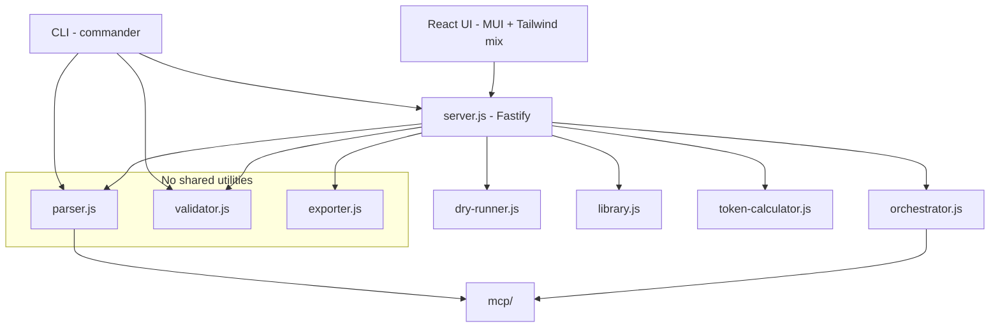
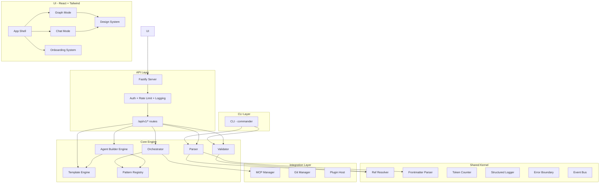
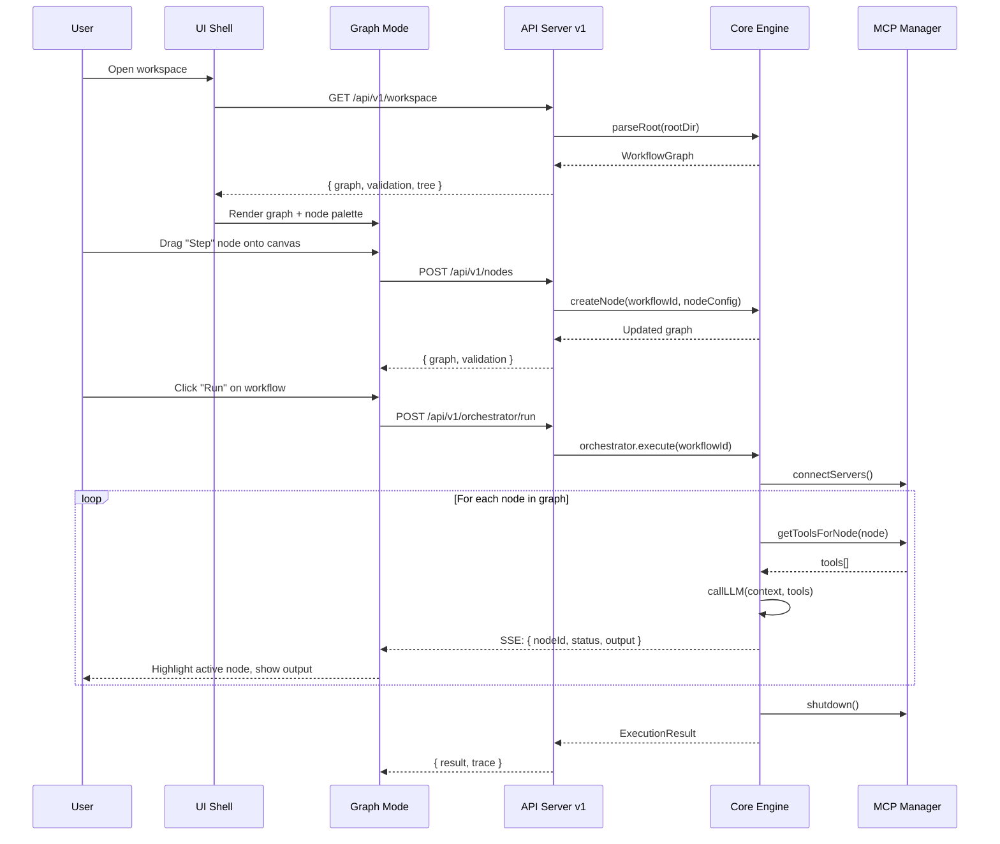
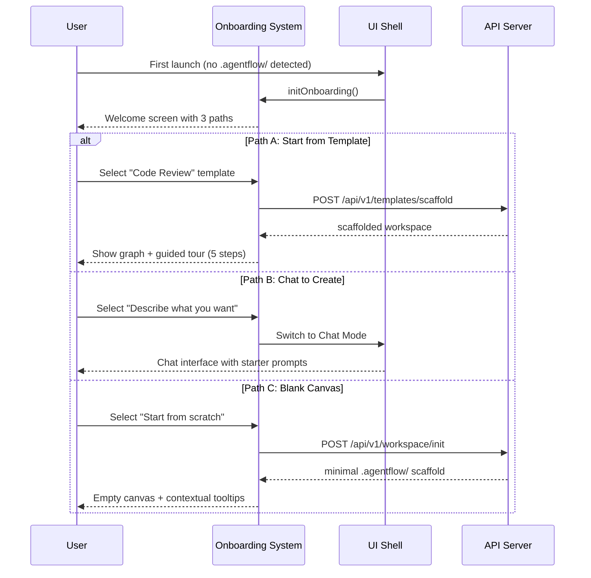
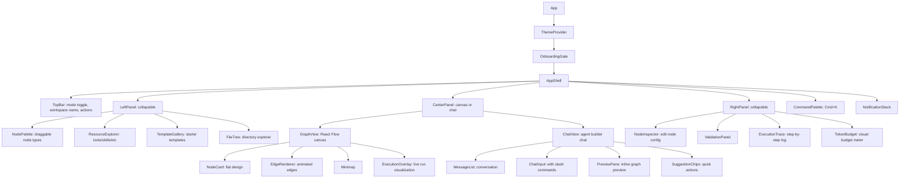

# Design Document: Production-Readiness Overhaul

## Overview

AgentFlow is a directory-based agent workflow orchestration system that parses, validates, visualizes, and exports agent workflows defined in markdown. The current v0.1.0 implementation has proven the core concept but needs a comprehensive production overhaul to reach open-source quality. The UI mixes MUI and Tailwind inconsistently, lacks onboarding, has no chat-based agent creation, and the codebase has DRY violations across both backend and frontend.

This design covers a complete UI redesign inspired by LangGraph Studio (dual graph + chat modes), OpenAI Agent Builder (typed node palette), n8n (clean flat design), and LangSmith (chat-first agent creation). It standardizes the component system, introduces multi-agent orchestration patterns, creates a template library with proper metadata, adds guided onboarding, and hardens the codebase for production use.

The overhaul preserves AgentFlow's core philosophy — directory-is-architecture, zero code dependency, platform agnostic — while making the tooling layer professional, extensible, and welcoming to new users.

## Architecture

### Current Architecture (Before)



### Target Architecture (After)



## Sequence Diagrams

### Main Flow: Graph Mode — Edit and Execute Workflow



### Main Flow: Chat Mode — Conversational Agent Creation

```mermaid
sequenceDiagram
    participant U as User
    participant CM as Chat Mode
    participant AB as Agent Builder Engine
    participant TE as Template Engine
    participant PR as Pattern Registry
    participant FS as File System

    U->>CM: "I want to build a code review agent"
    CM->>AB: processMessage(userMessage)
    AB->>PR: matchPattern("code review")
    PR-->>AB: { pattern: "supervisor", confidence: 0.85 }
    AB->>TE: getSuggestedTemplate("code-review")
    TE-->>AB: { workflow, skills[], tools[] }
    
    AB-->>CM: "I'll set up a code review workflow with 3 stages:
    scan → analyze → report. Want me to proceed?"
    CM-->>U: Show plan with preview graph
    
    U->>CM: "Yes, and add a human approval gate"
    CM->>AB: processMessage(refinement)
    AB->>AB: insertReviewGate(afterNode: "analyze")
    AB->>TE: generateFiles(workflowConfig)
    TE-->>AB: fileMap: { AGENTS.md, nodes/*, tools/* }
    
    AB->>FS: writeFiles(fileMap)
    FS-->>AB: success
    AB-->>CM: "Done! Created workflow with 4 nodes. 
    Switch to Graph Mode to see it visually?"
    CM-->>U: Show summary + "Open in Graph" button
```

### Onboarding Flow



## Components and Interfaces

### Component 1: Shared Kernel

The shared kernel extracts duplicated logic from parser, validator, and orchestrator into reusable modules.

**Interface**:
```typescript
// shared/ref-resolver.ts
interface RefResolver {
  resolve(ref: string, graph: WorkflowGraph): ResolvedRef | null
  resolveAll(content: string): ResolvedRef[]
  extractRefs(content: string): Ref[]
}

interface ResolvedRef {
  ref: Ref
  target: ParsedFile | null
  resolvedPath: string | null
  error?: string
}

// shared/frontmatter.ts
interface FrontmatterParser {
  parse(content: string): { data: Record<string, unknown>; content: string }
  validate(data: Record<string, unknown>, schema: ZodSchema): ValidationResult
  serialize(data: Record<string, unknown>, content: string): string
}

// shared/token-counter.ts
interface TokenCounter {
  count(text: string): number
  estimateNode(node: NodeDef, graph: WorkflowGraph): TokenEstimate
  estimateWorkflow(workflow: WorkflowDef, graph: WorkflowGraph): TokenEstimate[]
}

interface TokenEstimate {
  nodeId: string
  layer0: number
  layer1: number
  layer2: number
  layer3Refs: { ref: string; tokens: number }[]
  total: number
  withinBudget: boolean
}

// shared/logger.ts
interface Logger {
  info(msg: string, meta?: Record<string, unknown>): void
  warn(msg: string, meta?: Record<string, unknown>): void
  error(msg: string, error?: Error, meta?: Record<string, unknown>): void
  debug(msg: string, meta?: Record<string, unknown>): void
}

// shared/event-bus.ts
interface EventBus {
  emit(event: string, payload: unknown): void
  on(event: string, handler: (payload: unknown) => void): () => void
  off(event: string, handler: (payload: unknown) => void): void
}
```

**Responsibilities**:
- Eliminate duplicated ref parsing across parser.js, validator.js, and orchestrator.js
- Provide single source of truth for frontmatter parsing and validation
- Centralize token counting logic
- Structured logging for all modules
- Event-driven communication between subsystems

### Component 2: Core Engine

**Interface**:
```typescript
// core/parser.ts
interface Parser {
  parseRoot(rootDir: string): WorkflowGraph
  parseFile(filePath: string): ParsedFile
  parseWorkflow(workflowDir: string): WorkflowDef
}

// core/validator.ts  
interface Validator {
  validate(graph: WorkflowGraph, options?: ValidateOptions): ValidationResult
  validateNode(node: NodeDef, graph: WorkflowGraph): ValidationIssue[]
  validateRefs(graph: WorkflowGraph): ValidationIssue[]
}

interface ValidateOptions {
  strict?: boolean
  maxTokenBudget?: number
  checkCycles?: boolean
  checkReachability?: boolean
}

// core/orchestrator.ts
interface Orchestrator {
  execute(graph: WorkflowGraph, workflowId: string, options?: ExecuteOptions): AsyncGenerator<ExecutionEvent>
  step(state: ExecutionState): Promise<ExecutionEvent>
  pause(executionId: string): void
  resume(executionId: string): void
  cancel(executionId: string): void
}

interface ExecuteOptions {
  provider?: 'anthropic' | 'openai'
  model?: string
  maxIterations?: number
  onEvent?: (event: ExecutionEvent) => void
  humanApproval?: (request: ApprovalRequest) => Promise<boolean>
}

interface ExecutionEvent {
  type: 'node_enter' | 'node_exit' | 'tool_call' | 'tool_result' | 'llm_response' | 'routing' | 'error' | 'complete'
  nodeId?: string
  timestamp: number
  data: unknown
}

// core/agent-builder.ts
interface AgentBuilder {
  processMessage(message: string, context: BuilderContext): Promise<BuilderResponse>
  generateWorkflow(config: WorkflowConfig): Promise<FileMap>
  refineWorkflow(workflowId: string, instruction: string): Promise<FileMap>
}

interface BuilderContext {
  conversationHistory: Message[]
  currentWorkflow?: WorkflowGraph
  availableTemplates: LibraryEntry[]
  availablePatterns: PatternDef[]
}

interface BuilderResponse {
  message: string
  suggestedActions?: SuggestedAction[]
  previewGraph?: WorkflowGraph
  generatedFiles?: FileMap
}

type FileMap = Record<string, string>
```

**Responsibilities**:
- Parse .agentflow/ directories into typed WorkflowGraph
- Validate workspace structure, refs, frontmatter, context budgets
- Execute workflows with LLM + tools, emit events via SSE
- Conversational agent creation from natural language descriptions

### Component 3: Pattern Registry

**Interface**:
```typescript
// core/pattern-registry.ts
interface PatternRegistry {
  getPattern(id: PatternId): PatternDef
  listPatterns(): PatternDef[]
  matchPattern(description: string): PatternMatch[]
  scaffoldPattern(patternId: PatternId, config: PatternConfig): FileMap
}

type PatternId = 'single' | 'supervisor' | 'router' | 'pipeline' | 'handoff' | 'blackboard'

interface PatternDef {
  id: PatternId
  name: string
  description: string
  diagram: string  // Mermaid diagram
  nodeTypes: string[]
  edgePatterns: EdgePattern[]
  useCases: string[]
  template: WorkflowTemplate
}

interface PatternMatch {
  pattern: PatternDef
  confidence: number
  reasoning: string
}

interface PatternConfig {
  name: string
  description: string
  nodeOverrides?: Record<string, Partial<NodeConfig>>
  tools?: string[]
  skills?: string[]
}
```

**Responsibilities**:
- Define the 6 multi-agent architecture patterns (Single, Supervisor, Router, Pipeline, Handoff, Blackboard)
- Match user descriptions to appropriate patterns
- Scaffold complete workflow directories from pattern templates
- Provide visual diagrams for each pattern

### Component 4: Template Engine

**Interface**:
```typescript
// core/template-engine.ts
interface TemplateEngine {
  list(filters?: TemplateFilters): LibraryEntry[]
  get(type: string, name: string): TemplateDetail
  scaffold(type: string, name: string, targetDir: string, config?: ScaffoldConfig): FileMap
  validate(entry: LibraryEntry): ValidationResult
  search(query: string): SearchResult[]
}

interface TemplateDetail extends LibraryEntry {
  content: string
  frontmatter: Record<string, unknown>
  version: string
  author?: string
  category: TemplateCategory
  dependencies?: string[]
  examples?: string[]
}

type TemplateCategory = 
  | 'development' | 'data' | 'devops' | 'business' 
  | 'security' | 'content' | 'ai-ml' | 'general'

interface TemplateFilters {
  type?: string
  category?: TemplateCategory
  tags?: string[]
  search?: string
}

interface ScaffoldConfig {
  variables?: Record<string, string>
  includeOptional?: boolean
  overwrite?: boolean
}
```

**Responsibilities**:
- Manage the template library with proper metadata, versioning, and categories
- Scaffold new workflows/resources from templates
- Search and filter templates
- Validate template structure and completeness

### Component 5: Plugin Host

**Interface**:
```typescript
// plugins/plugin-host.ts
interface PluginHost {
  register(plugin: Plugin): void
  unregister(pluginId: string): void
  getPlugins(): PluginManifest[]
  getNodeTypes(): CustomNodeType[]
  getToolProviders(): ToolProvider[]
}

interface Plugin {
  manifest: PluginManifest
  activate(context: PluginContext): void
  deactivate(): void
}

interface PluginManifest {
  id: string
  name: string
  version: string
  description: string
  author?: string
  contributes?: {
    nodeTypes?: CustomNodeType[]
    toolProviders?: ToolProviderDef[]
    validators?: ValidatorDef[]
    themes?: ThemeDef[]
  }
}

interface PluginContext {
  eventBus: EventBus
  logger: Logger
  registerNodeType(nodeType: CustomNodeType): void
  registerToolProvider(provider: ToolProvider): void
  registerValidator(validator: ValidatorDef): void
}
```

**Responsibilities**:
- Load and manage plugins
- Allow custom node types, tool providers, validators, and themes
- Provide sandboxed plugin context
- Lifecycle management (activate/deactivate)


## Data Models

### Model 1: Enhanced WorkflowGraph

```typescript
interface WorkflowGraph {
  rootDir: string
  version: string  // NEW: schema version for migrations
  descriptorFile?: ParsedFile
  tools: Record<string, ParsedFile>
  skills: Record<string, ParsedFile>
  interactions: Record<string, ParsedFile>
  templates: Record<string, ParsedFile>
  memory: Record<string, ParsedFile>
  customFiles: Record<string, ParsedFile>
  workflows: Record<string, WorkflowDef>
  allFiles: ParsedFile[]
  metadata: GraphMetadata  // NEW
}

interface GraphMetadata {
  parsedAt: string
  fileCount: number
  totalTokens: number
  validationSummary: { errors: number; warnings: number }
}
```

**Validation Rules**:
- `rootDir` must be an absolute path to an existing directory
- `version` must be a valid semver string
- Every file in `allFiles` must have a unique `relativePath`
- Every workflow must have at least one entry point

### Model 2: Enhanced NodeDef with Agent Pattern Support

```typescript
interface NodeDef {
  id: string
  name: string
  description?: string
  nodeType: NodeType
  entry: boolean
  entryInferred: boolean
  primaryFile: ParsedFile
  contextFiles: ParsedFile[]
  allRefs: Ref[]
  frontmatter: Record<string, unknown>
  subWorkflow?: WorkflowDef
  // NEW fields for production overhaul
  agentPattern?: PatternId       // Which multi-agent pattern this node uses
  guardrails?: GuardrailConfig   // Safety guardrails
  approval?: ApprovalConfig      // Human-in-the-loop config
  retryPolicy?: RetryPolicy      // Retry on failure
  timeout?: number               // Max execution time in ms
}

type NodeType = 'step' | 'router' | 'sub-workflow' | 'agent' | 'guardrail' | 'transform' | 'approval'

interface GuardrailConfig {
  piiDetection?: boolean
  contentModeration?: boolean
  hallucination?: { enabled: boolean; threshold: number }
  maxTokens?: number
  blockedPatterns?: string[]
}

interface ApprovalConfig {
  required: boolean
  timeout: number  // seconds
  approvers?: string[]
  autoApproveIf?: string  // template condition ref
}

interface RetryPolicy {
  maxAttempts: number
  backoffMs: number
  backoffMultiplier: number
  retryableErrors?: string[]
}
```

**Validation Rules**:
- `nodeType` must be one of the defined types
- If `nodeType` is 'router', node must not reference tools or skills
- If `approval.required` is true, `approval.timeout` must be > 0
- `retryPolicy.maxAttempts` must be between 1 and 10
- `guardrails.hallucination.threshold` must be between 0 and 1

### Model 3: Execution State

```typescript
interface ExecutionState {
  executionId: string
  workflowId: string
  status: ExecutionStatus
  currentNodeId: string | null
  visitedNodes: string[]
  nodeOutputs: Record<string, unknown>
  startedAt: string
  updatedAt: string
  completedAt?: string
  error?: ExecutionError
  trace: ExecutionEvent[]
  tokenUsage: { input: number; output: number; total: number }
}

type ExecutionStatus = 'pending' | 'running' | 'paused' | 'waiting_approval' | 'completed' | 'failed' | 'cancelled'

interface ExecutionError {
  nodeId: string
  message: string
  code: string
  retryable: boolean
  stack?: string
}
```

**Validation Rules**:
- `executionId` must be a valid UUID
- `status` transitions must follow the state machine (pending→running→completed/failed)
- `currentNodeId` must be null when status is 'completed' or 'failed'
- `visitedNodes` must be a subset of nodes in the workflow

### Model 4: Agent Builder Conversation

```typescript
interface BuilderConversation {
  id: string
  messages: BuilderMessage[]
  currentPhase: BuilderPhase
  workflowConfig: Partial<WorkflowConfig>
  generatedFiles: FileMap
  createdAt: string
  updatedAt: string
}

interface BuilderMessage {
  role: 'user' | 'assistant'
  content: string
  timestamp: string
  suggestedActions?: SuggestedAction[]
  previewGraph?: WorkflowGraph
}

type BuilderPhase = 'understanding' | 'designing' | 'refining' | 'generating' | 'complete'

interface SuggestedAction {
  id: string
  label: string
  description: string
  type: 'accept' | 'modify' | 'reject' | 'add_node' | 'add_tool' | 'change_pattern'
}

interface WorkflowConfig {
  name: string
  description: string
  pattern: PatternId
  nodes: NodeConfig[]
  tools: string[]
  skills: string[]
  interactions: string[]
  memory: string[]
  identity: { name: string; role: string; constraints: string[] }
}

interface NodeConfig {
  name: string
  type: NodeType
  description: string
  tools?: string[]
  skills?: string[]
  edges?: { to: string; condition?: string }[]
  isEntry?: boolean
}
```

### Model 5: Onboarding State

```typescript
interface OnboardingState {
  completed: boolean
  currentStep: number
  totalSteps: number
  path: OnboardingPath
  dismissedTooltips: string[]
  completedTours: string[]
  firstWorkflowCreated: boolean
}

type OnboardingPath = 'template' | 'chat' | 'blank' | null

interface TourStep {
  id: string
  target: string  // CSS selector or component ref
  title: string
  content: string
  placement: 'top' | 'bottom' | 'left' | 'right'
  action?: 'highlight' | 'click' | 'type'
  requiredAction?: string  // User must do this to proceed
}

interface TooltipConfig {
  id: string
  target: string
  content: string
  showAfter?: string  // Show after this tooltip is dismissed
  showOnce: boolean
}
```

## UI Design System

### Design Principles

Inspired by n8n's flat design, LangGraph Studio's dual-mode layout, and OpenAI Agent Builder's node palette:

1. **Tailwind-only** — Remove all MUI dependencies. Use Tailwind CSS v4 + Radix UI primitives for accessible, unstyled components.
2. **Three-panel layout** — Left (explorer/palette), Center (canvas or chat), Right (detail/inspector). Collapsible panels.
3. **Dual mode** — Graph Mode (visual canvas) and Chat Mode (conversational builder). Toggle in the top bar.
4. **Flat node design** — Clean cards with subtle shadows, color-coded by node type. No 3D effects.
5. **Dark-first** — Design for dark mode first, ensure light mode works well.
6. **Motion with purpose** — Framer Motion for meaningful transitions only (mode switch, panel open/close, node creation).

### Component Hierarchy



### Node Type Visual Design

```typescript
// Node type color mapping (Tailwind classes)
const NODE_COLORS: Record<NodeType, { bg: string; border: string; icon: string }> = {
  step:         { bg: 'bg-blue-50 dark:bg-blue-950',    border: 'border-blue-300 dark:border-blue-700',    icon: 'PlayCircle' },
  router:       { bg: 'bg-amber-50 dark:bg-amber-950',  border: 'border-amber-300 dark:border-amber-700',  icon: 'GitBranch' },
  'sub-workflow':{ bg: 'bg-purple-50 dark:bg-purple-950', border: 'border-purple-300 dark:border-purple-700', icon: 'Layers' },
  agent:        { bg: 'bg-emerald-50 dark:bg-emerald-950', border: 'border-emerald-300 dark:border-emerald-700', icon: 'Bot' },
  guardrail:    { bg: 'bg-red-50 dark:bg-red-950',      border: 'border-red-300 dark:border-red-700',      icon: 'Shield' },
  transform:    { bg: 'bg-cyan-50 dark:bg-cyan-950',    border: 'border-cyan-300 dark:border-cyan-700',    icon: 'ArrowRightLeft' },
  approval:     { bg: 'bg-orange-50 dark:bg-orange-950', border: 'border-orange-300 dark:border-orange-700', icon: 'UserCheck' },
}
```

### Node Palette Categories (Inspired by OpenAI Agent Builder)

```typescript
const NODE_PALETTE: PaletteCategory[] = [
  {
    label: 'Core',
    nodes: [
      { type: 'step', label: 'Step', description: 'Execute instructions with tools' },
      { type: 'agent', label: 'Agent', description: 'Autonomous agent with its own context' },
      { type: 'router', label: 'Router', description: 'Route based on conditions' },
    ]
  },
  {
    label: 'Control Flow',
    nodes: [
      { type: 'approval', label: 'Approval Gate', description: 'Require human approval' },
      { type: 'sub-workflow', label: 'Sub-Workflow', description: 'Embed another workflow' },
    ]
  },
  {
    label: 'Safety',
    nodes: [
      { type: 'guardrail', label: 'Guardrail', description: 'PII, moderation, hallucination checks' },
    ]
  },
  {
    label: 'Data',
    nodes: [
      { type: 'transform', label: 'Transform', description: 'Transform data between nodes' },
    ]
  },
]
```


## Algorithmic Pseudocode

### Algorithm 1: Agent Builder — Conversational Workflow Creation

```typescript
async function processBuilderMessage(
  message: string, 
  context: BuilderContext
): Promise<BuilderResponse> {
  // Phase 1: Understand intent
  const intent = await classifyIntent(message, context.conversationHistory)
  
  switch (context.currentPhase) {
    case 'understanding': {
      // Extract workflow requirements from conversation
      const requirements = extractRequirements(message, context.conversationHistory)
      
      if (requirements.isComplete) {
        // Match to best pattern
        const matches = patternRegistry.matchPattern(requirements.description)
        const bestMatch = matches[0]
        
        // Generate initial workflow config
        const config = generateWorkflowConfig(requirements, bestMatch.pattern)
        const previewGraph = buildPreviewGraph(config)
        
        return {
          message: formatDesignProposal(config, bestMatch),
          suggestedActions: [
            { id: 'accept', label: 'Looks good, create it', type: 'accept' },
            { id: 'modify', label: 'I want to change something', type: 'modify' },
            { id: 'different', label: 'Try a different approach', type: 'reject' },
          ],
          previewGraph,
        }
      }
      
      // Ask follow-up questions
      const nextQuestion = determineNextQuestion(requirements)
      return { message: nextQuestion }
    }
    
    case 'designing': {
      // User is refining the design
      const refinement = parseRefinement(message, context.workflowConfig)
      const updatedConfig = applyRefinement(context.workflowConfig, refinement)
      const previewGraph = buildPreviewGraph(updatedConfig)
      
      return {
        message: formatRefinementSummary(refinement),
        previewGraph,
        suggestedActions: [
          { id: 'done', label: 'Generate the workflow', type: 'accept' },
          { id: 'more', label: 'More changes', type: 'modify' },
        ],
      }
    }
    
    case 'generating': {
      // Generate actual files
      const files = await templateEngine.scaffold(
        context.workflowConfig.pattern,
        context.workflowConfig.name,
        context.workflowConfig
      )
      
      return {
        message: `Created ${Object.keys(files).length} files for "${context.workflowConfig.name}".`,
        generatedFiles: files,
        suggestedActions: [
          { id: 'open', label: 'Open in Graph Mode', type: 'accept' },
          { id: 'refine', label: 'Make adjustments', type: 'modify' },
        ],
      }
    }
  }
}
```

**Preconditions:**
- `message` is a non-empty string
- `context.conversationHistory` contains all previous messages
- `patternRegistry` and `templateEngine` are initialized

**Postconditions:**
- Returns a valid `BuilderResponse` with at least a `message`
- If `previewGraph` is returned, it is a valid `WorkflowGraph`
- If `generatedFiles` is returned, all file paths are valid relative paths
- Conversation phase advances monotonically: understanding → designing → generating → complete

### Algorithm 2: Pattern Matching — Select Best Multi-Agent Architecture

```typescript
function matchPattern(
  description: string, 
  patterns: PatternDef[]
): PatternMatch[] {
  const matches: PatternMatch[] = []
  
  for (const pattern of patterns) {
    let score = 0
    const reasons: string[] = []
    
    // Keyword matching
    for (const useCase of pattern.useCases) {
      const similarity = computeSimilarity(description, useCase)
      if (similarity > 0.6) {
        score += similarity * 0.4
        reasons.push(`Matches use case: "${useCase}"`)
      }
    }
    
    // Structural heuristics
    if (description.includes('sequential') || description.includes('pipeline')) {
      if (pattern.id === 'pipeline') score += 0.3
    }
    if (description.includes('delegate') || description.includes('coordinate')) {
      if (pattern.id === 'supervisor') score += 0.3
    }
    if (description.includes('route') || description.includes('classify')) {
      if (pattern.id === 'router') score += 0.3
    }
    if (description.includes('handoff') || description.includes('pass')) {
      if (pattern.id === 'handoff') score += 0.3
    }
    if (description.includes('shared') || description.includes('blackboard')) {
      if (pattern.id === 'blackboard') score += 0.3
    }
    
    // Complexity heuristic — simple descriptions favor single agent
    const wordCount = description.split(/\s+/).length
    if (wordCount < 15 && pattern.id === 'single') {
      score += 0.2
      reasons.push('Simple description favors single agent')
    }
    
    if (score > 0.1) {
      matches.push({
        pattern,
        confidence: Math.min(score, 1.0),
        reasoning: reasons.join('; '),
      })
    }
  }
  
  // Sort by confidence descending
  return matches.sort((a, b) => b.confidence - a.confidence)
}
```

**Preconditions:**
- `description` is a non-empty string
- `patterns` contains at least the 6 foundational patterns

**Postconditions:**
- Returns array sorted by confidence descending
- Each `confidence` is in range [0, 1]
- If no patterns match, returns empty array
- At least one pattern will match for any non-trivial description (single agent as fallback)

### Algorithm 3: Workflow Execution with Event Streaming

```typescript
async function* executeWorkflow(
  graph: WorkflowGraph,
  workflowId: string,
  options: ExecuteOptions
): AsyncGenerator<ExecutionEvent> {
  const workflow = graph.workflows[workflowId]
  if (!workflow) throw new Error(`Workflow not found: ${workflowId}`)
  
  const state: ExecutionState = {
    executionId: generateUUID(),
    workflowId,
    status: 'running',
    currentNodeId: workflow.entryPoints[0],
    visitedNodes: [],
    nodeOutputs: {},
    startedAt: new Date().toISOString(),
    updatedAt: new Date().toISOString(),
    trace: [],
    tokenUsage: { input: 0, output: 0, total: 0 },
  }
  
  const toolProvider = new ToolProvider()
  await toolProvider.initialize(graph)
  
  try {
    while (state.currentNodeId && state.status === 'running') {
      const node = workflow.nodes[state.currentNodeId]
      
      // Emit node_enter
      yield { type: 'node_enter', nodeId: node.id, timestamp: Date.now(), data: { name: node.name, type: node.nodeType } }
      
      state.visitedNodes.push(node.id)
      
      // Check for approval gate
      if (node.approval?.required) {
        state.status = 'waiting_approval'
        yield { type: 'node_enter', nodeId: node.id, timestamp: Date.now(), data: { waitingApproval: true } }
        
        const approved = await options.humanApproval?.({ nodeId: node.id, description: node.description })
        if (!approved) {
          state.status = 'cancelled'
          yield { type: 'error', nodeId: node.id, timestamp: Date.now(), data: { message: 'Approval denied' } }
          break
        }
        state.status = 'running'
      }
      
      // Build context (layers 0-3)
      const context = buildNodeContext(node, graph, state.nodeOutputs)
      const tools = toolProvider.getToolsForNode(node, graph)
      
      // Execute with retry policy
      const retryPolicy = node.retryPolicy ?? { maxAttempts: 1, backoffMs: 0, backoffMultiplier: 1 }
      let attempt = 0
      let result: LLMResult | null = null
      
      while (attempt < retryPolicy.maxAttempts) {
        try {
          result = await callLLM(context, tools, options)
          
          // Process tool calls
          for (const toolCall of result.toolCalls) {
            yield { type: 'tool_call', nodeId: node.id, timestamp: Date.now(), data: toolCall }
            const toolResult = await toolProvider.execute(toolCall)
            yield { type: 'tool_result', nodeId: node.id, timestamp: Date.now(), data: toolResult }
          }
          
          // Run guardrails if configured
          if (node.guardrails) {
            const guardrailResult = await runGuardrails(result, node.guardrails)
            if (!guardrailResult.passed) {
              yield { type: 'error', nodeId: node.id, timestamp: Date.now(), data: { guardrail: guardrailResult } }
              throw new Error(`Guardrail failed: ${guardrailResult.reason}`)
            }
          }
          
          break  // Success, exit retry loop
        } catch (err) {
          attempt++
          if (attempt >= retryPolicy.maxAttempts) throw err
          await sleep(retryPolicy.backoffMs * Math.pow(retryPolicy.backoffMultiplier, attempt - 1))
        }
      }
      
      // Store output
      state.nodeOutputs[node.id] = result
      state.tokenUsage.input += result.usage?.input_tokens ?? 0
      state.tokenUsage.output += result.usage?.output_tokens ?? 0
      state.tokenUsage.total = state.tokenUsage.input + state.tokenUsage.output
      
      yield { type: 'node_exit', nodeId: node.id, timestamp: Date.now(), data: { output: result.text } }
      
      // Determine next node via routing
      const nextNodeId = await evaluateRouting(node, workflow, result, state)
      yield { type: 'routing', nodeId: node.id, timestamp: Date.now(), data: { nextNodeId } }
      
      state.currentNodeId = nextNodeId
      state.updatedAt = new Date().toISOString()
    }
    
    state.status = 'completed'
    state.completedAt = new Date().toISOString()
    yield { type: 'complete', timestamp: Date.now(), data: { state } }
    
  } catch (err) {
    state.status = 'failed'
    state.error = { nodeId: state.currentNodeId!, message: err.message, code: 'EXECUTION_ERROR', retryable: false }
    yield { type: 'error', timestamp: Date.now(), data: { error: state.error } }
  } finally {
    await toolProvider.shutdown()
  }
}
```

**Preconditions:**
- `graph` is a valid, parsed WorkflowGraph
- `workflowId` exists in `graph.workflows`
- The workflow has at least one entry point
- LLM provider credentials are configured

**Postconditions:**
- Yields events in order: node_enter → (tool_call/tool_result)* → node_exit → routing → ... → complete|error
- Final event is always 'complete' or 'error'
- `state.tokenUsage` reflects cumulative usage across all nodes
- All MCP connections are shut down in the finally block

**Loop Invariants:**
- `state.currentNodeId` is always a valid node in the workflow or null
- `state.visitedNodes` grows monotonically (may contain duplicates for loops)
- `state.status` is 'running' while the loop continues

### Algorithm 4: Onboarding Flow Controller

```typescript
function advanceOnboarding(
  state: OnboardingState, 
  action: OnboardingAction
): OnboardingState {
  switch (action.type) {
    case 'select_path': {
      return {
        ...state,
        path: action.path,
        currentStep: 1,
        totalSteps: getTotalSteps(action.path),
      }
    }
    
    case 'complete_step': {
      const nextStep = state.currentStep + 1
      const completed = nextStep > state.totalSteps
      
      return {
        ...state,
        currentStep: completed ? state.totalSteps : nextStep,
        completed,
        completedTours: completed 
          ? [...state.completedTours, `${state.path}-tour`]
          : state.completedTours,
      }
    }
    
    case 'dismiss_tooltip': {
      return {
        ...state,
        dismissedTooltips: [...state.dismissedTooltips, action.tooltipId],
      }
    }
    
    case 'skip': {
      return { ...state, completed: true }
    }
    
    default:
      return state
  }
}

function getTotalSteps(path: OnboardingPath): number {
  switch (path) {
    case 'template': return 5   // select → preview → customize → create → explore
    case 'chat': return 4       // describe → review → generate → explore
    case 'blank': return 3      // init → add node → connect
    default: return 0
  }
}
```

**Preconditions:**
- `state` is a valid OnboardingState
- `action.type` is one of the defined action types

**Postconditions:**
- Returns a new state object (immutable update)
- `currentStep` never exceeds `totalSteps`
- `completed` is true only when all steps are done or skipped
- `dismissedTooltips` only grows, never shrinks

