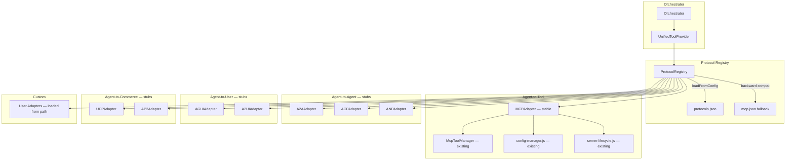
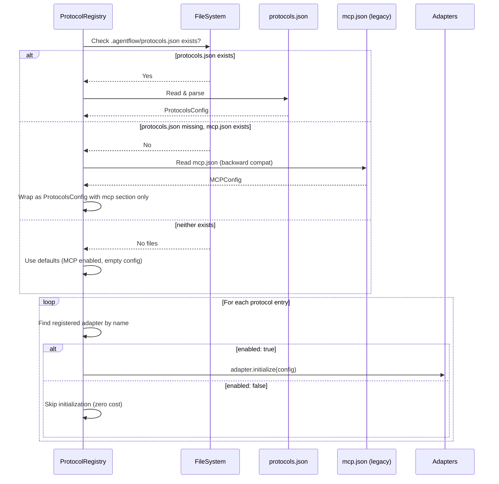
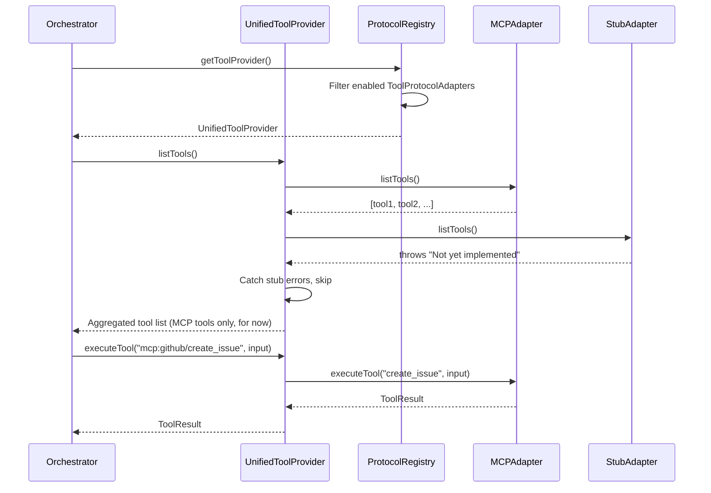

# Design Document: Protocol Layer (Spec 4 of 4)

## Overview

This spec implements the universal protocol adapter layer for AgentFlow. The current codebase has MCP integration spread across four files (`src/mcp/tool-provider.js`, `server-lifecycle.js`, `config-manager.js`, `registry-client.js`) with a `ToolProvider` base class and `NodeToolProvider` that directly wires MCP. This spec wraps that existing MCP code into a proper `MCPAdapter` class, introduces a generic `ProtocolRegistry` that accepts any adapter via `register()`, adds a `protocols.json` config file that supersedes `mcp.json`, creates stub adapters for A2A/ACP/ANP/AG-UI/A2UI/UCP/AP2, supports custom user-written adapters, provides a `UnifiedToolProvider` that aggregates tools from all enabled `ToolProtocolAdapter` instances, and adds a Protocol UI panel to the right panel.

Nothing is hardcoded. The registry is a generic container — it doesn't know about MCP, A2A, or any specific protocol. Adapters self-describe via `name`, `category`, and `status`. Only MCP ships fully implemented; everything else is a configurable stub. The master design is at `.kiro/specs/agentflow-production-overhaul/design.md`.

## Architecture

### Protocol Layer Architecture



### Config Resolution Flow



### Protocol Registration & Tool Resolution



## Components and Interfaces

### Component 1: ProtocolAdapter Base Interface

**Purpose**: Generic interface that ALL protocol adapters implement. No protocol-specific knowledge — just name, version, category, status, and lifecycle methods.

**Interface**:

```javascript
// src/protocols/protocol-adapter.js

/**
 * @typedef {'agent-to-tool' | 'agent-to-agent' | 'agent-to-user' | 'agent-to-commerce' | 'custom'} ProtocolCategory
 * @typedef {'stable' | 'experimental' | 'planned' | 'custom'} ProtocolStatus
 * @typedef {{ status: 'healthy' | 'degraded' | 'unavailable', message?: string, latencyMs?: number }} HealthStatus
 */

/**
 * Base class for all protocol adapters.
 *
 * Subclasses MUST set name, version, category, status in constructor.
 * Subclasses MUST override initialize(), shutdown(), healthCheck().
 */
class ProtocolAdapter {
  constructor() {
    /** @type {string} */
    this.name = ''
    /** @type {string} */
    this.version = '0.0.0'
    /** @type {ProtocolCategory} */
    this.category = 'custom'
    /** @type {ProtocolStatus} */
    this.status = 'planned'
    /** @type {boolean} */
    this.initialized = false
  }

  /** @param {Record<string, unknown>} config */
  async initialize(config) {}

  async shutdown() {
    this.initialized = false
  }

  /** @returns {Promise<HealthStatus>} */
  async healthCheck() {
    return { status: 'unavailable', message: 'Not implemented' }
  }
}
```

**Responsibilities**:
- Single base class for every adapter (MCP, A2A, stubs, custom)
- Tracks `initialized` state so the registry knows what's live
- `healthCheck()` returns a uniform status object for the UI panel

### Component 2: Category-Specific Interfaces

**Purpose**: Extend `ProtocolAdapter` with methods specific to each protocol category. Adapters implement the one that matches their category.

**Interface**:

```javascript
// src/protocols/protocol-adapter.js (continued)

/**
 * @typedef {{ name: string, description: string, inputSchema: object }} ToolDefinition
 * @typedef {{ content: unknown, isError?: boolean }} ToolResult
 */

/**
 * For agent-to-tool protocols (MCP, future tool protocols).
 * Provides tool listing and execution.
 */
class ToolProtocolAdapter extends ProtocolAdapter {
  constructor() {
    super()
    this.category = 'agent-to-tool'
  }

  /** @returns {Promise<ToolDefinition[]>} */
  async listTools() { return [] }

  /**
   * @param {string} name — tool name
   * @param {unknown} input — tool arguments
   * @returns {Promise<ToolResult>}
   */
  async executeTool(name, input) {
    return { content: null, isError: true }
  }
}

/**
 * @typedef {{ name: string, description: string, url: string, capabilities: string[], protocol: string }} RemoteAgentCard
 * @typedef {{ role: string, content: string, metadata?: object }} AgentMessage
 * @typedef {{ content: string, metadata?: object }} AgentResponse
 */

/**
 * For agent-to-agent protocols (A2A, ACP, ANP).
 * Provides agent discovery and messaging.
 */
class AgentProtocolAdapter extends ProtocolAdapter {
  constructor() {
    super()
    this.category = 'agent-to-agent'
  }

  /** @param {string} [query] @returns {Promise<RemoteAgentCard[]>} */
  async discoverAgents(query) { return [] }

  /**
   * @param {string} agentId
   * @param {AgentMessage} message
   * @returns {Promise<AgentResponse>}
   */
  async sendMessage(agentId, message) {
    return { content: '' }
  }
}

/**
 * @typedef {{ type: string, data: unknown, timestamp: string }} UIEvent
 * @typedef {(event: UIEvent) => void} EventHandler
 */

/**
 * For agent-to-user protocols (AG-UI, A2UI).
 * Provides event streaming between agent and frontend.
 */
class UserProtocolAdapter extends ProtocolAdapter {
  constructor() {
    super()
    this.category = 'agent-to-user'
  }

  /** @param {EventHandler} handler */
  streamEvents(handler) {}

  /** @param {UIEvent} event */
  emitEvent(event) {}
}

/**
 * @typedef {{ items: object[], currency: string }} CheckoutRequest
 * @typedef {{ sessionId: string, url: string }} CheckoutSession
 * @typedef {{ mandateId: string, amount: number, currency: string }} PaymentMandate
 * @typedef {{ receiptId: string, status: string }} PaymentReceipt
 */

/**
 * For agent-to-commerce protocols (UCP, AP2).
 * Provides checkout and payment operations.
 */
class CommerceProtocolAdapter extends ProtocolAdapter {
  constructor() {
    super()
    this.category = 'agent-to-commerce'
  }

  /** @param {CheckoutRequest} request @returns {Promise<CheckoutSession>} */
  async createCheckout(request) {
    return { sessionId: '', url: '' }
  }

  /** @param {PaymentMandate} mandate @returns {Promise<PaymentReceipt>} */
  async authorizePayment(mandate) {
    return { receiptId: '', status: 'failed' }
  }
}
```

### Component 3: MCPAdapter

**Purpose**: Wraps the existing `McpToolManager`, `config-manager.js`, and `server-lifecycle.js` into a `ToolProtocolAdapter`. This is the ONLY adapter that ships fully implemented. All existing MCP functionality is preserved — just reorganized behind the adapter interface.

**Interface**:

```javascript
// src/protocols/mcp-adapter.js

const { McpToolManager } = require('../mcp/tool-provider')
const { loadMcpConfig } = require('../mcp/config-manager')

/**
 * MCP protocol adapter — wraps existing MCP infrastructure.
 *
 * Delegates to McpToolManager for server connections and tool execution.
 * Config comes from protocols.json mcp section (or mcp.json fallback).
 */
class MCPAdapter extends ToolProtocolAdapter {
  constructor(opts = {}) {
    super()
    this.name = 'mcp'
    this.version = '1.0.0'
    this.status = 'stable'
    /** @type {McpToolManager} */
    this.manager = new McpToolManager(opts)
    this._rootDir = null
  }

  /**
   * Initialize from config. Accepts either:
   * - { servers: { ... } } from protocols.json mcp.config
   * - { rootDir: string } to load from mcp.json directly
   */
  async initialize(config) {
    if (config.rootDir) {
      this._rootDir = config.rootDir
      const mcpConfig = loadMcpConfig(config.rootDir)
      if (Object.keys(mcpConfig.servers).length > 0) {
        await this.manager.initialize(mcpConfig)
      }
    } else if (config.servers) {
      await this.manager.initialize({ servers: config.servers })
    }
    this.initialized = true
  }

  async shutdown() {
    await this.manager.shutdown()
    this.initialized = false
  }

  async healthCheck() {
    if (!this.initialized) {
      return { status: 'unavailable', message: 'Not initialized' }
    }
    const servers = this.listServers()
    const connected = servers.filter(s => s.connected).length
    if (connected === 0 && servers.length > 0) {
      return { status: 'degraded', message: `0/${servers.length} servers connected` }
    }
    return { status: 'healthy', message: `${connected}/${servers.length} servers connected` }
  }

  /** @returns {Promise<ToolDefinition[]>} */
  async listTools() {
    const tools = []
    for (const [serverName, entry] of this.manager.servers) {
      for (const tool of (entry.tools || [])) {
        tools.push({
          name: tool.name,
          description: tool.description || '',
          inputSchema: tool.inputSchema || {},
          _server: serverName,
        })
      }
    }
    return tools
  }

  async executeTool(name, input) {
    // Find which server owns this tool
    for (const [serverName, entry] of this.manager.servers) {
      const hasTool = (entry.tools || []).some(t => t.name === name)
      if (hasTool) {
        return this.manager.execute(serverName, name, input)
      }
    }
    return { content: null, isError: true, error: `Tool "${name}" not found on any MCP server` }
  }

  /** @returns {{ name: string, connected: boolean, toolCount: number }[]} */
  listServers() {
    const result = []
    for (const [name, entry] of this.manager.servers) {
      result.push({
        name,
        connected: !!entry.client,
        toolCount: (entry.tools || []).length,
      })
    }
    return result
  }

  async connectServer(name, serverEntry) {
    await this.manager._connectServer(name, serverEntry)
  }

  async disconnectServer(name) {
    const entry = this.manager.servers.get(name)
    if (entry && entry.client) {
      await entry.client.close()
      this.manager.servers.delete(name)
    }
  }
}
```

**Responsibilities**:
- Zero new MCP logic — delegates everything to existing `McpToolManager`
- `listTools()` aggregates tools across all connected servers
- `executeTool()` routes to the correct server by scanning tool ownership
- `listServers()` provides server status for the UI panel
- `healthCheck()` reports based on connected server count

### Component 4: Protocol Registry

**Purpose**: Generic container that accepts ANY adapter via `register()`. No hardcoded protocol list. Provides lookup by name, category, and enabled status. Loads config from `protocols.json` and initializes enabled adapters.

**Interface**:

```javascript
// src/protocols/protocol-registry.js

const fs = require('fs')
const path = require('path')
const { loadMcpConfig } = require('../mcp/config-manager')

const PROTOCOLS_FILENAME = 'protocols.json'
const AGENTFLOW_DIR = '.agentflow'

class ProtocolRegistry {
  constructor() {
    /** @type {Map<string, ProtocolAdapter>} */
    this.adapters = new Map()
    /** @type {Set<string>} */
    this.enabledNames = new Set()
    this._config = null
  }

  /**
   * Register an adapter. Does NOT initialize it.
   * @param {ProtocolAdapter} adapter
   */
  register(adapter) {
    if (!adapter.name) throw new Error('Adapter must have a name')
    if (this.adapters.has(adapter.name)) {
      throw new Error(`Adapter "${adapter.name}" is already registered`)
    }
    this.adapters.set(adapter.name, adapter)
  }

  /** @param {string} name */
  unregister(name) {
    this.adapters.delete(name)
    this.enabledNames.delete(name)
  }

  /** @param {string} name @returns {ProtocolAdapter | undefined} */
  get(name) {
    return this.adapters.get(name)
  }

  /** @param {ProtocolCategory} category @returns {ProtocolAdapter[]} */
  getByCategory(category) {
    return [...this.adapters.values()].filter(a => a.category === category)
  }

  /** @returns {ProtocolAdapter[]} */
  list() {
    return [...this.adapters.values()]
  }

  /** @returns {ProtocolAdapter[]} */
  listEnabled() {
    return [...this.adapters.values()].filter(a => this.enabledNames.has(a.name))
  }

  /**
   * Load protocols.json (or fall back to mcp.json).
   * Initializes enabled adapters with their config.
   * Loads custom adapters from specified paths.
   *
   * @param {string} rootDir — workspace root
   */
  async loadFromConfig(rootDir) {
    const protocolsPath = path.join(rootDir, AGENTFLOW_DIR, PROTOCOLS_FILENAME)
    const mcpJsonExists = fs.existsSync(path.join(rootDir, AGENTFLOW_DIR, 'mcp.json'))

    let config

    if (fs.existsSync(protocolsPath)) {
      // Primary: read protocols.json
      const raw = fs.readFileSync(protocolsPath, 'utf-8')
      config = JSON.parse(raw)
    } else if (mcpJsonExists) {
      // Backward compat: wrap mcp.json into protocols format
      const mcpConfig = loadMcpConfig(rootDir)
      config = {
        protocols: {
          mcp: { enabled: true, config: { servers: mcpConfig.servers } }
        }
      }
    } else {
      // No config — MCP enabled with empty config
      config = { protocols: { mcp: { enabled: true, config: {} } } }
    }

    this._config = config

    for (const [name, entry] of Object.entries(config.protocols || {})) {
      // Load custom adapters from path
      if (entry.adapter && typeof entry.adapter === 'string') {
        const adapterPath = path.resolve(rootDir, entry.adapter)
        const CustomAdapter = require(adapterPath)
        const instance = new (CustomAdapter.default || CustomAdapter)()
        if (!this.adapters.has(name)) {
          instance.name = name
          instance.category = instance.category || 'custom'
          instance.status = 'custom'
          this.register(instance)
        }
      }

      if (entry.enabled) {
        this.enabledNames.add(name)
        const adapter = this.adapters.get(name)
        if (adapter && !adapter.initialized) {
          await adapter.initialize(entry.config || {})
        }
      }
    }
  }

  /**
   * Returns a UnifiedToolProvider aggregating tools from all
   * enabled ToolProtocolAdapter instances.
   *
   * @param {string[]} [protocols] — optional filter by adapter name
   * @returns {UnifiedToolProvider}
   */
  getToolProvider(protocols) {
    return new UnifiedToolProvider(this, protocols)
  }

  /** Shut down all initialized adapters. */
  async shutdown() {
    for (const adapter of this.adapters.values()) {
      if (adapter.initialized) {
        await adapter.shutdown()
      }
    }
  }
}
```

**Responsibilities**:
- Pure container — no knowledge of any specific protocol
- `loadFromConfig()` handles the `protocols.json` → `mcp.json` fallback chain
- Custom adapters loaded dynamically from user-specified paths
- `enabledNames` tracks which adapters should be active
- `getToolProvider()` returns a `UnifiedToolProvider` for the orchestrator

### Component 5: UnifiedToolProvider

**Purpose**: Extends the existing `ToolProvider` base class. Aggregates tools from all enabled `ToolProtocolAdapter` instances so the orchestrator uses one provider instead of directly using `NodeToolProvider`.

**Interface**:

```javascript
// src/protocols/unified-tool-provider.js

const { ToolProvider } = require('../mcp/tool-provider')

/**
 * Aggregates tools from all enabled ToolProtocolAdapters in the registry.
 * Drop-in replacement for NodeToolProvider in the orchestrator.
 */
class UnifiedToolProvider extends ToolProvider {
  /**
   * @param {ProtocolRegistry} registry
   * @param {string[]} [protocolFilter] — only include these adapter names
   */
  constructor(registry, protocolFilter) {
    super()
    this.registry = registry
    this.protocolFilter = protocolFilter || null
    /** @type {Map<string, { adapter: ToolProtocolAdapter, tool: ToolDefinition }>} */
    this._toolIndex = new Map()
  }

  async initialize(graph) {
    // Build tool index from all enabled tool-protocol adapters
    const adapters = this.registry.getByCategory('agent-to-tool')
      .filter(a => this.registry.enabledNames.has(a.name))
      .filter(a => !this.protocolFilter || this.protocolFilter.includes(a.name))

    for (const adapter of adapters) {
      try {
        const tools = await adapter.listTools()
        for (const tool of tools) {
          const key = `${adapter.name}:${tool.name}`
          this._toolIndex.set(key, { adapter, tool })
          // Also index by bare name for backward compat
          if (!this._toolIndex.has(tool.name)) {
            this._toolIndex.set(tool.name, { adapter, tool })
          }
        }
      } catch (err) {
        // Stub adapters throw — skip silently
        console.warn(`[UnifiedToolProvider] ${adapter.name}: ${err.message}`)
      }
    }
  }

  /**
   * Get tools for a node. Merges protocol-provided tools with
   * the node's tool references from the graph.
   */
  getToolsForNode(node, graph) {
    const tools = []
    for (const [key, { adapter, tool }] of this._toolIndex) {
      // Skip namespaced duplicates — only return bare names
      if (key.includes(':')) continue
      tools.push({
        name: tool.name,
        schema: {
          name: tool.name,
          description: tool.description,
          input_schema: tool.inputSchema,
        },
        execute: (args) => adapter.executeTool(tool.name, args),
        toolType: adapter.name,
      })
    }
    return tools
  }

  async shutdown() {
    // Registry handles adapter shutdown — nothing to do here
  }
}
```

### Component 6: Stub Adapters

**Purpose**: Placeholder adapters for A2A, ACP, ANP, AG-UI, A2UI, UCP, AP2. Each implements the correct category interface. Every method throws `'Not yet implemented'`. Stubs exist so the registry can list them and the UI can show them with enable/disable toggles.

**Interface**:

```javascript
// src/protocols/stubs/a2a-adapter.js
class A2AAdapter extends AgentProtocolAdapter {
  constructor() {
    super()
    this.name = 'a2a'
    this.version = '0.1.0'
    this.status = 'experimental'
  }

  async initialize(config) {
    throw new Error('A2A: Not yet implemented — enable via protocols.json when SDK is available')
  }

  async healthCheck() {
    return { status: 'unavailable', message: 'Not yet implemented' }
  }

  async discoverAgents(query) {
    throw new Error('A2A: Not yet implemented — enable via protocols.json when SDK is available')
  }

  async sendMessage(agentId, message) {
    throw new Error('A2A: Not yet implemented — enable via protocols.json when SDK is available')
  }
}

// src/protocols/stubs/acp-adapter.js
class ACPAdapter extends AgentProtocolAdapter {
  constructor() {
    super()
    this.name = 'acp'
    this.version = '0.1.0'
    this.status = 'experimental'
  }
  // Same pattern — all methods throw 'Not yet implemented'
}

// src/protocols/stubs/anp-adapter.js
class ANPAdapter extends AgentProtocolAdapter {
  constructor() {
    super()
    this.name = 'anp'
    this.version = '0.1.0'
    this.status = 'planned'
  }
  // Same pattern
}

// src/protocols/stubs/ag-ui-adapter.js
class AGUIAdapter extends UserProtocolAdapter {
  constructor() {
    super()
    this.name = 'ag-ui'
    this.version = '0.1.0'
    this.status = 'experimental'
  }
  // Same pattern — streamEvents/emitEvent throw
}

// src/protocols/stubs/a2ui-adapter.js
class A2UIAdapter extends UserProtocolAdapter {
  constructor() {
    super()
    this.name = 'a2ui'
    this.version = '0.1.0'
    this.status = 'experimental'
  }
  // Same pattern
}

// src/protocols/stubs/ucp-adapter.js
class UCPAdapter extends CommerceProtocolAdapter {
  constructor() {
    super()
    this.name = 'ucp'
    this.version = '0.1.0'
    this.status = 'planned'
  }
  // Same pattern — createCheckout/authorizePayment throw
}

// src/protocols/stubs/ap2-adapter.js
class AP2Adapter extends CommerceProtocolAdapter {
  constructor() {
    super()
    this.name = 'ap2'
    this.version = '0.1.0'
    this.status = 'planned'
  }
  // Same pattern
}
```

### Component 7: protocols.json Configuration

**Purpose**: Single source of truth for ALL protocol configuration inside AgentFlow. `protocols.json` is our internal format — it stores MCP servers, A2A config, and everything else in one place. On export, we generate standard `mcp.json` (and other tool-specific configs) from it. On import, if someone brings in a standard `mcp.json`, we convert it into `protocols.json`.

This means:
- Internally: only `protocols.json` exists in `.agentflow/`
- On export: `protocols.json` → generates `mcp.json` in standard `{ mcpServers: {...} }` format (compatible with Claude Desktop, Cursor, VS Code, Kiro, Windsurf)
- On export for specific tools: can also generate `.cursor/mcp.json`, `.vscode/mcp.json`, etc.
- On import: if workspace has `mcp.json` but no `protocols.json`, convert `mcp.json` → `protocols.json`
- Legacy: if existing workspace has `mcp.json`, auto-migrate to `protocols.json` on first load

**Schema**:

```javascript
// src/protocols/config-schema.js
const { z } = require('zod')

const ProtocolEntrySchema = z.object({
  enabled: z.boolean(),
  config: z.record(z.unknown()).default({}),
  adapter: z.string().optional(),  // path to custom adapter module
})

const ProtocolsConfigSchema = z.object({
  protocols: z.record(ProtocolEntrySchema),
})
```

**Default protocols.json**:

```json
{
  "protocols": {
    "mcp": {
      "enabled": true,
      "config": {
        "servers": {}
      }
    },
    "a2a": {
      "enabled": false,
      "config": {
        "agentCards": [],
        "discoveryEndpoints": [],
        "publishCard": false,
        "cardPath": ".well-known/agent-card.json"
      }
    },
    "acp": {
      "enabled": false,
      "config": {
        "endpoints": [],
        "registryUrl": null
      }
    },
    "anp": {
      "enabled": false,
      "config": {
        "did": null,
        "discoveryMethod": "dns",
        "encryptionEnabled": true
      }
    },
    "ag-ui": {
      "enabled": false,
      "config": {
        "transport": "sse",
        "eventTypes": ["TEXT_MESSAGE_CONTENT", "TOOL_CALL_START", "TOOL_CALL_RESULT", "RUN_STARTED", "RUN_FINISHED"]
      }
    },
    "a2ui": {
      "enabled": false,
      "config": {
        "renderer": "react",
        "allowedComponents": ["Card", "Column", "Row", "Text", "Button", "TextField", "CheckBox", "DateTimeInput"]
      }
    },
    "ucp": {
      "enabled": false,
      "config": {
        "discoveryUrl": null,
        "merchantProfile": null
      }
    },
    "ap2": {
      "enabled": false,
      "config": {
        "mandatePolicy": "require_approval",
        "spendingLimit": null,
        "allowedMerchants": []
      }
    }
  }
}
```

**Import/Export Conversion Rules**:
1. `protocols.json` is the ONLY config file inside `.agentflow/` — no `mcp.json` coexists
2. On import: if workspace has `mcp.json` → convert to `protocols.json` (wrap servers into `protocols.mcp.config.servers`)
3. On import: if workspace has `protocols.json` → use as-is
4. On export: always generate `mcp.json` from `protocols.mcp.config.servers` in standard `{ mcpServers: {...} }` format alongside the `.agentflow/` directory
5. On export with `--target cursor`: also generate `.cursor/mcp.json`
6. On export with `--target vscode`: also generate `.vscode/mcp.json`
7. On export with `--target kiro`: also generate `.kiro/settings/mcp.json`
8. Legacy migration: if existing workspace has `mcp.json` but no `protocols.json`, auto-create `protocols.json` from `mcp.json` on first load, then delete `mcp.json`

**Standard MCP config format** (what we generate on export):
```json
{
  "mcpServers": {
    "github": {
      "command": "npx",
      "args": ["-y", "@modelcontextprotocol/server-github"],
      "env": { "GITHUB_TOKEN": "${env:GITHUB_TOKEN}" }
    }
  }
}
```

This format is accepted by: Claude Desktop (`~/.claude/claude_desktop_config.json`), Cursor (`~/.cursor/mcp.json`), VS Code (`.vscode/mcp.json`), Kiro (`.kiro/settings/mcp.json`), Windsurf (`~/.windsurf/mcp.json`).

### Component 8: Protocol UI Panel

**Purpose**: Tab in the right panel (from Spec 1) showing all registered protocols grouped by category. Each protocol shows name, status, health, and enable/disable toggle. Toggle changes persist to `protocols.json`.

**Interface**:

```javascript
// ui/src/components/ProtocolPanel.tsx (React component)

/**
 * Props for the protocol panel in the right sidebar.
 * Data comes from GET /api/protocols endpoint.
 */
interface ProtocolPanelData {
  protocols: {
    name: string
    category: ProtocolCategory
    status: 'stable' | 'experimental' | 'planned' | 'custom'
    enabled: boolean
    initialized: boolean
    health: HealthStatus
    config: Record<string, unknown>
    // MCP-specific: connected servers
    servers?: { name: string, connected: boolean, toolCount: number }[]
  }[]
}

// Category grouping for display
const CATEGORY_LABELS = {
  'agent-to-tool': 'Agent-to-Tool',
  'agent-to-agent': 'Agent-to-Agent',
  'agent-to-user': 'Agent-to-User',
  'agent-to-commerce': 'Agent-to-Commerce',
  'custom': 'Custom',
}

const STATUS_BADGES = {
  stable: { label: 'Stable', color: 'green' },
  experimental: { label: 'Experimental', color: 'amber' },
  planned: { label: 'Planned', color: 'gray' },
  custom: { label: 'Custom', color: 'blue' },
}
```

**API Endpoints** (added to Fastify via ProtocolService from Spec 1):

```javascript
// GET /api/protocols — list all registered protocols with status
// POST /api/protocols/:name/toggle — enable/disable a protocol
// GET /api/protocols/:name/health — health check for a specific protocol
```

**Responsibilities**:
- Groups protocols by category with collapsible sections
- Shows status badge (stable/experimental/planned/custom) per protocol
- Health indicator dot (green/amber/red) for initialized protocols
- Enable/disable toggle that persists to `protocols.json`
- MCP section expands to show connected servers with tool counts
- Enabled protocols show a config summary (collapsed by default)
- Disabled stubs show "Enable when SDK is available" message

## Data Models

### Model 1: ProtocolsConfig (on-disk format)

```javascript
/**
 * @typedef {Object} ProtocolEntry
 * @property {boolean} enabled — whether this protocol is active
 * @property {Record<string, unknown>} config — protocol-specific config
 * @property {string} [adapter] — path to custom adapter module (relative to workspace root)
 */

/**
 * @typedef {Object} ProtocolsConfig
 * @property {Record<string, ProtocolEntry>} protocols — keyed by protocol name
 */
```

**Validation Rules**:
- `protocols` must be a non-null object
- Each key must be a non-empty string (protocol name)
- Each value must have `enabled` (boolean) and `config` (object)
- `adapter` path, if present, must resolve to an existing `.js` file
- MCP `config.servers` entries must match existing `MCPServerConfig` shape
- Unknown protocol names are allowed (for custom adapters)

### Model 2: Protocol Runtime State

```javascript
/**
 * @typedef {Object} ProtocolRuntimeInfo
 * @property {string} name
 * @property {ProtocolCategory} category
 * @property {ProtocolStatus} status
 * @property {boolean} enabled — from config
 * @property {boolean} initialized — actually running
 * @property {HealthStatus} health
 * @property {Record<string, unknown>} config — sanitized (no secrets)
 * @property {object[]} [servers] — MCP-specific: connected server list
 */
```

**Validation Rules**:
- `initialized` can only be true if `enabled` is true
- `health.status` must be one of `'healthy' | 'degraded' | 'unavailable'`
- Config must be sanitized before sending to UI (strip env var values)

## Algorithmic Pseudocode

### Algorithm 1: Config Resolution

```javascript
/**
 * ALGORITHM: resolveProtocolConfig
 *
 * Determines which config source to use and normalizes it.
 * Priority: protocols.json > mcp.json > defaults.
 *
 * INPUT: rootDir (string) — workspace root
 * OUTPUT: ProtocolsConfig — normalized config object
 *
 * PRECONDITIONS:
 *   - rootDir is a valid directory path
 *
 * POSTCONDITIONS:
 *   - Returns a valid ProtocolsConfig with at least mcp entry
 *   - mcp.enabled is true in all cases (default protocol)
 *   - If mcp.json existed without protocols.json, auto-migrates: creates protocols.json, deletes mcp.json
 */
function resolveProtocolConfig(rootDir) {
  const protocolsPath = join(rootDir, '.agentflow', 'protocols.json')
  const mcpPath = join(rootDir, '.agentflow', 'mcp.json')

  // Priority 1: protocols.json exists — single source of truth
  if (existsSync(protocolsPath)) {
    const raw = readFileSync(protocolsPath, 'utf-8')
    const parsed = JSON.parse(raw)
    const validated = ProtocolsConfigSchema.parse(parsed)
    return validated
  }

  // Priority 2: mcp.json exists (legacy) — auto-migrate to protocols.json
  if (existsSync(mcpPath)) {
    const mcpConfig = loadMcpConfig(rootDir)
    const migrated = {
      protocols: {
        mcp: { enabled: true, config: { servers: mcpConfig.servers } }
      }
    }
    // Write protocols.json and remove mcp.json
    writeFileSync(protocolsPath, JSON.stringify(migrated, null, 2), 'utf-8')
    unlinkSync(mcpPath)
    return migrated
  }

  // Priority 3: nothing exists — create default protocols.json
  const defaults = {
    protocols: {
      mcp: { enabled: true, config: { servers: {} } }
    }
  }
  writeFileSync(protocolsPath, JSON.stringify(defaults, null, 2), 'utf-8')
  return defaults
}
```

### Algorithm 2: Registry Initialization

```javascript
/**
 * ALGORITHM: initializeRegistry
 *
 * Creates a ProtocolRegistry, registers all known adapters,
 * loads config, and initializes enabled adapters.
 *
 * INPUT: rootDir (string) — workspace root
 * OUTPUT: ProtocolRegistry — fully initialized registry
 *
 * PRECONDITIONS:
 *   - rootDir contains a valid .agentflow/ directory (or will use defaults)
 *
 * POSTCONDITIONS:
 *   - All built-in adapters (MCP + stubs) are registered
 *   - Custom adapters from config are loaded and registered
 *   - Enabled adapters are initialized with their config
 *   - Disabled adapters are registered but NOT initialized (zero cost)
 *   - MCP adapter wraps existing McpToolManager
 *
 * LOOP INVARIANT:
 *   - After each adapter registration: registry.adapters.size increases by 1
 *   - After each initialization: adapter.initialized === true
 */
async function initializeRegistry(rootDir) {
  const registry = new ProtocolRegistry()

  // Register all built-in adapters (not initialized yet)
  registry.register(new MCPAdapter())
  registry.register(new A2AAdapter())
  registry.register(new ACPAdapter())
  registry.register(new ANPAdapter())
  registry.register(new AGUIAdapter())
  registry.register(new A2UIAdapter())
  registry.register(new UCPAdapter())
  registry.register(new AP2Adapter())

  // Load config and initialize enabled adapters
  await registry.loadFromConfig(rootDir)

  return registry
}
```

### Algorithm 3: Unified Tool Resolution

```javascript
/**
 * ALGORITHM: resolveUnifiedTools
 *
 * Aggregates tools from all enabled ToolProtocolAdapters.
 * Handles stub errors gracefully — stubs throw, we skip them.
 *
 * INPUT: registry (ProtocolRegistry)
 * OUTPUT: ToolDefinition[] — aggregated tool list
 *
 * PRECONDITIONS:
 *   - registry has at least MCP adapter registered
 *   - enabled adapters are initialized
 *
 * POSTCONDITIONS:
 *   - Returns tools from all enabled tool-protocol adapters
 *   - Stub adapter errors are caught and skipped (not propagated)
 *   - Each tool has a unique name (last-registered wins on collision)
 *   - Tool names are not namespaced (bare names for backward compat)
 *
 * LOOP INVARIANT:
 *   - tools array only grows (never shrinks) during iteration
 */
async function resolveUnifiedTools(registry) {
  const tools = []
  const seen = new Set()

  const toolAdapters = registry.getByCategory('agent-to-tool')
    .filter(a => registry.enabledNames.has(a.name))

  for (const adapter of toolAdapters) {
    try {
      const adapterTools = await adapter.listTools()
      for (const tool of adapterTools) {
        if (!seen.has(tool.name)) {
          seen.add(tool.name)
          tools.push({ ...tool, _protocol: adapter.name })
        }
      }
    } catch (err) {
      // Stub adapters throw — skip silently
      continue
    }
  }

  return tools
}
```

### Algorithm 4: Toggle Protocol (UI Action)

```javascript
/**
 * ALGORITHM: toggleProtocol
 *
 * Enables or disables a protocol via the UI toggle.
 * Persists change to protocols.json and initializes/shuts down the adapter.
 *
 * INPUT: registry, rootDir, protocolName, enabled (boolean)
 * OUTPUT: Updated ProtocolRuntimeInfo
 *
 * PRECONDITIONS:
 *   - protocolName is registered in the registry
 *   - rootDir is writable
 *
 * POSTCONDITIONS:
 *   - protocols.json is updated with new enabled state
 *   - If enabling: adapter.initialize() is called
 *   - If disabling: adapter.shutdown() is called
 *   - Registry.enabledNames reflects the new state
 *   - Stub adapters that fail to initialize → enabled stays false, error returned
 */
async function toggleProtocol(registry, rootDir, protocolName, enabled) {
  const adapter = registry.get(protocolName)
  if (!adapter) throw new Error(`Unknown protocol: ${protocolName}`)

  // Update config file
  const config = resolveProtocolConfig(rootDir)
  if (!config.protocols[protocolName]) {
    config.protocols[protocolName] = { enabled: false, config: {} }
  }
  config.protocols[protocolName].enabled = enabled

  const protocolsPath = path.join(rootDir, '.agentflow', 'protocols.json')
  fs.writeFileSync(protocolsPath, JSON.stringify(config, null, 2), 'utf-8')

  // Initialize or shut down
  if (enabled) {
    try {
      registry.enabledNames.add(protocolName)
      await adapter.initialize(config.protocols[protocolName].config || {})
    } catch (err) {
      // Stub failed — revert
      registry.enabledNames.delete(protocolName)
      config.protocols[protocolName].enabled = false
      fs.writeFileSync(protocolsPath, JSON.stringify(config, null, 2), 'utf-8')
      throw err
    }
  } else {
    registry.enabledNames.delete(protocolName)
    if (adapter.initialized) {
      await adapter.shutdown()
    }
  }

  return getProtocolInfo(registry, protocolName)
}
```

## Key Functions with Formal Specifications

### Function 1: ProtocolRegistry.register()

```javascript
function register(adapter) // ProtocolAdapter → void
```

**Preconditions:**
- `adapter` is an instance of `ProtocolAdapter` (or subclass)
- `adapter.name` is a non-empty string
- No adapter with the same `name` is already registered

**Postconditions:**
- `this.adapters.has(adapter.name)` is true
- `this.adapters.get(adapter.name) === adapter`
- `this.adapters.size` increased by exactly 1
- No other adapters are modified
- Adapter is NOT initialized (`adapter.initialized === false`)

### Function 2: ProtocolRegistry.loadFromConfig()

```javascript
async function loadFromConfig(rootDir) // string → Promise<void>
```

**Preconditions:**
- `rootDir` is a string pointing to an existing directory
- At least one built-in adapter is registered (MCP)

**Postconditions:**
- `this._config` is set to the resolved config
- For each `enabled: true` entry: adapter is initialized and in `this.enabledNames`
- For each `enabled: false` entry: adapter is NOT initialized, NOT in `this.enabledNames`
- Custom adapters from `adapter` paths are loaded and registered
- If `protocols.json` doesn't exist but `mcp.json` does: MCP is enabled with mcp.json servers
- If neither exists: MCP is enabled with empty config

### Function 3: ProtocolRegistry.getToolProvider()

```javascript
function getToolProvider(protocols) // string[]? → UnifiedToolProvider
```

**Preconditions:**
- Registry has at least one `ToolProtocolAdapter` registered

**Postconditions:**
- Returns a `UnifiedToolProvider` instance
- Provider's `registry` reference points to this registry
- If `protocols` filter provided: only those adapters are included
- Provider is NOT yet initialized (caller must call `initialize()`)

### Function 4: MCPAdapter.listTools()

```javascript
async function listTools() // → Promise<ToolDefinition[]>
```

**Preconditions:**
- Adapter is initialized (`this.initialized === true`)
- `this.manager` is a valid `McpToolManager` with connected servers

**Postconditions:**
- Returns array of `ToolDefinition` objects
- Each tool has `name`, `description`, `inputSchema`, `_server`
- Tools are aggregated from ALL connected MCP servers
- If no servers connected: returns empty array
- No side effects on server connections

### Function 5: MCPAdapter.executeTool()

```javascript
async function executeTool(name, input) // (string, unknown) → Promise<ToolResult>
```

**Preconditions:**
- Adapter is initialized
- `name` is a non-empty string

**Postconditions:**
- If tool found on a connected server: delegates to `McpToolManager.execute()`
- If tool not found: returns `{ content: null, isError: true, error: "..." }`
- Server crashes during execution: caught and returned as error result (not thrown)
- No effect on other tools or servers

### Function 6: resolveProtocolConfig()

```javascript
function resolveProtocolConfig(rootDir) // string → ProtocolsConfig
```

**Preconditions:**
- `rootDir` is a valid directory path

**Postconditions:**
- Returns a valid `ProtocolsConfig` object
- If `protocols.json` exists: returns its parsed content
- If only `mcp.json` exists: returns wrapped MCP config
- If neither exists: returns default config with MCP enabled
- No file mutations occur
- Result always has at least `protocols.mcp` entry

## Example Usage

### Example 1: Basic registry setup

```javascript
const { ProtocolRegistry } = require('./protocols/protocol-registry')
const { MCPAdapter } = require('./protocols/mcp-adapter')
const { A2AAdapter } = require('./protocols/stubs/a2a-adapter')

const registry = new ProtocolRegistry()

// Register adapters
registry.register(new MCPAdapter())
registry.register(new A2AAdapter())

// Load config and initialize enabled adapters
await registry.loadFromConfig('/path/to/workspace')

// List all protocols
registry.list()
// → [MCPAdapter { name: 'mcp', initialized: true }, A2AAdapter { name: 'a2a', initialized: false }]

// Get by category
registry.getByCategory('agent-to-tool')
// → [MCPAdapter]

registry.getByCategory('agent-to-agent')
// → [A2AAdapter]
```

### Example 2: Orchestrator using UnifiedToolProvider

```javascript
const registry = await initializeRegistry(rootDir)
const toolProvider = registry.getToolProvider()
await toolProvider.initialize(graph)

// Get tools — aggregates from all enabled tool protocols (currently just MCP)
const tools = toolProvider.getToolsForNode(currentNode, graph)

// Execute a tool — routes to the correct adapter
const result = await toolProvider._toolIndex.get('create_issue')
  .adapter.executeTool('create_issue', { title: 'Bug fix', body: '...' })
```

### Example 3: Custom adapter registration

```javascript
// User creates ./adapters/my-custom.js:
const { ToolProtocolAdapter } = require('agentflow/src/protocols/protocol-adapter')

class MyCustomAdapter extends ToolProtocolAdapter {
  constructor() {
    super()
    this.name = 'my-custom'
    this.version = '1.0.0'
    this.status = 'custom'
  }

  async initialize(config) {
    // Connect to custom tool server
    this.initialized = true
  }

  async listTools() {
    return [{ name: 'my-tool', description: 'Does something', inputSchema: {} }]
  }

  async executeTool(name, input) {
    return { content: 'result' }
  }
}

module.exports = MyCustomAdapter
```

```json
// .agentflow/protocols.json
{
  "protocols": {
    "mcp": { "enabled": true, "config": { "servers": {} } },
    "my-custom": {
      "enabled": true,
      "adapter": "./adapters/my-custom.js",
      "config": { "apiKey": "${env:MY_API_KEY}" }
    }
  }
}
```

### Example 4: Protocol UI panel data flow

```javascript
// GET /api/protocols handler
async function listProtocols(registry) {
  const protocols = []
  for (const adapter of registry.list()) {
    const health = adapter.initialized
      ? await adapter.healthCheck()
      : { status: 'unavailable', message: 'Disabled' }

    const info = {
      name: adapter.name,
      category: adapter.category,
      status: adapter.status,
      enabled: registry.enabledNames.has(adapter.name),
      initialized: adapter.initialized,
      health,
    }

    // MCP-specific: include server list
    if (adapter.name === 'mcp' && adapter.initialized) {
      info.servers = adapter.listServers()
    }

    protocols.push(info)
  }
  return protocols
}
```

## Correctness Properties

### Property 1: Registry Adapter Uniqueness

For all adapters registered in the registry, no two adapters share the same name.

```javascript
// ∀ a1, a2 ∈ registry.list():
//   a1 !== a2 ⟹ a1.name !== a2.name
```

### Property 2: Enabled ⊆ Registered

The set of enabled adapter names is always a subset of registered adapter names.

```javascript
// ∀ name ∈ registry.enabledNames:
//   registry.adapters.has(name) === true
```

### Property 3: Initialized ⟹ Enabled

An adapter can only be initialized if it is enabled.

```javascript
// ∀ adapter ∈ registry.list():
//   adapter.initialized === true ⟹ registry.enabledNames.has(adapter.name) === true
```

### Property 4: Config Resolution Determinism

For the same file system state, `resolveProtocolConfig()` always returns the same result.

```javascript
// ∀ rootDir where filesystem is unchanged:
//   resolveProtocolConfig(rootDir) === resolveProtocolConfig(rootDir)
```

### Property 5: Tool Execution Isolation

Executing a tool on one adapter never affects the state of another adapter.

```javascript
// ∀ adapter1, adapter2 ∈ registry.getByCategory('agent-to-tool')
//   where adapter1.name ≠ adapter2.name:
//   let state2_before = snapshot(adapter2)
//   await adapter1.executeTool(anyTool, anyInput)
//   let state2_after = snapshot(adapter2)
//   deepEqual(state2_before, state2_after) === true
```

### Property 6: Backward Compatibility

If `mcp.json` exists and `protocols.json` does not, the resolved config produces the same MCP server set as `loadMcpConfig()`.

```javascript
// Given: !existsSync('protocols.json') && existsSync('mcp.json')
//   let legacy = loadMcpConfig(rootDir)
//   let resolved = resolveProtocolConfig(rootDir)
//   deepEqual(resolved.protocols.mcp.config.servers, legacy.servers) === true
```

### Property 7: Toggle Roundtrip

Toggling a protocol on then off returns it to its original state.

```javascript
// ∀ protocolName ∈ registry.list().map(a => a.name):
//   let before = adapter.initialized
//   await toggleProtocol(registry, rootDir, protocolName, true)
//   await toggleProtocol(registry, rootDir, protocolName, false)
//   adapter.initialized === false
//   registry.enabledNames.has(protocolName) === false
```

## Error Handling

### Error Scenario 1: Stub Adapter Enabled by User

**Condition**: User toggles a stub adapter (e.g., A2A) to enabled via the UI.
**Response**: `initialize()` throws `'Not yet implemented'`. The toggle handler catches this, reverts `enabled` to false in `protocols.json`, and returns an error to the UI.
**Recovery**: UI shows toast: "A2A is not yet implemented. Enable when the SDK is available." Toggle stays off.

### Error Scenario 2: Custom Adapter Load Failure

**Condition**: `protocols.json` references `"adapter": "./adapters/my-custom.js"` but the file doesn't exist or has syntax errors.
**Response**: `loadFromConfig()` catches the `require()` error, logs a warning, and skips the adapter. Other adapters continue loading normally.
**Recovery**: UI shows the custom protocol as "unavailable" with the error message. User fixes the adapter file and reloads.

### Error Scenario 3: protocols.json Parse Failure

**Condition**: `protocols.json` contains invalid JSON or fails Zod validation.
**Response**: `loadFromConfig()` catches the parse error, falls back to `mcp.json` if available, otherwise uses defaults. Logs a warning with the specific parse error.
**Recovery**: UI shows a notification: "protocols.json has errors — using defaults." User fixes the file.

### Error Scenario 4: MCP Server Unavailable During Health Check

**Condition**: An MCP server that was connected becomes unreachable.
**Response**: `healthCheck()` returns `{ status: 'degraded', message: '2/3 servers connected' }`. The UI shows an amber health dot for MCP.
**Recovery**: User can click the server in the MCP section to see details and trigger a reconnect.

### Error Scenario 5: Concurrent Config Writes

**Condition**: UI toggle and CLI both write to `protocols.json` simultaneously.
**Response**: Last write wins (standard file system behavior). The registry re-reads config on next API call.
**Recovery**: UI re-fetches protocol state after any toggle action to ensure consistency.

## Testing Strategy

### Unit Testing Approach

Key test files:
- `tests/protocols/protocol-registry.test.js` — register, unregister, get, getByCategory, list, listEnabled
- `tests/protocols/mcp-adapter.test.js` — wraps McpToolManager correctly, listTools aggregates, executeTool routes
- `tests/protocols/config-resolution.test.js` — protocols.json > mcp.json > defaults fallback chain
- `tests/protocols/unified-tool-provider.test.js` — aggregates tools, handles stub errors, backward compat
- `tests/protocols/stubs.test.js` — all stubs throw correct errors, have correct category/status

Test runner: Vitest (already configured). Mock file system reads for config tests. Mock McpToolManager for adapter tests.

### Property-Based Testing Approach

**Property Test Library**: fast-check (already in devDependencies)

Key properties:
1. **Registry uniqueness**: Generate random adapter names → register all → verify no duplicates
2. **Enabled ⊆ Registered**: Generate random enable/disable sequences → verify invariant holds
3. **Config roundtrip**: Generate random ProtocolsConfig → write to JSON → read back → verify identical
4. **Toggle idempotency**: Toggle on/off/on/off → verify final state matches initial state
5. **Tool aggregation**: Generate random tool lists per adapter → verify UnifiedToolProvider returns union

Generators needed:
- `arbitraryProtocolName()` — non-empty alphanumeric + hyphens
- `arbitraryProtocolsConfig()` — valid config with random protocol entries
- `arbitraryToolDefinition()` — valid tool with random name/schema

### Integration Testing Approach

- Config resolution: create temp dirs with various combinations of `protocols.json` and `mcp.json` → verify correct resolution
- Full registry lifecycle: register → loadFromConfig → getToolProvider → initialize → listTools → shutdown
- MCP adapter integration: connect to mock MCP server → list tools → execute tool → verify result
- Custom adapter loading: write a custom adapter to temp file → reference in protocols.json → verify it loads and registers

## Performance Considerations

- **Lazy initialization**: Disabled adapters are registered but never initialized — zero runtime cost. Only `register()` (Map.set) runs for disabled protocols.
- **Tool index caching**: `UnifiedToolProvider._toolIndex` is built once during `initialize()` and reused. Rebuild only when adapters change (toggle on/off).
- **Config file reads**: `resolveProtocolConfig()` reads from disk. Cache the result in the registry and invalidate on file change (same polling watcher as Spec 1).
- **Health check throttling**: `healthCheck()` calls should be throttled to at most once per 10 seconds per adapter. The UI polls `/api/protocols` — the API layer caches health results.
- **Stub adapter overhead**: Stubs are tiny objects (~100 bytes each). Registering 7 stubs adds negligible memory. Their methods are never called unless explicitly enabled.

## Security Considerations

- **Custom adapter sandboxing**: Custom adapters loaded via `require()` run in the same Node.js process. Document that custom adapters have full process access. Future: consider `vm` module sandboxing.
- **Config sanitization**: When sending protocol config to the UI via `/api/protocols`, strip environment variable values. Replace `${env:VAR}` tokens with `"${env:VAR}"` (literal string, not resolved).
- **Path traversal**: Custom adapter paths in `protocols.json` must be validated. Resolve the path and verify it's within the workspace root (same `validatePath()` utility from Spec 1).
- **Protocol toggle authorization**: In shared deployments, toggling protocols should require the same authorization as other config changes. No additional auth layer needed for local use.

## Dependencies

### Existing (used by this spec)
- `@modelcontextprotocol/sdk` — MCP client (used by MCPAdapter via McpToolManager)
- `zod` — config schema validation
- `fs`, `path` — config file I/O

### No New Dependencies
This spec adds zero new npm packages. Everything is built on existing infrastructure:
- `ProtocolRegistry` is a plain class with a `Map`
- `MCPAdapter` wraps existing `McpToolManager`
- Stubs are trivial classes
- Config is JSON parsed with `zod` validation
- UI panel uses shadcn components from Spec 1

## File Structure

```
src/protocols/
  protocol-adapter.js      — Base classes: ProtocolAdapter, ToolProtocolAdapter,
                              AgentProtocolAdapter, UserProtocolAdapter, CommerceProtocolAdapter
  protocol-registry.js     — ProtocolRegistry class
  mcp-adapter.js           — MCPAdapter (wraps existing MCP code)
  unified-tool-provider.js — UnifiedToolProvider (extends ToolProvider)
  config-schema.js         — Zod schemas for protocols.json
  stubs/
    a2a-adapter.js
    acp-adapter.js
    anp-adapter.js
    ag-ui-adapter.js
    a2ui-adapter.js
    ucp-adapter.js
    ap2-adapter.js
  index.js                 — Re-exports: initializeRegistry, all adapters, registry

ui/src/components/
  ProtocolPanel.tsx         — Right panel tab for protocol management

tests/protocols/
  protocol-registry.test.js
  mcp-adapter.test.js
  config-resolution.test.js
  unified-tool-provider.test.js
  stubs.test.js
```
