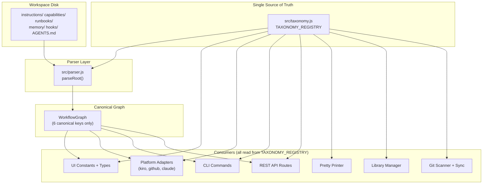
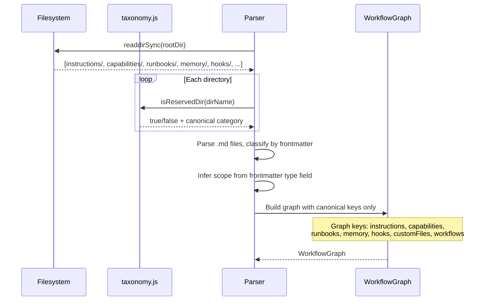
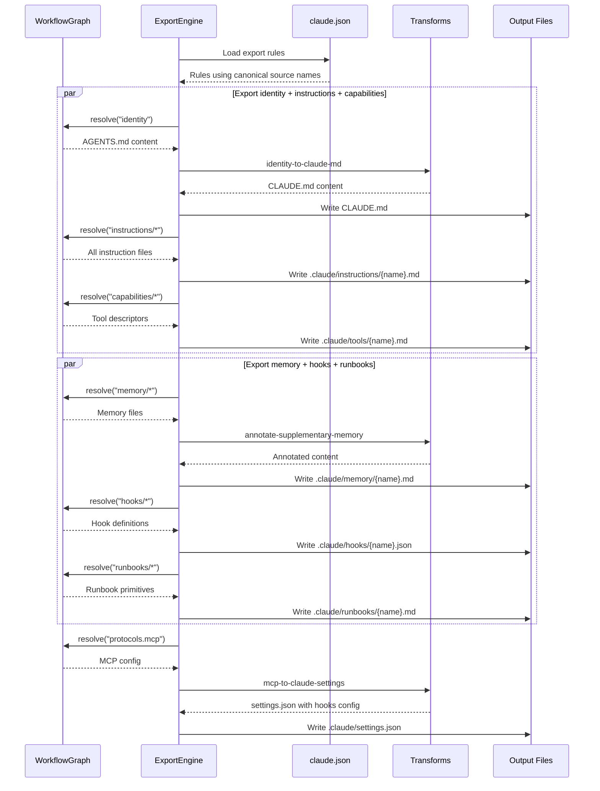

# Design Document: Taxonomy Consolidation

## Overview

AgentFlow currently has 11+ resource categories (tools, skills, interactions, templates, memory, steering, hooks, workflows, identity, protocols, customFiles) that grew organically and now overlap. This feature performs a clean-break consolidation into 6 umbrella categories with no backward compatibility — old directory names stop working, old code paths are removed, and the codebase gets simpler.

The critical naming issue: "workflows" as an umbrella name collides with AgentFlow's core workflow concept (the directed graphs of nodes). We rename the umbrella to **"runbooks"** — a term that means "executable procedures" without conflicting with the internal workflow engine. Runbooks contain what were previously called workflows, interactions, and templates — all things the agent executes.

The consolidation:

| New Category | Absorbs | Scope Differentiation (frontmatter) |
|---|---|---|
| **instructions** | skills + steering | `scope: workflow` vs `scope: global` |
| **capabilities** | tools + protocols | `scope: descriptor` vs `scope: config` |
| **runbooks** | interactions + templates + (workflow primitives) | `scope: interaction` / `scope: condition` / `scope: step` |
| **memory** | memory | unchanged |
| **hooks** | hooks | unchanged |
| **identity** | AGENTS.md | unchanged, singular top-level file |

Key design constraints: DRY (single taxonomy config drives everything), extensibility (new sub-types via frontmatter only), parallel execution where possible, every file exported (no silent drops), open-source compatible, and platform-native memory preference for adapters.

## Architecture



## Sequence Diagrams

### Parsing with New Taxonomy



### Platform Export (Claude Code)



## Components and Interfaces

### Component 1: Taxonomy Registry (`src/taxonomy.js`)

**Purpose**: Single source of truth for all category definitions. Every other module imports from here — parser, UI, CLI, transport, git, library, pretty-printer. Adding a new sub-type means adding one entry here and a frontmatter `scope` value. No other code changes needed.

```javascript
// src/taxonomy.js — THE single source of truth (~80 lines)

const TAXONOMY_REGISTRY = {
  instructions: {
    label: 'Instruction',
    pluralLabel: 'Instructions',
    dir: 'instructions',
    resourceType: 'instruction',
    scopes: {
      workflow: { label: 'Skill', description: 'Reusable instruction set for workflow nodes' },
      global:  { label: 'Steering', description: 'Persistent project-level instruction' },
    },
    defaultScope: 'workflow',
  },
  capabilities: {
    label: 'Capability',
    pluralLabel: 'Capabilities',
    dir: 'capabilities',
    resourceType: 'capability',
    scopes: {
      descriptor: { label: 'Tool', description: 'MCP/builtin/script tool descriptor' },
      config:     { label: 'Protocol', description: 'Protocol configuration' },
    },
    defaultScope: 'descriptor',
  },
  runbooks: {
    label: 'Runbook',
    pluralLabel: 'Runbooks',
    dir: 'runbooks',
    resourceType: 'runbook',
    scopes: {
      interaction: { label: 'Interaction', description: 'Human-in-the-loop pause point' },
      condition:   { label: 'Condition', description: 'Routing condition check' },
    },
    defaultScope: 'interaction',
  },
  memory: {
    label: 'Memory',
    pluralLabel: 'Memory',
    dir: 'memory',
    resourceType: 'memory',
    scopes: {},
    defaultScope: null,
  },
  hooks: {
    label: 'Hook',
    pluralLabel: 'Hooks',
    dir: 'hooks',
    resourceType: 'hook',
    scopes: {},
    defaultScope: null,
  },
};

// Derived constants (computed once at module load)
const CANONICAL_CATEGORIES = Object.keys(TAXONOMY_REGISTRY);
const RESERVED_DIRS = CANONICAL_CATEGORIES.map(k => TAXONOMY_REGISTRY[k].dir);
const DIR_TO_CATEGORY = Object.fromEntries(
  CANONICAL_CATEGORIES.map(k => [TAXONOMY_REGISTRY[k].dir, k])
);
const RESOURCE_TYPE_MAP = Object.fromEntries(
  CANONICAL_CATEGORIES.map(k => [TAXONOMY_REGISTRY[k].dir, TAXONOMY_REGISTRY[k].resourceType])
);

function getCategory(name) { return TAXONOMY_REGISTRY[name] || null; }
function getCategoryByDir(dirName) { return TAXONOMY_REGISTRY[DIR_TO_CATEGORY[dirName]] || null; }
function isReservedDir(dirName) { return RESERVED_DIRS.includes(dirName); }
function inferScope(frontmatter, categoryName) { /* see algorithm below */ }

module.exports = {
  TAXONOMY_REGISTRY, CANONICAL_CATEGORIES, RESERVED_DIRS,
  DIR_TO_CATEGORY, RESOURCE_TYPE_MAP,
  getCategory, getCategoryByDir, isReservedDir, inferScope,
};
```

**Responsibilities**:
- Define all category metadata in one place
- Provide lookup functions used by every consumer
- Derive RESERVED_DIRS, type maps, etc. automatically
- Support scope inference from frontmatter for sub-categorization

### Component 2: Updated Parser (`src/parser.js`)

**Purpose**: Imports taxonomy constants instead of hardcoding them. Outputs WorkflowGraph with canonical keys only (no legacy keys).

**Interface changes**:
```javascript
// BEFORE (hardcoded)
const RESERVED_DIRS = ['tools', 'skills', 'interactions', 'templates', 'memory', 'steering'];
const RESERVED_DIR_TYPE_MAP = { tools: 'tool', skills: 'skill', ... };

// AFTER (imported from taxonomy.js)
const { RESERVED_DIRS, RESOURCE_TYPE_MAP, inferScope, DIR_TO_CATEGORY } = require('./taxonomy');
```

**WorkflowGraph output shape (clean break)**:
```javascript
{
  rootDir: string,
  descriptorFile: ParsedFile | null,
  instructions: Record<string, TaxonomyEntry>,  // was skills + steering
  capabilities: Record<string, TaxonomyEntry>,  // was tools + protocols
  runbooks: Record<string, TaxonomyEntry>,       // was interactions + templates
  memory: Record<string, ParsedFile>,
  hooks: Record<string, unknown>,
  customFiles: Record<string, ParsedFile>,
  workflows: Record<string, WorkflowDef>,        // internal workflow graphs (unchanged)
  allFiles: ParsedFile[],
}
```

### Component 3: Updated UI Types and Constants

**Purpose**: Replace old category types and constants with canonical ones.

```typescript
// ui/src/types.ts — CLEAN BREAK
export type ResourceCategory =
  | 'instructions' | 'capabilities' | 'runbooks'
  | 'memory' | 'hooks' | 'customFiles'

// ui/src/constants.ts — CATEGORIES object rebuilt from taxonomy
// Only 6 entries: instructions, capabilities, runbooks, memory, hooks, customFiles
// Old entries (tools, skills, steering, interactions, templates) REMOVED
```

### Component 4: Claude Code Platform Adapter (`src/transport/platforms/claude.json`)

**Purpose**: New platform config for Claude Code / OpenClaude export/import.

```json
{
  "name": "claude",
  "displayName": "Claude Code",
  "version": "1.0.0",
  "capabilities": ["export", "import"],
  "memoryHandling": "prefer-native",
  "exportRules": [
    { "source": "identity", "target": "CLAUDE.md", "type": "single-file",
      "transform": "identity-to-claude-md" },
    { "source": "protocols.mcp", "target": ".claude/settings.json", "type": "single-file",
      "transform": "mcp-to-claude-settings" },
    { "source": "instructions/*", "target": ".claude/instructions/{name}.md", "type": "glob-copy",
      "transform": "markdown-passthrough" },
    { "source": "capabilities/*", "target": ".claude/tools/{name}.md", "type": "glob-copy",
      "transform": "markdown-passthrough" },
    { "source": "runbooks/*", "target": ".claude/runbooks/{name}.md", "type": "glob-copy",
      "transform": "markdown-passthrough" },
    { "source": "memory/*", "target": ".claude/memory/{name}.md", "type": "glob-copy",
      "transform": "annotate-supplementary-memory" },
    { "source": "hooks/*", "target": ".claude/hooks/{name}.json", "type": "glob-copy",
      "transform": "json-passthrough" },
    { "source": "customFiles", "target": ".claude/custom/{name}", "type": "glob-copy",
      "transform": "markdown-passthrough" }
  ],
  "importRules": [
    { "source": "CLAUDE.md", "target": "AGENTS.md", "type": "single-file",
      "transform": "claude-md-to-identity" },
    { "source": ".claude/settings.json", "target": ".agentflow/mcp.json", "type": "single-file",
      "transform": "claude-settings-to-mcp" },
    { "source": ".claude/instructions/*.md", "target": "instructions/{name}.md", "type": "glob-copy",
      "transform": "markdown-passthrough" },
    { "source": ".claude/tools/*.md", "target": "capabilities/{name}.md", "type": "glob-copy",
      "transform": "markdown-passthrough" },
    { "source": ".claude/runbooks/*.md", "target": "runbooks/{name}.md", "type": "glob-copy",
      "transform": "markdown-passthrough" },
    { "source": ".claude/memory/*.md", "target": "memory/{name}.md", "type": "glob-copy",
      "transform": "strip-supplementary-annotation" },
    { "source": ".claude/hooks/*.json", "target": "hooks/{name}.json", "type": "glob-copy",
      "transform": "json-passthrough" }
  ]
}
```

### Component 5: New Transforms for Claude Code

**Purpose**: Transform functions for Claude Code platform adapter.

```javascript
// Added to src/transport/transforms.js

function identityToClaudeMd(agentsMd) {
  // Strip YAML frontmatter, output as CLAUDE.md (plain markdown instructions)
}

function claudeMdToIdentity(claudeMd) {
  // Wrap plain markdown in AGENTS.md frontmatter format
}

function mcpToClaudeSettings(protocolsData) {
  // Convert protocols.json → .claude/settings.json format
  // Include hooks config section for OpenClaude compatibility
}

function claudeSettingsToMcp(settingsJson) {
  // Extract mcpServers from .claude/settings.json → protocols format
}

function annotateSupplementaryMemory(content) {
  // Prepend annotation: "This platform has native memory. These files are supplementary."
}

function stripSupplementaryAnnotation(content) {
  // Remove the supplementary annotation on import
}
```

## Data Models

### TaxonomyEntry (extended ParsedFile)

```typescript
interface TaxonomyEntry extends ParsedFile {
  /** Sub-category scope within the umbrella (e.g. 'workflow', 'global', 'descriptor') */
  scope: string
}
```

**Validation Rules**:
- `scope` must be a valid scope for the entry's parent category (defined in TAXONOMY_REGISTRY)
- If frontmatter has no explicit `scope`, it is inferred from the `type` field or defaults to the category's `defaultScope`

### Updated WorkflowGraph (clean break)

```typescript
interface WorkflowGraph {
  rootDir: string
  descriptorFile?: ParsedFile

  // Canonical categories only — no legacy keys
  instructions: Record<string, TaxonomyEntry>
  capabilities: Record<string, TaxonomyEntry>
  runbooks: Record<string, TaxonomyEntry>
  memory: Record<string, ParsedFile>
  hooks: Record<string, unknown>
  customFiles: Record<string, ParsedFile>

  // Workflow graphs (internal engine concept, NOT the "runbooks" category)
  workflows: Record<string, WorkflowDef>
  allFiles: ParsedFile[]
}
```

### Updated ResourceCategory Type

```typescript
type ResourceCategory =
  | 'instructions' | 'capabilities' | 'runbooks'
  | 'memory' | 'hooks' | 'customFiles'
```

### New Directory Structure

```
.agentflow/
  AGENTS.md                        ← Identity (Layer 0)
  .agentflow/                      ← Config dir
    mcp.json
    protocols.json
  instructions/                    ← Was: skills/ + steering/
    code-search.md                   scope: workflow (was skill)
    implementation.md                scope: workflow (was skill)
    coding-standards.md              scope: global (was steering)
  capabilities/                    ← Was: tools/
    read-code.md                     scope: descriptor
    source-agent.md                  scope: descriptor
  runbooks/                        ← Was: interactions/ + templates/
    checkpoint.md                    scope: interaction
    design-approved.md               scope: condition
  memory/                          ← Unchanged
    decisions.md
    lessons.md
  hooks/                           ← Unchanged
    on-file-edit.json
  <workflow-name>/                 ← Workflow graphs (unchanged structure)
    AGENTS.md
    <node>/SKILL.md
```

### Updated Platform Adapter Configs

All three platform configs (kiro.json, github.json, claude.json) use canonical source names:

```
source: "instructions/*"   (was: "skills/*" + "steering/*")
source: "capabilities/*"   (was: "tools/*")
source: "runbooks/*"        (was: "interactions/*" + "templates/*")
source: "memory/*"          (unchanged)
source: "hooks/*"           (unchanged)
source: "identity"          (unchanged)
source: "protocols.mcp"    (unchanged)
source: "customFiles"      (unchanged)
```

## Key Functions with Formal Specifications

### Function 1: inferScope(frontmatter, categoryName)

```javascript
function inferScope(frontmatter, categoryName) {
  const cat = TAXONOMY_REGISTRY[categoryName];
  if (!cat || !cat.scopes || Object.keys(cat.scopes).length === 0) return null;

  // Explicit scope in frontmatter wins
  if (frontmatter.scope && cat.scopes[frontmatter.scope]) return frontmatter.scope;

  // Infer from type field
  if (categoryName === 'instructions') {
    if (frontmatter.inclusion) return 'global';  // steering marker
    return 'workflow';
  }
  if (categoryName === 'capabilities') {
    if (['builtin', 'script', 'mcp', 'package'].includes(frontmatter.type)) return 'descriptor';
    return 'config';
  }
  if (categoryName === 'runbooks') {
    if (frontmatter.type === 'condition') return 'condition';
    return 'interaction';
  }

  return cat.defaultScope;
}
```

**Preconditions:**
- `frontmatter` is a plain object (may be empty `{}`)
- `categoryName` is a key in TAXONOMY_REGISTRY

**Postconditions:**
- Returns a string that is a valid scope for the given category, or `null` for categories with no scopes
- If `frontmatter.scope` is set and valid, returns it unchanged
- Pure function, no side effects

### Function 2: classifyResource(parsed, dirPath) — updated

```javascript
function classifyResource(parsed, dirPath) {
  const fm = parsed.frontmatter || {};

  // Frontmatter type takes priority (unchanged logic)
  if (fm.type && NODE_TYPE_ALIASES.has(fm.type)) return 'node';

  // Check if parent dir is a reserved (canonical) directory
  const parentDir = path.basename(dirPath);
  if (isReservedDir(parentDir)) {
    return RESOURCE_TYPE_MAP[parentDir] || 'untyped';
  }

  return null;
}
```

**Preconditions:**
- `parsed` is a ParsedFile with frontmatter
- `dirPath` is the absolute path to the file's parent directory

**Postconditions:**
- Returns a resourceType string from RESOURCE_TYPE_MAP, 'node', or null
- Only recognizes canonical directory names (instructions, capabilities, runbooks, memory, hooks)

### Function 3: buildCanonicalGraph(categorizedFiles, hooks, workflows)

```javascript
function buildCanonicalGraph(categorizedFiles, hooks, workflows, descriptorFile, allFiles) {
  // categorizedFiles: { instructions: {}, capabilities: {}, runbooks: {}, memory: {}, customFiles: {} }
  // Each entry in instructions/capabilities/runbooks has .scope set
  return {
    rootDir,
    descriptorFile,
    instructions: categorizedFiles.instructions,
    capabilities: categorizedFiles.capabilities,
    runbooks: categorizedFiles.runbooks,
    memory: categorizedFiles.memory,
    hooks,
    customFiles: categorizedFiles.customFiles,
    workflows,
    allFiles,
  };
}
```

**Preconditions:**
- All category records are `Record<string, ParsedFile | TaxonomyEntry>`
- No duplicate keys within any single category

**Postconditions:**
- Every file from allFiles appears in exactly one category or in workflows
- `Object.keys(result.instructions).length + Object.keys(result.capabilities).length + Object.keys(result.runbooks).length + Object.keys(result.memory).length + Object.keys(result.customFiles).length + workflowFileCount === allFiles.length`

### Function 4: resolveGraphSource(graph, source) — updated

```javascript
function resolveGraphSource(graph, source) {
  if (source === 'identity') return graph.descriptorFile || null;
  if (source === 'protocols.mcp') return graph.protocols?.mcp || null;

  const globMatch = source.match(/^(\w+)\/\*$/);
  if (globMatch) {
    const section = globMatch[1];
    const data = graph[section];
    return data && typeof data === 'object' && Object.keys(data).length > 0 ? data : null;
  }

  if (source === 'customFiles') return graph.customFiles || null;
  return null;
}
```

**Preconditions:**
- `graph` is a WorkflowGraph with canonical keys
- `source` is a string from a platform config export rule

**Postconditions:**
- Returns the matching data from the graph, or null
- Understands canonical category names: instructions, capabilities, runbooks, memory, hooks

## Algorithmic Pseudocode

### Main Algorithm: Taxonomy-Aware Parsing (Clean Break)

```pascal
ALGORITHM parseRootWithTaxonomy(rootDir, mode)
INPUT: rootDir (absolute path), mode ('full' | 'metadata-only')
OUTPUT: WorkflowGraph with canonical categories only

BEGIN
  IMPORT { RESERVED_DIRS, DIR_TO_CATEGORY, inferScope } FROM taxonomy

  // Step 1: Glob all markdown files
  mdPaths ← glob('**/*.md', rootDir, exclude=['node_modules', '.git', 'output'])

  // Step 2: Parse each file
  allFiles ← []
  FOR EACH relPath IN mdPaths DO
    parsed ← parseMarkdownFile(join(rootDir, relPath), mode)
    parsed.relativePath ← relPath
    allFiles.add(parsed)
  END FOR

  // Step 3: Classify into canonical categories
  categorized ← { instructions: {}, capabilities: {}, runbooks: {}, memory: {}, customFiles: {} }
  workflowDirs ← []

  FOR EACH parsed IN allFiles DO
    parentDir ← firstSegment(parsed.relativePath)

    IF parentDir IN RESERVED_DIRS THEN
      categoryName ← DIR_TO_CATEGORY[parentDir]
      key ← resourceKey(parsed)
      parsed.scope ← inferScope(parsed.frontmatter, categoryName)
      categorized[categoryName][key] ← parsed
    ELSE IF isWorkflowDir(parentDir, rootDir) THEN
      workflowDirs.add(parentDir)
    ELSE IF parsed.relativePath = 'AGENTS.md' THEN
      descriptorFile ← parsed
    ELSE
      categorized.customFiles[key] ← parsed
    END IF
  END FOR

  // Step 4: Parse workflow graphs (unchanged logic)
  workflows ← {}
  FOR EACH wfDir IN workflowDirs DO
    workflows[wfDir] ← parseWorkflow(join(rootDir, wfDir), mode)
  END FOR

  // Step 5: Load hooks (JSON files from hooks/)
  hooks ← loadHooksDir(join(rootDir, 'hooks'))

  // Step 6: Build and return canonical graph
  RETURN buildCanonicalGraph(categorized, hooks, workflows, descriptorFile, allFiles)
END
```

### Algorithm: Scope Inference

```pascal
ALGORITHM inferScope(frontmatter, categoryName)
INPUT: frontmatter (object), categoryName (string)
OUTPUT: scope string or null

BEGIN
  cat ← TAXONOMY_REGISTRY[categoryName]
  IF cat IS NULL OR cat.scopes IS EMPTY THEN
    RETURN null
  END IF

  // Explicit scope wins
  IF frontmatter.scope IS NOT NULL AND frontmatter.scope IN cat.scopes THEN
    RETURN frontmatter.scope
  END IF

  // Infer from frontmatter fields
  SWITCH categoryName
    CASE 'instructions':
      IF frontmatter.inclusion IS NOT NULL THEN RETURN 'global'
      RETURN 'workflow'

    CASE 'capabilities':
      IF frontmatter.type IN ['builtin', 'script', 'mcp', 'package'] THEN RETURN 'descriptor'
      RETURN 'config'

    CASE 'runbooks':
      IF frontmatter.type = 'condition' THEN RETURN 'condition'
      RETURN 'interaction'
  END SWITCH

  RETURN cat.defaultScope
END
```

### Algorithm: Complete Export Verification

```pascal
ALGORITHM verifyCompleteExport(graph, platformConfig)
INPUT: graph (WorkflowGraph), platformConfig (platform JSON)
OUTPUT: { complete: boolean, missing: string[] }

BEGIN
  // Collect all resource keys from graph
  allKeys ← {}
  FOR EACH category IN ['instructions', 'capabilities', 'runbooks', 'memory', 'hooks', 'customFiles'] DO
    FOR EACH key IN keys(graph[category]) DO
      allKeys.add(category + '/' + key)
    END FOR
  END FOR
  IF graph.descriptorFile THEN allKeys.add('identity')

  // Check which keys are covered by export rules
  coveredKeys ← {}
  FOR EACH rule IN platformConfig.exportRules DO
    sourceData ← resolveGraphSource(graph, rule.source)
    IF sourceData IS NOT NULL THEN
      IF rule.type = 'single-file' THEN
        coveredKeys.add(rule.source)
      ELSE
        FOR EACH key IN keys(sourceData) DO
          section ← rule.source.replace('/*', '')
          coveredKeys.add(section + '/' + key)
        END FOR
      END IF
    END IF
  END FOR

  missing ← allKeys - coveredKeys
  RETURN { complete: length(missing) = 0, missing: toArray(missing) }
END
```

## Example Usage

### New workspace layout

```
.agentflow/
  AGENTS.md
  .agentflow/
    mcp.json
    protocols.json
  instructions/
    code-search.md          # scope: workflow
    implementation.md        # scope: workflow
    coding-standards.md      # scope: global (has inclusion: auto in frontmatter)
  capabilities/
    read-code.md             # scope: descriptor (type: builtin)
    source-agent.md          # scope: descriptor (type: mcp)
  runbooks/
    checkpoint.md            # scope: interaction (type: approval)
    design-approved.md       # scope: condition (type: condition)
  memory/
    decisions.md
    lessons.md
  hooks/
    on-file-edit.json
  build-feature/
    AGENTS.md
    gather-requirements/
      SKILL.md
```

### Parser output

```javascript
const graph = parseRoot('/path/to/.agentflow');

// Canonical access only
graph.instructions['code-search']       // { scope: 'workflow', ... }
graph.instructions['coding-standards']  // { scope: 'global', ... }
graph.capabilities['read-code']         // { scope: 'descriptor', ... }
graph.runbooks['checkpoint']            // { scope: 'interaction', ... }
graph.runbooks['design-approved']       // { scope: 'condition', ... }

// NO legacy accessors — clean break
graph.tools       // undefined
graph.skills      // undefined
graph.steering    // undefined
```

### CLI commands

```bash
# Init creates canonical directories
$ agentflow init .agentflow
# Creates: instructions/, capabilities/, runbooks/, memory/, hooks/, AGENTS.md

# Stats show canonical categories
$ agentflow stats .agentflow
# Instructions: 3 (2 workflow, 1 global)
# Capabilities: 2 (2 descriptors)
# Runbooks: 2 (1 interaction, 1 condition)
# Memory: 2
# Hooks: 1

# Export to Claude Code
$ agentflow export --format platform --platform claude .agentflow
# Output:
#   CLAUDE.md
#   .claude/settings.json
#   .claude/instructions/code-search.md
#   .claude/instructions/coding-standards.md
#   .claude/tools/read-code.md
#   .claude/tools/source-agent.md
#   .claude/runbooks/checkpoint.md
#   .claude/runbooks/design-approved.md
#   .claude/memory/decisions.md  (annotated: supplementary)
#   .claude/memory/lessons.md    (annotated: supplementary)
#   .claude/hooks/on-file-edit.json
```

### Reference syntax (updated)

```markdown
{{instructions/code-search}}                          → mention
{{capabilities/read-code}}                            → mention
{{runbooks/checkpoint}}                               → mention
{{-> nodes/create-design}}                            → edge (unchanged)
{{-> nodes/plan-tasks | runbooks/design-approved}}    → conditional edge
{{<< output.gather-requirements}}                     → data flow (unchanged)
```

## Correctness Properties

1. **Single source of truth**: Every module that needs category names, directory names, resource types, or scope definitions imports from `src/taxonomy.js`. No hardcoded category arrays exist anywhere else in the codebase.

2. **No file loss**: For any workspace directory, `parseRoot(dir)` produces a graph where every `.md` file under `rootDir` appears in exactly one canonical category, in `customFiles`, or as part of a workflow node. `|allFiles| === sum of all category entries + workflow node files + descriptor files`.

3. **Scope correctness**: For every entry in `instructions`, `capabilities`, or `runbooks`, the `.scope` field is a valid scope defined in `TAXONOMY_REGISTRY[category].scopes`. Categories without scopes (memory, hooks) have `scope === null`.

4. **Idempotent scope inference**: `inferScope(frontmatter, cat)` is a pure function. Calling it twice with the same inputs returns the same result.

5. **Complete export**: For every platform config (kiro, github, claude), `verifyCompleteExport(graph, config)` returns `{ complete: true }`. Every resource in the graph has a matching export rule. No files are silently dropped.

6. **Round-trip fidelity**: Exporting a workspace to any platform and importing it back produces a graph where all resources are present with correct canonical categories and scopes.

7. **Extensibility**: Adding a new scope to an existing category requires only adding an entry to `TAXONOMY_REGISTRY[category].scopes` and supporting the new frontmatter value. No code changes in parser, UI, CLI, or transport.

8. **Reference resolution**: All `{{category/name}}` references in SKILL.md files resolve correctly using canonical category names. The parser's ref extraction handles `instructions/`, `capabilities/`, `runbooks/` prefixes.

9. **Platform memory preference**: When exporting to a platform with `memoryHandling: 'prefer-native'`, memory files are annotated as supplementary. The annotation is stripped on import.

10. **No naming collision**: The term "workflows" in `WorkflowGraph.workflows` refers exclusively to the internal directed graph engine. The umbrella category for executable procedures is "runbooks" — no ambiguity.

## Error Handling

### Error Scenario 1: Duplicate Resource Names Within a Category

**Condition**: Two files in `instructions/` have the same `name` frontmatter field.
**Response**: Parser emits a warning: `"Duplicate resource name 'X' in instructions/. Using first encountered."` First file wins (alphabetical order).
**Recovery**: User renames one of the files.

### Error Scenario 2: Old Directory Names Present

**Condition**: Workspace has `tools/` or `skills/` directories (old names).
**Response**: Parser ignores them — they are not in RESERVED_DIRS. Files fall into `customFiles`. CLI `validate` command emits a warning: `"Unrecognized directory 'tools/' — did you mean 'capabilities/'? Run 'agentflow migrate' to update."`.
**Recovery**: User renames directories or runs migration utility.

### Error Scenario 3: Missing Scope in Frontmatter

**Condition**: A file in `instructions/` has no `scope` field and no `inclusion` field.
**Response**: `inferScope()` returns the category's `defaultScope` (e.g., 'workflow' for instructions). No error — this is the expected default behavior.
**Recovery**: None needed.

### Error Scenario 4: Platform Config Missing Export Rule

**Condition**: A platform JSON config doesn't cover `runbooks/*`.
**Response**: `verifyCompleteExport()` returns `{ complete: false, missing: [...] }`. Export emits warnings for each unmapped resource but does not fail.
**Recovery**: Platform config author adds the missing rule.

### Error Scenario 5: Memory Export to Platform with Native Memory

**Condition**: Exporting to Claude Code (memoryHandling: 'prefer-native').
**Response**: Memory files are exported with annotation comment: `<!-- AgentFlow supplementary memory. This platform has native memory. Adjust prompts as needed. -->`. Export log notes: `"Memory exported as supplementary for Claude Code."`.
**Recovery**: User reviews and adjusts memory prompts for the target platform.

## Testing Strategy

### Unit Testing Approach

- `src/taxonomy.js`: Test all registry lookups, scope inference for every category/type combination, derived constants correctness
- `src/parser.js`: Test `parseRoot()` with canonical directory names only. Verify graph has canonical keys, no legacy keys. Test scope inference integration. Test that old directory names fall to customFiles.
- `src/transport/utils.js`: Test `resolveGraphSource()` with canonical names
- `src/transport/transforms.js`: Test all new Claude Code transforms (identity-to-claude-md, mcp-to-claude-settings, annotate-supplementary-memory, etc.)
- `ui/src/constants.ts`: Test that CATEGORIES has exactly 6 entries matching TAXONOMY_REGISTRY
- `ui/src/utils/buildExplorerSections.ts`: Test explorer sections use canonical categories

### Property-Based Testing Approach

**Property Test Library**: fast-check

- **Scope inference determinism**: For any randomly generated frontmatter object and valid category name, `inferScope` returns a consistent result
- **No file loss**: For any randomly generated workspace file tree with canonical directories, `parseRoot` accounts for every file
- **Registry consistency**: For every category in TAXONOMY_REGISTRY, `DIR_TO_CATEGORY[cat.dir]` maps back to the category name

### Integration Testing Approach

- End-to-end: Parse example workspace (migrated to canonical dirs) → export to each platform → verify all files present
- Round-trip: Parse → export to Claude → import back → verify graph equality
- Claude Code specific: Verify CLAUDE.md content, .claude/settings.json structure, memory annotation
- CLI: Test `init`, `validate`, `export`, `stats` commands with canonical directories
- Migration: Test that a workspace with old directory names produces appropriate warnings

## Performance Considerations

- Taxonomy registry is a static object — O(1) lookups, loaded once at module init
- Scope inference is a simple switch/if chain — O(1) per file
- No additional filesystem operations beyond existing parsing
- Removing legacy compatibility code actually simplifies and slightly speeds up parsing (fewer branches)

## Security Considerations

- No new attack surface — taxonomy consolidation is a naming/grouping change
- Path traversal protection unchanged
- Platform export configs are static JSON
- Memory annotation is a static string, not user-controlled
- Claude Code settings.json export must not leak sensitive MCP server credentials — transform strips auth tokens

## Dependencies

- No new external dependencies
- `src/taxonomy.js` is a pure utility module with zero imports
- `claude.json` follows the same schema as existing platform configs
- New transforms in `transforms.js` use only existing dependencies (js-yaml, gray-matter)
- UI changes are replacements, not additions — net reduction in CATEGORIES entries

## Affected Files (Complete List)

Every file that must be modified, grouped by change type:

### New Files
1. `src/taxonomy.js` — Single source of truth for taxonomy registry
2. `src/transport/platforms/claude.json` — Claude Code platform adapter config
3. `docs/taxonomy-reference.md` — Taxonomy reference documentation

### Core Parser/Engine Changes
4. `src/parser.js` — Replace hardcoded RESERVED_DIRS/RESERVED_DIR_TYPE_MAP with taxonomy imports
5. `src/pretty-printer.js` — Replace hardcoded categories array with taxonomy imports
6. `src/library.js` — Replace DIR_TYPE_MAP and typeToDir with taxonomy imports
7. `src/transport/utils.js` — Update resolveGraphSource for canonical names
8. `src/transport/transforms.js` — Add Claude Code transforms
9. `src/cli.js` — Update init dirs, add command types, stats display, library commands

### UI Changes
10. `ui/src/types.ts` — Replace ResourceCategory union type, update WorkflowGraph interface
11. `ui/src/constants.ts` — Replace CATEGORIES object, update SIDEBAR_SECTIONS
12. `ui/src/utils/buildExplorerSections.ts` — Replace RESOURCE_CATEGORIES array

### Backend Service Changes
13. `agentflow/src/services/workflow-service.js` — Replace RESERVED set and dirTypeMap
14. `agentflow/src/services/export-service.js` — Replace hardcoded category list in buildGraphSummary and filteredMap
15. `agentflow/src/services/steering-manager.js` — Rename to instruction-manager.js, update dir from 'steering' to 'instructions'
16. `agentflow/src/routes/steering-routes.js` — Rename to instruction-routes.js, update endpoints

### Git Integration Changes
17. `src/git/repo-scanner.js` — Replace RESERVED_DIRS with taxonomy imports
18. `src/git/sync-engine.js` — Replace RESOURCE_TYPE_DIRS with taxonomy imports

### Transport Platform Configs
19. `src/transport/platforms/kiro.json` — Update source names to canonical categories
20. `src/transport/platforms/github.json` — Update source names to canonical categories

### Documentation
21. `docs/authoring-guide.md` — Update directory layout, resource definitions, reference syntax
22. `docs/authoring-cheatsheet.md` — Update structure and reference syntax

### Examples
23. `examples/.agentflow/` — Rename directories: tools→capabilities, skills+steering→instructions, interactions+templates→runbooks
