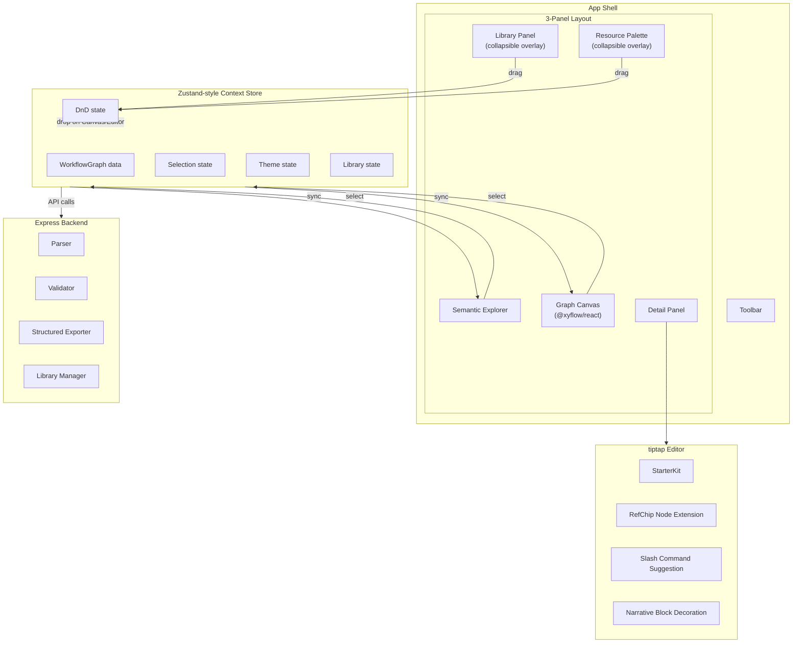

# Design Document: UI Overhaul

## Overview

This design covers a comprehensive UI overhaul of the AgentFlow v2 React/TypeScript SPA. The overhaul transforms the current interface into a minimal, Notion-like aesthetic while adding significant new capabilities: semantic explorer grouping, interactive ref chip rendering in the tiptap editor, slash command palette, bidirectional graph-explorer sync, drag-and-drop edge creation, a library panel, structured export, resource palette with IO compatibility checking, narrative ref composition, full theme support, and an editor/preview toggle.

The overhaul is additive — the existing data model (`WorkflowGraph`, `ParsedFile`, `NodeDef`, `EdgeDef`, etc.), parser, validator, and backend API remain the foundation. Changes are concentrated in the UI layer (`ui/src/`) with targeted backend additions for structured export and library endpoints.

### Key Design Decisions

- **tiptap custom extensions** — A `RefChipNode` (Node extension) renders `{{ref}}` tokens as interactive inline chips. A `SlashCommandSuggestion` (Suggestion plugin) replaces the current manual overlay.
- **@dnd-kit** — Unified drag-and-drop library for Library Panel, Resource Palette, narrative composition, and edge creation interactions.
- **Tailwind v4 CSS variables** — Theme tokens defined as CSS custom properties, toggled via `class` strategy on `<html>`. Three modes: light, dark, system-auto.
- **Inter font** via `@fontsource/inter`.
- **Lucide icons** replacing emoji strings in `CATEGORY_CONFIG`.
- **js-yaml** for YAML serialization in structured export.
- **JSZip** for ZIP download in the UI export flow.

## Architecture

The application retains its 3-panel layout (Explorer | Canvas | Detail) with a top Toolbar. The overhaul introduces new panels (Library, Resource Palette) as overlay/collapsible sidebars and restructures internal component composition.



### Component Hierarchy

```
App
├── ThemeProvider (CSS variable injection, FOUC prevention)
├── StoreProvider (extended with theme, library, DnD state)
├── DndContext (@dnd-kit provider)
├── Toolbar
│   ├── WorkflowSelector
│   ├── ThemeToggle (light/dark/system)
│   ├── LibraryToggle
│   ├── ResourcePaletteToggle
│   ├── VerifyButton
│   ├── ExportButton (structured ZIP / JSON modal)
│   ├── ViewFilter
│   └── Breadcrumbs
├── MainLayout (flex row)
│   ├── LibraryPanel (collapsible, left overlay)
│   ├── SemanticExplorer (fixed 240px left panel)
│   ├── GraphCanvas (flex-1 center)
│   │   ├── StepNode / RouterNode / SubWorkflowNode (updated styling)
│   │   ├── ResourceNode (updated with Lucide icons)
│   │   └── ConditionNode
│   └── DetailPanel (fixed 360px right panel)
│       ├── PanelHeader
│       ├── FrontmatterForm
│       ├── ValidationErrors
│       ├── RefList
│       ├── EditorPreviewToggle
│       ├── TiptapEditor (edit mode)
│       │   ├── RefChipNode (inline node extension)
│       │   ├── SlashCommandPalette (suggestion popup)
│       │   └── NarrativeBlockDecoration (decorations plugin)
│       └── MarkdownPreview (preview mode)
└── ResourcePalette (collapsible, right overlay)
```

## Components and Interfaces

### 1. Theme System

**File:** `ui/src/theme.ts` + inline `<script>` in `index.html`

The theme system uses CSS custom properties defined in Tailwind v4's `@theme` directive. Three modes: `light`, `dark`, `system`.

```typescript
type ThemeMode = 'light' | 'dark' | 'system'

// Resolved to actual light/dark based on OS preference when mode is 'system'
type ResolvedTheme = 'light' | 'dark'

interface ThemeState {
  mode: ThemeMode
  resolved: ResolvedTheme
  setMode: (mode: ThemeMode) => void
}
```

FOUC prevention: A blocking `<script>` in `index.html` reads `localStorage('af-theme')` and sets the `dark` class on `<html>` before first paint.

The `ThemeProvider` component listens to `prefers-color-scheme` media query changes when mode is `system` and updates the resolved theme accordingly.

**CSS Variables (defined in `ui/src/index.css`):**

```css
:root {
  --surface-primary: theme(colors.white);
  --surface-secondary: theme(colors.zinc.50);
  --surface-elevated: theme(colors.white);
  --border-primary: theme(colors.zinc.200 / 60%);
  --text-primary: theme(colors.zinc.900);
  --text-secondary: theme(colors.zinc.500);
  --text-muted: theme(colors.zinc.400);
  --radius-default: 8px;
  --font-body: 'Inter', system-ui, -apple-system, sans-serif;
}

.dark {
  --surface-primary: #191919;
  --surface-secondary: theme(colors.zinc.900);
  --surface-elevated: theme(colors.zinc.800);
  --border-primary: theme(colors.zinc.800 / 60%);
  --text-primary: theme(colors.zinc.100);
  --text-secondary: theme(colors.zinc.400);
  --text-muted: theme(colors.zinc.500);
}
```

### 2. Semantic Explorer Panel

**File:** `ui/src/components/SemanticExplorer.tsx`

Replaces `DirectoryExplorer.tsx`. Derives grouping from `WorkflowGraph` data instead of the filesystem `TreeNode`.

```typescript
interface ExplorerSection {
  key: ResourceCategory | 'workflows' | 'nodes'
  label: string
  icon: LucideIcon
  accentColor: string
  items: ExplorerItem[]
}

interface ExplorerItem {
  id: string           // unique key (e.g., "tools/my-tool" or "wf-id/node-id")
  name: string         // human-readable name from frontmatter/title
  type: 'resource' | 'node' | 'workflow'
  category?: ResourceCategory
  workflowId?: string
}
```

**Derivation logic:** `buildExplorerSections(data: WorkflowGraph, activeWf: string): ExplorerSection[]`
- Iterates `data.tools`, `data.skills`, `data.templates`, `data.interactions`, `data.memory` → resource sections
- Iterates `data.workflows` → workflows section
- Iterates `data.workflows[activeWf].nodes` → nodes section
- Sections with zero items are omitted
- Each section header shows a count badge

### 3. RefChip tiptap Node Extension

**File:** `ui/src/extensions/RefChipExtension.ts`

A custom tiptap `Node` extension that matches `{{...}}` patterns and renders them as inline chip elements.

```typescript
// tiptap Node extension config
const RefChipNode = Node.create({
  name: 'refChip',
  group: 'inline',
  inline: true,
  atom: true,  // non-editable inline block

  addAttributes() {
    return {
      raw: { default: '' },           // full ref string inside {{ }}
      semanticType: { default: 'mention' },  // mention | edge | data_flow
      category: { default: '' },
      refName: { default: '' },
      condition: { default: null },
    }
  },

  // NodeView renders the chip UI
  addNodeView() {
    return ReactNodeViewRenderer(RefChipComponent)
  },

  // Input rule: converts typed {{...}} into refChip nodes
  addInputRules() { ... },

  // Paste rule: converts pasted {{...}} into refChip nodes
  addPasteRules() { ... },
})
```

**RefChipComponent** renders using the existing `CATEGORY_CONFIG` color/icon mapping (updated to Lucide icons). Displays:
- Mention refs: `[icon] name`
- Edge refs: `→ [icon] name`
- Conditional edge refs: `→ [icon] name | condition`
- Data flow refs: `⇠ output.name`

Clicking a chip dispatches `store.select()` to navigate to the referenced resource/node.

### 4. Slash Command Palette

**File:** `ui/src/extensions/SlashCommandExtension.ts`

Uses tiptap's `Suggestion` API (from `@tiptap/suggestion`) to provide a `/` triggered command palette.

```typescript
interface SlashCommand {
  id: string
  title: string
  description: string
  category: 'reference' | 'edge' | 'data-flow'
  icon: LucideIcon
  color: string
  action: (editor: Editor, item?: ResourceItem) => void
}

interface ResourceItem {
  name: string
  category: ResourceCategory
  refSyntax: string  // e.g., "tools/my-tool"
}
```

**Flow:**
1. User types `/` → Suggestion plugin triggers, renders `SlashCommandPalette` component
2. Typing filters commands via fuzzy match on name/category/description
3. Selecting a resource-type command opens a secondary picker listing available items of that type
4. Selecting an item inserts a `refChip` node with the correct attributes
5. Keyboard navigation: Arrow Up/Down, Enter to select, Escape to dismiss

The existing `{{` direct typing is preserved via the `RefChipNode` input rules — power users can still type refs manually.

### 5. Bidirectional Graph-Explorer Sync

**Mechanism:** Both the `SemanticExplorer` and `GraphCanvas` read and write to the shared `Selection` state in the store.

```typescript
// In SemanticExplorer: on item click
const handleItemClick = (item: ExplorerItem) => {
  store.select({
    type: item.type,
    category: item.category,
    key: item.id,
    workflowId: item.workflowId,
  })
}

// In GraphCanvas: react to selection changes
useEffect(() => {
  if (selection && selection.type === 'node') {
    const rfNode = reactFlowInstance.getNode(selection.key)
    if (rfNode) {
      reactFlowInstance.fitView({ nodes: [rfNode], padding: 0.3, duration: 300 })
    }
  }
}, [selection])
```

Explorer → Canvas: `fitView` pans/zooms to center the node, applies a highlight ring via a `selected` data prop on the RF node.

Canvas → Explorer: Explorer component scrolls to and highlights the matching item using a ref-based scroll-into-view.

If the selected explorer item has no corresponding canvas node (standalone resource), the canvas maintains its current viewport.

### 6. Drag-and-Drop Edge Creation

**Mechanism:** Uses `@xyflow/react`'s built-in `onConnect` callback.

```typescript
const onConnect = useCallback(async (connection: Connection) => {
  const sourceNode = data.workflows[activeWf].nodes[connection.source]
  const targetNode = data.workflows[activeWf].nodes[connection.target]
  if (!sourceNode || !targetNode) return

  // Check for duplicate
  const existingEdge = data.workflows[activeWf].edges.find(
    e => e.from === connection.source && e.to === connection.target
  )
  if (existingEdge) {
    showNotification('Duplicate edge — this connection already exists.')
    return
  }

  // Build ref syntax
  const targetCategory = targetNode.nodeType === 'sub-workflow' ? 'workflows' : 'nodes'
  const refSyntax = `{{-> ${targetCategory}/${targetNode.name}}}`

  // Append to source node's primary markdown
  const newContent = sourceNode.primaryFile.rawContent + `\n${refSyntax}\n`
  await store.save(sourceNode.primaryFile.filePath, newContent)
}, [data, activeWf])
```

The canvas always derives edges from parsed `Ref_Token`s in markdown — the visual graph is a projection of the source of truth (markdown content). After saving, `store.reload()` refreshes the graph.

### 7. Library Panel

**File:** `ui/src/components/LibraryPanel.tsx`

A collapsible overlay panel toggled from the Toolbar. Fetches library data from a new `/api/library` endpoint.

```typescript
interface LibraryEntry {
  name: string
  type: string        // 'workflow' | 'tool' | 'skill' | 'template' | 'interaction'
  path: string
  description: string
  tags: string[]
}

interface LibraryState {
  entries: LibraryEntry[]
  searchQuery: string
  loading: boolean
}
```

**API additions:**
```typescript
// api.ts additions
getLibrary: (): Promise<{ entries: LibraryEntry[] }> =>
  request('/library'),

addLibraryItem: (type: string, name: string): Promise<WorkflowGraph> =>
  request('/library/add', {
    method: 'POST',
    headers: { 'Content-Type': 'application/json' },
    body: JSON.stringify({ type, name })
  }),
```

Search uses case-insensitive substring matching on name, description, and tags (matching the existing `library.search()` backend function). Items are draggable via `@dnd-kit` — dropping onto the workspace area triggers `addLibraryItem`.

### 8. CATEGORY_CONFIG Update (Lucide Icons)

**File:** `ui/src/constants.ts` (modified)

Replace emoji `icon` strings with Lucide icon component references:

```typescript
import { Wrench, Brain, Zap, MessageSquare, Database, Box, ArrowUpRight, GitBranch } from 'lucide-react'
import type { LucideIcon } from 'lucide-react'

export const CATEGORY_CONFIG: Record<string, {
  icon: LucideIcon
  label: string
  color: string
  chip: string
}> = {
  tools:        { icon: Wrench,        label: 'Tool',        color: '...', chip: '...' },
  skills:       { icon: Brain,         label: 'Skill',       color: '...', chip: '...' },
  templates:    { icon: Zap,           label: 'Condition',   color: '...', chip: '...' },
  interactions: { icon: MessageSquare, label: 'Interaction', color: '...', chip: '...' },
  memory:       { icon: Database,      label: 'Memory',      color: '...', chip: '...' },
  nodes:        { icon: Box,           label: 'Node',        color: '...', chip: '...' },
  output:       { icon: ArrowUpRight,  label: 'Output',      color: '...', chip: '...' },
  workflows:    { icon: GitBranch,     label: 'Workflow',    color: '...', chip: '...' },
}
```

This single source of truth is consumed by Explorer, Canvas, RefChip, Library Panel, and Resource Palette.

### 9. Structured Export

**Backend:** `src/exporter.js` (extended) + new `src/structured-exporter.js`

```typescript
interface ExportDirectory {
  'graph.yaml': string           // YAML: nodes list, edges with conditions, entry points
  'metadata.yaml': string        // YAML: name, description, exportedAt, version
  'README.md': string            // Generated documentation
  'nodes/': {
    [nodeName: string]: string   // Markdown: resolved content per node
  }
  'resources/': {
    [category: string]: {
      [name: string]: string     // YAML: full resource definition
    }
  }
}
```

**CLI:** `src/cli.js` extended with `--format` flag:
- `--format dir` (default): produces `export/{workflow-name}/` directory
- `--format json`: produces existing flat JSON

**UI:** Export button offers two options:
1. Download as ZIP (uses `JSZip` to bundle the `ExportDirectory` structure)
2. View as JSON in a modal (existing behavior)

Environment variable references (`${env:VAR}`) are preserved as-is in exported content.

### 10. Resource Palette

**File:** `ui/src/components/ResourcePalette.tsx`

A collapsible overlay panel showing all workspace resources as draggable items. Grouped by `ResourceCategory` with the same icon/color scheme as the Explorer.

**IO Contract types:**

```typescript
interface IOContract {
  inputs: string[]    // e.g., ["raw_data", "config"]
  outputs: string[]   // e.g., ["result", "metadata"]
}

interface CompatibilityResult {
  compatible: boolean
  mismatches: string[]  // e.g., ["Node X outputs [result] but Tool Y expects [raw_data]"]
}
```

**Compatibility checking:**
- Parsed from frontmatter `inputs`/`outputs` fields on resources and nodes
- Advisory mode (default): drop succeeds, warning badge shown on mismatch
- Strict mode (opt-in per workflow/node): drop rejected on mismatch with explanation
- Resources without IO contracts skip checking entirely

### 11. Narrative Ref Composition

**Editor integration:**

When a resource is dragged from the Resource Palette onto the Editor (not the canvas), the editor inserts the ref with narrative scaffolding:

```typescript
const DEFAULT_NARRATIVE: Record<string, { prefix: string; suffix: string }> = {
  tools:        { prefix: 'Use ',        suffix: ' to process the input.' },
  skills:       { prefix: 'Apply ',      suffix: ' for this step.' },
  templates:    { prefix: 'Evaluate ',   suffix: ' to determine the path.' },
  interactions: { prefix: 'Engage ',     suffix: ' to gather information.' },
  memory:       { prefix: 'Recall ',     suffix: ' for context.' },
}
```

If the resource declares `narrativeTemplate.prefix` / `narrativeTemplate.suffix` in frontmatter, those override the defaults. Slash command insertion inserts bare refs without narrative scaffolding.

**Narrative Blocks:** A tiptap `Decoration` plugin visually groups paragraphs containing ref chips with subtle background/spacing to show story structure. These are purely visual — the underlying markdown is regular content.

### 12. Editor/Preview Toggle

**File:** `ui/src/components/DetailPanel.tsx` (modified)

```typescript
type EditorMode = 'edit' | 'preview'

// Toggle state lives in DetailPanel local state
const [editorMode, setEditorMode] = useState<EditorMode>('edit')
```

- Edit mode: tiptap editor with RefChips, NarrativeBlocks, slash commands
- Preview mode: `react-markdown` + `remark-gfm` with resolved refs rendered as styled inline elements (reusing RefChip color scheme)
- Toggle via UI button or `Cmd/Ctrl+Shift+P` keyboard shortcut
- Switching to preview renders current editor content without requiring save
- Switching back to edit restores cursor position (stored in a ref)

## Data Models

### Extended Store State

```typescript
// Additions to the existing Store interface

interface Store {
  // ... existing state ...

  // Theme
  themeMode: ThemeMode              // 'light' | 'dark' | 'system'
  resolvedTheme: ResolvedTheme      // 'light' | 'dark'
  setThemeMode: (mode: ThemeMode) => void

  // Library
  libraryEntries: LibraryEntry[]
  librarySearch: string
  libraryLoading: boolean
  setLibrarySearch: (q: string) => void
  loadLibrary: () => Promise<void>
  addFromLibrary: (type: string, name: string) => Promise<void>

  // Panels
  libraryPanelOpen: boolean
  resourcePaletteOpen: boolean
  toggleLibraryPanel: () => void
  toggleResourcePalette: () => void

  // Notifications
  notifications: Notification[]
  showNotification: (msg: string, type?: 'info' | 'warning' | 'error') => void
  dismissNotification: (id: string) => void
}
```

### New Types

```typescript
// IO Contract (parsed from frontmatter)
interface IOContract {
  inputs: string[]
  outputs: string[]
}

// Library entry (from registry)
interface LibraryEntry {
  name: string
  type: string
  path: string
  description: string
  tags: string[]
}

// Narrative template (from frontmatter)
interface NarrativeTemplate {
  prefix: string
  suffix: string
}

// Structured export types
interface StructuredExportOptions {
  workflow: string
  format: 'dir' | 'json'
}

// Notification
interface Notification {
  id: string
  message: string
  type: 'info' | 'warning' | 'error'
  timestamp: number
}
```

### API Additions

```typescript
// New endpoints added to api.ts
getLibrary: () => Promise<{ entries: LibraryEntry[] }>
addLibraryItem: (type: string, name: string) => Promise<WorkflowGraph>
exportStructured: (options: StructuredExportOptions) => Promise<Blob>  // ZIP binary
```

### Backend Additions

- `GET /api/library` — returns indexed library registry
- `POST /api/library/add` — copies library item to workspace, returns updated WorkflowGraph
- `POST /api/export` — extended with `format` query param; `format=dir` returns ZIP, `format=json` returns existing JSON


## Correctness Properties

*A property is a characteristic or behavior that should hold true across all valid executions of a system — essentially, a formal statement about what the system should do. Properties serve as the bridge between human-readable specifications and machine-verifiable correctness guarantees.*

### Property 1: Semantic explorer sections derived from WorkflowGraph

*For any* valid `WorkflowGraph`, the `buildExplorerSections` function shall produce sections whose keys correspond to the non-empty resource categories and workflow/node collections in the graph, with each section's items matching the records in the corresponding `WorkflowGraph` field (e.g., `data.tools`, `data.skills`), and sections with zero items shall be omitted from the output.

**Validates: Requirements 2.1, 2.2, 2.5**

### Property 2: Explorer item names match human-readable titles

*For any* resource in a `WorkflowGraph`, the corresponding `ExplorerItem.name` shall equal the resource's `title` field (derived from frontmatter or parsed heading), not its `filePath` or `relativePath`.

**Validates: Requirements 2.3**

### Property 3: Explorer section count badge accuracy

*For any* `ExplorerSection` produced by `buildExplorerSections`, the section's count badge value shall equal the length of the section's items array.

**Validates: Requirements 2.6**

### Property 4: Ref token to chip node conversion

*For any* markdown string containing one or more valid `{{ref}}` tokens (mention, edge, conditional edge, or data flow), parsing the content into the tiptap document model shall produce one `refChip` node per token, with the chip's `raw` attribute matching the original ref string.

**Validates: Requirements 3.1, 3.7**

### Property 5: Ref chip type indicator rendering

*For any* ref token, the chip rendering shall include the correct type-specific indicator: `→` prefix for Edge_Refs, both target name and condition separated by `|` for Conditional_Edge_Refs, `⇠` prefix for Data_Flow_Refs, and category icon + name for Mention_Refs.

**Validates: Requirements 3.3, 3.4, 3.5**

### Property 6: Ref chip category extraction

*For any* ref token string, the `refCategory` and `refName` functions shall extract the correct category and name, and the chip shall be styled with the accent color from `CATEGORY_CONFIG[category]`.

**Validates: Requirements 3.2**

### Property 7: Ref chip click produces correct Selection

*For any* ref token representing a resource or node, clicking the corresponding `RefChip` shall produce a `Selection` object with the correct `type`, `category`, and `key` fields that identify the referenced entity.

**Validates: Requirements 3.6**

### Property 8: Slash command fuzzy filter

*For any* query string and list of slash commands, the filter function shall return exactly those commands whose name, category, or description fuzzy-match the query, and shall return all commands when the query is empty.

**Validates: Requirements 4.5**

### Property 9: Slash command resource picker lists correct items

*For any* selected resource type command and `WorkflowGraph`, the secondary picker shall list exactly the items from the corresponding resource category in the graph (e.g., selecting "Tool" lists all entries from `data.tools`).

**Validates: Requirements 4.6**

### Property 10: Slash command ref insertion syntax

*For any* resource item selected from the secondary picker, the editor shall insert a `refChip` node whose underlying syntax is `{{category/name}}` where category and name match the selected item.

**Validates: Requirements 4.7**

### Property 11: Explorer-to-canvas selection sync

*For any* `ExplorerItem` that corresponds to a node present on the `GraphCanvas`, selecting that item shall result in the `Selection` state containing the correct node identifier, enabling the canvas to locate and focus the node.

**Validates: Requirements 5.4**

### Property 12: Edge creation ref syntax

*For any* source node and target node in a workflow, creating a connection between them shall produce the ref syntax `{{-> targetCategory/targetName}}` appended to the source node's primary markdown content.

**Validates: Requirements 6.1, 6.2**

### Property 13: Graph edges derive from markdown refs

*For any* `WorkflowDef`, the set of visual edges displayed on the `GraphCanvas` shall be exactly the set of `EdgeDef` objects parsed from `Ref_Token`s in the workflow's node markdown files — no more, no fewer.

**Validates: Requirements 6.4, 6.6**

### Property 14: Duplicate edge prevention

*For any* workflow where an edge from node A to node B already exists, attempting to create another edge from A to B shall be rejected (the edge creation function returns false or throws), and the source node's markdown content shall remain unchanged.

**Validates: Requirements 6.5**

### Property 15: Library search filtering

*For any* query string and library registry, the search function shall return exactly those entries where the name, description, or at least one tag contains the query as a case-insensitive substring, and shall return all entries when the query is empty.

**Validates: Requirements 7.1, 7.2**

### Property 16: CATEGORY_CONFIG uniqueness

*For any* two distinct resource type keys in `CATEGORY_CONFIG`, their `icon` components shall be different, and their `color` class strings shall be different, ensuring visual differentiation across all UI components.

**Validates: Requirements 8.1, 8.2, 8.6, 8.7**

### Property 17: Structured export directory layout

*For any* valid `WorkflowDef`, the structured export shall produce an output containing: a `graph.yaml` file with nodes list, edges, and entry points; a `nodes/` directory with one `.md` file per node; a `resources/` directory with category subdirectories containing `.yaml` files; a `metadata.yaml` file; and a `README.md` file.

**Validates: Requirements 9.1, 9.2, 9.4, 9.8**

### Property 18: Export ref resolution

*For any* node markdown content containing `Ref_Token`s, the exported node `.md` file shall contain the fully resolved content with all `{{ref}}` tokens replaced by their resolved values.

**Validates: Requirements 9.3**

### Property 19: Export resource YAML completeness

*For any* resource in the workspace, the exported YAML file shall contain all frontmatter fields, the description, and (for tools) the parameters — matching the original `ParsedFile` data.

**Validates: Requirements 9.5**

### Property 20: Export preserves environment variable syntax

*For any* content string containing `${env:VAR}` patterns, the export resolution process shall preserve those patterns unchanged in the output, never attempting to resolve them.

**Validates: Requirements 9.9**

### Property 21: Resource drop inserts Mention_Ref

*For any* workspace resource and target node, dropping the resource onto the node shall insert a `{{category/name}}` Mention_Ref into the target node's primary markdown content.

**Validates: Requirements 10.2, 10.3**

### Property 22: Resource move between nodes

*For any* resource currently attached to node A, moving it to node B via drag-and-drop shall remove the corresponding `Mention_Ref` from node A's markdown and insert it into node B's markdown, with both nodes' ref counts adjusting accordingly.

**Validates: Requirements 10.4**

### Property 23: IO contract parsing

*For any* frontmatter object containing `inputs` and `outputs` array fields, the IO contract parser shall produce an `IOContract` with the same input and output string arrays.

**Validates: Requirements 10.5**

### Property 24: Compatibility check correctness

*For any* two `IOContract` objects (source outputs and target inputs), the compatibility check shall report a mismatch for each target input that is not present in the source outputs. In advisory mode, the operation shall succeed with warnings; in strict mode, the operation shall be rejected when any mismatch exists.

**Validates: Requirements 10.6, 10.7, 10.8, 10.10**

### Property 25: Compatibility check mismatch descriptions

*For any* failed compatibility check, the mismatch descriptions shall include the specific field names that are incompatible (e.g., "Node X outputs [result] but Tool Y expects [raw_data]").

**Validates: Requirements 10.9**

### Property 26: Narrative insertion with template resolution

*For any* resource, when inserted via drag-and-drop, the editor shall wrap the `Ref_Token` with the resource's `narrativeTemplate.prefix` and `narrativeTemplate.suffix` if declared in frontmatter, or with the default prefix/suffix for the resource's `ResourceType` if no template is declared.

**Validates: Requirements 11.1, 11.2, 11.3**

### Property 27: Narrative block detection

*For any* markdown document, the narrative block detection function shall identify contiguous paragraph groups that each contain at least one `Ref_Token`, producing `NarrativeBlock` ranges that cover all ref-containing paragraphs.

**Validates: Requirements 11.5**

### Property 28: Slash command insertion omits narrative scaffolding

*For any* resource inserted via the slash command palette (not drag-and-drop), the editor shall insert only the bare `{{category/name}}` ref token without any narrative prefix or suffix text.

**Validates: Requirements 11.8**

### Property 29: Sequential narrative drag insertion

*For any* sequence of N resources dragged onto the editor, the resulting content shall contain N distinct narrative-wrapped ref tokens, each with its own prefix/suffix scaffolding.

**Validates: Requirements 11.10**

### Property 30: Theme persistence round trip

*For any* `ThemeMode` value (light, dark, or system), setting the theme mode shall persist it to localStorage, and loading the app with that persisted value shall resolve to the same theme mode.

**Validates: Requirements 12.3, 12.4**

### Property 31: Dark mode contrast ratio

*For any* category accent color in `CATEGORY_CONFIG` and the dark theme background color (`#191919`), the computed contrast ratio shall be at least 4.5:1, ensuring readability.

**Validates: Requirements 12.12**

### Property 32: Preview mode ref rendering

*For any* markdown content containing `Ref_Token`s, the preview renderer shall produce styled inline elements (not raw `{{}}` text) for each ref, with color coding matching the `CATEGORY_CONFIG` for the ref's category.

**Validates: Requirements 13.3, 13.7**

## Error Handling

### Editor Errors
- **Invalid ref syntax**: If a `{{...}}` token cannot be parsed (unknown category, malformed syntax), the editor renders it as a red-highlighted inline code span with the raw text, allowing the user to fix it.
- **Ref to missing resource**: If a ref points to a resource/node that doesn't exist in the current `WorkflowGraph`, the chip renders with a warning icon and strikethrough name. Clicking it shows a tooltip: "Resource not found."
- **tiptap extension errors**: If the RefChip or SlashCommand extension throws during rendering, the editor falls back to raw text display for that token. Errors are logged to console.

### Drag-and-Drop Errors
- **Drop on invalid target**: If a resource is dropped outside a valid drop zone (not on a node or editor), the operation is silently cancelled with no state change.
- **Library add failure**: If the `/api/library/add` call fails (e.g., name conflict, disk error), a notification is shown with the error message. The workspace state is not modified.
- **Edge creation failure**: If saving the edge ref to markdown fails, a notification is shown and the canvas does not render the edge.

### Export Errors
- **Missing workflow**: If the selected workflow ID doesn't exist, the export returns an error message without producing any files.
- **YAML serialization failure**: If `js-yaml` fails to serialize a resource (e.g., circular reference), the export skips that resource, includes it in an `errors` array in `metadata.yaml`, and continues with the rest.
- **ZIP generation failure**: If `JSZip` fails, the UI shows an error notification and offers the JSON fallback.

### Theme Errors
- **localStorage unavailable**: If localStorage is not accessible (private browsing, quota exceeded), the theme defaults to system mode and the preference is not persisted. No error is shown to the user.
- **Invalid stored value**: If the stored theme mode is not one of `light`, `dark`, `system`, it is treated as `system`.

### Compatibility Check Errors
- **Malformed IO contract**: If frontmatter `inputs`/`outputs` fields are not arrays of strings, the IO contract parser returns `null` and the compatibility check is skipped (treated as no contract).

### API Errors
- All API calls use the existing `request()` wrapper which throws on non-2xx responses. Components display error notifications via the store's `showNotification` method.

## Testing Strategy

### Dual Testing Approach

This feature uses both unit tests and property-based tests for comprehensive coverage:

- **Unit tests**: Verify specific examples, edge cases, integration points, and error conditions
- **Property-based tests**: Verify universal properties across randomly generated inputs

### Property-Based Testing Configuration

- **Library**: `fast-check` (JavaScript/TypeScript PBT library)
- **Minimum iterations**: 100 per property test
- **Tag format**: Each test is tagged with a comment: `// Feature: ui-overhaul, Property {N}: {title}`
- **Each correctness property is implemented by a single property-based test**

### Test Organization

```
tests/
├── unit/
│   ├── semantic-explorer.test.ts      — Explorer section building, item naming
│   ├── ref-chip-parsing.test.ts       — Ref token parsing, chip attribute extraction
│   ├── slash-command-filter.test.ts    — Command filtering, resource picker
│   ├── edge-creation.test.ts          — Edge ref syntax generation, duplicate detection
│   ├── library-search.test.ts         — Library search filtering
│   ├── structured-export.test.ts      — Export directory structure, ref resolution, env var preservation
│   ├── io-compatibility.test.ts       — IO contract parsing, compatibility checking
│   ├── narrative-insertion.test.ts    — Narrative template resolution, block detection
│   ├── theme.test.ts                  — Theme persistence, contrast ratio
│   └── preview-renderer.test.ts       — Preview ref rendering
├── property/
│   ├── explorer-sections.prop.test.ts — Properties 1-3
│   ├── ref-chip.prop.test.ts          — Properties 4-7
│   ├── slash-command.prop.test.ts     — Properties 8-10
│   ├── graph-sync.prop.test.ts        — Property 11
│   ├── edge-creation.prop.test.ts     — Properties 12-14
│   ├── library.prop.test.ts           — Property 15
│   ├── category-config.prop.test.ts   — Property 16
│   ├── export.prop.test.ts            — Properties 17-20
│   ├── resource-palette.prop.test.ts  — Properties 21-25
│   ├── narrative.prop.test.ts         — Properties 26-29
│   ├── theme.prop.test.ts             — Properties 30-31
│   └── preview.prop.test.ts           — Property 32
└── generators/
    ├── workflow-graph.gen.ts           — Random WorkflowGraph generation
    ├── ref-token.gen.ts               — Random ref token string generation
    ├── library-registry.gen.ts        — Random library registry generation
    ├── io-contract.gen.ts             — Random IO contract generation
    └── frontmatter.gen.ts             — Random frontmatter with narrative templates
```

### Unit Test Focus Areas

- Specific examples of each ref type (mention, edge, conditional edge, data flow)
- Edge cases: empty WorkflowGraph, single-node workflows, resources with no frontmatter
- Error conditions: invalid ref syntax, missing resources, malformed IO contracts
- Integration: theme toggle → localStorage → reload cycle
- Integration: export button → ZIP download flow

### Property Test Focus Areas

- Universal properties across all valid WorkflowGraph shapes
- Ref parsing correctness across all ref token formats
- Search/filter correctness across all query strings
- Export structure correctness across all workflow configurations
- Compatibility check correctness across all IO contract combinations
- Narrative template resolution across all resource types
