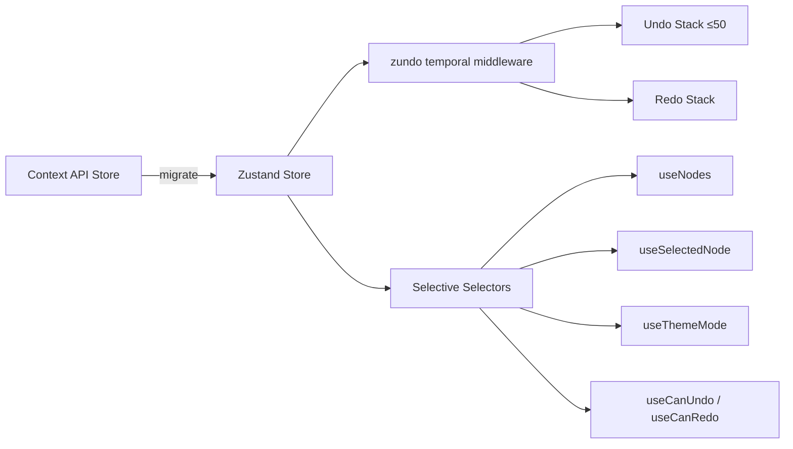

# Design Document: Material Design 3 UI Redesign

## Overview

This design covers the comprehensive UI redesign of the AgentFlow v2 application, migrating from the current Notion-like aesthetic (Inter font, zinc tones, floating panels) to a Material Design 3 visual language. The redesign addresses structural UX issues (floating panel chaos, no undo/redo, sparse toolbar, no command palette) while modernizing the technology stack (Zustand, MUI v6, Framer Motion).

The current application is a React/TypeScript SPA using:
- Context API for state management (`store.tsx` with `StoreProvider`)
- React Flow (`@xyflow/react`) for the graph canvas
- Tiptap for rich-text editing with custom extensions (RefChip, SlashCommand, NarrativeBlock)
- Tailwind CSS for styling with zinc/slate color tokens
- `@dnd-kit` for drag-and-drop
- `react-arborist` for the file tree
- `@fontsource/inter` for typography
- Raw Node.js `http` module + `serve-handler` for the backend

The redesign replaces floating panels with a docked CSS Grid layout, introduces MUI v6 components, migrates state to Zustand with temporal middleware for undo/redo, and applies Material Design 3 tokens (elevation, color roles, shape scale, type scale) throughout.

### Key Design Decisions

1. **MUI v6 as the component foundation**: Rather than building MD3 components from scratch, we adopt MUI v6 which provides MD3-aligned components out of the box. MUI's theming system maps directly to MD3 color roles, elevation tokens, and shape scale. Tailwind CSS is retained only for layout utilities (grid, flex) — all component styling goes through MUI's `sx` prop and theme overrides.

2. **Zustand over Redux/Jotai**: Zustand provides the simplest migration path from the current Context API store. The existing `Store` interface maps almost 1:1 to a Zustand store. The `zundo` middleware provides temporal undo/redo with minimal boilerplate. No provider wrapping needed.

3. **Docked layout via CSS Grid**: The three-zone layout (Explorer | Canvas | Drawer) uses CSS Grid with `grid-template-columns` for predictable, non-overlapping panel positioning. This directly addresses the "floating panel chaos" identified in the critical review.

4. **React Flow retained**: The `@xyflow/react` library is kept for the graph canvas since it handles node positioning, edge routing, viewport controls, and minimap natively. Custom node components are rewritten as Material Design cards.

5. **Framer Motion for MD3 motion**: Material Design 3 specifies container transforms, shared-axis transitions, and emphasis animations. Framer Motion provides the `AnimatePresence`, `layoutId`, and spring physics needed to implement these patterns.

## Architecture

### High-Level Layout

```
┌─────────────────────────────────────────────────────────────┐
│                      Action Bar (56px)                       │
├──────────┬──────────────────────────────┬───────────────────┤
│ Explorer │                              │    Node Drawer    │
│  Panel   │       Graph Canvas           │   (slide-in,     │
│ (280px,  │       (flex-grow)            │    400px)         │
│ collaps- │                              │                   │
│  ible)   │                              │                   │
│          │                    ┌────┐    │                   │
│          │                    │Mini│    │                   │
│          │                    │map │    │                   │
│          │              ┌───┐ └────┘    │                   │
│          │              │FAB│           │                   │
│          │              └───┘           │                   │
└──────────┴──────────────────────────────┴───────────────────┘
│                    Snackbar (bottom-center)                   │
└─────────────────────────────────────────────────────────────┘
```

### CSS Grid Layout

```css
.app-shell {
  display: grid;
  grid-template-rows: 56px 1fr;
  grid-template-columns: var(--explorer-width, 280px) 1fr var(--drawer-width, 0px);
  height: 100vh;
  width: 100vw;
}

.action-bar { grid-column: 1 / -1; }
.explorer-panel { grid-column: 1; grid-row: 2; }
.graph-canvas { grid-column: 2; grid-row: 2; }
.node-drawer { grid-column: 3; grid-row: 2; }
```

When the Explorer collapses: `--explorer-width: 48px`. When the Drawer closes: `--drawer-width: 0px`. When the Drawer opens: `--drawer-width: 400px`. Transitions use `transition: grid-template-columns 250ms cubic-bezier(0.4, 0, 0.2, 1)` (MD3 standard easing).

### Responsive Breakpoints

| Viewport | Explorer | Canvas | Drawer |
|----------|----------|--------|--------|
| ≥1440px | 280px docked | flex | 400px side panel |
| 1024–1439px | 48px icon rail | flex | 400px side panel |
| <1024px | overlay via hamburger | flex (min 50%) | Bottom Sheet (70vh) |

### Component Tree

```
App
├── MuiThemeProvider (MUI v6 theme with MD3 tokens)
│   └── AppShell (CSS Grid layout)
│       ├── ActionBar
│       │   ├── HamburgerToggle
│       │   ├── BreadcrumbBar
│       │   ├── WorkflowSelector
│       │   ├── UndoRedoButtons
│       │   ├── ZoomControls
│       │   ├── SearchTrigger (Ctrl+K)
│       │   ├── ValidateButton
│       │   ├── ExportButton
│       │   ├── ThemeToggle
│       │   └── OverflowMenu (< 1280px)
│       ├── ExplorerPanel
│       │   ├── SearchInput (MUI TextField)
│       │   ├── TabBar (Semantic | Files)
│       │   ├── ExpansionPanels (per category)
│       │   │   └── ListItems (MUI List)
│       │   └── IconRail (collapsed mode)
│       ├── GraphCanvas (React Flow)
│       │   ├── NodeCard (custom RF node)
│       │   │   ├── HeaderBar (type color)
│       │   │   ├── Title + TypeIcon
│       │   │   ├── ResourceChipGroup
│       │   │   └── ConnectionHandles
│       │   ├── EdgeRenderer (bezier + animated dash)
│       │   ├── ConditionLabel (MUI Chip on edge)
│       │   ├── Minimap (RF MiniMap in MD3 card)
│       │   ├── FAB (MUI Fab)
│       │   ├── NodeToolbar (contextual)
│       │   └── EmptyState
│       ├── NodeDrawer (Framer Motion slide)
│       │   ├── DrawerHeader (name, type, path, close)
│       │   ├── ValidationBanner
│       │   ├── TabBar (Content | Properties | References | Preview)
│       │   ├── ContentTab (Tiptap Editor)
│       │   ├── PropertiesTab (FrontmatterForm)
│       │   ├── ReferencesTab (grouped ref list)
│       │   └── PreviewTab (resolved markdown)
│       ├── CommandPalette (MUI Dialog)
│       └── SnackbarQueue (MUI Snackbar)
```


### State Management Migration



The migration preserves the existing `Store` interface shape. Each `useState` + `useCallback` pair in the current `StoreProvider` maps to a Zustand state slice + action. The `zundo` middleware wraps the store to automatically snapshot state changes into the undo stack.

**Transient state exclusions** (not tracked by undo): panel open/closed, scroll position, hover state, zoom level, explorer tab, theme mode.

**Operation grouping**: Tiptap editor keystrokes within 500ms are batched into a single undo entry using `zundo`'s `handleSet` option with a debounce timer.

## Components and Interfaces

### 1. Zustand Store (`store.ts`)

```typescript
import { create } from 'zustand'
import { temporal } from 'zundo'

interface AppState {
  // Domain state (tracked by undo)
  data: WorkflowGraph | null
  activeWf: string
  selection: Selection | null

  // Transient UI state (excluded from undo)
  explorerOpen: boolean
  explorerTab: 'semantic' | 'files'
  drawerOpen: boolean
  drawerTab: 'content' | 'properties' | 'references' | 'preview'
  themeMode: ThemeMode
  resolvedTheme: ResolvedTheme
  commandPaletteOpen: boolean
  zoomLevel: number
  minimapCollapsed: boolean
  notifications: AppNotification[]

  // Actions
  reload: () => Promise<WorkflowGraph>
  save: (filePath: string, content: string) => Promise<void>
  select: (s: Selection | null) => void
  undo: () => void
  redo: () => void
  // ... remaining actions
}

const useAppStore = create<AppState>()(
  temporal(
    (set, get) => ({
      // ... state and actions
    }),
    {
      limit: 50,
      partialize: (state) => {
        // Only track domain state, exclude transient UI state
        const { explorerOpen, explorerTab, drawerOpen, drawerTab,
                themeMode, resolvedTheme, commandPaletteOpen,
                zoomLevel, minimapCollapsed, notifications, ...domain } = state
        return domain
      },
      handleSet: (handleSet) => {
        // Debounce rapid edits (500ms) into single undo entries
        let timer: ReturnType<typeof setTimeout> | undefined
        return (state) => {
          clearTimeout(timer)
          timer = setTimeout(() => handleSet(state), 500)
        }
      },
    }
  )
)

// Granular selector hooks
export const useNodes = () => useAppStore(s => s.data?.workflows[s.activeWf]?.nodes ?? {})
export const useSelectedNode = () => useAppStore(s => { /* ... */ })
export const useThemeMode = () => useAppStore(s => s.themeMode)
export const useCanUndo = () => useAppStore.temporal(s => s.pastStates.length > 0)
export const useCanRedo = () => useAppStore.temporal(s => s.futureStates.length > 0)
```

### 2. MUI Theme Configuration (`theme.ts`)

```typescript
import { createTheme } from '@mui/material/styles'

const seedColor = '#1565C0' // blue-600

export const lightTheme = createTheme({
  palette: {
    mode: 'light',
    primary: { main: seedColor },
    background: {
      default: '#FFFBFE',           // surface
      paper: '#F7F2FA',             // surface-container
    },
  },
  typography: {
    fontFamily: '"Roboto", "Roboto Mono", sans-serif',
  },
  shape: {
    borderRadius: 12, // cards/containers default
  },
  components: {
    MuiButton: { styleOverrides: { root: { borderRadius: 8 } } },
    MuiChip: { styleOverrides: { root: { borderRadius: 8, height: 32 } } },
    MuiFab: { styleOverrides: { root: { borderRadius: 28 } } },
  },
})

export const darkTheme = createTheme({
  palette: {
    mode: 'dark',
    primary: { main: '#D0BCFF' },
    background: {
      default: '#121212',           // surface
      paper: '#1E1E1E',             // surface-container
    },
  },
  // ... same typography, shape, components
})
```

### 3. ActionBar Component

```typescript
interface ActionBarProps {}

// Renders: hamburger | breadcrumbs | workflow-selector | divider |
//          undo/redo | divider | zoom controls | divider |
//          search trigger | validate | export | theme | settings
// Height: 56px, docked top, full width
// Background: surface-container-low, elevation 2
// Responsive: collapses to overflow menu below 1280px
```

### 4. NodeCard (Custom React Flow Node)

```typescript
interface NodeCardProps {
  node: NodeDef
  selected: boolean
  onSelect: () => void
  onDrillDown?: () => void
}

// Renders as MUI Card with:
// - Colored header bar (blue/amber/purple by node type)
// - Node name + type icon
// - ResourceChipGroup (max 4 chips + overflow)
// - Connection handles (8px filled circles)
// - Elevation: 1 resting, 3 hovered/selected
// - 2px primary outline ring when selected
// - NodeToolbar on hover (edit, delete, duplicate, connect)
```

### 5. NodeDrawer Component

```typescript
interface NodeDrawerProps {
  open: boolean
  onClose: () => void
}

// Slides in from right (Framer Motion)
// Width: 400px (side panel) or 70vh (Bottom Sheet on mobile)
// Contains: DrawerHeader, ValidationBanner, TabBar, tab content
// Tabs: Content | Properties | References | Preview
// Keyboard: Escape to close, Ctrl+1-4 to switch tabs
```

### 6. CommandPalette Component

```typescript
interface CommandPaletteProps {
  open: boolean
  onClose: () => void
}

// Centered modal overlay (MUI Dialog)
// Search input with fuzzy matching across nodes, resources, workflows
// Results grouped by category with icons and type badges
// Keyboard: Arrow Up/Down, Enter, Escape
// Action commands: prefix with ">" (e.g., ">export", ">validate")
// Empty state: recent selections and frequently accessed items
```

### 7. ExplorerPanel Component

```typescript
interface ExplorerPanelProps {
  collapsed: boolean
  onToggle: () => void
}

// Docked left, 280px or 48px icon rail
// Search input at top (MUI TextField outlined)
// Tab bar: Semantic | Files
// Collapsible MUI Accordion panels per category
// Each item: MUI ListItem with leading icon, name, secondary text
// Category icons with count badges
// Collapsed: vertical icon rail with tooltips
```

### 8. FrontmatterForm (Type-Aware)

```typescript
interface FrontmatterFormProps {
  file: ParsedFile
  schema: FrontmatterFieldDef[]
  onSave: (frontmatter: Record<string, unknown>) => void
}

interface FrontmatterFieldDef {
  key: string
  label: string
  type: 'text' | 'textarea' | 'select' | 'boolean' | 'taglist' | 'keyvalue' | 'group'
  required?: boolean
  options?: string[]
  conditional?: { field: string; value: string }
  children?: FrontmatterFieldDef[] // for 'group' type
}

// Renders MUI form fields based on schema
// Built-in fields first, then "Custom Fields" divider
// "Add Custom Field" button for arbitrary key-value pairs
// Dynamic field visibility based on `type` field changes
```

### 9. NarrativeScaffoldingEditor Component

```typescript
interface NarrativeScaffoldingEditorProps {
  resource: ParsedFile
  onInsert: (text: string) => void
  onInsertBare: (ref: string) => void
  onCancel: () => void
}

// Inline popover near insertion point
// Three sections: prefix input, ref chip (non-editable), suffix input
// Live preview of full sentence
// Three buttons: Insert, Insert bare ref, Cancel
// Remembers last-used prefix/suffix per resource per session
```

### 10. Minimap Wrapper

```typescript
// Wraps React Flow's MiniMap in an MUI Card (elevation 1)
// Bottom-right corner, above FAB
// Collapsible with toggle button
// Persists collapsed state in localStorage
```

### 11. EdgeRenderer

```typescript
// Custom React Flow edge component
// Smooth bezier curves, 2px stroke (3px on hover)
// Animated dashed-line flow indicators
// Condition labels as MUI Chip at edge midpoint
// Delete button (X icon) at midpoint on hover
// Snackbar with undo on edge deletion
```

### 12. SnackbarQueue

```typescript
interface SnackbarQueueProps {}

// Manages queue of notifications
// Displays one at a time with transitions
// Auto-dismiss: 4s success, 6s error
// Optional action buttons (Undo, Retry)
// MUI Snackbar + Alert, bottom-center, 344px max width
```

### 13. FAB (Floating Action Button)

```typescript
// MUI Fab, 56px, primary color, elevation 3
// Bottom-right corner (above Minimap)
// Click opens MUI Menu: Step, Router, Sub-Workflow
// Creates node at viewport center
// Auto-selects and opens NodeDrawer
// Container transform animation (Framer Motion)
```


## Data Models

### Zustand Store State Shape

```typescript
// Domain state (undo-tracked)
interface DomainState {
  data: WorkflowGraph | null
  activeWf: string
  selection: Selection | null
  viewFilter: ViewFilter
  breadcrumbs: string[]
}

// Transient UI state (not undo-tracked)
interface UIState {
  loading: boolean
  explorerOpen: boolean
  explorerTab: 'semantic' | 'files'
  drawerOpen: boolean
  drawerTab: 'content' | 'properties' | 'references' | 'preview'
  themeMode: ThemeMode
  resolvedTheme: ResolvedTheme
  commandPaletteOpen: boolean
  zoomLevel: number
  minimapCollapsed: boolean
  notifications: AppNotification[]
  pendingDrop: PendingDrop | null
  libraryPanelOpen: boolean
  resourcePaletteOpen: boolean
  libraryEntries: LibraryEntry[]
  librarySearch: string
  libraryLoading: boolean
  directoryTree: TreeNode | null
  expandedDirs: Set<string>
  validationResult: ValidationResult | null
}

// Full store = domain + UI + actions
type AppStore = DomainState & UIState & Actions
```

### Frontmatter Schema Registry

```typescript
// Maps resource type → field definitions
const FRONTMATTER_SCHEMAS: Record<string, FrontmatterFieldDef[]> = {
  'step': [
    { key: 'name', label: 'Name', type: 'text', required: true },
    { key: 'type', label: 'Type', type: 'select', required: true, options: ['step', 'router', 'sub-workflow'] },
    { key: 'description', label: 'Description', type: 'textarea' },
    { key: 'entry', label: 'Entry Point', type: 'boolean' },
    { key: 'primary', label: 'Primary File', type: 'boolean' },
    { key: 'inputs', label: 'Inputs', type: 'taglist' },
    { key: 'outputs', label: 'Outputs', type: 'taglist' },
  ],
  'tool-builtin': [
    { key: 'name', label: 'Name', type: 'text', required: true },
    { key: 'type', label: 'Type', type: 'select', required: true, options: ['builtin', 'script', 'mcp', 'package'] },
    { key: 'description', label: 'Description', type: 'textarea' },
    { key: 'outputs', label: 'Outputs', type: 'taglist' },
    { key: 'parameters', label: 'Parameters', type: 'keyvalue' },
    { key: 'narrativeTemplate', label: 'Narrative Template', type: 'group', children: [
      { key: 'prefix', label: 'Prefix', type: 'text' },
      { key: 'suffix', label: 'Suffix', type: 'text' },
    ]},
    { key: 'builtin_mapping', label: 'Builtin Mapping', type: 'text', conditional: { field: 'type', value: 'builtin' } },
  ],
  'tool-script': [
    // ... same base fields + command (required, conditional on type=script)
  ],
  'tool-mcp': [
    // ... same base fields + mcp (required, conditional on type=mcp)
  ],
  'tool-package': [
    // ... same base fields + package (required, conditional on type=package)
  ],
  'skill': [
    { key: 'name', label: 'Name', type: 'text', required: true },
    { key: 'description', label: 'Description', type: 'textarea' },
    { key: 'domain', label: 'Domain', type: 'text' },
    { key: 'narrativeTemplate', label: 'Narrative Template', type: 'group', children: [
      { key: 'prefix', label: 'Prefix', type: 'text' },
      { key: 'suffix', label: 'Suffix', type: 'text' },
    ]},
  ],
  'interaction': [
    { key: 'name', label: 'Name', type: 'text', required: true },
    { key: 'type', label: 'Type', type: 'select', required: true, options: ['approval', 'freeform', 'choice', 'confirm'] },
    { key: 'description', label: 'Description', type: 'textarea' },
    { key: 'narrativeTemplate', label: 'Narrative Template', type: 'group', children: [
      { key: 'prefix', label: 'Prefix', type: 'text' },
      { key: 'suffix', label: 'Suffix', type: 'text' },
    ]},
  ],
  'condition': [
    { key: 'name', label: 'Name', type: 'text', required: true },
    { key: 'type', label: 'Type', type: 'select', options: ['condition'] },
    { key: 'description', label: 'Description', type: 'textarea' },
    { key: 'narrativeTemplate', label: 'Narrative Template', type: 'group', children: [
      { key: 'prefix', label: 'Prefix', type: 'text' },
      { key: 'suffix', label: 'Suffix', type: 'text' },
    ]},
  ],
  'memory': [
    { key: 'name', label: 'Name', type: 'text', required: true },
    { key: 'description', label: 'Description', type: 'textarea' },
    { key: 'editable', label: 'Editable', type: 'boolean' },
    { key: 'narrativeTemplate', label: 'Narrative Template', type: 'group', children: [
      { key: 'prefix', label: 'Prefix', type: 'text' },
      { key: 'suffix', label: 'Suffix', type: 'text' },
    ]},
  ],
  'untyped': [
    { key: 'name', label: 'Name', type: 'text' },
    { key: 'description', label: 'Description', type: 'textarea' },
    { key: 'type', label: 'Type', type: 'select', options: ['tool', 'skill', 'template', 'interaction', 'memory', 'none'] },
  ],
}
```

### CATEGORY_CONFIG (Updated for MD3)

```typescript
export const CATEGORY_CONFIG: Record<string, {
  icon: LucideIcon
  label: string
  primaryColor: string      // MD3 tonal color (hex)
  containerColor: string    // MD3 tonal surface variant (hex)
  onColor: string           // MD3 on-tonal color (hex)
}> = {
  tools:        { icon: Wrench,        label: 'Tool',        primaryColor: '#D81B60', containerColor: '#FCE4EC', onColor: '#880E4F' },
  skills:       { icon: Brain,         label: 'Skill',       primaryColor: '#2E7D32', containerColor: '#E8F5E9', onColor: '#1B5E20' },
  templates:    { icon: Zap,           label: 'Condition',   primaryColor: '#F57F17', containerColor: '#FFF8E1', onColor: '#E65100' },
  interactions: { icon: MessageSquare, label: 'Interaction', primaryColor: '#0277BD', containerColor: '#E1F5FE', onColor: '#01579B' },
  memory:       { icon: Database,      label: 'Memory',      primaryColor: '#6A1B9A', containerColor: '#F3E5F5', onColor: '#4A148C' },
  nodes:        { icon: Box,           label: 'Node',        primaryColor: '#1565C0', containerColor: '#E3F2FD', onColor: '#0D47A1' },
  workflows:    { icon: GitBranch,     label: 'Workflow',    primaryColor: '#283593', containerColor: '#E8EAF6', onColor: '#1A237E' },
}
```

### Node Type Colors

```typescript
export const NODE_TYPE_COLORS: Record<string, string> = {
  'step': '#1565C0',          // blue-600
  'router': '#F57F17',        // amber-600
  'sub-workflow': '#6A1B9A',  // purple-600
}
```

### Narrative Session Cache

```typescript
// In-memory per-session cache for narrative scaffolding defaults
const narrativeCache = new Map<string, { prefix: string; suffix: string }>()
// Key: `${category}/${name}`, Value: last-used prefix/suffix
```

### Theme Token Map

```typescript
interface MD3Tokens {
  surface: string
  surfaceContainerLowest: string
  surfaceContainerLow: string
  surfaceContainer: string
  surfaceContainerHigh: string
  surfaceContainerHighest: string
  onSurface: string
  primary: string
  onPrimary: string
  primaryContainer: string
  onPrimaryContainer: string
  secondary: string
  tertiary: string
  error: string
  outline: string
  outlineVariant: string
}

const lightTokens: MD3Tokens = {
  surface: '#FFFBFE',
  surfaceContainerLowest: '#FFFFFF',
  surfaceContainerLow: '#F7F2FA',
  surfaceContainer: '#F3EDF7',
  surfaceContainerHigh: '#ECE6F0',
  surfaceContainerHighest: '#E6E0E9',
  onSurface: '#1C1B1F',
  primary: '#1565C0',
  onPrimary: '#FFFFFF',
  primaryContainer: '#D0E4FF',
  onPrimaryContainer: '#001D36',
  secondary: '#625B71',
  tertiary: '#7D5260',
  error: '#B3261E',
  outline: '#79747E',
  outlineVariant: '#CAC4D0',
}

const darkTokens: MD3Tokens = {
  surface: '#121212',
  surfaceContainerLowest: '#0E0E0E',
  surfaceContainerLow: '#1A1A1A',
  surfaceContainer: '#1E1E1E',
  surfaceContainerHigh: '#252525',
  surfaceContainerHighest: '#2C2C2C',
  onSurface: '#E6E1E5',
  primary: '#D0BCFF',
  onPrimary: '#381E72',
  primaryContainer: '#4F378B',
  onPrimaryContainer: '#EADDFF',
  secondary: '#CCC2DC',
  tertiary: '#EFB8C8',
  error: '#F2B8B5',
  outline: '#938F99',
  outlineVariant: '#49454F',
}
```

