# AgentFlow — System Architecture Diagram

Complete architecture of the AgentFlow system showing all major components and their interactions.

```mermaid
graph TB
    subgraph "User Layer"
        CLI["CLI<br/>(bin/cli.js)<br/>parse | validate | export | graph | ui"]
        Studio["Studio UI<br/>(Next.js App)<br/>Visual Editor + Canvas + Chat"]
        ExtAgent["External Agents<br/>(Kiro, Cursor, Claude Code,<br/>VS Code Copilot, Windsurf)"]
    end

    subgraph "API Layer (Studio)"
        APIRoutes["Next.js API Routes<br/>/api/hooks, /api/data, etc."]
        CopilotKit["CopilotKit + LangGraph<br/>AI Chat Integration"]
    end

    subgraph "Transport Layer"
        direction TB
        TransportReg["TransportRegistry"]
        ExportPipe["ExportPipeline"]
        ImportPipe["ImportPipeline"]
        PlatformAdapter["PlatformAdapter<br/>(declarative JSON config)"]
        FidelityReporter["FidelityReporter"]
        Transforms["Transforms<br/>(markdown ↔ platform format)"]

        subgraph "Platform Configs"
            KiroCfg["kiro.json"]
            CursorCfg["cursor.json"]
            ClaudeCfg["claude-code.json"]
            VSCopilotCfg["vscode-copilot.json"]
            WindsurfCfg["windsurf.json"]
            AgentSpecCfg["agent-spec.json"]
            OpenClawCfg["openclaw.json"]
        end
    end

    subgraph "Core Engine"
        direction TB
        Parser["Parser<br/>(parser.js)<br/>Frontmatter + Ref Extraction<br/>+ Graph Construction"]
        Validator["Validator<br/>(validator.js)<br/>Schema + Refs + Cycles<br/>+ Unreachable Nodes"]
        Taxonomy["Taxonomy Registry<br/>(taxonomy.js)<br/>instructions | capabilities<br/>skills | memory | hooks"]
        TokenCalc["Token Calculator<br/>(token-calculator.js)"]
        DryRunner["Dry Runner<br/>(dry-runner.js)<br/>Simulated Workflow Execution"]
        Exporter["Exporter<br/>(exporter.js + structured-exporter.js)"]
        PrettyPrint["Pretty Printer<br/>(pretty-printer.js)"]
        Library["Library<br/>(library.js)<br/>search | add | index"]
    end

    subgraph "Services Layer"
        direction TB
        WorkflowSvc["WorkflowService<br/>parse, save, create, delete,<br/>move, buildTree"]
        ValidationSvc["ValidationService"]
        ExportSvc["ExportService"]
        ImportSvc["ImportService"]
        HookRegistry["HookRegistry<br/>loadAll, getHooksForEvent,<br/>addHook, removeHook"]
        EventHookEngine["EventHookEngine<br/>emit events → evaluate<br/>conditions → execute actions"]
        InstructionMgr["InstructionManager"]
        TemplateSvc["TemplateService"]
        ScaffoldGen["ScaffoldGenService"]
        GitSvc["GitService"]
        McpBridge["MCP Bridge"]
    end

    subgraph "MCP Integration"
        direction TB
        McpConfigMgr["Config Manager<br/>(mcp/config-manager.js)<br/>loadMcpConfig, resolveEnvTokens"]
        ToolProvider["ToolProvider<br/>(mcp/tool-provider.js)<br/>Base class + NodeToolProvider"]
        ServerLifecycle["Server Lifecycle<br/>(server-lifecycle.js)<br/>discoverTools via stdio/HTTP"]
        ToolScaffolder["Tool Scaffolder<br/>(tool-scaffolder.js)"]
        RegistryClient["Registry Client<br/>(registry-client.js)<br/>searchRegistry, getServer"]
        UnifiedSearch["Unified Search<br/>(unified-search.js)"]

        subgraph "Tool Types"
            Builtin["Builtin Tools<br/>(readCode, fsWrite,<br/>getDiagnostics, webSearch)"]
            ScriptTool["Script Tools<br/>(shell commands)"]
            McpTool["MCP Tools<br/>(external servers)"]
        end
    end

    subgraph "Git Integration"
        GitMgr["Git Manager"]
        RepoScanner["Repo Scanner"]
        SyncEngine["Sync Engine"]
        GitConfig["Config Manager"]
    end

    subgraph ".agentflow/ Workspace (The Format)"
        direction TB
        RootAgents["AGENTS.md<br/>(Layer 0 — Identity)"]
        
        subgraph "Reserved Dirs (Layer 3 — References)"
            Instructions["instructions/<br/>(skills, steering)"]
            Capabilities["capabilities/<br/>(tools: builtin, script, MCP)"]
            Skills["skills/<br/>(conditions, interactions)"]
            Memory["memory/<br/>(persistent state)"]
            Hooks["hooks/<br/>(event-driven JSON)"]
        end

        subgraph "Workflow (e.g. build-feature/)"
            WfAgents["AGENTS.md<br/>(Layer 1 — Routing)"]
            
            subgraph "Nodes (Layer 2 — Contract)"
                Node1["gather-requirements/<br/>SKILL.md + context files"]
                Node2["create-design/<br/>SKILL.md"]
                Node3["implement-task/<br/>SKILL.md"]
            end

            subgraph "Artifacts (Layer 4 — Never Loaded)"
                Output["node/output/"]
            end
        end

        McpJson["mcp.json<br/>(MCP server config)"]
    end

    subgraph "Reference Syntax (Graph Edges)"
        Mention["{{category/name}}<br/>→ mention (load context)"]
        Edge["{{-> target}}<br/>→ edge (transition)"]
        CondEdge["{{-> target | condition}}<br/>→ conditional edge"]
        DataFlow["{{<< output.node}}<br/>→ data flow"]
    end

    %% User → API connections
    CLI --> Parser
    CLI --> Validator
    CLI --> Exporter
    CLI --> DryRunner
    CLI --> Library
    Studio --> APIRoutes
    APIRoutes --> WorkflowSvc
    APIRoutes --> ValidationSvc
    APIRoutes --> ExportSvc
    APIRoutes --> HookRegistry
    Studio --> CopilotKit
    ExtAgent --> TransportReg

    %% Transport connections
    TransportReg --> PlatformAdapter
    PlatformAdapter --> Transforms
    PlatformAdapter --> KiroCfg
    PlatformAdapter --> CursorCfg
    PlatformAdapter --> ClaudeCfg
    PlatformAdapter --> VSCopilotCfg
    PlatformAdapter --> WindsurfCfg
    PlatformAdapter --> AgentSpecCfg
    PlatformAdapter --> OpenClawCfg
    ExportPipe --> TransportReg
    ExportPipe --> FidelityReporter
    ImportPipe --> TransportReg

    %% Core Engine connections
    Parser --> Taxonomy
    Parser --> McpConfigMgr
    Validator --> Parser
    DryRunner --> Parser
    DryRunner --> Validator
    TokenCalc --> Parser

    %% Services → Core
    WorkflowSvc --> Parser
    WorkflowSvc --> Taxonomy
    ValidationSvc --> Validator
    ExportSvc --> ExportPipe
    ImportSvc --> ImportPipe
    EventHookEngine --> HookRegistry

    %% MCP connections
    ToolProvider --> Builtin
    ToolProvider --> ScriptTool
    ToolProvider --> McpTool
    McpTool --> ServerLifecycle
    ServerLifecycle --> McpConfigMgr
    ToolScaffolder --> ServerLifecycle
    UnifiedSearch --> RegistryClient
    McpBridge --> ToolProvider

    %% Git connections
    GitSvc --> GitMgr
    GitSvc --> RepoScanner
    GitSvc --> SyncEngine
    GitSvc --> GitConfig

    %% Workspace connections
    Parser -->|"reads"| RootAgents
    Parser -->|"reads"| WfAgents
    Parser -->|"reads"| Node1
    Parser -->|"reads"| Node2
    Parser -->|"reads"| Node3
    Parser -->|"classifies"| Instructions
    Parser -->|"classifies"| Capabilities
    Parser -->|"classifies"| Skills
    Parser -->|"classifies"| Memory
    Parser -->|"classifies"| Hooks
    McpConfigMgr -->|"reads"| McpJson

    %% Ref syntax → graph
    Node1 -.->|"contains"| Mention
    Node1 -.->|"contains"| Edge
    Node1 -.->|"contains"| CondEdge
    Node1 -.->|"contains"| DataFlow

    %% Node transitions
    Node1 -->|"{{-> create-design}}"| Node2
    Node2 -->|"{{-> implement-task}}"| Node3
    Node3 -->|"writes to"| Output

    %% Styling
    classDef workspace fill:#1a1a2e,stroke:#e94560,color:#fff
    classDef core fill:#16213e,stroke:#0f3460,color:#fff
    classDef service fill:#0f3460,stroke:#533483,color:#fff
    classDef mcp fill:#533483,stroke:#e94560,color:#fff
    classDef transport fill:#2d4059,stroke:#ea5455,color:#fff
    classDef user fill:#222831,stroke:#00adb5,color:#fff

    class RootAgents,WfAgents,Node1,Node2,Node3,Output,Instructions,Capabilities,Skills,Memory,Hooks,McpJson workspace
    class Parser,Validator,Taxonomy,TokenCalc,DryRunner,Exporter,PrettyPrint,Library core
    class WorkflowSvc,ValidationSvc,ExportSvc,ImportSvc,HookRegistry,EventHookEngine,InstructionMgr,TemplateSvc,ScaffoldGen,GitSvc,McpBridge service
    class McpConfigMgr,ToolProvider,ServerLifecycle,ToolScaffolder,RegistryClient,UnifiedSearch,Builtin,ScriptTool,McpTool mcp
    class TransportReg,ExportPipe,ImportPipe,PlatformAdapter,FidelityReporter,Transforms transport
    class CLI,Studio,ExtAgent,APIRoutes,CopilotKit user
```

## How It Fits Together

The `.agentflow/` workspace is the source of truth — markdown files in directories, parsed by the Parser into a typed graph (nodes, edges, resources, refs). The Taxonomy Registry defines the five resource categories (instructions, capabilities, skills, memory, hooks). The five-layer context model (Identity → Routing → Contract → References → Artifacts) controls what gets loaded into the LLM context window at each stage.

The Parser extracts four ref types from markdown (`{{mention}}`, `{{-> edge}}`, `{{-> edge | condition}}`, `{{<< data_flow}}`) and builds the workflow graph. The Validator checks schemas, broken refs, cycles, and unreachable nodes. The Dry Runner simulates execution without an LLM.

The ToolProvider abstraction handles three tool types: builtins, shell scripts, and MCP servers. MCP integration uses the Server Lifecycle module to spawn stdio processes or connect via HTTP, discover tools, and clean up.

The Transport Layer exports/imports workspaces to 7 platforms (Kiro, Cursor, Claude Code, VS Code Copilot, Windsurf, Agent Spec, OpenClaw) via declarative JSON configs driving a single PlatformAdapter class, with fidelity reporting.

The Services Layer wraps everything into high-level APIs consumed by the Studio (Next.js + CopilotKit) and the CLI. The Event Hook Engine provides event-driven automation (file changes, workflow events, tool use) with condition evaluation.
