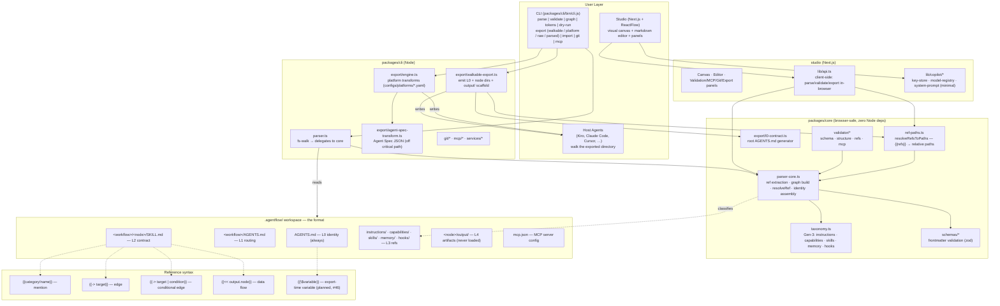

# AgentFlow — System Architecture Diagram

Current architecture (Gen-3 taxonomy, TypeScript monorepo, client-side export). This is the one
canonical architecture diagram — see `docs/planning/MASTER-PLAN.md` for the design rationale and
`docs/FEATURE-MAP.md` for the feature inventory.

## How it fits together

The `.agentflow/` workspace (markdown in directories) is the source of truth. **`packages/core`**
(browser-safe, zero Node deps) parses it into a typed graph, classifies resources against the
Gen-3 taxonomy (5 categories), validates, and resolves `{{refs}}` to relative paths. **`packages/cli`**
is the Node I/O layer: it fs-walks a real workspace, and its export engine emits either a **walkable
directory** (L0 `AGENTS.md` + one dir per node with `SKILL.md` + `output/`, all refs resolved to
plain paths — the primary, host-agnostic output) or **platform-specific layouts** (config-driven by
`configs/platforms/*.yaml`). Agent Spec JSON export exists but is off the critical path.

The **studio** (Next.js + ReactFlow) runs parse/validate/export **client-side** in the browser via
`lib/api.ts` importing core — there is no server-side export route. The copilot layer is currently
minimal (key-store + model-registry + system-prompt).

The **5-layer context model** governs what a host agent loads at each step: L0 identity (always),
L1 routing, L2 node contract, L3 references (on demand), L4 artifacts (never loaded).
