# AgentFlow — CopilotKit / LangGraph / LangChain Architecture

The AI chat integration layer: how CopilotKit, LangGraph, and LangChain wire together to power the studio's "Flow" assistant.

```mermaid
graph TB

    %% ── Browser Layer ──

    subgraph BROWSER["Browser - React / Next.js"]
        CopilotChat["CopilotChat Panel"]
        ModelPicker["ModelPicker"]
        ZustandStore["Zustand Store"]
    end

    subgraph READABLES["Readables - State to Agent"]
        R1["Workspace Graph"]
        R2["Selection Context"]
        R3["UI State"]
        R4["Validation Results"]
        R5["MCP Server Config"]
    end

    subgraph FRONTEND_TOOLS["Frontend Tools - useFrontendTool"]
        FT_File["createFile / editFile / deleteFile"]
        FT_Validate["validateWorkspace"]
        FT_DryRun["dryRun"]
        FT_Tokens["calculateTokens"]
        FT_Library["addFromLibrary"]
        FT_MCP["listMcpServers / toggleMcpServer / discoverMcpTools"]
        FT_UI["selectNode / focusNode / switchWorkflow / setTheme"]
    end

    subgraph HITL["Human-in-the-Loop"]
        ShellApproval["useHumanInTheLoop - Approve or Reject shell commands"]
    end

    subgraph RENDERERS["Chat Renderers"]
        TR["useRenderToolCall - 20+ tool renderers"]
        ASS["useRenderActivityMessage - step, plan, error badges"]
        Suggestions["useConfigureSuggestions - dynamic prompts"]
    end

    %% ── Next.js API Layer ──

    subgraph API["Next.js API Layer"]
        CKRoute["/api/copilotkit - CopilotRuntime + Hono"]
        API_Create["/api/create"]
        API_Save["/api/save"]
        API_Delete["/api/delete"]
        API_Validate["/api/validate"]
        API_DryRun["/api/dry-run"]
        API_Tokens["/api/tokens"]
        API_Library["/api/library"]
        API_MCP["/api/mcp - config, discover, toggle"]
        API_Keys["/api/copilot/keys"]
        API_Model["/api/copilot/model"]
    end

    %% ── CopilotKit Runtime ──

    subgraph CKRUNTIME["CopilotKit Runtime - Server"]
        CKRuntime["CopilotRuntime"]
        LGAgent["LangGraphAgent - deploymentUrl localhost:2024"]
        MCP_GitMCP["GitMCP SSE - AgentFlow docs"]
        MCP_User["User MCP Servers from mcp.json"]
    end

    %% ── LangGraph Server ──

    subgraph LANGGRAPH["LangGraph Dev Server - localhost:2024"]
        LGServer["langgraph-cli dev"]
        DeepAgent["createDeepAgent from deepagents"]
        SysPrompt["System Prompt"]
        Checkpointer["MemorySaver"]
        FSBackend["FilesystemBackend - READ ONLY"]
    end

    subgraph AGENT_TOOLS["DeepAgent Built-in Tools"]
        DA_Read["read_file / ls / glob / grep - free"]
        DA_Plan["write_todos - planning"]
        DA_Task["task - spawn subagents"]
        DA_Write["write_file / edit_file - BLOCKED"]
        DA_Shell["execute - GATED by HITL"]
    end

    subgraph SUBAGENTS["Subagents"]
        ValidatorSub["Validator Subagent"]
    end

    %% ── Model Registry ──

    subgraph MODELS["Model Registry"]
        ModelReg["model-registry.ts"]
        AutoResolve["Auto: gpt-4o then claude-sonnet then gemini-flash"]
        KeyStore["Key Store - env or per-session JSON"]
    end

    subgraph PROVIDERS["LLM Providers"]
        PA_Native["OpenAI / Anthropic / Google - native LangChain"]
        PA_Compat["DeepSeek / xAI / Mistral - OpenAI compatible"]
        PA_Router["OpenRouter - free tier fallback"]
    end

    %% ── Filesystem ──

    WS_Files[".agentflow/ Workspace - AGENTS.md, workflows, resources, mcp.json"]

    %% ════════════════════════════════════════
    %% CONNECTIONS
    %% ════════════════════════════════════════

    %% User to CopilotKit
    CopilotChat --> CKRoute
    CKRoute --> CKRuntime

    %% CopilotKit Runtime to LangGraph
    CKRuntime --> LGAgent
    CKRuntime --> MCP_GitMCP
    CKRuntime --> MCP_User
    LGAgent --> LGServer

    %% LangGraph to DeepAgent
    LGServer --> DeepAgent
    DeepAgent --> SysPrompt
    DeepAgent --> Checkpointer
    DeepAgent --> FSBackend
    DeepAgent --> DA_Read
    DeepAgent --> DA_Plan
    DeepAgent --> DA_Task
    DeepAgent --> DA_Write
    DeepAgent --> DA_Shell
    DA_Task --> ValidatorSub

    %% Filesystem reads
    FSBackend --> WS_Files
    DA_Read --> WS_Files

    %% HITL interrupt flow
    DA_Shell -->|"interrupt"| CKRuntime
    CKRuntime -->|"HITL request"| ShellApproval
    ShellApproval -->|"approve or reject"| CKRuntime

    %% Frontend tools to API
    FT_File --> API_Create
    FT_File --> API_Save
    FT_File --> API_Delete
    FT_Validate --> API_Validate
    FT_DryRun --> API_DryRun
    FT_Tokens --> API_Tokens
    FT_Library --> API_Library
    FT_MCP --> API_MCP
    FT_UI --> ZustandStore

    %% API to filesystem
    API_Create --> WS_Files
    API_Save --> WS_Files
    API_Delete --> WS_Files
    API_Validate --> WS_Files

    %% Readables from store
    ZustandStore --> R1
    ZustandStore --> R2
    ZustandStore --> R3
    ZustandStore --> R4
    R5 --> API_MCP

    %% Readables to agent context
    R1 --> CKRuntime
    R2 --> CKRuntime
    R3 --> CKRuntime
    R4 --> CKRuntime
    R5 --> CKRuntime

    %% Model resolution
    ModelPicker --> ModelReg
    DeepAgent --> ModelReg
    ModelReg --> AutoResolve
    ModelReg --> KeyStore
    ModelReg --> PA_Native
    ModelReg --> PA_Compat
    ModelReg --> PA_Router

    %% Tool renderers
    CKRuntime -.-> TR
    CKRuntime -.-> ASS

    %% Styling
    classDef browser fill:#1e293b,stroke:#3b82f6,color:#fff
    classDef api fill:#1e3a5f,stroke:#60a5fa,color:#fff
    classDef runtime fill:#312e81,stroke:#818cf8,color:#fff
    classDef langgraph fill:#4c1d95,stroke:#a78bfa,color:#fff
    classDef model fill:#064e3b,stroke:#34d399,color:#fff
    classDef fs fill:#1a1a2e,stroke:#e94560,color:#fff

    class CopilotChat,ModelPicker,ZustandStore,R1,R2,R3,R4,R5,FT_File,FT_Validate,FT_DryRun,FT_Tokens,FT_Library,FT_MCP,FT_UI,ShellApproval,TR,ASS,Suggestions browser
    class CKRoute,API_Create,API_Save,API_Delete,API_Validate,API_DryRun,API_Tokens,API_Library,API_MCP,API_Keys,API_Model api
    class CKRuntime,LGAgent,MCP_GitMCP,MCP_User runtime
    class LGServer,DeepAgent,SysPrompt,Checkpointer,FSBackend,DA_Read,DA_Plan,DA_Task,DA_Write,DA_Shell,ValidatorSub langgraph
    class ModelReg,AutoResolve,KeyStore,PA_Native,PA_Compat,PA_Router model
    class WS_Files fs
```

## How It Flows

### Request Path

1. User types in the `CopilotChat` panel
2. `CopilotKitProvider` sends the message to `POST /api/copilotkit`
3. The route handler creates a `CopilotRuntime` wrapping a `LangGraphAgent`
4. `LangGraphAgent` forwards to the LangGraph dev server at `localhost:2024`
5. The LangGraph server runs a `DeepAgent` (from the `deepagents` package) — a LangChain-based agent graph
6. DeepAgent reasons, plans, reads files, and calls tools
7. Tool results and activity messages stream back through CopilotKit to the chat UI

### Two Tool Surfaces

The agent has tools on both sides:

- **Backend (DeepAgent built-ins):** `read_file`, `ls`, `glob`, `grep` for filesystem reads. `write_todos` for planning. `task` for spawning subagents. `execute` for shell commands (gated by HITL). Backend writes (`write_file`, `edit_file`) are intentionally blocked.
- **Frontend (CopilotKit `useFrontendTool`):** `createFile`, `editFile`, `deleteFile` execute in the browser, hit Next.js API routes, write to disk, and update the Zustand store + canvas live. Plus UI tools (`selectNode`, `focusNode`, `switchWorkflow`, `setTheme`) and workspace tools (`validateWorkspace`, `dryRun`, `calculateTokens`, `addFromLibrary`).

This split means reads happen on the server (fast, no round-trip) while writes go through the frontend (live UI updates).

### Context Flow (Readables)

Five `useAgentContext` hooks push live workspace state from the Zustand store into the agent's context on every turn:

| Readable | What the agent sees |
|----------|-------------------|
| Workspace graph | All workflows, nodes, edges, resources (summarized) |
| Selection context | The focused node/resource with frontmatter, refs, raw content |
| UI state | Active workflow, theme, whether a modal is open |
| Validation results | Current errors and warnings |
| MCP servers | Configured servers with status and tool lists |

### Human-in-the-Loop

Shell commands (`execute`) trigger an interrupt in the LangGraph agent. CopilotKit surfaces this as an Approve/Reject prompt in the chat via `useHumanInTheLoop`. The user decides, and the response flows back to the agent.

### Model Registry

The model registry uses LangChain's `initChatModel` to create chat models from 7 providers:

| Provider | Adapter |
|----------|---------|
| OpenAI | Native LangChain |
| Anthropic | Native LangChain |
| Google GenAI | Native LangChain |
| DeepSeek | OpenAI-compatible (custom baseURL) |
| x.ai (Grok) | OpenAI-compatible (custom baseURL) |
| Mistral | OpenAI-compatible (custom baseURL) |
| OpenRouter | OpenAI-compatible (free `:free` models) |

Auto-resolution picks the first available provider based on which API keys are set. Users can also manually select a model via the `ModelPicker` dropdown.

API keys come from `.env.local` / `process.env` in default mode, or a per-session `.copilot-keys.json` file in multi-user mode (24h TTL, auto-pruned).

### MCP at Two Levels

MCP servers are wired at two levels:

1. **CopilotKit Runtime level:** A preconfigured GitMCP SSE endpoint for AgentFlow docs/examples, plus any HTTP/SSE servers from the user's `.agentflow/mcp.json`. These are available as tools the agent can call directly.
2. **Frontend tool level:** The agent can list, toggle, and discover MCP servers via `listMcpServers`, `toggleMcpServer`, and `discoverMcpTools` frontend tools that hit the `/api/mcp/*` routes.

### Key Files

| File | Role |
|------|------|
| `studio/app/api/copilotkit/[[...path]]/route.ts` | CopilotRuntime + LangGraphAgent setup |
| `studio/lib/copilot/agent.ts` | DeepAgent graph definition (LangGraph) |
| `studio/lib/copilot/system-prompt.ts` | Agent system prompt |
| `studio/lib/copilot/model-registry.ts` | Model resolution + LangChain initChatModel |
| `studio/lib/copilot/key-store.ts` | API key management (env + per-session) |
| `studio/components/copilot/CopilotProvider.tsx` | CopilotKitProvider wrapper |
| `studio/components/copilot/CopilotReadables.tsx` | State to agent context (5 readables) |
| `studio/components/copilot/CopilotActions.tsx` | Frontend tools (20+ tools) |
| `studio/components/copilot/CopilotPanel.tsx` | Chat UI + HITL + status |
| `studio/components/copilot/CopilotToolRenderers.tsx` | Tool call rendering in chat |
| `studio/components/copilot/AgentStateSync.tsx` | Activity message rendering |
| `studio/components/copilot/CopilotSuggestions.tsx` | Dynamic chat suggestions |
| `studio/langgraph.json` | LangGraph graph registration |
