# AgentFlow Taxonomy — Visual Reference

## 1. The Six Resource Categories

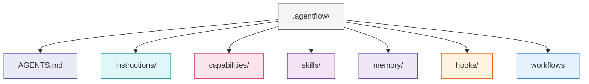

| Category | Directory | What it holds | Scopes |
|----------|-----------|---------------|--------|
| Identity | `AGENTS.md` | Who the agent is — name, role, personality, constraints | Singular file |
| Instructions | `instructions/` | Reusable how-to modules the agent follows | `workflow`, `global` |
| Capabilities | `capabilities/` | Tool declarations — what the agent can do | `descriptor`, `config` |
| Skills | `skills/` | Human touchpoints and routing conditions | `interaction`, `condition` |
| Memory | `memory/` | Persistent state across sessions | None |
| Hooks | `hooks/` | Event-driven automation (JSON files) | None |

---

## 2. Instructions

Reusable instruction sets that tell the agent **how** to do things.

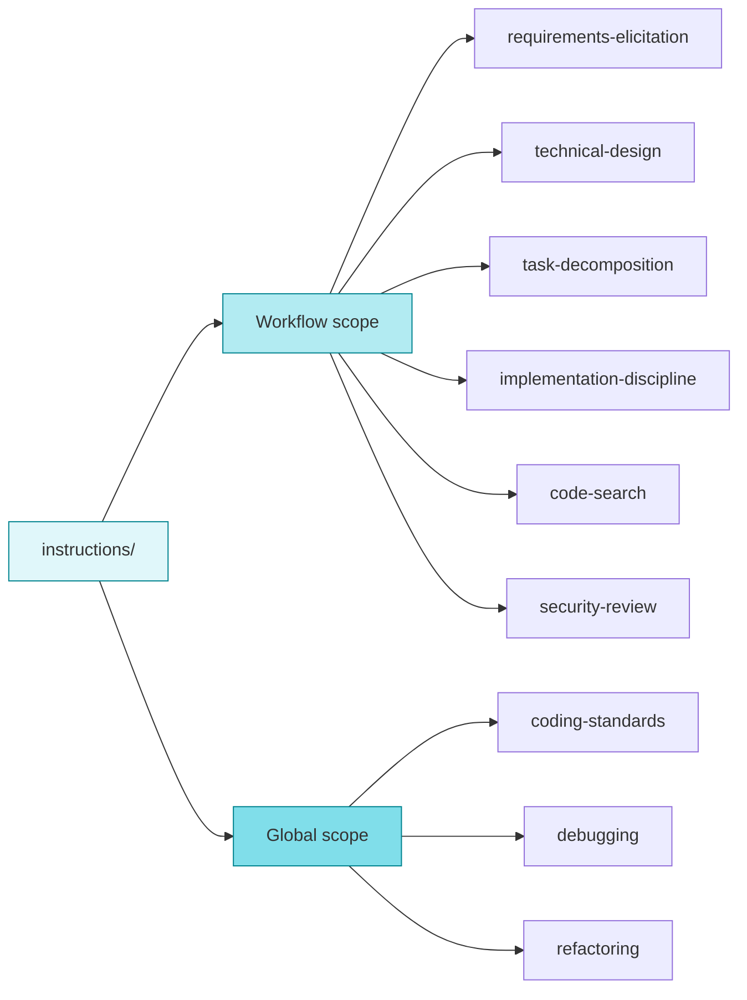

- **Workflow scope** — loaded only when a specific node references them
- **Global scope** — auto-loaded in every interaction (set via `inclusion: auto` in frontmatter)

---

## 3. Capabilities

Tool declarations — **what** the agent can do. Three types:

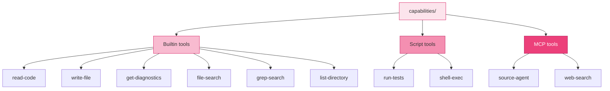

| Type | What it does | Example |
|------|-------------|---------|
| `builtin` | Maps to the agent runtime's native ability | `read-code` calls the host's file reader |
| `script` | Runs a shell command | `run-tests` executes `npm test` |
| `mcp` | Connects to an MCP server | `source-agent` queries a codebase index |

---

## 4. Skills

Two distinct purposes merged into one category:

```mermaid
graph TD
    RUN["skills/"]

    RUN --> INTERACTIONS["Interactions"]
    RUN --> CONDITIONS["Conditions"]

    INTERACTIONS --> I1["review-design"]
    INTERACTIONS --> I2["review-requirements"]
    INTERACTIONS --> I3["review-tasks"]
    INTERACTIONS --> I4["checkpoint"]
    INTERACTIONS --> I5["confirm-destructive"]
    INTERACTIONS --> I6["collect-feedback"]
    INTERACTIONS --> I7["escalate-to-human"]
    INTERACTIONS --> I8["show-diff"]

    CONDITIONS --> C1["design-approved"]
    CONDITIONS --> C2["design-rejected"]
    CONDITIONS --> C3["requirements-approved"]
    CONDITIONS --> C4["requirements-rejected"]
    CONDITIONS --> C5["tasks-approved"]
    CONDITIONS --> C6["all-tasks-done"]
    CONDITIONS --> C7["tests-pass"]
    CONDITIONS --> C8["tests-fail"]

    style RUN fill:#F3E5F5,stroke:#6A1B9A
    style INTERACTIONS fill:#E1BEE7,stroke:#6A1B9A
    style CONDITIONS fill:#CE93D8,stroke:#4A148C
```

- **Interactions** — human touchpoints: approvals, confirmations, feedback prompts
- **Conditions** — boolean checks used in conditional edges to route the workflow

---

## 5. Scope Inference

When you don't set `scope:` explicitly, the system infers it:

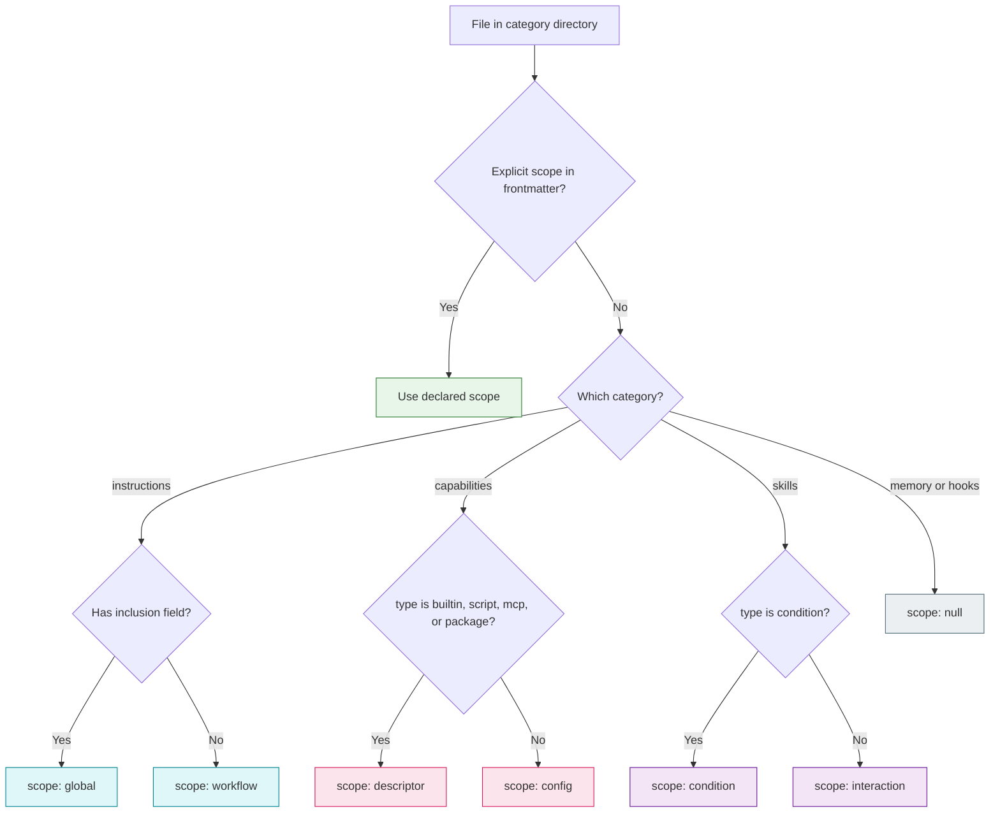

---

## 6. The Five-Layer Context Model

Every token loaded is a token the model can't reason with. Layers control what gets loaded and when.

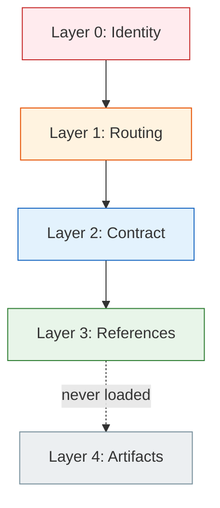

| Layer | Name | Source | Budget | Lifetime |
|-------|------|--------|--------|----------|
| 0 | Identity | Root `AGENTS.md` | ~200 tokens | Always loaded |
| 1 | Routing | Workflow `AGENTS.md` | ~500–800 tokens | Always loaded |
| 2 | Contract | Active node's `SKILL.md` | 2k–8k tokens | Current stage only |
| 3 | References | `instructions/`, `capabilities/`, `memory/` | On demand | Resolved per ref |
| 4 | Artifacts | `node/output/` | Zero — never loaded | Write-only |

**Hard constraint:** L0 + L1 + active L2 + resolved L3 ≤ ~8k tokens total.

---

## 7. Reference Syntax

Four ref types connect everything in the system:

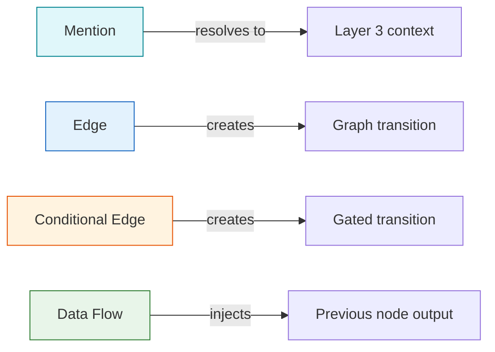

| Type | Syntax | What it does |
|------|--------|-------------|
| Mention | `{{capabilities/read-code}}` | Load this resource as context |
| Edge | `{{-> nodes/create-design}}` | Go to this node next |
| Conditional Edge | `{{-> nodes/plan-tasks \| skills/design-approved}}` | Go to this node if condition is met |
| Data Flow | `{{<< output.gather-requirements}}` | Read output from a previous node |

---

## 8. Node Types

Three kinds of nodes compose a workflow:

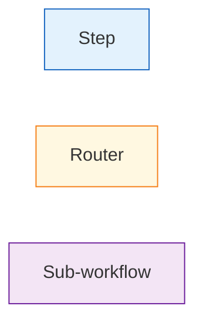

| Type | Purpose | Has capabilities? | Has instructions? |
|------|---------|-------------------|-------------------|
| Step | Does work — reads code, writes files, runs tests | Yes | Yes |
| Router | Decision point — routes based on conditions | No | No |
| Sub-workflow | Delegates to another complete workflow | Inherited | Inherited |

---

## 9. Workflow Graph Pattern

A typical workflow with review gates and rejection loops:

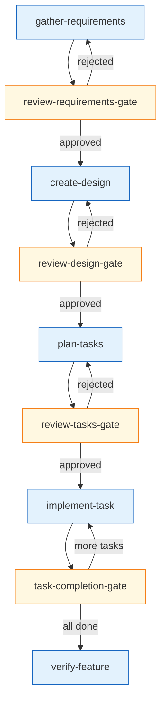

Key patterns visible here:
- **Linear flow** — steps execute in sequence
- **Review gates** — router nodes that branch on approval/rejection
- **Rejection loops** — rejected work returns to the previous step for revision
- **Iteration loops** — implement → check → implement again until done

---

## 10. Full Directory Structure

```mermaid
graph TD
    ROOT[".agentflow/"]

    ROOT --> AGENTS["AGENTS.md"]
    ROOT --> MCPJSON["mcp.json"]
    ROOT --> INST_DIR["instructions/"]
    ROOT --> CAPS_DIR["capabilities/"]
    ROOT --> RUN_DIR["skills/"]
    ROOT --> MEM_DIR["memory/"]
    ROOT --> HOOKS_DIR["hooks/"]
    ROOT --> BF["build-feature/"]

    INST_DIR --> INST1["requirements-elicitation.md"]
    INST_DIR --> INST2["coding-standards.md"]

    CAPS_DIR --> CAP1["read-code.md"]
    CAPS_DIR --> CAP2["source-agent.md"]
    CAPS_DIR --> CAP3["run-tests.md"]

    RUN_DIR --> RUN1["design-approved.md"]
    RUN_DIR --> RUN2["review-design.md"]

    MEM_DIR --> MEM1["user.md"]
    MEM_DIR --> MEM2["decisions.md"]
    MEM_DIR --> MEM3["lessons.md"]

    HOOKS_DIR --> HOOK1["lint-on-save.json"]
    HOOKS_DIR --> HOOK2["diagnostics-after-write.json"]

    BF --> BF_AGENTS["AGENTS.md"]
    BF --> NODE1["gather-requirements/"]
    BF --> NODE2["review-gate/"]
    BF --> NODE3["implement-task/"]

    NODE1 --> SKILL1["SKILL.md"]
    NODE3 --> SKILL3["SKILL.md"]
    NODE3 --> OUTPUT["output/"]

    style ROOT fill:#f5f5f5,stroke:#333
    style AGENTS fill:#E8EAF6,stroke:#283593
    style INST_DIR fill:#E0F7FA,stroke:#00838F
    style CAPS_DIR fill:#FCE4EC,stroke:#D81B60
    style RUN_DIR fill:#F3E5F5,stroke:#6A1B9A
    style MEM_DIR fill:#EDE7F6,stroke:#512DA8
    style HOOKS_DIR fill:#FFF3E0,stroke:#E65100
    style BF fill:#E3F2FD,stroke:#1565C0
```

---

## 11. How It All Connects

A single node referencing resources across categories:

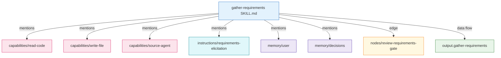

This is the core idea: a SKILL.md file uses `{{ref}}` syntax to pull in exactly the capabilities, instructions, and memory it needs — nothing more. The context model ensures only the active node's references are loaded, keeping total token usage under budget.
