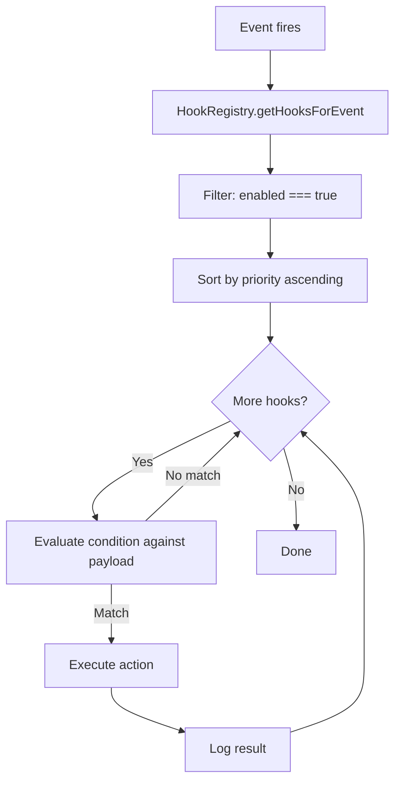

Hooks are JSON files that fire actions when events happen — run tests when code changes, trigger diagnostics after edits, notify on failures. They're the automation layer between the agent and your development environment.

## Your First Hook

Let's create a hook that runs the linter whenever a TypeScript file is saved:

```json
{
  "name": "lint-on-save",
  "event": "fileEdited",
  "condition": {
    "field": "path",
    "operator": "matches",
    "value": "\\.(ts|tsx)$"
  },
  "action": {
    "type": "run-script",
    "target": "npm run lint -- --fix"
  },
  "enabled": true,
  "priority": 100
}
```

Save this as `.agentflow/hooks/lint-on-save.json`. That's it — the hook fires whenever a `.ts` or `.tsx` file is edited.

### Breaking it down

- **`event: "fileEdited"`** — triggers when any file is saved
- **`condition`** — filters to only TypeScript files using a regex match on the `path` field
- **`action`** — runs `npm run lint -- --fix` as a shell command
- **`priority: 100`** — lower numbers run first (if multiple hooks fire on the same event)

## Events

<Tabs items={['File', 'Tool', 'Workflow', 'Other']}>
  <Tab value="File">
    | Event | Fires when | Payload |
    |-------|-----------|---------|
    | `fileEdited` | A file is saved | `path`, `content`, `oldContent` |
    | `fileCreated` | A new file is created | `path`, `content` |
    | `fileDeleted` | A file is deleted | `path` |

    **Common use:** Linting, formatting, diagnostics, test running.
  </Tab>
  <Tab value="Tool">
    | Event | Fires when | Payload |
    |-------|-----------|---------|
    | `preToolUse` | Before a tool executes | `toolName`, `args`, `source` |
    | `postToolUse` | After a tool executes | `toolName`, `args`, `result`, `source` |

    **Common use:** Audit logging, security scanning, tool gating.
  </Tab>
  <Tab value="Workflow">
    | Event | Fires when | Payload |
    |-------|-----------|---------|
    | `workflowStarted` | A workflow begins | `workflowId`, `trigger` |
    | `workflowCompleted` | A workflow succeeds | `workflowId`, `result`, `duration` |
    | `workflowFailed` | A workflow fails | `workflowId`, `error` |
    | `nodeEntered` | A node begins | `workflowId`, `nodeId`, `nodeType` |
    | `nodeCompleted` | A node finishes | `workflowId`, `nodeId`, `result` |

    **Common use:** Notifications, memory persistence, logging.
  </Tab>
  <Tab value="Other">
    | Event | Fires when | Payload |
    |-------|-----------|---------|
    | `memoryUpdated` | A memory file changes | `category`, `key`, `value` |
    | `protocolToggled` | A protocol is toggled | `protocolName`, `enabled` |

    **Common use:** Syncing, backup, state tracking.
  </Tab>
</Tabs>

## Conditions

Conditions match a field from the event payload against a value. If the condition is omitted, the hook fires on every occurrence.

| Operator | What it does | Example |
|----------|-------------|---------|
| `equals` | Exact match | `"field": "toolName", "value": "write-file"` |
| `contains` | Substring | `"field": "path", "value": "src/"` |
| `startsWith` | Prefix | `"field": "path", "value": "tests/"` |
| `endsWith` | Suffix | `"field": "path", "value": ".test.ts"` |
| `matches` | Regex | `"field": "path", "value": "\\.(ts|tsx|js|jsx)$"` |

<Callout type="info" title="Regex safety">
  The `matches` operator has a ReDoS guard — patterns longer than 512 characters or with dangerous backtracking are rejected.
</Callout>

## Actions

| Type | What it does | `target` field |
|------|-------------|---------------|
| `trigger-workflow` | Starts a workflow | Workflow name: `"get-diagnostics"` |
| `run-script` | Executes a shell command | Command: `"npm test -- --related"` |
| `notify` | Sends a message | `"user"` or `"agent"` |
| `log` | Writes to a named log | Log name: `"tool-audit"` |

## Real Scenarios

<Accordions>
  <Accordion title="Run diagnostics after every code edit">
    ```json
    {
      "name": "diagnostics-after-write",
      "event": "fileEdited",
      "condition": { "field": "path", "operator": "matches", "value": "\\.(ts|tsx|js|jsx|py)$" },
      "action": { "type": "trigger-workflow", "target": "get-diagnostics", "params": { "scope": "modified" } },
      "enabled": true,
      "priority": 50
    }
    ```
    Priority 50 means this runs before linting (100) and testing (200).
  </Accordion>
  <Accordion title="Audit all tool usage">
    ```json
    {
      "name": "guard-tool-use",
      "event": "postToolUse",
      "action": { "type": "log", "target": "tool-audit" },
      "enabled": true,
      "priority": 100
    }
    ```
    No condition — logs every tool call. Useful for security auditing.
  </Accordion>
  <Accordion title="Persist learnings when workflow completes">
    ```json
    {
      "name": "memory-on-complete",
      "event": "workflowCompleted",
      "action": { "type": "notify", "target": "agent", "params": { "message": "Persist any new learnings to memory files" } },
      "enabled": true,
      "priority": 900
    }
    ```
    Priority 900 — runs last, after all other completion hooks.
  </Accordion>
  <Accordion title="Security scan before commits">
    ```json
    {
      "name": "security-scan-on-commit",
      "event": "preToolUse",
      "condition": { "field": "toolName", "operator": "contains", "value": "commit" },
      "action": { "type": "run-script", "target": "npm audit --production" },
      "enabled": false,
      "priority": 50
    }
    ```
    Disabled by default — enable when you want pre-commit security scanning.
  </Accordion>
</Accordions>

## Building a Hook Step by Step

<Steps>
  <Step>
    ### Choose the event

    What should trigger the hook? File changes are the most common — `fileEdited` fires whenever a file is saved. For pre-commit checks, use `preToolUse` and filter on `toolName` containing "commit".
  </Step>
  <Step>
    ### Add a condition (optional)

    Without a condition, the hook fires on every occurrence of the event. Add a condition to filter — for example, only TypeScript files:

    ```json
    "condition": {
      "field": "path",
      "operator": "matches",
      "value": "\\.(ts|tsx)$"
    }
    ```

    The `field` must be a key from the event payload (see the Events section above). The `operator` determines how to match.
  </Step>
  <Step>
    ### Define the action

    What should happen when the hook fires? Four options:

    - `trigger-workflow` — start a workflow by name
    - `run-script` — execute a shell command
    - `notify` — send a message to the agent or user
    - `log` — write to a named log file
  </Step>
  <Step>
    ### Set priority

    If multiple hooks fire on the same event, priority determines order. Lower numbers run first. Use 50 for critical hooks (diagnostics), 100 for standard (linting), 200+ for optional (testing).
  </Step>
  <Step>
    ### Save and test

    Save the JSON file in `.agentflow/hooks/` (global) or `.agentflow/your-workflow/hooks/` (workflow-scoped). The hook is active immediately — edit a matching file to see it fire.
  </Step>
</Steps>

## Scoping

| Level | Location | Fires when |
|-------|----------|-----------|
| **Global** | `.agentflow/hooks/` | Any workflow is active |
| **Workflow** | `.agentflow/build-feature/hooks/` | Only when build-feature is active |

## Platform Export

| Platform | Native hooks? | Export format |
|----------|--------------|--------------|
| **Kiro** | Yes | `.kiro/hooks/{name}.json` |
| **Claude Code** | Yes | Merged into claude settings |
| **VS Code Copilot** | Yes | `.github/hooks/agentflow-hooks.json` |
| **Cursor** | No | Converted to natural language instructions |
| **Windsurf** | No | Converted to natural language instructions |
| **OpenClaw** | Yes | `hooks/{name}/HOOK.md` |
| **Agent Spec** | Yes | `hooks/{name}.json` (passthrough) |


## Hook Execution Flow

When an event fires, the hook system follows a deterministic pipeline to evaluate and execute matching hooks:



### Execution guarantees

- Hooks execute sequentially in priority order — no parallelism
- A failing hook does not block subsequent hooks from running
- If a hook's action is `trigger-workflow`, the workflow runs asynchronously
- If a hook's action is `run-script`, the script runs synchronously and blocks the next hook until complete

## Combining Hooks

Multiple hooks can fire on the same event. Priority determines the execution order, letting you build layered automation pipelines.

### Example: fileEdited pipeline

Three hooks fire whenever a source file is edited, each handling a different concern:

```json
[
  {
    "name": "diagnostics-after-write",
    "event": "fileEdited",
    "condition": { "field": "path", "operator": "matches", "value": "\\.(ts|tsx|js|jsx|py)$" },
    "action": { "type": "trigger-workflow", "target": "get-diagnostics" },
    "priority": 50
  },
  {
    "name": "lint-on-save",
    "event": "fileEdited",
    "condition": { "field": "path", "operator": "matches", "value": "\\.(ts|tsx)$" },
    "action": { "type": "run-script", "target": "npm run lint -- --fix" },
    "priority": 100
  },
  {
    "name": "test-related",
    "event": "fileEdited",
    "condition": { "field": "path", "operator": "matches", "value": "\\.(ts|tsx)$" },
    "action": { "type": "run-script", "target": "npm test -- --related" },
    "priority": 200
  }
]
```

### Execution order for this pipeline

| Order | Hook | Priority | Action |
|-------|------|----------|--------|
| 1 | diagnostics-after-write | 50 | Triggers diagnostic workflow (async) |
| 2 | lint-on-save | 100 | Runs linter with auto-fix (sync) |
| 3 | test-related | 200 | Runs related tests (sync) |

Diagnostics fire first at priority 50 because they provide immediate feedback. Linting at 100 auto-fixes formatting issues. Testing at 200 runs last because it depends on the linted output. This layered approach ensures each hook operates on the cleanest possible state.

<Cards>
  <Card title="Patterns" href="/docs/authoring/patterns" description="See hooks in workflow patterns" />
  <Card title="Writing Resources" href="/docs/authoring/writing-resources" description="Other resource types" />
</Cards>
