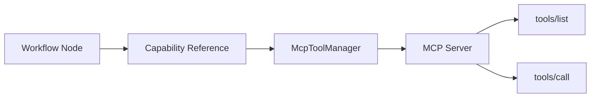

MCP (Model Context Protocol) lets your workflows use external tools — GitHub, databases, browsers, Slack, Linear, and anything else with an MCP server. AgentFlow handles the full lifecycle from discovery to execution.

## End-to-End: Adding GitHub Tools

<Steps>
  <Step>
    ### Search the registry

    ```bash
    agentflow mcp search github
    ```

    ```
    github — GitHub API (create issues, PRs, search code)
    ```

    The official registry at `registry.modelcontextprotocol.io` has hundreds of servers. You can also browse it in the studio's MCP panel.
  </Step>
  <Step>
    ### Add the server

    ```bash
    agentflow mcp add github --required --env GITHUB_TOKEN=ghp_xxx
    ```

    This writes to `.agentflow/mcp.json`:

    ```json
    {
      "mcpServers": {
        "github": {
          "command": "npx",
          "args": ["-y", "@modelcontextprotocol/server-github"],
          "env": { "GITHUB_TOKEN": "${env:GITHUB_TOKEN}" },
          "required": true
        }
      }
    }
    ```

    The `${env:GITHUB_TOKEN}` token is never resolved in the file — it's preserved as a literal string so you can safely commit `mcp.json`. Resolution happens only at connection time.
  </Step>
  <Step>
    ### Discover tools

    ```bash
    agentflow mcp discover github
    ```

    ```
    ✓ Connected to github
    ✓ Found 12 tools
    ✓ Generated 12 capability files in .agentflow/capabilities/
    ```

    Each tool becomes a `.md` file:

    ```yaml
    # .agentflow/capabilities/create-issue.md
    ---
    name: create-issue
    type: mcp
    mcp: github
    description: Create a new GitHub issue
    parameters:
      title: { type: string, required: true }
      body: { type: string }
    generated: true
    ---

    # Create a new GitHub issue
    ```

    You can edit these files — add usage notes, adjust descriptions. The `generated: true` flag prevents `discover` from overwriting your edits (unless you pass `--overwrite`).
  </Step>
  <Step>
    ### Use in a workflow node

    Reference the generated capability like any other:

    ```markdown
    # create-bug-report/SKILL.md

    Create a GitHub issue for the identified bug
    using {{capabilities/create-issue}}.
    ```

    At runtime, the agent calls the MCP server through the capability reference. The `mcp: github` field in the capability frontmatter tells the runtime which server to use.
  </Step>
</Steps>

## Config Format

<TypeTable type={{
  command: { description: 'Executable for local servers (e.g. "npx", "uvx", "node")', type: 'string' },
  args: { description: 'Arguments passed to the command', type: 'string[]' },
  url: { description: 'URL for remote servers (mutually exclusive with command)', type: 'string' },
  env: { description: 'Environment variables — ${env:VAR} tokens resolved at connection time only', type: 'Record<string, string>' },
  required: { description: 'If true, workflow fails when server can\'t start. If false, warns and continues.', type: 'boolean', default: 'false' },
  disabled: { description: 'Skip this server entirely', type: 'boolean', default: 'false' },
  discoveredTools: { description: 'Tool names found via discover (auto-populated)', type: 'string[]' },
  autoApprove: { description: 'Tools that don\'t need user confirmation', type: 'string[]' },
}} />

### Example: Remote server (Linear)

```json
{
  "mcpServers": {
    "linear": {
      "url": "https://mcp.linear.app/mcp",
      "description": "Manage issues, projects & workflows in Linear"
    }
  }
}
```

No `command` or `args` — just a URL. The runtime connects to the remote server directly.

## CLI Reference

```bash
agentflow mcp search <query>     # Search the official registry
agentflow mcp add <server>       # Add to mcp.json (--required, --env KEY=val)
agentflow mcp remove <server>    # Remove (--remove-tools deletes .md files too)
agentflow mcp discover <server>  # Connect, list tools, generate capability files
agentflow mcp list               # Show all configured servers with status
```

## Studio MCP Panel

The studio provides visual server management — registry browsing, one-click add with auth prompts, connection testing, and tool discovery.


<ComponentPreview title="MCP server management panel" height="lg">
  <DocsPlayground panel="mcp" />
</ComponentPreview>


<Accordions>
  <Accordion title="Registry browser">
    Search the official registry, browse recently updated servers, and see auth requirements. One-click add auto-populates env tokens and prompts for API keys.
  </Accordion>
  <Accordion title="Server management">
    Each server card shows: status (connected/disconnected), discovered tools. Actions: Test (with latency), Discover, Configure (edit env vars), Toggle, Remove.
  </Accordion>
  <Accordion title="Custom servers">
    Add servers not in the registry — enter a URL for remote servers or a command for local servers, plus environment variables.
  </Accordion>
</Accordions>

## Platform Export

MCP config exports to each platform's expected format:

| Platform | Output path | Notes |
|----------|-------------|-------|
| VS Code Copilot | `.mcp.json` | Standard format |
| Cursor | `.cursor/mcp.json` | Standard format |
| Kiro | `.kiro/settings/mcp.json` | Standard format |
| Claude Code | `claude_desktop_config.json` | Claude-specific format |

AgentFlow can also **import** MCP configs from other platforms — if you already have a `.cursor/mcp.json`, the import converts it to AgentFlow format.

## Troubleshooting

<Accordions>
  <Accordion title="Server won't connect">
    - Check that the command exists: `which npx` or `which uvx`
    - Check env vars are set: `echo $GITHUB_TOKEN`
    - Try `agentflow mcp test github` for detailed error output
    - For HTTP servers, verify the URL is reachable: `curl -I https://...`
  </Accordion>
  <Accordion title="Tools not showing up after discover">
    - Run `agentflow mcp discover github --overwrite` to regenerate
    - Check `.agentflow/capabilities/` for the generated `.md` files
    - Verify the capability has `type: mcp` and `mcp: server-name` in frontmatter
  </Accordion>
  <Accordion title="Required server failing in CI">
    Set `required: false` for servers that aren't available in CI, or use env vars to conditionally configure:
    ```json
    { "env": { "GITHUB_TOKEN": "${env:GITHUB_TOKEN}" } }
    ```
    If `GITHUB_TOKEN` isn't set, the server will fail to auth but won't block the workflow (if not required).
  </Accordion>
</Accordions>


## MCP Architecture

The runtime connects workflows to external tools through capability references:



### How capability files bridge the gap

Capability files (`.agentflow/capabilities/*.md`) act as the contract between your workflow and the MCP server. When a node references a capability via the standard syntax, the runtime:

1. Reads the capability frontmatter to find the `mcp` field (server name)
2. Looks up the server in `mcp.json` to determine connection details
3. Calls `McpToolManager.invokeTool()` with the tool name and parameters
4. The server executes `tools/call` and returns the result

This indirection means workflow authors never deal with connection details — they reference capabilities by name, and the runtime handles everything.

<Cards>
  <Card title="Writing Resources" href="/docs/authoring/writing-resources" description="Capability types including MCP" />
  <Card title="Library" href="/docs/authoring/library" description="Pre-built capabilities" />
  <Card title="CLI Reference" href="/docs/reference/cli" description="All MCP CLI commands" />
</Cards>
