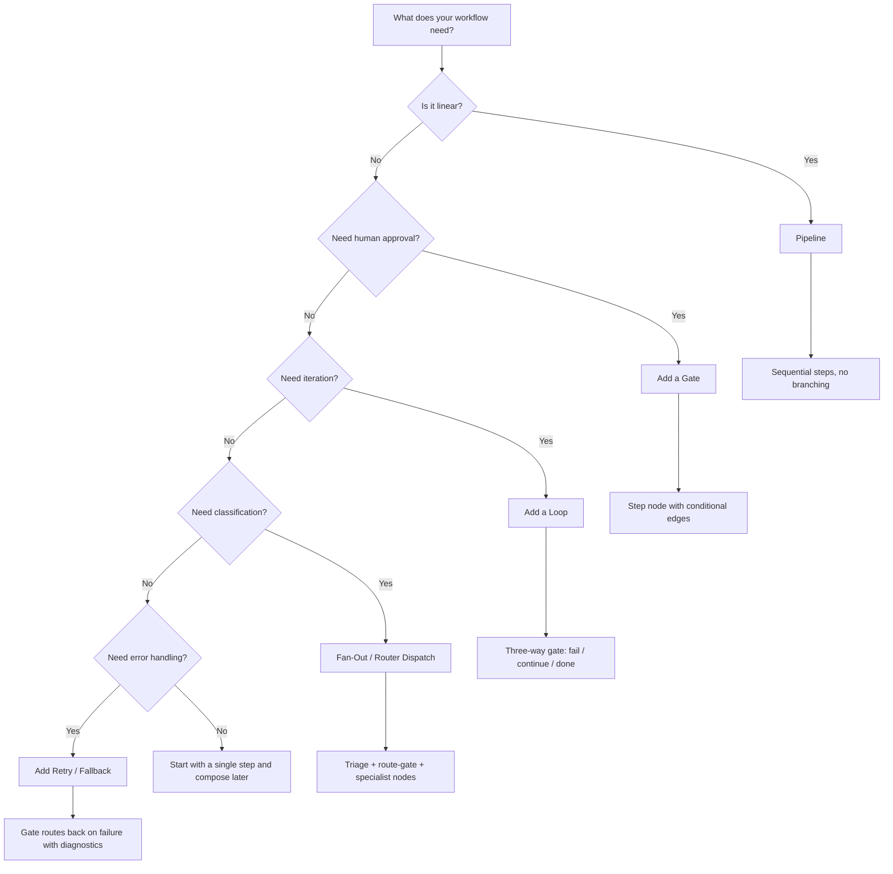

Every library workflow combines multiple patterns. This page shows each pattern with the actual files that implement it.

## Approval Gates

The most common pattern — a step node with conditional edges that blocks until a human approves. Used 8 times across the 6 library workflows.

### The files

<Tabs items={['Gate SKILL.md', 'Inline condition', 'Directory']}>
  <Tab value="Gate SKILL.md">
    ```yaml
    # review-design-gate/SKILL.md
    ---
    name: review-design-gate
    type: step
    context:
      inputs:
        - ref: memory/user
          scope: summary
    ---

    # Review Design Gate

    Present the design from {{<< output.create-design}} to the user.

    ## Routing

    - If approved → {{-> nodes/plan-tasks | The user explicitly approves the design}}
    - If rejected → {{-> nodes/create-design | The user rejects the design or requests changes}}
    ```
  </Tab>
  <Tab value="Inline condition">
    Conditions are written directly in the edge syntax:

    ```yaml
    # In the gate's SKILL.md
    - If approved → {{-> nodes/plan-tasks | The user explicitly approves the design}}
    ```

    The condition after `|` is evaluated inline — no separate file needed.
    The text should be an unambiguous true/false check.
  </Tab>
  <Tab value="Directory">
    <Files>
      <Folder name="build-feature" defaultOpen>
        <Folder name="create-design">
          <File name="SKILL.md" />
        </Folder>
        <Folder name="review-design-gate">
          <File name="SKILL.md" />
        </Folder>
        <Folder name="plan-tasks">
          <File name="SKILL.md" />
        </Folder>
      </Folder>
    </Files>

    The gate sits between the producing step and the consuming step. Rejection loops back to the producer.
  </Tab>
</Tabs>

### Key rules

- Gates are step nodes with conditional edges — they automatically become gateways in the graph
- Two edges minimum — approved (forward) and rejected (backward with feedback)
- Conditions are written inline in the edge syntax after the `|` separator

## Task Loops

A step executes repeatedly until a completion condition is met. The build-feature workflow uses this for implementing tasks one at a time.

### How it works

```
implement-task → task-completion-gate
                    ├── task-failed → implement-task (retry same)
                    ├── more-tasks-remain → implement-task (next task)
                    └── all-tasks-done → verify-feature (exit loop)
```

The key is **three-way routing**: fail (retry), continue (next iteration), done (exit). State is tracked in the task list — `[x]` vs `[ ]` checkboxes that the step updates after each iteration.

<Tabs items={['Gate SKILL.md', 'Condition: more tasks', 'Condition: all done']}>
  <Tab value="Gate SKILL.md">
    ```yaml
    ---
    name: task-completion-gate
    type: step
    ---

    ## Logic

    Read the task list. Count completed [x] vs uncompleted [ ] tasks.

    ## Routing

    - If current task failed → {{-> nodes/implement-task | The current task failed with errors}}
    - If more tasks remain → {{-> nodes/implement-task | One or more tasks remain uncompleted}}
    - If all done → {{-> nodes/verify-feature | All tasks are completed and tests pass}}
    ```
  </Tab>
  <Tab value="Condition: more tasks">
    Conditions are inline edge text — no separate file needed:

    ```
    {{-> nodes/implement-task | One or more tasks remain uncompleted}}
    ```

    **True when:** At least one task has `[ ]` (unchecked).
    **False when:** All tasks have `[x]` (checked).
  </Tab>
  <Tab value="Condition: all done">
    ```
    {{-> nodes/verify-feature | All tasks are completed and tests pass}}
    ```

    **True when:** All tasks `[x]`, all tests pass, no errors.
    **False when:** Any task incomplete, tests failing, or errors exist.
  </Tab>
</Tabs>

<Callout type="info" title="Conversation loops">
  The interactive-assistant uses a different loop: `triage → handler → user-review-gate → triage`. The user drives iteration — each loop is a new request, not a task from a list.
</Callout>

## Fan-Out (Router Dispatch)

A classification step feeds a step with conditional edges that dispatches to specialist nodes. All specialists converge at a single output node.

```
triage → route-gate → billing    → respond
                    → technical  → respond
                    → general    → respond
```

### The router

```yaml
# route-gate/SKILL.md
---
name: route-gate
type: step
agent: support-router
context:
  max_tokens: 500
  inputs:
    - ref: nodes/triage
      scope: output
  exclude:
    - instructions/*
    - capabilities/*
---

## Routing Rules

| Category    | Route                  |
|-------------|------------------------|
| `billing`   | → {{nodes/billing}}    |
| `technical` | → {{nodes/technical}}  |
| `general`   | → {{nodes/general}}    |

### Urgency Override
If urgency is `critical`:
- {{The ticket is marked as critical urgency}} → fast-track to {{nodes/respond}}
```

Notice the aggressive context scoping — the router loads only the triage output (`scope: output`) and excludes all instructions and capabilities. It needs minimal context to make a routing decision.

## Error Recovery

Four strategies, from simplest to most complex:

<Tabs items={['Retry', 'Fallback', 'Priority list', 'Escalation']}>
  <Tab value="Retry">
    The task-completion-gate routes back to implement-task on failure. The step gets the error feedback and tries again:

    ```
    implement-task → task-completion-gate
                        ├── task-failed → implement-task (with diagnostics)
    ```
  </Tab>
  <Tab value="Fallback">
    The verify step can route back to implementation if final tests fail:

    ```markdown
    If any tests fail → {{-> nodes/implement-task}} to fix.
    ```
  </Tab>
  <Tab value="Priority list">
    The incident-response workflow tries mitigations in order:

    ```markdown
    ### Mitigation Strategy (priority order)
    1. Rollback — safest, fastest
    2. Feature flag — disable broken feature
    3. Scale up — add resources
    4. Redirect traffic — route away from affected region
    5. Hotfix — only if rollback isn't possible

    If not recovered: try the next strategy.
    ```
  </Tab>
  <Tab value="Escalation">
    When the agent can't resolve the issue:

    ```yaml
    ---
    name: escalate-to-human
    type: escalation
    ---

    Used for: security-sensitive decisions, ambiguous requirements,
    breaking changes, production data operations.
    ```
  </Tab>
</Tabs>

## Pattern Composition

Real workflows combine patterns. Here's what each library workflow uses:

| Workflow | Patterns | Nodes |
|----------|----------|-------|
| **build-feature** | Sequential + Gates (×3) + Task Loop + Error Recovery | 9 |
| **agent-builder** | Sequential + Gates (×2) + Resource Scoping | 10 |
| **content-pipeline** | Pipeline + Gate + Hooks | 6 |
| **incident-response** | Supervisor + Priority List + Escalation | 7 |
| **customer-support** | Fan-Out + Urgency Override + Convergence | 7 |
| **interactive-assistant** | Conditional Edges + Conversation Loop + Memory | 8 |

## Explore Patterns Live

The build-feature workflow demonstrates approval gates (diamond nodes), the task loop (implement-task ↔ task-completion-gate), and error recovery (verify → implement-task fallback). Click the router nodes to see their conditional edges.

<ComponentPreview title="build-feature — gates, loops, and error recovery" height="lg">
  <DocsPlayground workflow="build-feature" panels={['validation', 'elements']} />
</ComponentPreview>


## Pattern Decision Tree

Use this flowchart to determine which pattern fits your workflow requirement:



### How to read the tree

Start at the top and answer each question about your workflow's requirements. Most real workflows combine multiple patterns — a pipeline with gates and a loop is the most common combination (see build-feature). If you answer "yes" to multiple questions, layer the patterns together using the composition table above.

### Quick reference

| Requirement | Pattern | Key mechanism |
|-------------|---------|---------------|
| Steps run in order | Pipeline | Linear edges between steps |
| Human must approve | Gate | Step node with conditional edges |
| Repeat until done | Loop | Three-way step with conditional edges (fail/continue/done) |
| Classify and dispatch | Fan-out | Triage step feeds a routing table |
| Handle failures | Retry/Fallback | Gate routes back with error context |
| Cannot resolve automatically | Escalation | Escalation node hands off to human |

<Cards>
  <Card title="Writing Workflows" href="/docs/authoring/writing-workflows" description="Build a workflow using these patterns" />
  <Card title="Library" href="/docs/authoring/library" description="Import pre-built workflows" />
  <Card title="Edges" href="/docs/concepts/edges" description="Edge types and conditional routing" />
</Cards>
