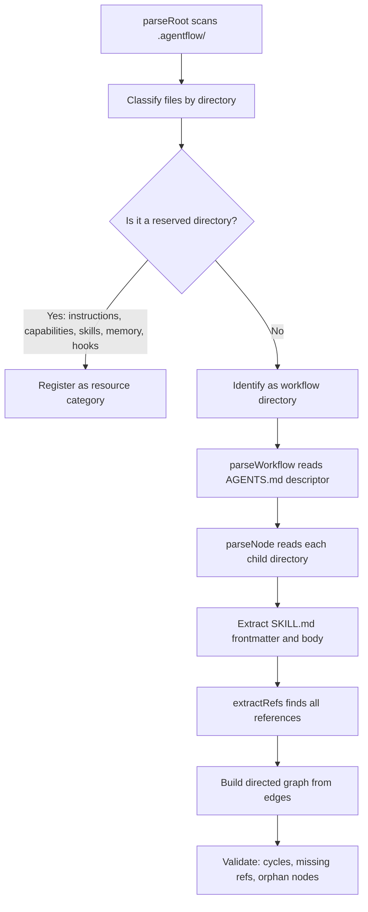

Most agent orchestration tools require you to write code — define agents as classes, wire them together with function calls, manage state through APIs. AgentFlow takes a different approach: the folder structure IS the architecture. No framework code, no orchestration layer — just folders, markdown files, and references.

This idea comes from a simple observation: if the prompts and context for each stage of a workflow already exist as files in a well-organized folder hierarchy, you don't need a coordination framework. You need one agent that reads the right files at the right moment.

<Tabs items={['Framework approach', 'Directory approach']}>
  <Tab value="Framework approach">
    ```python
    # Define agents as code
    research_agent = Agent(role="researcher", tools=[search])
    writer_agent = Agent(role="writer", tools=[write_file])

    # Wire orchestration in code
    pipeline = Pipeline([
      research_agent,
      writer_agent,
    ])

    # Run with programmatic state management
    pipeline.run(topic="feature spec")
    ```

    To change anything — step order, a prompt, adding a stage — you edit code, understand abstractions, and redeploy.
  </Tab>
  <Tab value="Directory approach">
    ```
    .agentflow/
      build-feature/
        AGENTS.md
        gather-requirements/SKILL.md
        create-design/SKILL.md
        implement/SKILL.md
    ```

    To change anything — step order, a prompt, adding a stage — you rename a folder, edit a markdown file, or create a new directory.
  </Tab>
</Tabs>

| Operation | Framework | Directory |
|-----------|-----------|-----------|
| Change step order | Edit orchestration code, redeploy | Rename or reorder folders |
| Modify a prompt | Edit agent configuration in code | Edit a markdown file |
| Add a stage | Write new agent class, update orchestrator | Add a folder with SKILL.md |
| Inspect intermediate state | Add logging, build dashboard | Open the folder, read the files |
| Hand off to someone | Document environment, dependencies, setup | Copy the folder |
| Who can make changes | Developer | Anyone with a text editor |

<Callout type="info" title="Research: Interpretable Context Methodology">
  This approach is formalized in the [ICM paper](https://arxiv.org/html/2603.16021v2) (Van Clief & McDermott, 2026), which demonstrates that filesystem structure can replace framework-level orchestration for sequential, human-reviewed workflows. The paper reports adoption across content production, academic research, and policy analysis teams — including non-technical users who modified workflows by editing markdown files.
</Callout>

## Anatomy of a Workspace

An AgentFlow workspace encodes all orchestration decisions in its folder structure:

<Files>
  <Folder name=".agentflow" defaultOpen>
    <File name="AGENTS.md" />
    <Folder name="build-feature" defaultOpen>
      <File name="AGENTS.md" />
      <Folder name="gather-requirements">
        <File name="SKILL.md" />
      </Folder>
      <Folder name="create-design">
        <File name="SKILL.md" />
      </Folder>
      <Folder name="implement">
        <File name="SKILL.md" />
      </Folder>
    </Folder>
    <Folder name="instructions">
      <File name="code-style.md" />
      <File name="testing-strategy.md" />
    </Folder>
    <Folder name="capabilities">
      <File name="write-file.md" />
      <File name="run-tests.md" />
    </Folder>
    <Folder name="skills">
      <File name="tests-pass.md" />
    </Folder>
  </Folder>
</Files>

- **Sequencing** — node directories within a workflow define the steps
- **Context scoping** — each node sees only its own SKILL.md + referenced resources
- **State** — files on disk ARE the state. Outputs from one node become inputs to the next.
- **Coordination** — `{{references}}` in SKILL.md files wire nodes together

No orchestration code. No state management library. No deployment step. The filesystem does the work.

## Five Design Principles

<Steps>
  <Step>
    ### One stage, one job

    Each node directory handles a single step. A node that gathers requirements doesn't also write code. This follows the Unix principle — programs that do one thing well.

    ```
    gather-requirements/SKILL.md   → produces requirements doc
    create-design/SKILL.md         → produces design doc
    implement/SKILL.md             → produces working code
    ```
  </Step>
  <Step>
    ### Plain text as the interface

    Nodes communicate through markdown files and `{{references}}`. No binary formats, no database connections, no proprietary serialization. Any tool that reads text can participate.
  </Step>
  <Step>
    ### Every output is an edit surface

    The intermediate output of each node is a file you can open, read, and edit. If the design doc needs adjustment before implementation begins, you edit it directly. The next node reads whatever you left there.
  </Step>
  <Step>
    ### Layered context loading

    Agents load only the context they need for the current node. Irrelevant context is never loaded in the first place. See [Selective Context](/docs/concepts/selective-context) for the full 5-layer model.
  </Step>
  <Step>
    ### Configure the factory, not the product

    A workspace is set up once with your conventions, tools, and structural decisions. After that, each run produces a new deliverable using the same configuration. The workspace improves over time; individual outputs are disposable.
  </Step>
</Steps>

## Tradeoffs

<Accordions>
  <Accordion title="Good fit — when directories work well">
    - Sequential workflows where step 2 follows step 1
    - Workflows where a human reviews output at each step
    - Repeatable pipelines that run daily/weekly with different input
    - Teams where non-developers need to modify agent behavior
    - Projects that need version control and diffable history

    Examples: feature development, content pipelines, code review, incident response, customer support workflows.
  </Accordion>
  <Accordion title="Not a good fit — when to use a framework instead">
    - Real-time multi-agent collaboration with tight feedback loops
    - High-concurrency systems with many simultaneous users
    - Complex branching logic based on AI decisions mid-pipeline
    - Dynamic agent spawning based on runtime conditions

    For these cases, frameworks like LangGraph, CrewAI, or AutoGen provide the message-passing infrastructure that file-based handoffs can't match.
  </Accordion>
  <Accordion title="Why markdown over YAML/JSON?">
    - **LLM-native** — language models produce and consume markdown naturally. It's the format they're trained on most.
    - **Human-readable** — no syntax noise, just prose with structure. Non-developers can read and edit it.
    - **Diffable** — meaningful git diffs. You can see exactly what changed in a PR.
    - **Extensible** — frontmatter for structured data (YAML), body for freeform content (markdown). Best of both worlds.
    - **Universal** — every editor, every platform, every tool understands markdown.

    ```yaml
    ---
    name: implement
    type: step
    outputs:
      - name: implementation
        format: code
    ---

    # Implement the Feature

    Structured frontmatter for machine-readable config.
    Freeform markdown body for the actual instructions.
    References like {{instructions/code-style}} for context assembly.
    ```
  </Accordion>
</Accordions>

## On the Canvas

This entire workflow — 9 nodes, conditional routing, approval gates, data flow between steps — is defined as folders and markdown files. Expand the Explorer panel to see the directory tree that produces this graph. Every folder is a node, every AGENTS.md is a descriptor.

<ComponentPreview title="build-feature — a 9-node workflow defined entirely in directories" height="lg">
  <DocsPlayground workflow="build-feature" panel="explorer" />
</ComponentPreview>

## How the Parser Reads Your Directories

The core insight of AgentFlow is that your folder structure IS the program. The parser doesn't interpret code — it reads directories. Here is the exact flow:



Each stage of this pipeline maps directly to a filesystem operation:

1. **parseRoot** performs a single directory listing of `.agentflow/`. It separates reserved directories (instructions, capabilities, skills, memory, hooks) from everything else. Non-reserved directories are workflows.

2. **parseWorkflow** reads the `AGENTS.md` file inside each workflow directory. This file provides the workflow's name, description, and metadata. The parser then lists subdirectories — each one is a node.

3. **parseNode** reads the `SKILL.md` inside each node directory. It parses YAML frontmatter for typed metadata (name, type, entry, outputs, context config) and the markdown body for instructions.

4. **extractRefs** scans the markdown body with a regex for `{{...}}` patterns. Each match is classified by prefix: `->` for edges, `<<` for data flow, `$` for template variables, and bare references for resource mentions.

5. **Build graph** — edge references (`{{-> nodes/target}}`) become directed edges. The result is a DAG (directed acyclic graph) that represents execution order. The validator checks for cycles, unreachable nodes, and missing references.

The key consequence: there is no "orchestration layer" to understand. The parser is a pure function from filesystem state to graph structure. If you can read a directory listing, you can understand the program.

### Why This Matters for Debugging

When something goes wrong in a framework-based system, you trace through abstraction layers — middleware, event buses, state machines. In AgentFlow, debugging means:

- Open the node's folder
- Read its SKILL.md
- Check which references it declares
- Verify those files exist and contain what you expect

The filesystem is the single source of truth. There is no hidden state, no runtime configuration that diverges from what's on disk.

## Comparison with Framework Approaches

AgentFlow is not the only way to orchestrate AI agents. Here is a deeper comparison with the major frameworks, focusing on what each optimizes for and the tradeoffs involved.

| Dimension | LangGraph | CrewAI | AutoGen | AgentFlow |
|-----------|-----------|--------|---------|-----------|
| **Abstraction** | Python classes, state machines | Agent roles, task delegation | Multi-agent chat protocols | Directories, markdown, references |
| **Orchestration model** | Explicit graph with conditional edges in code | Manager agent delegates to worker agents | Agents converse until consensus | Filesystem structure defines execution order |
| **State management** | Typed state dict passed between nodes | Shared memory + task outputs | Chat history between agents | Files on disk. Outputs are files. |
| **Modification requires** | Python knowledge, understanding of state schema | Python knowledge, understanding of role system | Python knowledge, understanding of chat patterns | Text editor, understanding of folder structure |
| **Optimized for** | Complex conditional logic, cycles, human-in-the-loop | Team simulation, role-based decomposition | Emergent collaboration, debate, refinement | Sequential workflows, human review, reproducibility |
| **Concurrency** | Native async, parallel branches | Task-level parallelism | Multi-agent simultaneous chat | Sequential by default (parallel via gateway nodes) |
| **Debugging** | Step through Python, inspect state dict | Read agent logs, check delegation chain | Read chat transcripts | Open folder, read markdown files |
| **Version control** | Code diffs (meaningful but verbose) | Code diffs | Code diffs | Markdown diffs (highly readable) |
| **Non-developer access** | No — requires Python | No — requires Python | No — requires Python | Yes — requires text editor |
| **Dynamic behavior** | Full Turing-complete branching | Agent decides delegation at runtime | Emergent from conversation | Limited to predefined conditional edges |

### When to Choose What

**Choose LangGraph** when your workflow has complex branching logic that depends on runtime state — loops, retries, conditional paths that can't be predetermined. LangGraph gives you a full programming language to express arbitrary control flow.

**Choose CrewAI** when your problem decomposes naturally into roles — a researcher, a writer, a reviewer — and you want agents to delegate subtasks to each other dynamically.

**Choose AutoGen** when you want multiple agents to debate, refine, and converge on a solution through conversation. This works well for tasks where the "right answer" emerges from iteration rather than a predetermined sequence.

**Choose AgentFlow** when your workflow is sequential or mostly sequential, when humans need to review intermediate outputs, when non-developers need to modify agent behavior, and when you want full transparency into what each step sees and produces. AgentFlow trades dynamic flexibility for interpretability and accessibility.

<Cards>
  <Card title="Selective Context" href="/docs/concepts/selective-context" description="How the 5-layer model delivers focused context per node" />
  <Card title="AGENTS.md Standard" href="/docs/concepts/agents-md-standard" description="The open standard AgentFlow builds on" />
  <Card title="Workspaces" href="/docs/concepts/workspaces" description="What .agentflow/ is and how it's structured" />
</Cards>
