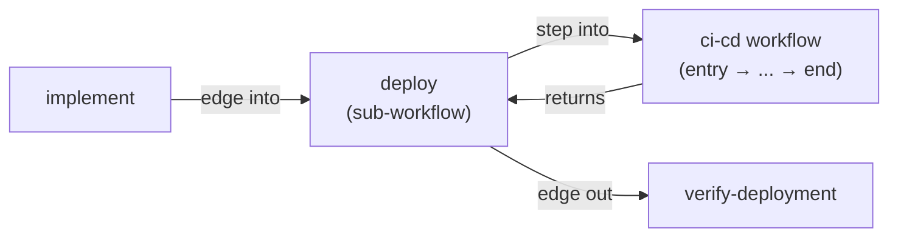
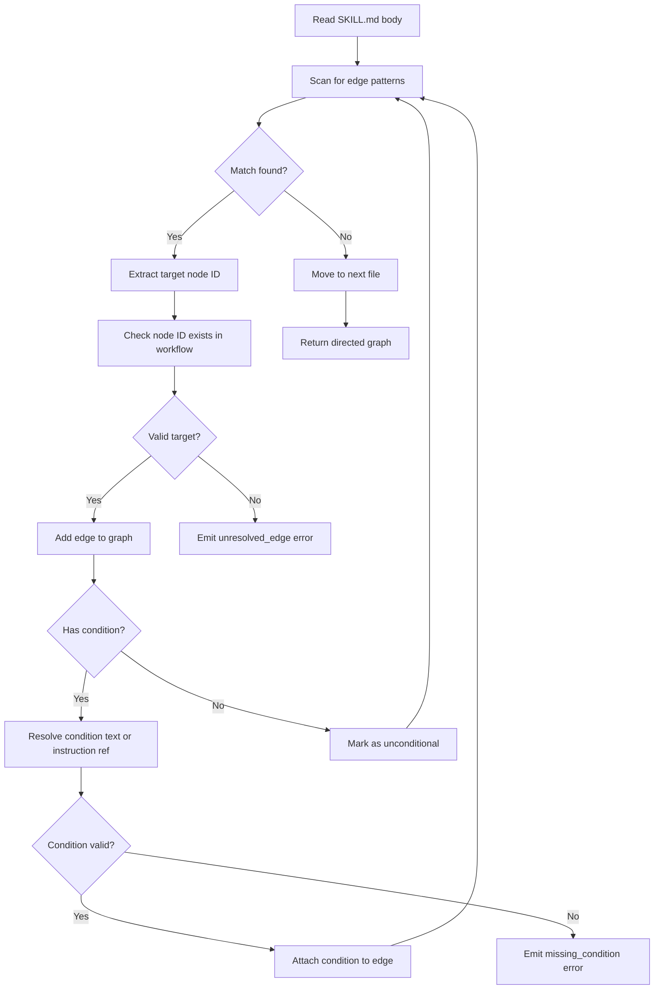

Edges connect nodes in a workflow. They're declared as `{{references}}` inside SKILL.md files — the parser reads them and builds the directed graph.

## Three Edge Types

<Tabs items={['Unconditional', 'Conditional', 'Data flow']}>
  <Tab value="Unconditional">
    Always go to the target node after this one completes.

    ```markdown
    {{-> nodes/create-design}}
    ```
  </Tab>
  <Tab value="Conditional">
    Go to the target node only if a condition is met. The condition is defined inline after the pipe.

    ```markdown
    {{-> nodes/plan-tasks | design approved by user}}
    {{-> nodes/create-design | design rejected or changes requested}}
    ```

    Conditions can also reference instruction files for reusable criteria:

    ```markdown
    {{-> nodes/plan-tasks | instructions/approval-criteria}}
    ```

    When referencing an instruction, the instruction content (with narrativeTemplate wrapping) becomes the condition description.
  </Tab>
  <Tab value="Data flow">
    Load another node's output into this node's context. Not a flow edge — it controls context assembly, not execution order.

    ```markdown
    Using the design from {{<< output.create-design}}, implement the feature.
    ```

    Data flow refs can only point backward in the graph — to nodes that execute before the current one.
  </Tab>
</Tabs>

<Callout type="info" title="💡 Instruction references in conditions">
  Conditions can reference instructions: `{{-> target | instructions/approval-criteria}}`. The instruction content (with narrativeTemplate wrapping) becomes the condition description.
</Callout>

## Control Flow vs Data Flow

<TypeTable type={{
  'Control flow': {
    description: 'Determines execution order — "after this node, go there"',
    type: '{{-> nodes/target}}',
    default: 'Forward direction',
  },
  'Conditional control flow': {
    description: 'Conditional routing via inline condition text or instruction reference',
    type: '{{-> nodes/target | condition text}}',
    default: 'Forward direction',
  },
  'Data flow': {
    description: 'Loads prior output into context — "I need this node\'s result"',
    type: '{{<< output.node}}',
    default: 'Backward direction',
  },
}} />

A node can have both:

```markdown
# implement/SKILL.md

Using the design from {{<< output.create-design}}, implement the feature.

{{-> nodes/verify-feature}}
```

This node loads the design output (data flow) AND declares that `verify-feature` runs next (control flow).

## Conditional Routing with Inline Conditions

Conditional edges use inline condition text after the pipe `|` to describe when the edge should be followed:

```markdown
{{-> nodes/plan-tasks | all tasks completed and tests pass}}
{{-> nodes/create-design | design needs revision}}
```

Any node with conditional edges is automatically rendered as a diamond-shaped gateway (router) on the canvas. You don't need a special node type — just add conditional edges to a step.

<Callout type="warn" title="Validation">
  The validator emits `missing_condition` if a conditional edge references an instruction that doesn't exist. It emits `unresolved_edge` if the target node doesn't exist.
</Callout>

<Accordions>
  <Accordion title="Cycles and loops">
    Workflows must be directed acyclic graphs — no infinite loops. However, conditional edges that loop back are allowed because they represent human-controlled iteration:

    ```markdown
    # review-design-gate/SKILL.md
    {{-> nodes/plan-tasks | design approved by user}}
    {{-> nodes/create-design | design rejected or changes requested}}  ← loops back
    ```

    This is valid because a human decides whether to loop. The validator only flags cycles that have no conditional exit.
  </Accordion>
</Accordions>

## Sub-workflow Edges

When an edge leads into a sub-workflow node, the agent enters the referenced workflow and executes it from its entry point. Once the sub-workflow completes, control returns to the parent workflow and follows the sub-workflow node's outgoing edge to the next step.



The parent workflow does not need to know the internal structure of the sub-workflow. It only sees the sub-workflow node as a single step with an incoming edge and an outgoing edge.

## Explore Edges in the Studio

The canvas below shows the build-feature workflow with all its edges. Notice the diamond-shaped nodes (steps with conditional edges) rendered as gateways. Click any edge to see its label — conditional edges show the condition text.

<ComponentPreview title="build-feature edges and routing" height="lg">
  <DocsPlayground workflow="build-feature" />
</ComponentPreview>


## Edge Resolution at Parse Time

When the parser processes a workflow, it scans every SKILL.md body for edge references, resolves them against known node IDs, and assembles the directed graph.



The parser performs three passes:

### Pass 1 — Node discovery

Scan all directories for SKILL.md files. Register each node by its directory name as the canonical ID.

### Pass 2 — Edge extraction

For each SKILL.md body, find all `{{-> ...}}` and `{{<< ...}}` patterns. Parse the target ID and optional condition from each match.

### Pass 3 — Graph assembly

Create directed edges between source and target nodes. Validate that all targets exist, all condition references resolve, and no unconditional cycles exist.

## Edge Validation Rules

The validator enforces these rules on edges during the validation phase:

| Rule ID | Severity | Condition | Example |
|---------|----------|-----------|---------|
| `unresolved_edge` | error | Target node ID does not exist in the workflow | `{{-> nodes/nonexistent}}` references a node that has no directory |
| `missing_condition` | error | Conditional edge references an instruction that does not exist | `{{-> nodes/x \| instructions/missing}}` where `instructions/missing.md` is absent |
| `unconditional_cycle` | error | An unconditional edge creates a cycle with no conditional exit | `A -> B -> A` where both edges are unconditional |
| `data_flow_forward` | error | A data flow ref points to a node that executes after the current one | `{{<< output.later-node}}` where `later-node` has not yet executed |
| `orphan_node` | warning | A node has no incoming edges and is not the entry point | Node exists but nothing routes to it |
| `duplicate_edge` | warning | Two identical edges between the same source and target | `{{-> nodes/x}}` appears twice in the same SKILL.md |
| `self_referencing_edge` | error | A node has an edge pointing to itself | `{{-> nodes/self}}` inside `self/SKILL.md` |

<Cards>
  <Card title="Nodes" href="/docs/concepts/nodes" description="Steps and sub-workflows" />
  <Card title="Resources" href="/docs/concepts/resources" description="The five resource categories" />
  <Card title="Validation Rules" href="/docs/reference/validation-rules" description="All edge-related validation rules" />
  <Card title="Ref Syntax" href="/docs/reference/ref-syntax" description="Complete reference syntax" />
</Cards>
