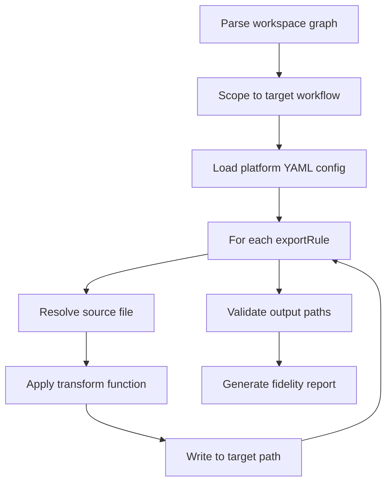

AgentFlow workflows are platform-agnostic — they're defined as markdown files in directories. The export system transforms them into the format each target platform expects.

One workspace, seven export targets.

## Three Export Modes

<Tabs items={['Raw', 'Parsed', 'Platform']}>
  <Tab value="Raw">
    Files as-is, no transformation. Template variables and references are left unresolved.

    Use when you want the source files for manual processing or custom tooling.
  </Tab>
  <Tab value="Parsed">
    References resolved to file paths. Template variables expanded. The output is a self-contained set of files with all references inlined.

    Use when you want resolved content but don't need platform-specific structure.
  </Tab>
  <Tab value="Platform">
    Full transformation to a target platform's expected format. Directory structure, file naming, and content format all match the platform's conventions.

    Use when deploying to a specific agent platform.
  </Tab>
</Tabs>

## Supported Platforms

<TypeTable type={{
  'Claude Code': {
    description: 'AGENTS.md + SKILL.md in .claude/ directory',
    type: 'claude-code',
    default: '.claude/',
  },
  'Cursor': {
    description: 'Rules (.mdc) in .cursor/ directory',
    type: 'cursor',
    default: '.cursor/',
  },
  'Kiro': {
    description: 'Specs + steering in .kiro/ directory',
    type: 'kiro',
    default: '.kiro/',
  },
  'Windsurf': {
    description: 'Rules (.md) in .windsurf/ directory',
    type: 'windsurf',
    default: '.windsurf/',
  },
  'VS Code Copilot': {
    description: 'Instructions (.md) in .github/copilot/',
    type: 'vscode-copilot',
    default: '.github/copilot/',
  },
  'OpenClaw': {
    description: 'Single openclaw.yaml file',
    type: 'openclaw',
    default: '—',
  },
  'Agent Spec': {
    description: 'Single agent-spec.json file — the primary interchange format',
    type: 'agent-spec',
    default: '—',
  },
}} />

## The Export Pipeline

Export is handled server-side via the `/api/export` endpoint. The pipeline follows four stages:

<Steps>
  <Step>
    ### Parse

    Read all files in the workspace, build the graph, and resolve all `{{references}}` to their target files.
  </Step>
  <Step>
    ### Validate

    Check for errors. Export blocks on errors — you can't export a broken workspace. Warnings are reported but don't block.
  </Step>
  <Step>
    ### Transform

    Apply platform-specific transforms defined in YAML config files in `configs/platforms/`. Each platform config defines file naming conventions, content format, and directory structure.

    | Source | Transformation |
    |--------|---------------|
    | Root `AGENTS.md` | Becomes the platform's identity file |
    | Workflow `AGENTS.md` | Merged into workflow instructions |
    | Node `SKILL.md` files | Become platform-specific task files |
    | `{{references}}` | Resolved to inline content |
    | `{{$variables}}` | Expanded to actual values |
    | Resource files | Inlined where referenced |
  </Step>
  <Step>
    ### Write

    Output the transformed files to the target directory. The original `.agentflow/` workspace is never modified.
  </Step>
</Steps>

<Callout type="info" title="💡 Adding new platforms">
  Adding a new platform = adding a YAML config in `configs/platforms/`. No code changes needed.
</Callout>

## Platform Output Examples

<Tabs items={['Claude Code', 'Cursor', 'Kiro']}>
  <Tab value="Claude Code">
    ```
    .claude/
      AGENTS.md              ← workspace identity
      skills/
        build-feature/
          SKILL.md           ← workflow as a skill
    ```

    Claude Code natively understands AGENTS.md and SKILL.md, so the export is close to the source format with references resolved.
  </Tab>
  <Tab value="Cursor">
    ```
    .cursor/
      rules/
        build-feature.mdc    ← workflow as a rule file
    ```

    Cursor uses `.mdc` rule files. The export merges identity, workflow description, and node instructions into a single rule file per workflow.
  </Tab>
  <Tab value="Kiro">
    ```
    .kiro/
      specs/
        build-feature.md     ← workflow specification
      steering/
        rules.md             ← workspace constraints
    ```

    Kiro separates specs (what to build) from steering (how to behave). The export maps workflows to specs and identity/instructions to steering.
  </Tab>
</Tabs>

## Using Export

### From the studio

Open the Export dialog (`Cmd+Shift+E`) → select format and platform → download or copy. The studio calls the `/api/export` endpoint server-side.

### From the API

```bash
# Export to a specific platform
curl -X POST /api/export -d '{"platform": "claude-code", "workflow": "build-feature"}'

# Export in parsed format (no platform transform)
curl -X POST /api/export -d '{"format": "parsed", "workflow": "build-feature"}'
```

<Callout type="info" title="Custom platforms">
  You can create your own platform config by adding a YAML file to `configs/platforms/`. See [Custom Platform](/docs/guides/custom-platform) for a step-by-step guide.
</Callout>

## Explore the Workflow

The canvas below shows the build-feature workflow that gets exported. Each node, edge, and resource reference is transformed during export. Click any node to see its references — those are the files that get inlined into the platform output.

<ComponentPreview title="build-feature — the workflow that gets exported" height="lg">
  <DocsPlayground workflow="build-feature" panels={['elements', 'explorer']} />
</ComponentPreview>


## The Transform Pipeline

The platform export is a multi-stage pipeline that processes each export rule defined in the platform's YAML configuration.



### Parse workspace graph

The full workspace is parsed into an in-memory representation: nodes, edges, resources, identity layers, and template variables. This is the same parse step used by the validator.

### Scope to target workflow

If exporting a single workflow, the graph is scoped to only that workflow's nodes and their referenced resources. Global resources that are referenced are included; unreferenced globals are excluded.

### Load platform config

Each platform has a YAML configuration file (e.g., `configs/platforms/claude-code.yaml`) that defines export rules. Each rule maps a source pattern to a target path with an optional transform function.

### Process export rules

For each rule in the platform config:

1. **Resolve source** — match the rule's source pattern against workspace files (e.g., `workflows/*/AGENTS.md`)
2. **Apply transform** — run the transform function that converts content to the platform's expected format (inline references, rewrite headers, merge files)
3. **Write target** — output the transformed content to the platform-specific path

### Validate output paths

After all rules are processed, the pipeline checks that output paths do not conflict, required files exist, and the directory structure matches platform expectations.

### Generate fidelity report

The pipeline produces a report showing what was preserved, what was translated, and what was lost during export. This helps authors understand the tradeoffs of each platform target.

## Fidelity Levels

Not every AgentFlow feature maps cleanly to every platform. The export system classifies each feature's support level per platform:

### Native

The platform supports this feature directly with equivalent semantics. No information is lost.

**Example:** Exporting `AGENTS.md` identity to Claude Code. Claude Code natively reads AGENTS.md files, so the export copies the file with references resolved — full fidelity.

### On-demand

The platform supports the feature but requires a different structure. The exporter restructures content to fit.

**Example:** Exporting conditional edges to Cursor. Cursor rules do not have native edge syntax, so the exporter converts edge logic into rule conditions with `globs` and `alwaysApply` fields. The routing logic is preserved but expressed differently.

### Translated

The platform has a partial equivalent. Some semantics are preserved but the mapping is lossy.

**Example:** Exporting per-node `context.max_tokens` to VS Code Copilot. Copilot does not support per-instruction token budgets, so the exporter translates this into instruction ordering (higher-budget instructions appear first) and adds a comment noting the original budget. The intent is communicated but not enforced.

### Preserved

The platform has no equivalent. The exporter includes the information as documentation (comments or metadata) so it is not lost, but the platform will not act on it.

**Example:** Exporting `context.exclude` glob patterns to OpenClaw. OpenClaw has no context exclusion mechanism, so the exporter adds the patterns as YAML comments in the output file. A human reading the file can see the intent, but the platform ignores it.

<Cards>
  <Card title="Export Formats Reference" href="/docs/reference/export-formats" description="Detailed specs for each format" />
  <Card title="Platform Configs" href="/docs/reference/platform-configs" description="All 7 platform configurations" />
  <Card title="Export to Claude" href="/docs/guides/export-to-claude" description="Step-by-step export guide" />
  <Card title="Custom Platform" href="/docs/guides/custom-platform" description="Create your own export target" />
</Cards>
