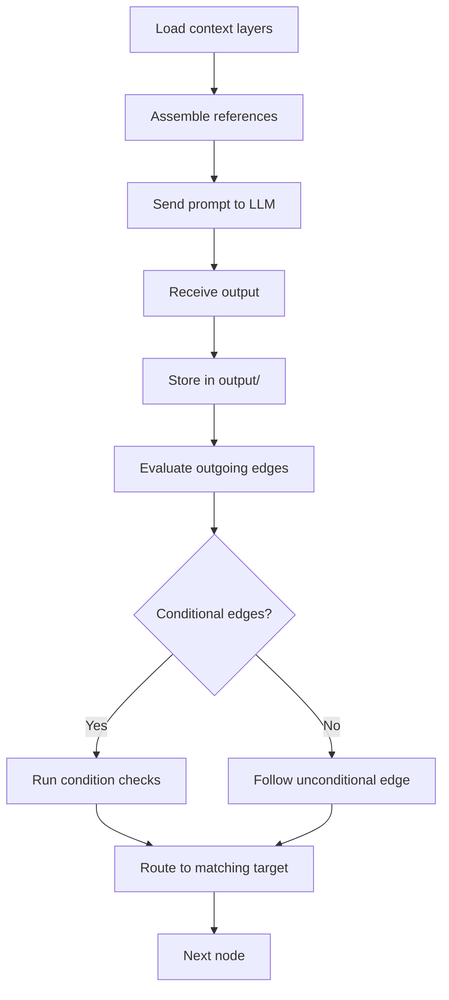
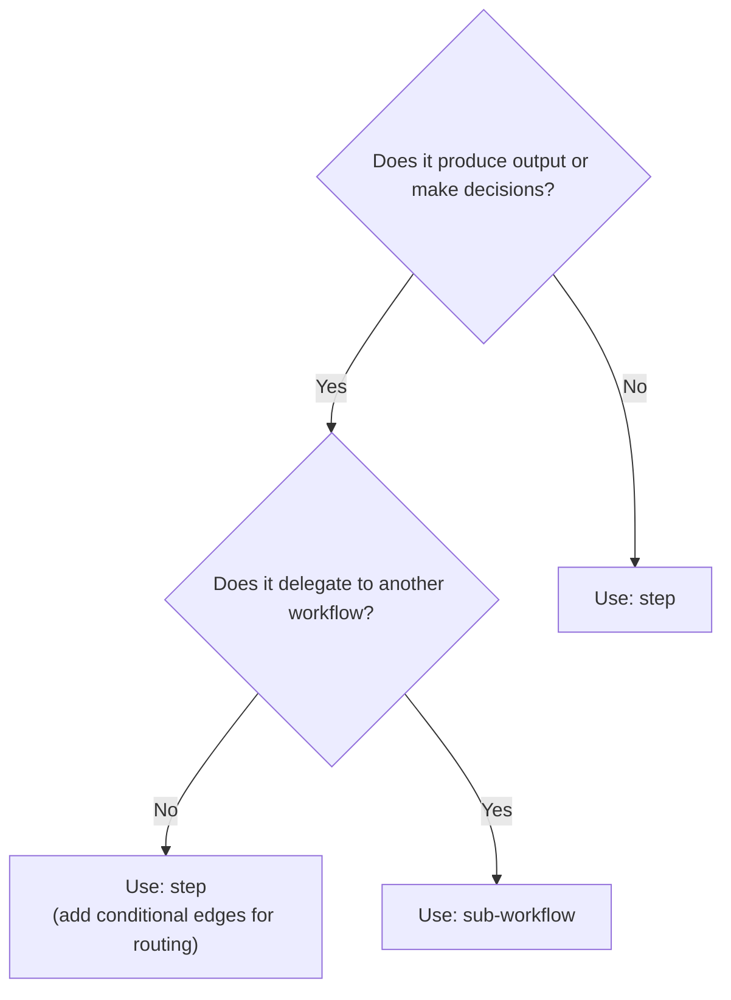

A node is a single step in a workflow. Each node lives in its own directory and contains a `SKILL.md` file that defines what the agent does at that step.

AgentFlow has two node types: **steps** and **sub-workflows**. Nodes with conditional edges are automatically rendered as routers (diamond-shaped gateways) on the canvas.

<Callout type="info" title="💡 Router inference">
  Router nodes are inferred automatically. Any node with conditional edges renders as a gateway on the canvas. You don't need to declare a router type — just add conditional edges to a step.
</Callout>

## Two Types

<Tabs items={['Step', 'Sub-workflow']}>
  <Tab value="Step">
    A step does work — it produces output. This is the default and most common node type.

    ```yaml
    # gather-requirements/SKILL.md
    ---
    name: gather-requirements
    type: step
    entry: true
    outputs:
      - name: requirements-doc
        format: markdown
        description: Structured requirements document
    ---

    # Gather Requirements

    Interview the user to understand what they want to build.
    Reference {{instructions/requirements-elicitation}} for technique.

    {{-> nodes/review-requirements-gate}}
    ```

    Steps can reference resources, declare outputs, and have edges to other nodes. Steps with conditional edges act as decision points — routing to different nodes based on conditions:

    ```yaml
    # review-design-gate/SKILL.md
    ---
    name: review-design-gate
    type: step
    ---

    # Review Design Gate

    Present the design from {{<< output.create-design}} to the user.

    ## Routing

    - If approved → {{-> nodes/plan-tasks | design approved by user}}
    - If rejected → {{-> nodes/create-design | design rejected or changes requested}}
    ```

    This node has conditional edges, so it renders as a diamond-shaped gateway on the canvas.
  </Tab>
  <Tab value="Sub-workflow">
    A sub-workflow delegates to another workflow. When the agent reaches this node, it steps into the referenced workflow, executes it to completion, then returns to the parent workflow and continues along the outgoing edge.

    The `workflow` field in frontmatter names the target workflow. In the SKILL.md body, use the `{{workflows/name}}` reference pattern to link to the target workflow's `AGENTS.md`:

    ```yaml
    # deploy/SKILL.md
    ---
    name: deploy
    type: sub-workflow
    workflow: ci-cd
    ---

    # Deploy

    ## When to enter

    All implementation tasks are complete and tests pass.

    ## Context passed in

    - Build artifacts from {{<< output.implement}}
    - Deployment configuration from {{instructions/deploy-config}}

    ## Expected outcome

    Application is deployed to the target environment and health checks pass.

    ## Workflow definition

    {{workflows/ci-cd}}
    ```

    For nested sub-workflows, create the target workflow directory inside the parent workflow with its own `AGENTS.md`. The nested workflow is a fully independent workflow with its own nodes and resources.
  </Tab>
</Tabs>

## SKILL.md Frontmatter

Every node's SKILL.md has two parts: frontmatter (YAML) and body (markdown). The body is what the agent reads as its task description.

<TypeTable type={{
  name: {
    description: 'Node identifier — must match directory name',
    type: 'string',
    required: true,
  },
  type: {
    description: 'Node type',
    type: '"step" | "sub-workflow"',
    required: true,
  },
  entry: {
    description: 'Whether this is the workflow entry point',
    type: 'boolean',
    default: 'false',
  },
  description: {
    description: 'Brief description of what this node does',
    type: 'string',
  },
  outputs: {
    description: 'Declared outputs (name, format, description)',
    type: 'OutputDeclaration[]',
  },
  workflow: {
    description: 'Referenced workflow (sub-workflow type only)',
    type: 'string',
  },
  agent: {
    description: 'Override agent persona for this node',
    type: 'string',
  },
  model: {
    description: 'Preferred model (e.g. claude-sonnet-4-20250514)',
    type: 'string',
  },
  'context.max_tokens': {
    description: 'Token budget ceiling for this node',
    type: 'number',
  },
  'context.inputs': {
    description: 'Explicit external inputs with scope control',
    type: 'ContextInput[]',
  },
  'context.exclude': {
    description: 'Glob patterns to exclude from context',
    type: 'string[]',
  },
}} />

<Callout type="info" title="Full schema reference">
  See [Frontmatter Schema](/docs/reference/frontmatter-schema) for the complete field reference with types, defaults, and validation rules.
</Callout>

## Outputs and Data Flow

Steps can declare outputs that other nodes reference via `{{<< output.node-name}}`:

```yaml
outputs:
  - name: requirements-doc
    format: markdown
    description: Structured requirements with acceptance criteria
  - name: user-stories
    format: markdown
    description: User stories derived from requirements
```

Outputs are the data flow mechanism — they're how information passes between nodes without loading everything into a single context.

## Explore Nodes in the Studio

Click any node on the canvas to see its type, frontmatter fields, and connections. The Elements panel shows all resources referenced by nodes. Switch to the Tokens panel to see how each node's context budget is consumed.

<ComponentPreview title="build-feature nodes" height="lg">
  <DocsPlayground workflow="build-feature" panels={['elements', 'tokens']} />
</ComponentPreview>


## Node Execution Model

When the runtime reaches a node, it follows a fixed sequence to assemble context, invoke the LLM, and determine the next step.



### Load context layers

The runtime assembles the node's context from five layers (see [Selective Context](/docs/concepts/selective-context)):

1. Workspace identity (root AGENTS.md)
2. Workflow descriptor (workflow AGENTS.md)
3. Node instructions (SKILL.md body)
4. Referenced resources (instructions, capabilities, skills)
5. Prior node outputs (data flow refs)

### Assemble references

All `{{instructions/...}}`, `{{capabilities/...}}`, and `{{<< output.x}}` references in the SKILL.md body are resolved. File contents are loaded and inserted into the prompt at their reference positions.

### Send prompt to LLM

The assembled context is sent to the configured model. The node's `model` and `context.max_tokens` frontmatter fields control which model is used and the token budget ceiling.

### Store output

The LLM response is stored in the node's output slot. Other nodes can access it via `{{<< output.node-name}}` data flow references.

### Evaluate edges and route

The runtime checks all outgoing edges. For unconditional edges, it proceeds immediately. For conditional edges, it evaluates each condition and follows the first matching path.

## Choosing the Right Node Type

Use this decision process to determine which node type fits your use case:



### Step

The default choice. Use a step when the node needs to do work and produce output — write code, generate a document, analyze data, gather information from the user.

Steps with conditional outgoing edges automatically render as diamond-shaped gateways on the canvas. This makes them capable of routing decisions alongside their primary work. Common patterns:

- Approval gates (present work, ask for approval, route based on response)
- Completion checks (are all tasks done? route to finish or loop back)
- Triage decisions (classify input, route to the appropriate handler)

### Sub-workflow

Use a sub-workflow when the node should execute an entire separate workflow and return. This is useful for:
- Reusable processes (a deploy workflow called from multiple parent workflows)
- Complex sub-tasks that have their own multi-step logic
- Keeping the parent workflow readable by abstracting detail

<Cards>
  <Card title="Edges" href="/docs/concepts/edges" description="How nodes connect — unconditional and conditional flow" />
  <Card title="Writing Nodes" href="/docs/authoring/writing-nodes" description="How to write SKILL.md files" />
  <Card title="Frontmatter Schema" href="/docs/reference/frontmatter-schema" description="Complete field reference" />
</Cards>
