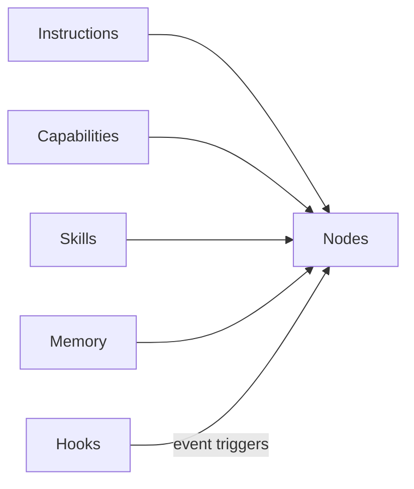

Resources are the reusable building blocks that nodes reference. They live in dedicated directories and are loaded into a node's context only when explicitly referenced via `{{category/name}}`.

<Files>
  <Folder name=".agentflow" defaultOpen>
    <Folder name="instructions" defaultOpen>
      <File name="code-style.md" />
      <File name="testing-strategy.md" />
    </Folder>
    <Folder name="capabilities" defaultOpen>
      <File name="write-file.md" />
      <File name="run-tests.md" />
    </Folder>
    <Folder name="skills" defaultOpen>
      <Folder name="review-design" defaultOpen>
        <File name="SKILL.md" />
        <Folder name="references" />
        <Folder name="scripts" />
        <Folder name="assets" />
      </Folder>
    </Folder>
    <Folder name="memory" defaultOpen>
      <File name="decisions.md" />
    </Folder>
    <Folder name="hooks" defaultOpen>
      <File name="diagnostics-after-write.json" />
    </Folder>
  </Folder>
</Files>



## Five Categories

<Accordions>
  <Accordion title="Instructions — guidance and conventions">
    The agent treats these as constraints to follow. Referenced as `{{instructions/name}}`.

    ```yaml
    # instructions/code-style.md
    ---
    name: Code Style
    ---

    ## TypeScript Conventions

    - Use strict mode
    - Prefer functional patterns
    - No `any` types — use `unknown` and narrow
    ```

    Instructions are scoped by position in the directory tree: place them at the workspace level for global access, or inside a workflow directory for workflow-scoped access.
  </Accordion>
  <Accordion title="Capabilities — tool definitions">
    What the agent can do. Referenced as `{{capabilities/name}}`. Types: `builtin`, `script`, `mcp`, `package`.

    ```yaml
    # capabilities/agent-browser.md
    ---
    type: builtin
    name: agent-browser
    description: Browser automation CLI for AI agents.
    allowed-tools: Bash(agent-browser:*), Bash(npx agent-browser:*)
    ---

    Browser automation CLI for AI agents. Uses Chrome/Chromium via CDP.
    ```
  </Accordion>
  <Accordion title="Skills — directory-based reusable components">
    Skills are directory-based: each skill lives in `skills/name/SKILL.md` with optional `references/`, `scripts/`, and `assets/` subdirectories. Referenced as `{{skills/name}}`.

    Skills use progressive disclosure: metadata (frontmatter) → body (instructions) → references (supporting files).

    ```
    skills/
      review-design/
        SKILL.md            ← skill definition
        references/         ← supporting documents
        scripts/            ← automation scripts
        assets/             ← images, templates, etc.
    ```

    ```yaml
    # skills/review-design/SKILL.md
    ---
    name: review-design
    description: Present design for user review and approval
    ---

    # Review Design

    Present the design document to the user and collect feedback.
    Ask for explicit approval or specific change requests.
    ```
  </Accordion>
  <Accordion title="Memory — persistent state">
    Decisions, preferences, and context that persists across workflow runs. Referenced as `{{memory/name}}`. The only resource category the agent can write to during execution.

    ```yaml
    # memory/decisions.md
    ---
    name: Architecture Decisions
    ---

    ## 2024-03-15: Database Choice

    Chose PostgreSQL over MongoDB for relational data integrity.
    ```
  </Accordion>
  <Accordion title="Hooks — event triggers">
    JSON files (not markdown) defining event → condition → action pipelines that run automatically.

    ```json
    {
      "name": "diagnostics-after-write",
      "event": "fileEdited",
      "condition": {
        "field": "path",
        "operator": "matches",
        "value": "\\.(ts|tsx|js|jsx)$"
      },
      "action": {
        "type": "trigger-workflow",
        "target": "get-diagnostics"
      },
      "enabled": true
    }
    ```
  </Accordion>
</Accordions>

<Callout type="info" title="💡 Discover tab">
  Skills from skills.sh can be installed directly from the Discover tab in the studio.
</Callout>

## Scoping

Resources are scoped by their position in the directory tree:

<Tabs items={['Global', 'Workflow-scoped']}>
  <Tab value="Global">
    ```
    .agentflow/instructions/code-style.md
    ```

    Available to all workflows.
  </Tab>
  <Tab value="Workflow-scoped">
    ```
    .agentflow/build-feature/instructions/requirements-elicitation.md
    ```

    Available only to nodes within `build-feature`. If both levels have a file with the same name, the workflow-scoped version takes precedence.
  </Tab>
</Tabs>

## Loading

Resources are Layer 3 in the selective context model. They're loaded only when a node explicitly references them:

```markdown
# implement/SKILL.md

Follow {{instructions/code-style}} conventions.
Use {{capabilities/write-file}} and {{capabilities/run-tests}}.
```

This node loads 3 resources. All other resources in the workspace are excluded. See [Selective Context](/docs/concepts/selective-context) for the full loading model.

<Callout type="info" title="Validation">
  The validator checks that every `{{category/name}}` reference points to an existing file. If not, it emits a `broken_ref` error. It also warns about `unknown_category` if you reference a directory that isn't one of the five standard categories.
</Callout>

## Explore Resources in the Studio

The Elements panel below shows all resources in the build-feature workflow, organized by category — capabilities, instructions, skills. Click any resource to see which nodes reference it. Switch to the Explorer panel to see the same resources as files in the directory tree.

<ComponentPreview title="Resources in build-feature" height="lg">
  <DocsPlayground workflow="build-feature" panels={['elements', 'explorer']} />
</ComponentPreview>

<Cards>
  <Card title="Writing Resources" href="/docs/authoring/writing-resources" description="How to create each resource type" />
  <Card title="References" href="/docs/concepts/references" description="The {{...}} syntax for loading resources" />
  <Card title="Selective Context" href="/docs/concepts/selective-context" description="How resources fit into the 5-layer model" />
</Cards>
