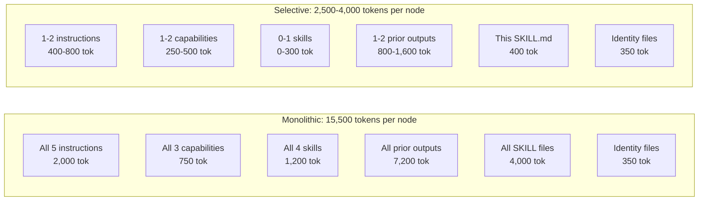

Most AI agent systems load everything into a single prompt — all instructions, all tools, all history. This works for simple tasks, but breaks down as workflows grow. The model loses focus, costs increase, and instructions from unrelated steps interfere with each other.

Selective context solves this. Instead of one large prompt, each step in a workflow receives its own focused context window — assembled from only the files it explicitly references.

AgentFlow implements selective context through its `{{reference}}` syntax and a 5-layer hierarchy that organizes all context by scope and lifecycle.

## Layers

<Callout type="info" title="💡 The 5-layer model and progressive disclosure">
  Context is assembled progressively: automatic layers (identity, routing, contract) load without explicit references, while on-demand layers (reference material, working artifacts) load only when a node's SKILL.md explicitly references them. This progressive disclosure ensures each node sees exactly what it needs — nothing more.
</Callout>

Every node in an AgentFlow workflow receives context from five distinct layers. Each layer has a clear purpose, a specific file source, and defined loading rules.

<Tabs items={['Automatic (0–2)', 'On-demand (3–4)']}>
  <Tab value="Automatic (0–2)">
    The first three layers load automatically based on where you are in the directory tree. You don't need to reference them.

    **Layer 0 — Identity** is the root `AGENTS.md` at the top of your workspace. It defines the agent's name, role, personality, and hard constraints. Every node in every workflow sees this file.

    **Layer 1 — Routing** is the workflow-level `AGENTS.md` descriptor. It provides the workflow's name, description, and high-level goal. Loaded whenever that workflow is active.

    **Layer 2 — Contract** is the node's own `SKILL.md`. This is where the actual task is defined — what to do, what to produce, and which resources to reference.

    ```yaml
    # .agentflow/build-feature/implement/SKILL.md
    ---
    name: implement
    type: step
    outputs:
      - name: implementation
        format: code
        description: Working implementation with tests
    ---

    # Implement the Feature

    Build the feature according to the approved design.
    ```
  </Tab>
  <Tab value="On-demand (3–4)">
    The last two layers load only when a node explicitly references them through `{{syntax}}`. This is where selective context happens — you choose exactly what each node sees.

    **Layer 3 — Reference Material** includes instructions, capabilities, and skills. These files are stable across runs — they represent your conventions, tool definitions, and decision criteria. Loaded via `{{category/name}}`.

    **Layer 4 — Working Artifacts** includes outputs from other nodes and memory files. These change every run — they represent the actual work product flowing through the workflow. Loaded via `{{<< output.node-name}}`.

    <Callout type="warn" title="Why the distinction matters">
      Mixing reference material and working artifacts in an undifferentiated prompt forces the model to figure out which information is a rule to follow vs. data to process. Separating them structurally gives the model clearer signals and produces more consistent output.
    </Callout>
  </Tab>
</Tabs>

## Assembly in Practice

Here is the `implement` node from the build-feature workflow:

```markdown
---
name: implement
type: step
---

# Implement the Feature

Using the design from {{<< output.create-design}}, implement the feature
following {{instructions/code-style}} conventions.

Use {{capabilities/write-file}} and {{capabilities/run-tests}} to complete the work.
```

When this node executes, the runtime resolves each `{{reference}}` and assembles the full context window:

<Steps>
  <Step>
    ### Load automatic layers

    The runtime loads the root `AGENTS.md` (~200 tokens), the workflow descriptor (~150 tokens), and this node's `SKILL.md` (~400 tokens). These are always present.
  </Step>
  <Step>
    ### Resolve references

    The parser scans the SKILL.md body for `{{...}}` expressions. It finds `{{instructions/code-style}}`, `{{capabilities/write-file}}`, `{{capabilities/run-tests}}`, and `{{<< output.create-design}}`.
  </Step>
  <Step>
    ### Assemble the window

    Each referenced file is loaded and appended to the context. The final window is ~2,250 tokens — every token relevant to this specific task.
  </Step>
</Steps>

| Source | Layer | Reason | ~Tokens |
|--------|-------|--------|---------|
| Root `AGENTS.md` | 0 | Always loaded | 200 |
| Workflow `AGENTS.md` | 1 | Workflow is active | 150 |
| `implement/SKILL.md` | 2 | Node is executing | 400 |
| `instructions/code-style.md` | 3 | `{{instructions/code-style}}` | 300 |
| `capabilities/write-file.md` | 3 | `{{capabilities/write-file}}` | 200 |
| `capabilities/run-tests.md` | 3 | `{{capabilities/run-tests}}` | 200 |
| Output from `create-design` | 4 | `{{<< output.create-design}}` | 800 |
| **Total** | | | **~2,250** |

### Excluded by design

These files exist in the workspace but are excluded from this node's context — none are referenced in `implement/SKILL.md`:

<Files>
  <Folder name="instructions">
    <File name="requirements-elicitation.md" />
    <File name="testing-strategy.md" />
    <File name="api-conventions.md" />
  </Folder>
  <Folder name="capabilities">
    <File name="read-code.md" />
    <File name="search-codebase.md" />
  </Folder>
  <Folder name="skills">
    <File name="tests-pass.md" />
    <File name="design-approved.md" />
  </Folder>
</Files>

Other nodes in the same workflow may use them, but each node maintains its own isolated context window. There is no leakage between nodes.

## Selective vs Monolithic

<Tabs items={['Selective (per-node)', 'Monolithic (single prompt)']}>
  <Tab value="Selective (per-node)">
    Each node gets 2,000–8,000 tokens of focused context:

    - The model can attend to every token meaningfully
    - Instructions are unambiguous — there's only one task
    - No conflicting guidance from other steps
    - Output is consistent and on-target
    - Token cost is minimal per step
  </Tab>
  <Tab value="Monolithic (single prompt)">
    Everything in one prompt — typically 30,000–50,000 tokens:

    - Relevant information gets buried in the middle
    - The model struggles to identify which instructions apply now
    - Instructions from different steps contradict each other
    - Output quality degrades as context grows
    - Token cost is 10–20x higher per step
  </Tab>
</Tabs>

<Callout type="info" title="Research: Lost in the Middle">
  Liu et al. (2024) demonstrated in [Lost in the Middle](https://arxiv.org/abs/2307.03172) that LLM accuracy drops significantly when key information is positioned in the middle of long contexts. Selective context avoids this entirely by keeping each node's window compact — typically under 8,000 tokens where every token is relevant.
</Callout>

## Token Budgets

AgentFlow provides built-in tooling to enforce context size limits and catch bloat before it reaches production.

```yaml
---
name: implement
type: step
context:
  max_tokens: 8000
  exclude:
    - "*.test.*"
    - "node_modules/**"
---
```

When the assembled context exceeds `max_tokens`, the validator emits a warning at authoring time:

```
⚠ context_budget: Node "implement" context is 9,240 tokens (budget: 8,000)
```

<ComponentPreview height="lg">
  <DocsPlayground workflow="build-feature" panels={['validation', 'tokens']} />
</ComponentPreview>

<Accordions>
  <Accordion title="Fine-grained input control">
    For more control over how prior node outputs are loaded, use the `inputs` field:

    ```yaml
    context:
      max_tokens: 8000
      inputs:
        - ref: output.create-design
          scope: full
        - ref: output.gather-requirements
          scope: summary
    ```

    `full` loads the entire output. `summary` loads a condensed version, saving tokens when you need awareness of a prior step's result without the full detail.
  </Accordion>
  <Accordion title="Live tracking in the studio">
    The [Tokens panel](/docs/studio/tokens) provides real-time budget tracking as you edit. It shows how each reference contributes to the total, highlights nodes approaching their limit, and lets you identify which files are consuming the most context space.
  </Accordion>
</Accordions>

## Further Reading

<Cards>
  <Card title="Interpretable Context Methodology" href="https://arxiv.org/html/2603.16021v2" description="Van Clief & McDermott, 2026. The 5-layer context hierarchy formalized. (CC BY 4.0)" />
  <Card title="Lost in the Middle" href="https://arxiv.org/abs/2307.03172" description="Liu et al., 2024. Why LLM accuracy degrades with long, unfocused contexts." />
  <Card title="Context Engineering for Agents" href="https://blog.langchain.com/context-engineering-for-agents/" description="Martin, LangChain, 2025. Four strategies: write, select, compress, isolate." />
  <Card title="Karpathy on Context Engineering" href="https://x.com/karpathy/status/1937902205765607626" description="June 2025. Why this is the new core skill for AI development." />
</Cards>

## The Cost of Monolithic Context

To understand why selective context matters, consider the real token costs of a typical workflow loaded monolithically versus selectively.

Take a 10-node workflow with these workspace resources:

- 5 instruction files (~400 tokens each = 2,000 tokens)
- 3 capability definitions (~250 tokens each = 750 tokens)
- 4 skill files (~300 tokens each = 1,200 tokens)
- 10 SKILL.md files (~400 tokens each = 4,000 tokens)
- Root AGENTS.md (~200 tokens)
- Workflow AGENTS.md (~150 tokens)
- Average node output from prior steps (~800 tokens each, 9 outputs = 7,200 tokens)

**Monolithic total: ~15,500 tokens per node invocation.** Multiply by 10 nodes and you spend 155,000 tokens per workflow run — most of it irrelevant to the node currently executing.

**Selective total: ~2,500-4,000 tokens per node.** Each node loads only its own SKILL.md, the two identity files, and 2-4 referenced resources. Over 10 nodes, you spend 25,000-40,000 tokens total — a 4-6x reduction.



### The Math Per Node

Here is the breakdown for a typical `implement` node under both approaches:

| Resource | Monolithic | Selective | Reason for difference |
|----------|-----------|-----------|----------------------|
| Identity (root + workflow) | 350 | 350 | Always loaded in both |
| This node's SKILL.md | 400 | 400 | Always loaded in both |
| Other nodes' SKILL.md files | 3,600 | 0 | Not referenced, not loaded |
| All instructions | 2,000 | 400 | Only code-style referenced |
| All capabilities | 750 | 400 | Only write-file and run-tests |
| All skills | 1,200 | 0 | No skill referenced |
| All prior outputs | 7,200 | 800 | Only design output referenced |
| **Total** | **15,500** | **2,350** | **85% reduction** |

The cost difference compounds across runs. A workflow that executes 5 times per day saves over 500,000 tokens daily — purely from not loading irrelevant context.

### Quality Impact

Token savings are secondary to the quality impact. Research on LLM attention patterns shows that models perform best when context is compact and every token is relevant. With 15,500 tokens, the model must identify which 2,350 are relevant to the current task. With selective context, that filtering is already done — the model can attend fully to everything it sees.

## Context Engineering Strategies

Beyond basic reference selection, AgentFlow provides several mechanisms to fine-tune what each node sees and how much of it loads.

### Use scope:signature for Tool Awareness

When a node mentions a capability but doesn't need its full documentation, use `scope: signature` to load only the tool's name, parameters, and return type — not the full usage examples and edge cases.

```yaml
context:
  inputs:
    - ref: capabilities/search-codebase
      scope: signature    # ~50 tokens instead of ~250
    - ref: capabilities/write-file
      scope: full         # needs full docs, this is the primary tool
```

This is useful when a node needs to know a tool exists (so it can call it) but doesn't need detailed guidance on how to use it. The signature provides enough information for the model to construct a valid call.

### Use scope:summary for Prior Outputs

When a node needs awareness of what happened earlier but doesn't need the full output, use `scope: summary`:

```yaml
context:
  inputs:
    - ref: output.gather-requirements
      scope: summary    # ~200 tokens instead of ~1,200
    - ref: output.create-design
      scope: full       # needs the complete design to implement
```

The summary scope loads a condensed version — typically the first paragraph, key decisions, and output metadata. This gives the node enough context to understand what happened without consuming the full token budget.

### Use context.exclude to Block Irrelevant Content

The `exclude` field uses glob patterns to prevent specific content from entering the context, even if it would otherwise be loaded:

```yaml
context:
  max_tokens: 6000
  exclude:
    - "*.test.*"           # test files never relevant to this node
    - "node_modules/**"    # dependency code excluded
    - "*.spec.md"          # specification drafts excluded
```

This is a safety net — it prevents accidental context pollution when outputs or referenced files contain embedded content that isn't relevant.

### Set max_tokens Budgets

Every node can declare a token budget. The validator checks assembled context against this budget at authoring time, before any LLM call:

```yaml
context:
  max_tokens: 4000
```

If the assembled context exceeds the budget, you get a warning during validation — not a surprise at runtime. This forces you to make deliberate choices about what to include, rather than discovering context bloat through degraded output quality.

### Combining Strategies

A well-optimized node uses multiple strategies together:

```yaml
---
name: implement
type: step
context:
  max_tokens: 6000
  exclude:
    - "*.draft.*"
  inputs:
    - ref: output.create-design
      scope: full
    - ref: output.gather-requirements
      scope: summary
    - ref: capabilities/search-codebase
      scope: signature
---
```

This node gets the full design (it needs every detail to implement), a summary of requirements (for awareness, not direct use), and just the signature of the search tool (it knows the tool exists but doesn't need usage examples). Total context stays well under 6,000 tokens.

<Cards>
  <Card title="Context Engineering" href="/docs/concepts/context-engineering" description="How the four strategies map to AgentFlow's reference system" />
  <Card title="References" href="/docs/concepts/references" description="Complete syntax for all four reference types" />
  <Card title="Tokens Panel" href="/docs/studio/tokens" description="Live token budget tracking in the studio" />
</Cards>
