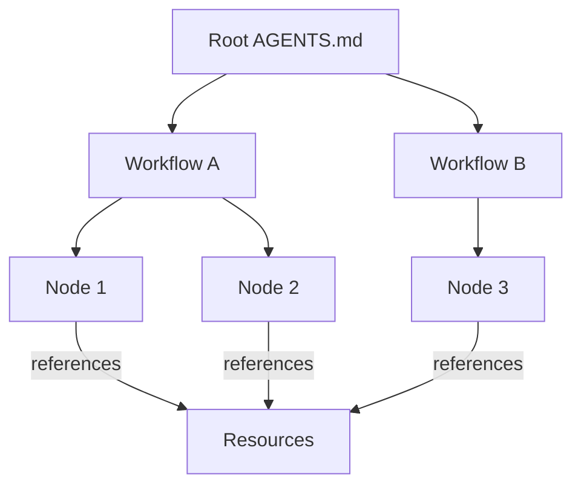

A workspace is a `.agentflow/` directory at the root of your project. It contains everything an agent needs — workflows, resources, identity, and configuration. One workspace per project.



## Layout

<Files>
  <Folder name=".agentflow" defaultOpen>
    <File name="AGENTS.md" />
    <Folder name="build-feature" defaultOpen>
      <File name="AGENTS.md" />
      <Folder name="gather-requirements">
        <File name="SKILL.md" />
      </Folder>
      <Folder name="create-design">
        <File name="SKILL.md" />
      </Folder>
      <Folder name="implement">
        <File name="SKILL.md" />
      </Folder>
    </Folder>
    <Folder name="instructions">
      <File name="code-style.md" />
      <File name="testing-strategy.md" />
    </Folder>
    <Folder name="capabilities">
      <File name="write-file.md" />
      <File name="run-tests.md" />
    </Folder>
    <Folder name="skills">
      <Folder name="review-design">
        <File name="SKILL.md" />
      </Folder>
    </Folder>
    <Folder name="memory">
      <File name="decisions.md" />
    </Folder>
    <Folder name="hooks">
      <File name="on-commit.json" />
    </Folder>
  </Folder>
</Files>

The root `AGENTS.md` is the workspace identity — it defines who the agent is across all workflows. This is Layer 0 in the selective context model and is always loaded.

```yaml
---
name: My Project
description: A SaaS application for widget management.
identity:
  name: Widget Engineer
  role: >
    Senior full-stack engineer specializing in React, Node.js,
    and PostgreSQL. Writes clean, tested, production-ready code.
  personality: Thorough, pragmatic, test-driven
  constraints:
    - Always write tests before implementation
    - Follow existing patterns in the codebase
    - Never modify files outside the project scope
---
```

## Reserved Directories

<Accordions>
  <Accordion title="instructions/ — guidance and conventions">
    Style guides, coding conventions, strategy documents. The agent treats these as constraints to follow. Scoped by position in the directory tree — global or per-workflow.
  </Accordion>
  <Accordion title="capabilities/ — tool definitions">
    What the agent can do — builtin tools, scripts, MCP servers, packages. Types: `builtin`, `script`, `mcp`, `package`.
  </Accordion>
  <Accordion title="skills/ — directory-based reusable components">
    Each skill lives in `skills/name/SKILL.md` with optional `references/`, `scripts/`, and `assets/` subdirectories. Skills use progressive disclosure: metadata → body → references.
  </Accordion>
  <Accordion title="memory/ — persistent state">
    Decisions, preferences, and context that persists across workflow runs. The only resource category the agent can write to during execution.
  </Accordion>
  <Accordion title="hooks/ — event triggers">
    JSON files defining event → condition → action pipelines. Fire on file edits, commits, validation, etc.
  </Accordion>
</Accordions>

Any other top-level directory inside `.agentflow/` is treated as a workflow.

## Scoping: Global vs Workflow

Resources can live at two levels:

<Tabs items={['Global', 'Workflow-scoped']}>
  <Tab value="Global">
    ```
    .agentflow/
      instructions/              ← all workflows can reference
        code-style.md
    ```

    Available to every node in every workflow.
  </Tab>
  <Tab value="Workflow-scoped">
    ```
    .agentflow/
      build-feature/
        instructions/            ← only build-feature nodes
          requirements-elicitation.md
    ```

    Available only to nodes within that workflow. If both levels have a file with the same name, the workflow-scoped version takes precedence.
  </Tab>
</Tabs>

## Getting Started

<Steps>
  <Step>
    ### CLI

    ```bash
    agentflow init
    ```

    Creates `.agentflow/` with a root `AGENTS.md` and empty resource directories.
  </Step>
  <Step>
    ### Manual

    ```bash
    mkdir -p .agentflow/{instructions,capabilities,skills,memory,hooks}
    touch .agentflow/AGENTS.md
    ```

    Then edit `AGENTS.md` to define your workspace identity.
  </Step>
  <Step>
    ### Studio

    Click **New Workspace** in the studio. It creates the directory structure and opens the identity editor.
  </Step>
</Steps>

## Multiple Workflows

A workspace can contain any number of workflows. They share global resources but are otherwise independent:

```
.agentflow/
  AGENTS.md                    ← workspace identity
  build-feature/               ← workflow 1
    AGENTS.md
    ...nodes...
  fix-bug/                     ← workflow 2
    AGENTS.md
    ...nodes...
  content-pipeline/            ← workflow 3
    AGENTS.md
    ...nodes...
```

### Sub-workflows

A workflow can delegate to another workflow via a sub-workflow node. The target workflow lives as a nested directory inside the parent workflow and must have its own `AGENTS.md`. When the agent reaches a sub-workflow node, it enters the nested workflow, executes it to completion, then returns to the parent.

```
.agentflow/
  build-feature/
    AGENTS.md
    implement/
      SKILL.md
    deploy/                    ← sub-workflow node
      SKILL.md
      ci-cd/                   ← nested workflow directory
        AGENTS.md
        ...nodes...
```

<Callout type="info" title="White-labeling">
  The directory name `.agentflow/` and CLI command `agentflow` can be customized via `agentflow.config.json`. See [Branding](/docs/reference/branding) for details.
</Callout>

## Explore the Workspace

The Explorer panel below shows the full file tree of the build-feature workspace — AGENTS.md files, node directories, and resource folders. Switch to the Elements panel to see resources organized by category instead of by file path.

<ComponentPreview title="Workspace explorer" height="lg">
  <DocsPlayground workflow="build-feature" panels={['explorer', 'elements']} />
</ComponentPreview>

<Cards>
  <Card title="Workflows" href="/docs/concepts/workflows" description="Directed graphs of nodes within a workspace" />
  <Card title="Resources" href="/docs/concepts/resources" description="The five resource categories" />
  <Card title="Identity" href="/docs/concepts/identity" description="Workspace vs workflow AGENTS.md" />
  <Card title="Directory Layout" href="/docs/authoring/directory-layout" description="Full conventions for file structure" />
</Cards>
