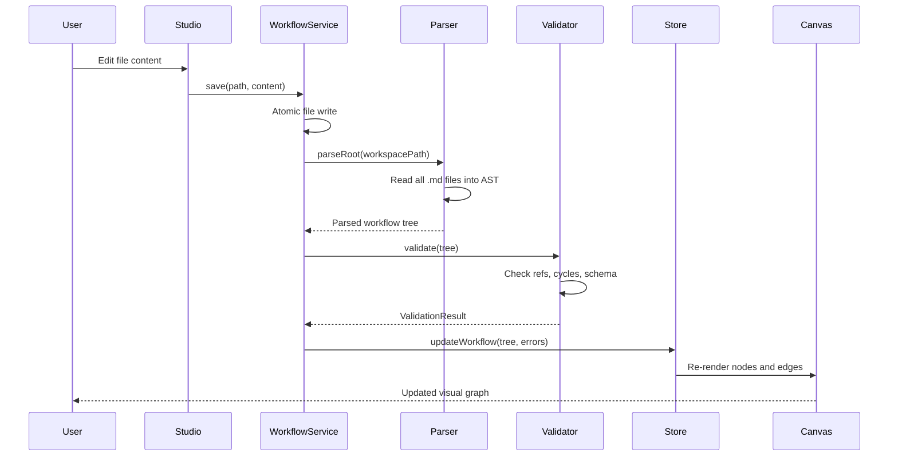

import { Files, Folder, File } from "fumadocs-ui/components/files"

## Directory Structure

<Files>
  <Folder name="src" defaultOpen>
    <File name="parser.js" />
    <File name="parser-core.js" />
    <File name="validator.js" />
    <File name="exporter.js" />
    <File name="taxonomy.js" />
    <File name="library.js" />
    <File name="branding.js" />
    <File name="errors.js" />
    <File name="pretty-printer.js" />
    <Folder name="transport">
      <File name="platform-adapter.js" />
      <File name="transforms.js" />
      <File name="export-pipeline.js" />
      <File name="import-pipeline.js" />
      <File name="langgraph.json" />
      <File name="claude.json" />
      <File name="github-actions.json" />
      <File name="openai.json" />
      <File name="bedrock.json" />
      <File name="crewai.json" />
      <File name="autogen.json" />
    </Folder>
    <Folder name="services">
      <File name="workflow.js" />
      <File name="validation.js" />
      <File name="template.js" />
      <File name="git.js" />
      <File name="export.js" />
      <File name="import.js" />
      <File name="mcp-bridge.js" />
      <File name="hook-registry.js" />
      <File name="event-hook-engine.js" />
      <File name="instruction-manager.js" />
      <File name="scaffold-gen.js" />
    </Folder>
    <Folder name="git">
      <File name="git-manager.js" />
      <File name="repo-scanner.js" />
      <File name="config-manager.js" />
      <File name="sync-engine.js" />
    </Folder>
    <Folder name="mcp">
      <File name="config-manager.js" />
      <File name="tool-provider.js" />
      <File name="tool-scaffolder.js" />
      <File name="registry-client.js" />
      <File name="unified-search.js" />
      <File name="server-lifecycle.js" />
    </Folder>
  </Folder>
  <Folder name="studio">
    <Folder name="components" />
    <Folder name="app" />
    <Folder name="lib" />
    <Folder name="hooks" />
    <Folder name="store" />
  </Folder>
  <Folder name="library">
    <Folder name="workflows" />
    <Folder name="instructions" />
    <Folder name="capabilities" />
    <Folder name="runbooks" />
    <Folder name="memory" />
    <Folder name="hooks" />
  </Folder>
  <Folder name="bin">
    <File name="cli.js" />
  </Folder>
  <Folder name="tests" />
</Files>

## Core Engine (`src/`)

The core engine handles parsing, validation, and export of `.agentflow` workflows. The parser reads markdown files into an AST, the validator checks structural and semantic correctness, and the exporter serializes workflows to target platforms.

## Transport Layer (`src/transport/`)

Handles multi-platform export and import. The `platform-adapter.js` normalizes platform differences, `transforms.js` applies AST transformations, and the pipeline files orchestrate the full export/import flow. Each platform has a JSON configuration file defining its node mappings and constraints.

## Services (`src/services/`)

Thirteen service modules provide the application logic. Services cover workflow CRUD, validation, template management, git operations, export/import orchestration, MCP bridging, hook management, instruction resolution, and project scaffolding.

## Git Integration (`src/git/`)

Four modules handle git operations: repository management, scanning for workspace changes, configuration, and syncing local state with remotes.

## MCP Integration (`src/mcp/`)

Six modules manage Model Context Protocol connections: server configuration, tool discovery and provisioning, scaffolding new tool definitions, registry search, unified tool search across providers, and server lifecycle management.

## Studio (`studio/`)

A Next.js application providing the visual workflow editor. Built with React Flow for the canvas, Zustand for state management, and custom hooks for workflow operations.

## Library (`library/`)

Pre-built workflows, instructions, capabilities, runbooks, memory templates, and hooks that users can install into their workspace.

## Service Layer Pattern

All services are instantiated through a single factory:

```js
const services = createServiceLayer(ctx)
```

The `ctx` object carries workspace path, configuration, and shared state. Every service method returns a result object following the `ok`/`fail` pattern:

```js
// Success
{ ok: true, data: { ... } }

// Failure
{ ok: false, error: { code: "VALIDATION_ERROR", message: "..." } }
```

This makes error handling consistent and composable across the entire codebase.

## Data Flow

The following diagram shows the complete data flow when a user edits a workflow file in the studio:



Every edit triggers this full pipeline. The atomic file write ensures that the on-disk state is never partially written. If validation fails, the store still updates with the new tree but attaches error annotations so the canvas can display inline diagnostics.

## Service Layer Pattern

### Factory Creation

All services are created through a single entry point:

```js
import { createServiceLayer } from "./services/index.js"

const ctx = {
  workspacePath: "/path/to/.agentflow",
  config: loadedConfig,
  fs: fileSystemAdapter,
}

const services = createServiceLayer(ctx)
```

The `ctx` object is immutable after creation. Services never modify it. This guarantees that all services share the same view of the workspace without hidden side effects.

### Result Pattern

Every service method returns a discriminated result:

```js
// Calling a service
const result = await services.workflow.save(path, content)

if (result.ok) {
  console.log(result.data) // The saved workflow
} else {
  console.error(result.error.code)    // e.g. "WRITE_FAILED"
  console.error(result.error.message) // Human-readable description
}
```

This pattern eliminates try/catch chains and makes error propagation explicit. Services that call other services simply forward failures:

```js
async function exportWorkflow(name, target) {
  const parsed = await services.workflow.load(name)
  if (!parsed.ok) return parsed // Forward the failure

  const validated = await services.validation.check(parsed.data)
  if (!validated.ok) return validated

  return services.export.run(parsed.data, target)
}
```

### Service Composition

Services reference each other through the shared context, never through direct imports. This keeps the dependency graph flat and makes testing straightforward since you can replace any service with a mock in the context.

## Key Design Decisions

### Config-Driven Transport (No Subclasses)

Each export target (LangGraph, Claude, GitHub Actions, etc.) is defined as a JSON configuration file rather than a class hierarchy. The `platform-adapter.js` reads the config and applies it generically. This means adding a new platform requires only a new JSON file with node mappings and constraints, not new code.

```
src/transport/
  langgraph.json      # Node mappings, edge rules, output format
  claude.json
  github-actions.json
  platform-adapter.js # Generic adapter that reads any config
```

Benefits:
- No inheritance chains to maintain
- Platform configs are declarative and auditable
- Community contributors can add platforms without touching core logic

### Zod Validation

All frontmatter schemas are defined with Zod. The validator uses these schemas at parse time to produce precise, actionable error messages. Zod schemas also serve as the single source of truth for the TypeTable documentation in the reference docs.

```js
const nodeSchema = z.object({
  entry: z.boolean().optional(),
  refs: z.array(z.string()).optional(),
  max_tokens: z.number().positive().optional(),
  outputs: z.array(z.string()).optional(),
})
```

### Atomic File Writes

All file mutations go through a write-then-rename pattern:

1. Write content to a temporary file in the same directory
2. Call `fs.rename()` to atomically replace the target file

This prevents partial writes from corrupting workflow files if the process crashes mid-write. The filesystem guarantees that rename is atomic on all supported platforms.
