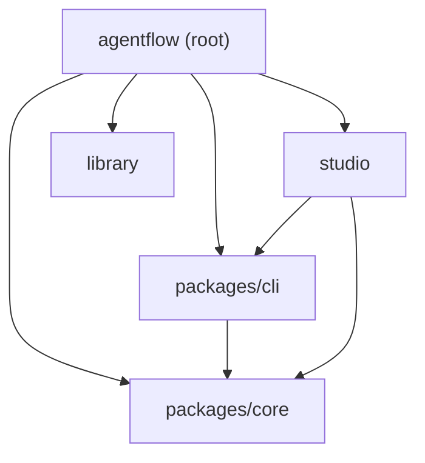
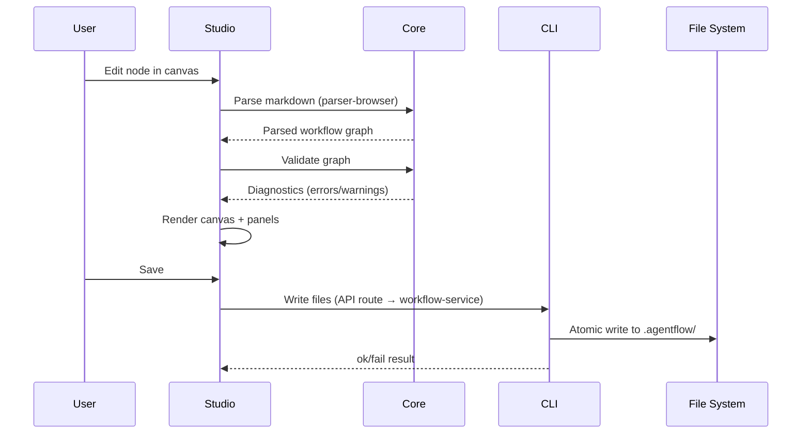
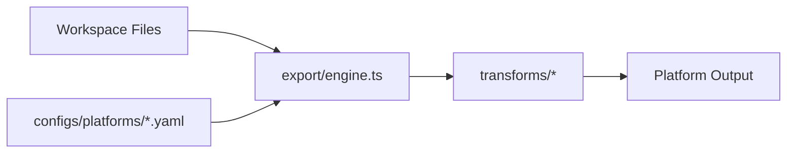

## Monorepo Overview

AgentFlow is an npm workspaces monorepo with three main areas: two shared packages, a standalone studio app, and a content library.

<Callout type="info">
💡 The codebase is fully TypeScript. Core engine is in `packages/core/src/`, export engine in `packages/cli/src/export/`, studio in `studio/`.
</Callout>



<Callout type="info">
`packages/core` and `packages/cli` are npm workspace members. `studio` is a standalone Next.js app that depends on both via `"*"` version specifiers — it is **not** a workspace member.
</Callout>

<Files>
  <Folder name="agentflow" defaultOpen>
    <File name="package.json" />
    <Folder name="packages" defaultOpen>
      <Folder name="core" />
      <Folder name="cli" />
    </Folder>
    <Folder name="studio" />
    <Folder name="library" />
    <Folder name="configs" />
    <Folder name="scripts" />
    <Folder name=".agentflow" />
  </Folder>
</Files>

| Area | Package name | Runtime | Purpose |
|---|---|---|---|
| `packages/core` | `@agentflow/core` | Browser + Node | Parser, validator, taxonomy, schemas — pure logic |
| `packages/cli` | `@agentflow/cli` | Node only | CLI binary, file I/O services, git, MCP bridge, export engine |
| `studio` | `agentflow-app` | Next.js 16 | Visual workflow editor |
| `library` | — | — | Pre-built workflows, skills, capabilities, instructions, memory, hooks |
| `configs/platforms` | — | — | YAML platform export configurations |

---

## packages/core

`@agentflow/core` is the foundation. It contains the parser, validator, and schemas — all pure TypeScript with **zero Node.js API dependencies**. This makes it safe to run in the browser.

**Dependencies**: `gray-matter`, `js-yaml`, `zod`

<Files>
  <Folder name="packages/core/src" defaultOpen>
    <File name="parser-core.ts" />
    <File name="parser-browser.ts" />
    <File name="validator.ts" />
    <File name="errors.ts" />
    <File name="taxonomy.ts" />
    <Folder name="schemas" defaultOpen>
      <File name="index.ts" />
      <File name="frontmatter-schemas.ts" />
      <File name="brand-schemas.ts" />
      <File name="agent-schemas.ts" />
      <File name="builder-schemas.ts" />
    </Folder>
    <Folder name="services">
      <File name="index.ts" />
      <File name="types.ts" />
      <File name="validation-service.ts" />
      <File name="event-hook-engine.ts" />
    </Folder>
    <Folder name="mcp">
      <File name="registry-client.ts" />
    </Folder>
    <Folder name="utils">
      <File name="compatibility.ts" />
      <File name="narrative.ts" />
    </Folder>
    <Folder name="types">
      <File name="index.ts" />
    </Folder>
  </Folder>
</Files>

### Key modules

<Tabs items={["Parser", "Validator", "Taxonomy"]}>
  <Tab value="Parser">
    `parser-core.ts` reads `.md` files from a workflow directory, extracts YAML frontmatter with `gray-matter`, and builds an in-memory graph of nodes and edges. Nodes are either `step` or `sub-workflow` types. Router behavior is inferred from the graph structure — there is no explicit router node type. `parser-browser.ts` is a thin shim that delegates to the core parser without touching any Node APIs.
  </Tab>
  <Tab value="Validator">
    `validator.ts` takes a parsed workflow graph and runs structural, semantic, and schema checks. All frontmatter is validated against Zod schemas defined in `schemas/`. Returns a list of diagnostics (errors, warnings, info).
  </Tab>
  <Tab value="Taxonomy">
    `taxonomy.ts` defines the five fixed resource categories: **instructions**, **capabilities**, **skills**, **memory**, and **hooks**. Node labels are "Step" and "Sub-workflow".
  </Tab>
</Tabs>

---

## packages/cli

`@agentflow/cli` provides the `agentflow` command-line binary and all Node.js-dependent services: file I/O, git operations, MCP server lifecycle, template scaffolding, and the **export engine**.

**Dependencies**: `@agentflow/core`, `commander`, `glob`, `simple-git`, `jszip`, `@modelcontextprotocol/sdk`, `zod`

<Callout type="warn">
This package uses Node.js APIs (fs, path, child_process). It cannot run in the browser. Studio imports it only in server-side API routes.
</Callout>

<Files>
  <Folder name="packages/cli" defaultOpen>
    <Folder name="bin">
      <File name="cli.js" />
    </Folder>
    <Folder name="src" defaultOpen>
      <File name="parser.ts" />
      <File name="pretty-printer.ts" />
      <File name="branding.ts" />
      <File name="library.ts" />
      <Folder name="export" defaultOpen>
        <File name="index.ts" />
        <File name="engine.ts" />
        <File name="agent-spec-transform.ts" />
        <Folder name="transforms">
          <File name="index.ts" />
          <File name="concatenate.ts" />
          <File name="rename.ts" />
          <File name="copy.ts" />
          <File name="flatten-skill.ts" />
          <File name="to-skill-dir.ts" />
          <File name="to-mdc.ts" />
          <File name="split-identity.ts" />
          <File name="merge-mcp-config.ts" />
        </Folder>
      </Folder>
      <Folder name="git">
        <File name="repo-scanner.ts" />
        <File name="config-manager.ts" />
        <File name="sync-engine.ts" />
        <File name="git-manager.ts" />
      </Folder>
      <Folder name="services" defaultOpen>
        <File name="workflow-service.ts" />
        <File name="validation-service.ts" />
        <File name="export-service.ts" />
        <File name="git-service.ts" />
        <File name="template-service.ts" />
        <File name="scaffold-gen-service.ts" />
        <File name="import-service.ts" />
        <File name="instruction-manager.ts" />
        <File name="mcp-bridge.ts" />
        <File name="hook-registry.ts" />
      </Folder>
      <Folder name="mcp">
        <File name="server-lifecycle.ts" />
        <File name="tool-provider.ts" />
        <File name="config-manager.ts" />
        <File name="tool-scaffolder.ts" />
        <File name="unified-search.ts" />
      </Folder>
      <Folder name="svc-utils">
        <File name="validate-path.ts" />
        <File name="file-io.ts" />
      </Folder>
      <Folder name="utils">
        <File name="resolve-root.ts" />
      </Folder>
    </Folder>
  </Folder>
</Files>

### Service layer

The `services/` directory is the primary integration point for studio. Each service wraps a domain (git, export, validation, templates) and exposes functions that return structured `ok`/`fail` results.

<Tabs items={["Workflow", "Git", "Export", "MCP"]}>
  <Tab value="Workflow">
    `workflow-service.ts` — create, read, update, delete workflows and nodes. Coordinates parser + validator + file I/O.
  </Tab>
  <Tab value="Git">
    `git-service.ts` wraps `simple-git` via the `git/` modules. Handles clone, pull, push, commit, status, and diff. `sync-engine.ts` manages bidirectional sync between local workspace and remote.
  </Tab>
  <Tab value="Export">
    `export-service.ts` orchestrates multi-platform export. The export engine lives in `packages/cli/src/export/` and reads YAML platform configs from `configs/platforms/`. The studio exposes export via the `/api/export` server-side route.
  </Tab>
  <Tab value="MCP">
    `mcp-bridge.ts` connects to external MCP servers. `tool-provider.ts` exposes AgentFlow operations as MCP tools. `server-lifecycle.ts` manages start/stop of the MCP server process.
  </Tab>
</Tabs>

---

## Studio

The visual editor is a standalone Next.js 16 app (React 19, TypeScript). It imports from both `@agentflow/core` (client + server) and `@agentflow/cli` (server only).

### What studio imports

| Source | Used where | Examples |
|---|---|---|
| `@agentflow/core` | Client + Server | `parser-browser`, `validator`, `taxonomy`, `schemas` |
| `@agentflow/cli` | Server only (API routes) | `parser`, `services/*`, `git/*`, `mcp/*`, `svc-utils/*`, `export/*` |

### API routes

Every server-side operation goes through Next.js API routes in `studio/app/api/`:

<Files>
  <Folder name="app/api" defaultOpen>
    <Folder name="export">
      <File name="route.ts" />
    </Folder>
    <Folder name="git">
      <File name="route.ts" />
    </Folder>
    <Folder name="skills">
      <File name="route.ts" />
    </Folder>
    <Folder name="library">
      <File name="route.ts" />
    </Folder>
    <Folder name="copilot">
      <File name="route.ts" />
    </Folder>
    <Folder name="mcp">
      <File name="route.ts" />
    </Folder>
    <Folder name="search">
      <File name="route.ts" />
    </Folder>
    <Folder name="auth">
      <File name="device/route.ts" />
      <Folder name="[[...nextauth]]">
        <File name="route.ts" />
      </Folder>
    </Folder>
    <Folder name="copilotkit">
      <Folder name="[[...path]]">
        <File name="route.ts" />
      </Folder>
    </Folder>
    <Folder name="config">
      <Folder name="mode">
        <File name="route.ts" />
      </Folder>
    </Folder>
  </Folder>
</Files>

| Route | Purpose |
|---|---|
| `/api/export` | Server-side export — receives workspace files, returns transformed output |
| `/api/git` | Git operations (status, commit, push, pull, clone) |
| `/api/skills` | Skills.sh search and install |
| `/api/library` | Library browsing and content serving |
| `/api/copilot` | AI copilot chat completions |
| `/api/mcp` | MCP server management and tool discovery |
| `/api/search` | Unified search across workspace and library |
| `/api/auth/*` | NextAuth + device flow authentication |
| `/api/copilotkit/*` | CopilotKit integration endpoint |
| `/api/config/mode` | Runtime mode configuration |

### Client-side architecture

<Accordions>
  <Accordion title="lib/ — client libraries">
    Key modules in `studio/lib/`:

    - **`api.ts`** — central API client, all fetch calls to API routes
    - **`constants.ts`** — app-wide constants and defaults
    - **`workspace/`** — storage adapters (browser OPFS, IndexedDB, local filesystem, git)
    - **`copilot/`** — AI model registry, system prompts, key management
    - **`parse-client-files.ts`** — client-side parsing via `@agentflow/core/parser-browser`
    - **`service-context.ts`** — React context for dependency injection of services
    - **`agentflow-language.ts`** — Monaco editor language definition for `.agentflow` markdown
  </Accordion>
  <Accordion title="components/ — UI components">
    Top-level components include `Canvas.tsx`, `Editor.tsx`, `ExplorerPanel.tsx`, `NodeDetail.tsx`, `ExportDialog.tsx`, `GitPanel.tsx`, `MCPPanel.tsx`, `ValidationPanel.tsx`, `CommandPalette.tsx`, and `SettingsDialog.tsx`.

    Subdirectories:
    - **`ui/`** — Radix-based primitives (Button, Dialog, Popover, etc.)
    - **`canvas/`** — ReactFlow node types, edges, canvas architecture
    - **`copilot/`** — AI chat interface components
    - **`layout/`** — ActionBar, AppMenubar, StatusBar, ThreePanelLayout
    - **`git/`** — git status, diff, commit UI
    - **`library/`** — library browser and installer
    - **`docs/`** — embedded documentation viewer
    - **`onboarding/`** — first-run setup wizard
  </Accordion>
</Accordions>

---

## Library

The `library/` directory contains pre-built, reusable content auto-indexed by `scripts/build-library-index.js` which generates `library/index.json`.

`studio/public/library` is a symlink to `../../library`, so changes to library content are immediately reflected in the studio.

<Files>
  <Folder name="library" defaultOpen>
    <File name="index.json" />
    <File name="registry.json" />
    <File name="README.md" />
    <Folder name="workflows">
      <Folder name="build-feature" />
      <Folder name="agent-builder" />
    </Folder>
    <Folder name="skills" />
    <Folder name="capabilities" />
    <Folder name="instructions" />
    <Folder name="memory" />
    <Folder name="hooks" />
  </Folder>
</Files>

Skills in the library are directory-based — each skill is a directory containing its files, imported from skills.sh.

| Directory | Content |
|---|---|
| `workflows/` | Complete workflow definitions |
| `skills/` | Reusable skill directories (imported from skills.sh) |
| `capabilities/` | Tool capability definitions (`.md`) |
| `instructions/` | Instruction sets (`.md`) |
| `memory/` | Memory templates (`.md`) |
| `hooks/` | Event hook definitions (`.json`) |

---

## Data Flow

This is how a user edit flows through the system:



<Steps>
### Parse

User edits produce markdown content. The parser (`parser-core` on server, `parser-browser` on client) extracts frontmatter via `gray-matter`, resolves node references, and builds a directed graph. Nodes are typed as "Step" or "Sub-workflow".

### Validate

The validator runs the graph through structural checks (orphan nodes, missing edges), semantic checks (invalid references, circular dependencies), and schema checks (Zod validation of all frontmatter fields).

### Render

The studio renders the validated graph on a ReactFlow canvas. Diagnostics appear in the ValidationPanel. Node details are editable in the side panel.

### Persist

On save, the studio calls an API route that delegates to `@agentflow/cli` services. Files are written atomically to the `.agentflow/` directory.
</Steps>

---

## Key Design Decisions

### Config-driven export

Platform export is driven entirely by YAML configuration files in `configs/platforms/`. Adding support for a new AI coding tool means adding a single `.yaml` file — no code changes required. The export engine in `packages/cli/src/export/` reads the config and applies the transform pipeline.



### Zod schema validation

All frontmatter is validated with Zod schemas defined in `packages/core/src/schemas/`. This gives:

- **Type-safe parsing** — invalid frontmatter is caught at parse time, not at runtime
- **Descriptive errors** — Zod produces human-readable validation messages
- **Single source of truth** — schemas are shared between parser, validator, and studio form generation

### Service layer pattern (ok/fail)

All CLI services return structured results instead of throwing exceptions:

```ts
// Success
{ ok: true, data: { ... } }

// Failure
{ ok: false, error: { code: 'VALIDATION_FAILED', message: '...' } }
```

This makes error handling explicit at every call site. Studio API routes translate these into appropriate HTTP status codes.

### Atomic file writes

File mutations in `@agentflow/cli` go through `svc-utils/file-io.ts`, which writes to a temporary file first, then renames it into place. This prevents partial writes from corrupting workspace files if the process is interrupted.

### Browser/Node split

The `core` ↔ `cli` boundary exists specifically to keep `@agentflow/core` browser-safe. Any module that needs `fs`, `path`, `child_process`, or other Node APIs lives in `@agentflow/cli`. The studio uses `parser-browser` on the client and the full `parser` (via API routes) on the server.

---

## Where to Go Next

<Cards>
  <Card title="Development Setup" href="/docs/contributing/development-setup" description="Set up your development environment" />
  <Card title="New Features" href="/docs/contributing/features" description="How to add new features" />
  <Card title="Library" href="/docs/contributing/library" description="Contributing to the shared library" />
</Cards>
