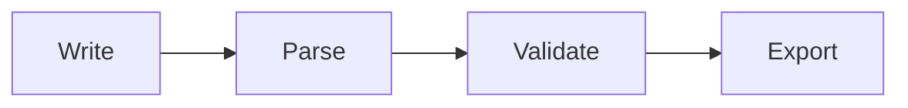

## How the Docs System Works

The documentation site is built with **Fumadocs v16**, **MDX**, and **Tailwind CSS v4**. All content lives in `studio/content/docs/` as `.mdx` files organized by section.

<Files>
  <Folder name="content/docs" defaultOpen>
    <Folder name="getting-started">
      <File name="installation.mdx" />
      <File name="quickstart.mdx" />
      <File name="meta.json" />
    </Folder>
    <Folder name="concepts" />
    <Folder name="authoring" />
    <Folder name="guides" />
    <Folder name="studio" />
    <Folder name="reference" />
    <Folder name="contributing" />
    <Folder name="troubleshooting" />
    <File name="index.mdx" />
  </Folder>
</Files>

Navigation ordering is controlled by `meta.json` files in each directory. Each entry maps a slug to its position in the sidebar.

## Available Components

All components below are **globally registered** — no imports needed in MDX files.

### Callout

Use for tips, warnings, and important notes.

<Callout type="info">
This is an info callout. Use for helpful tips and context.
</Callout>

<Callout type="warn">
This is a warning. Use for gotchas and things that might break.
</Callout>

<Callout type="error">
This is an error callout. Use for critical warnings and breaking changes.
</Callout>

You can also use directive syntax:

```mdx
:::note
This is a note using directive syntax.
:::

:::warning
This is a warning using directive syntax.
:::
```

### Steps

Use for numbered procedures and tutorials.

<Steps>
<Step>
### Create the file

Add a new `.mdx` file in the appropriate directory.
</Step>
<Step>
### Add frontmatter

Every page needs `title` and `description`.
</Step>
<Step>
### Update meta.json

Add the slug to control sidebar position.
</Step>
</Steps>

### Tabs

Use for multi-platform or multi-language content.

<Tabs items={["npm", "yarn", "pnpm"]}>
<Tab value="npm">
```bash
npm install agentflow
```
</Tab>
<Tab value="yarn">
```bash
yarn add agentflow
```
</Tab>
<Tab value="pnpm">
```bash
pnpm add agentflow
```
</Tab>
</Tabs>

### Files

Use for directory structures.

<Files>
  <Folder name=".agentflow" defaultOpen>
    <File name="AGENTS.md" />
    <Folder name="build-feature" defaultOpen>
      <File name="AGENTS.md" />
      <Folder name="gather-requirements">
        <File name="SKILL.md" />
      </Folder>
    </Folder>
    <Folder name="instructions">
      <File name="coding-standards.md" />
    </Folder>
    <Folder name="capabilities">
      <File name="read-code.md" />
    </Folder>
  </Folder>
</Files>

### Accordion

Use for collapsible FAQ sections and optional details.

<Accordions>
<Accordion title="What file format do docs use?">
All docs are MDX files — Markdown with JSX component support. Frontmatter is YAML.
</Accordion>
<Accordion title="Do I need to import components?">
No. All fumadocs components and custom components are globally registered. Just use them directly in MDX.
</Accordion>
</Accordions>

### TypeTable

Use for schema and API type documentation.

<TypeTable type={{
  title: { type: 'string', description: 'Page title shown in sidebar and heading', required: true },
  description: { type: 'string', description: 'Page description shown below title', required: true },
  status: { type: "'new' | 'beta' | 'deprecated'", description: 'Status badge shown in sidebar', required: false },
}} />

### Cards

Use for navigation grids and related page links.

<Cards>
  <Card title="Getting Started" href="/docs/getting-started" description="Installation and quickstart" />
  <Card title="Concepts" href="/docs/concepts" description="Core ideas and architecture" />
</Cards>

### Mermaid Diagrams

Use fenced code blocks with the `mermaid` language tag:

````mdx

````

### Other Components

| Component | Use for |
|-----------|---------|
| `<ImageZoom>` | Zoomable screenshots and diagrams |
| `<InlineTOC>` | Table of contents inside page content |
| `<Banner>` | Top-of-page announcements |
| `<ComponentPreview>` | Live studio component demos |
| `<DocsShowcase>` | Loads workflow data for interactive demos |
| `<DocsPlayground>` | Full canvas + panel interactive playground |

## Remark Plugins

These transform your MDX at build time:

| Syntax | Plugin | What it does |
|--------|--------|-------------|
| `:::note` / `:::warning` / `:::danger` | remarkAdmonition | Directive-style callouts |
| `:::steps` | remarkSteps | Directive-style step lists |
| ` ```mermaid ` | remarkMdxMermaid | Converts to `<Mermaid />` component |
| `npm install ...` in code blocks | remarkNpm | Auto-generates npm/yarn/pnpm/bun tabs |
| `` | remarkImage | Image optimization and lazy loading |
| Consecutive code blocks | remarkCodeTab | Groups into language tabs |

## Writing Rules

<Callout type="warn">
Follow these rules for consistent, high-quality docs.
</Callout>

- **No h1 headings** in the body — the frontmatter `title` renders the page heading
- **Frontmatter must include** `title` and `description`
- **No per-file imports** for fumadocs components — they're all global
- **Use components** over plain markdown when they improve readability (Steps for procedures, Callout for tips, Tabs for alternatives)
- **Keep pages focused** — one topic per page, link to related pages with `<Cards>`

```mdx
---
title: My Page
description: What this page covers.
---

## First Section

Content starts at h2. Use components freely.

<Callout type="info">
Helpful tip here.
</Callout>
```

## Adding a New Page

<Steps>
<Step>
### Create the MDX file

Add a `.mdx` file in the appropriate directory under `studio/content/docs/`.
</Step>
<Step>
### Add frontmatter

```yaml
---
title: My New Page
description: What this page covers.
---
```

Optional: add `status: new` to show a badge in the sidebar.
</Step>
<Step>
### Update meta.json

Add the file slug to the nearest `meta.json` to control sidebar position:

```json
["existing-page", "my-new-page", "another-page"]
```
</Step>
<Step>
### Build and verify

```bash
npm run build
```

Check the page renders correctly at `/docs/your-section/my-new-page`.
</Step>
</Steps>

## Search

Docs search uses **Orama** (advanced mode with BM25 ranking):
- **Dev mode**: server-side fetch per query
- **Production**: client-side static index (pre-built at build time, instant search)

The search index is generated from page titles, descriptions, content, and breadcrumbs.

## LLMs.txt

The docs expose an LLMs.txt endpoint at `/docs/llms.txt` for AI agent consumption. This is auto-generated by fumadocs from all page content.
