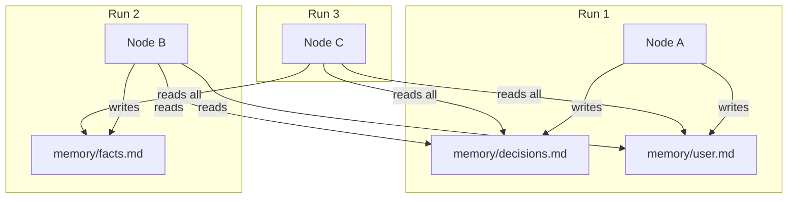

Memory is the only resource category the agent can write to during execution. While instructions, capabilities, and skills are read-only context, memory files accumulate knowledge across runs — architecture decisions, user preferences, and project facts.

## How memory flows



## What you will create

<Files>
  <Folder name=".agentflow" defaultOpen>
    <Folder name="memory" defaultOpen>
      <File name="user.md" />
      <File name="decisions.md" />
      <File name="facts.md" />
    </Folder>
  </Folder>
</Files>

<Steps>

<Step>
## Create user preferences memory

Tracks how the user likes to work. The agent reads it to personalize interactions.

Create `.agentflow/memory/user.md`:

```yaml
---
name: User Preferences
---

## Preferences

(The agent will populate this section as it learns your preferences.)
```

After a few runs it might look like:

```markdown
## Preferences

### 2024-03-15: Code style

User prefers functional patterns over class-based. Uses arrow functions
exclusively. Wants explicit return types on all exported functions.

### 2024-03-18: Review process

User reviews diffs inline. Prefers small, focused changes over large
refactors. Wants tests updated in the same commit as implementation.
```
</Step>

<Step>
## Create decisions memory

Architecture decisions and trade-offs the agent should remember. Prevents re-proposing rejected approaches.

Create `.agentflow/memory/decisions.md`:

```yaml
---
name: Architecture Decisions
---

## Decisions

(The agent records architecture and technology decisions here.)
```

A populated file:

```markdown
## Decisions

### 2024-03-10: Database choice

Chose PostgreSQL over MongoDB. Rationale: relational data integrity
matters more than schema flexibility for this project.

### 2024-04-01: API layer

Rejected GraphQL in favor of REST. Rationale: team familiarity,
simpler caching. Revisit if we need flexible queries across
multiple resources.
```
</Step>

<Step>
## Create facts memory

Project-specific facts discovered during execution — file locations, naming conventions, environment details.

Create `.agentflow/memory/facts.md`:

```yaml
---
name: Project Facts
---

## Facts

(The agent records discovered project facts here.)
```
</Step>

<Step>
## Reference memory from nodes

Load memory into a node's context using `{{memory/name}}`:

<Tabs items={['Read only', 'Read and write', 'Scoped read']}>
  <Tab value="Read only">
    ```yaml
    # implement/SKILL.md
    ---
    name: implement
    type: step
    entry: true
    ---

    # Implement the Feature

    Check {{memory/decisions}} for prior architecture choices.
    Follow preferences from {{memory/user}}.
    Use {{memory/facts}} to locate correct files.

    {{-> nodes/verify}}
    ```
  </Tab>
  <Tab value="Read and write">
    ```yaml
    # gather-requirements/SKILL.md
    ---
    name: gather-requirements
    type: step
    entry: true
    ---

    # Gather Requirements

    Read {{memory/user}} to understand communication style.

    After gathering requirements, update {{memory/decisions}}
    with any technology choices made. Use the date-prefix format:

    ### YYYY-MM-DD: Decision title

    Description and rationale.

    {{-> nodes/create-design}}
    ```
  </Tab>
  <Tab value="Scoped read">
    ```yaml
    # review-gate/SKILL.md
    ---
    name: review-gate
    type: step
    context:
      inputs:
        - ref: memory/user
          scope: summary
    ---

    # Review Gate

    Present the design to the user. Reference their review
    preferences from {{memory/user}}.

    {{-> nodes/implement | The user explicitly approves the design}}
    {{-> nodes/create-design | The user rejects the design or requests changes}}
    ```

    The `scope: summary` loads a condensed version, saving tokens.
  </Tab>
</Tabs>
</Step>

<Step>
## Establish writing patterns

### Date-prefix entries

Every entry starts with a date and descriptive title:

```markdown
### 2024-04-15: Chose Tailwind over CSS modules

Rationale: utility-first approach matches the team's velocity goals.
```

### Categorize with sections

Group related entries under second-level headings:

```markdown
## Database Decisions
### 2024-03-10: PostgreSQL over MongoDB
...

## Frontend Decisions
### 2024-04-01: React 19 with Server Components
...
```

### Keep entries atomic

One decision or fact per entry. Do not combine unrelated items.
</Step>

<Step>
## Know when to read vs write

| Node type | Read memory? | Write memory? |
|-----------|-------------|---------------|
| Requirements gathering | `user`, `decisions` | `decisions` |
| Design | `decisions`, `facts` | `decisions` |
| Implementation | `decisions`, `facts`, `user` | `facts` |
| Review gates | `user` (scoped) | Never |
| Verification | `facts` | `facts` |

<Callout type="warn">
Gate nodes (steps with conditional edges) should read memory sparingly and never write to it. Gates evaluate conditions and route — nothing more.
</Callout>
</Step>

<Step>
## Prune stale data

Memory files grow over time. Without pruning, they consume increasing token budget and may contain outdated information.

Add a pruning instruction to nodes that write memory:

```markdown
Before adding new entries to {{memory/decisions}}, review existing
entries. If a new decision supersedes an old one, remove the old
entry and note the change:

### 2024-04-15: Switched from REST to GraphQL

Supersedes: 2024-04-01 "Rejected GraphQL in favor of REST"
```

Use the Tokens panel to monitor memory's budget impact. If a memory file exceeds 20% of a node's token budget, prune stale entries, use `scope: summary`, or split into focused files.
</Step>

</Steps>

## Global vs workflow-scoped memory

<Tabs items={['Global', 'Workflow-scoped']}>
  <Tab value="Global">
    ```
    .agentflow/memory/decisions.md
    ```
    Available to all workflows. Use for cross-cutting knowledge.
  </Tab>
  <Tab value="Workflow-scoped">
    ```
    .agentflow/build-feature/memory/task-progress.md
    ```
    Available only within `build-feature`. Use for workflow-specific state.
  </Tab>
</Tabs>

<Cards>
  <Card title="Resources" href="/docs/concepts/resources" description="All five resource categories explained" />
  <Card title="Selective Context" href="/docs/concepts/selective-context" description="How memory fits into the 5-layer model" />
  <Card title="Building Review Loops" href="/docs/guides/building-review-loops" description="Use memory in approval gate patterns" />
  <Card title="Tokens Panel" href="/docs/studio/tokens" description="Monitor memory's token budget impact" />
</Cards>
