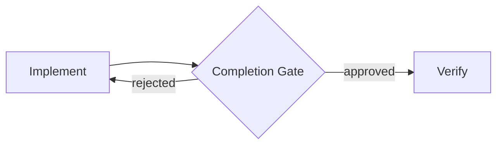
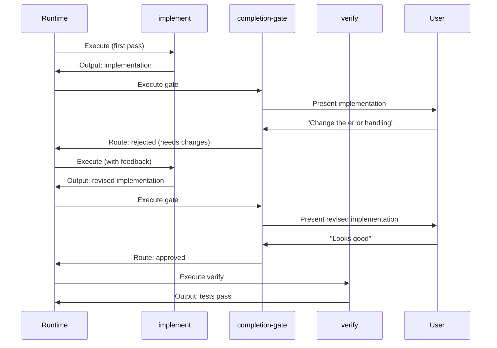
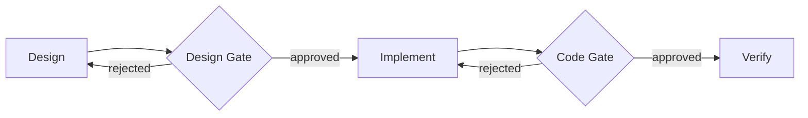

The most common AgentFlow pattern is the review loop: a step does work, a gate asks for approval, and rejection loops back with feedback. This guide builds a complete 3-node workflow implementing this pattern.

<Callout type="info">
💡 Review gates are just nodes with conditional edges. The pattern is: present output → ask for approval → route based on response.
</Callout>

## The pattern



Conditional edges are allowed to point backward. The validator permits this since a human controls whether the loop continues — there is always a conditional exit.

## What you will build

<Files>
  <Folder name=".agentflow" defaultOpen>
    <Folder name="review-loop" defaultOpen>
      <File name="AGENTS.md" />
      <Folder name="implement">
        <File name="SKILL.md" />
      </Folder>
      <Folder name="completion-gate">
        <File name="SKILL.md" />
      </Folder>
      <Folder name="verify">
        <File name="SKILL.md" />
      </Folder>
    </Folder>
  </Folder>
</Files>

<Steps>

<Step>
## Create the workflow descriptor

Create `.agentflow/review-loop/AGENTS.md`:

```yaml
---
type: agents
name: review-loop
description: >
  Implement a feature with a human review gate. The agent implements,
  presents for review, and iterates on feedback until approved.
---

# Review Loop

A 3-node workflow demonstrating the implement-gate-loop pattern.
```
</Step>

<Step>
## Create the implement node

Create `.agentflow/review-loop/implement/SKILL.md`:

```yaml
---
name: implement
type: step
entry: true
outputs:
  - name: implementation
    format: markdown
    description: The code changes and explanation of what was done
---

# Implement

Write the code to satisfy the user's request.

## First iteration

1. Read the user's request carefully.
2. Plan the minimal implementation.
3. Write the code using {{capabilities/write-file}}.
4. Run {{capabilities/get-diagnostics}} to check for errors.

## Subsequent iterations (feedback received)

1. Read the reviewer's feedback carefully.
2. Address every point raised.
3. Apply changes using {{capabilities/write-file}}.
4. Run {{capabilities/get-diagnostics}} to verify fixes.

Follow {{instructions/code-style}} conventions throughout.

{{-> nodes/completion-gate}}
```
</Step>

<Step>
## Create the completion gate

Create `.agentflow/review-loop/completion-gate/SKILL.md`:

```yaml
---
name: completion-gate
type: step
---

# Completion Gate

Present the implementation from {{<< output.implement}} to the user
for review.

## What to show

1. Summary of changes made.
2. Files modified or created.
3. Any trade-offs or assumptions.

## Routing

- If approved: {{-> nodes/verify | The user explicitly approves the implementation}}
- If rejected: {{-> nodes/implement | The user requests changes to the implementation}}
```

<Callout type="info">
💡 You don't need to declare `type: router`. Add conditional edges and the node automatically becomes a gateway.
</Callout>
</Step>

<Step>
## Understand inline conditions

Conditions are written directly in the edge syntax after the `|` separator — no separate skill files needed:

```
{{-> nodes/verify | The user explicitly approves the implementation}}
{{-> nodes/implement | The user requests changes to the implementation}}
```

The condition text should be an unambiguous true/false check that the agent evaluates based on the conversation context.
</Step>

<Step>
## Create the verify node

Create `.agentflow/review-loop/verify/SKILL.md`:

```yaml
---
name: verify
type: step
---

# Verify

The implementation has been approved. Run the test suite.

1. Run {{capabilities/run-tests}} on the affected code.
2. Check that all existing tests still pass.
3. Report the results.
```
</Step>

<Step>
## Validate

```bash
agentflow validate
```

```
review-loop: 0 errors, 0 warnings
```
</Step>

</Steps>

## How the loop executes



## Extending the pattern

### Three-way routing

Add a third condition for implementation failures:

```yaml
# completion-gate/SKILL.md (extended routing)
- Approved: {{-> nodes/verify | The user explicitly approves the implementation}}
- Needs changes: {{-> nodes/implement | The user requests changes}}
- Failed: {{-> nodes/implement | The implementation failed with errors}}
```

### Nested gates

Chain multiple gates for multi-stage review:



### Loop with memory

Track iteration history in a workflow-scoped memory file:

```markdown
Check {{memory/iteration-log}} for prior feedback on this task.
After completing this iteration, append to {{memory/iteration-log}}:

### Iteration N: YYYY-MM-DD
- Feedback addressed: (summary)
- Changes made: (summary)
```

## Common mistakes

| Mistake | Symptom | Fix |
|---------|---------|-----|
| Unconditional loop | `unconditional_cycle` error | Use conditional edges with inline condition text |
| Data flow to future node | `data_flow_forward` error | `{{<< output.x}}` can only reference prior nodes |
| No entry point | `no_entry_point` error | Add `entry: true` to the first node |

<Cards>
  <Card title="Patterns" href="/docs/authoring/patterns" description="All workflow patterns including fan-out and error recovery" />
  <Card title="Edges" href="/docs/concepts/edges" description="Unconditional, conditional, and data flow edges" />
  <Card title="Using MCP Servers" href="/docs/guides/using-mcp-servers" description="Connect external tools to your workflow" />
  <Card title="Debugging Workflows" href="/docs/guides/debugging-workflows" description="Fix validation errors and broken references" />
</Cards>
