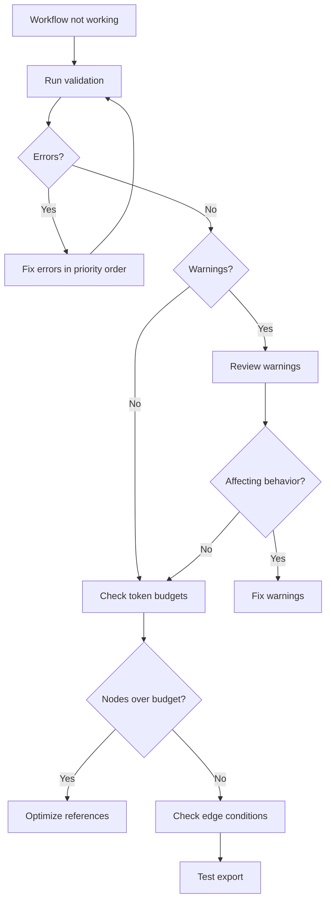
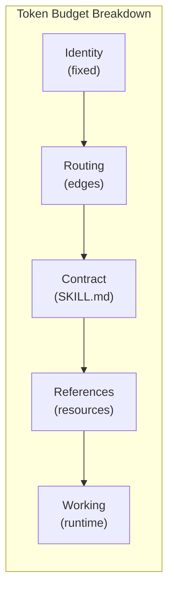

When a workflow does not validate, export, or behave as expected, the studio and CLI provide tools to diagnose the problem. This guide walks through the debugging process — from reading validation errors to fixing the most common mistakes.

## Debugging flow



## The validation panel

The studio Validation panel runs checks automatically on every edit. Errors appear in red, warnings in yellow. Click any result to jump directly to the source file.

Key features:
- **Real-time** — validates as you type, no manual trigger needed
- **Click to navigate** — each result links to the exact file and location
- **Strict mode** — toggle to treat warnings as errors (useful before export)
- **23 rules** — covers graph structure, references, context budgets, schema, and identity

From the CLI:

```bash
agentflow validate
```

Add `--strict` to treat warnings as errors, or `--format json` for machine-readable output.

## Fixing a broken workflow step by step

<Steps>

<Step>
### Run validation and read the output

```bash
agentflow validate
```

```
build-feature: 3 errors, 2 warnings

  [error] broken_ref: Reference "instructions/codestyle" not found
    in build-feature/implement/SKILL.md

  [error] no_entry_point: Workflow "build-feature" has no entry node

  [error] broken_data_flow: Data flow ref "output.design" references
    non-existent node "design"
    in build-feature/implement/SKILL.md

  [warn] unreachable: Node "legacy-step" is not reachable from entry point

  [warn] context_budget_high: Node "implement" at 7,200/8,000 tokens (90%)
```

Three errors block export. Fix them in this order: broken references first (they often cause cascading issues), then structural problems.
</Step>

<Step>
### Fix broken_ref — typo in resource name

The error says `instructions/codestyle` was not found. Check what files actually exist:

```bash
ls .agentflow/instructions/
```

```
code-style.md    testing-strategy.md
```

The file is `code-style`, not `codestyle`. Fix the reference in `implement/SKILL.md`:

```markdown
# Before (broken)
Follow {{instructions/codestyle}} conventions.

# After (fixed)
Follow {{instructions/code-style}} conventions.
```

<Callout type="info">
The most common cause of `broken_ref` is a filename mismatch — hyphens vs no hyphens, singular vs plural, or a renamed file. Always check the actual filename on disk.
</Callout>
</Step>

<Step>
### Fix no_entry_point — add entry: true

No node has `entry: true` in its frontmatter. Add it to the first node in the workflow:

```yaml
# gather-requirements/SKILL.md
---
name: gather-requirements
type: step
entry: true    # <-- add this line
---
```

Every workflow needs exactly one entry point. If you see `multiple_entry_points`, remove `entry: true` from all but the intended starting node.
</Step>

<Step>
### Fix broken_data_flow — correct the node name

The reference `{{<< output.design}}` points to a node called `design`, but the actual node is `create-design`. Fix the reference:

```markdown
# Before (broken)
Using the design from {{<< output.design}}, implement the feature.

# After (fixed)
Using the design from {{<< output.create-design}}, implement the feature.
```

Data flow references must match the exact directory name of the target node. Check the workflow directory to see all available node names:

```bash
ls .agentflow/build-feature/
```
</Step>

<Step>
### Address warnings

With all errors fixed, re-run validation:

```bash
agentflow validate
```

```
build-feature: 0 errors, 2 warnings

  [warn] unreachable: Node "legacy-step" is not reachable from entry point
  [warn] context_budget_high: Node "implement" at 7,200/8,000 tokens (90%)
```

**unreachable** — The `legacy-step` node exists but nothing routes to it. Either:
- Add an edge from another node: `{{-> nodes/legacy-step}}`
- Remove the node directory if it is no longer needed

**context_budget_high** — The `implement` node is at 90% of its token budget. Options:
- Increase the budget: `context.max_tokens: 10000`
- Use `scope: summary` for large references
- Remove references the node does not actively need
</Step>

<Step>
### Verify the fix

Run validation one more time to confirm a clean state:

```bash
agentflow validate
```

```
build-feature: 0 errors, 0 warnings
```

Now try exporting to confirm the workflow produces valid output:

```bash
agentflow export --platform claude-code --dry-run
```

The `--dry-run` flag shows what would be generated without writing files.
</Step>

</Steps>

## Common validation errors

Quick reference for the most frequent errors and their fixes:

<Tabs items={['References', 'Graph', 'Context', 'MCP']}>
  <Tab value="References">
    | Error | Cause | Fix |
    |-------|-------|-----|
    | `broken_ref` | File does not exist at the referenced path | Check filename spelling, hyphens, and directory |
    | `broken_data_flow` | `{{<< output.x}}` references a non-existent node | Check the node directory name |
    | `ambiguous_ref` | Reference matches multiple files | Use the full path to disambiguate |
    | `unknown_category` | Reference uses a non-standard directory | Use one of: instructions, capabilities, skills, memory, hooks |
  </Tab>
  <Tab value="Graph">
    | Error | Cause | Fix |
    |-------|-------|-----|
    | `no_entry_point` | No node has `entry: true` | Add `entry: true` to the first node |
    | `multiple_entry_points` | More than one node has `entry: true` | Remove `entry: true` from all but one |
    | `unconditional_cycle` | Loop with no conditional exit | Add a condition skill to at least one edge in the cycle |
    | `unreachable` | Node has no incoming edges | Connect it to the graph or remove it |
    | `self_referencing_edge` | Node points to itself | Remove the self-referencing edge |
  </Tab>
  <Tab value="Context">
    | Warning | Cause | Fix |
    |---------|-------|-----|
    | `context_budget` | Node exceeds `max_tokens` | Increase budget or reduce references |
    | `context_budget_high` | Node is above 70% of budget | Optimize with `scope: summary` or remove unused refs |
    | `context_input_broken` | `context.inputs` ref is invalid | Fix the ref path in frontmatter |
    | `output_declaration` | Data flow ref without matching output declaration | Add `outputs` to the source node's frontmatter |
  </Tab>
  <Tab value="MCP">
    | Error | Cause | Fix |
    |-------|-------|-----|
    | `missing_mcp_server` | Capability has `mcp: x` but `mcp.json` has no `x` | Add the server to `mcp.json` or fix the name |
    | `orphaned_mcp_tool` | Capability exists but no node references it | Reference it from a node or delete the file |
  </Tab>
</Tabs>

## Using the token calculator

The Tokens panel shows per-node token consumption broken into five layers:



| Layer | What it includes |
|-------|-----------------|
| Identity | Root and workflow AGENTS.md |
| Routing | Edge conditions, graph navigation |
| Contract | SKILL.md body content |
| References | Capabilities, instructions, skills, memory |
| Working | Conversation history, tool results (estimated) |

The References layer is usually the largest optimization target. Use `scope: signature` (capabilities) or `scope: summary` (any resource) to reduce it.

## Debugging checklist

1. **Run `agentflow validate`** — fix all errors first.
2. **Check the Tokens panel** — over-budget nodes silently drop low-priority references.
3. **Verify edge conditions** — confirm each conditional edge has clear inline condition text.
4. **Check data flow direction** — `{{<< output.x}}` can only reference prior nodes.
5. **Test MCP connections** — `agentflow mcp test server-name`.
6. **Export with `--dry-run`** — confirm output before writing files.

<Cards>
  <Card title="Validation Rules" href="/docs/reference/validation-rules" description="Complete list of all 23 rules" />
  <Card title="Common Errors" href="/docs/troubleshooting/common-errors" description="Detailed fixes for frequent issues" />
  <Card title="Tokens Panel" href="/docs/studio/tokens" description="Context budget tracking per node" />
  <Card title="Building Review Loops" href="/docs/guides/building-review-loops" description="Common pattern that triggers validation issues" />
</Cards>
