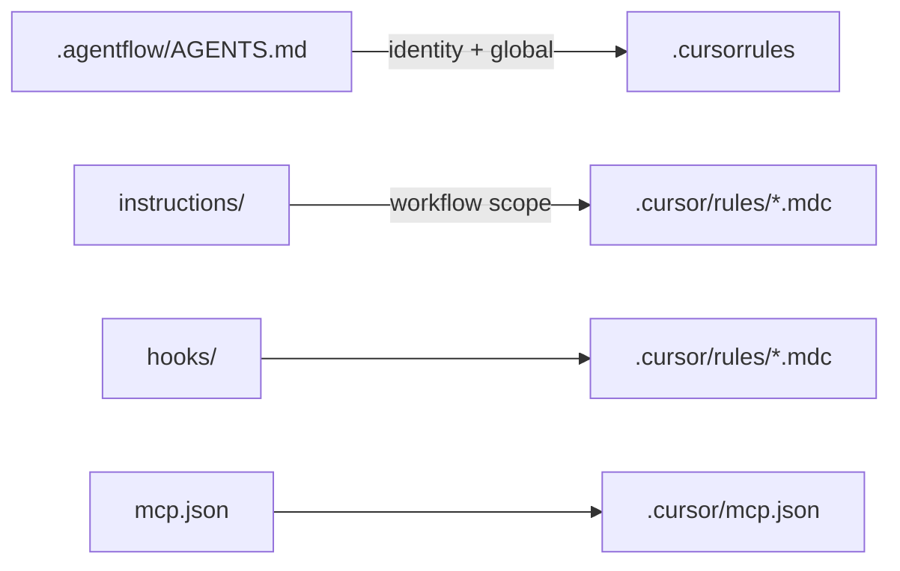

AgentFlow can export your workspace directly to Cursor's native configuration format. Your identity, instructions, hooks, and MCP servers are mapped to the `.cursor/` directory structure that Cursor understands.



## Quick Start

Run the export command:

```bash
agentflow export --platform cursor
```

This generates a `.cursor/` directory in your project root with all mapped resources.

## What Gets Exported

<Steps>
<Step>
### Identity

Your workspace `AGENTS.md` is passed through as-is. Cursor supports `AGENTS.md` natively, so no transformation is needed.
</Step>

<Step>
### Instructions

Each instruction file is converted to Cursor's MDC rule format and placed in `.cursor/rules/`.

<Tabs items={["Before (AgentFlow)", "After (Cursor)"]}>
<Tab value="Before (AgentFlow)">
```md
<!-- .agentflow/instructions/code-style.md -->
# Code Style

- Use TypeScript strict mode
- Prefer const over let
- Use early returns
```
</Tab>
<Tab value="After (Cursor)">
```md
<!-- .cursor/rules/code-style.mdc -->
---
alwaysApply: false
description: Code Style
---

- Use TypeScript strict mode
- Prefer const over let
- Use early returns
```
</Tab>
</Tabs>

<Callout type="info">
MDC (Markdown Components) is Cursor's rule format. It uses YAML frontmatter with `alwaysApply` and `description` fields. The `alwaysApply: false` default means rules are suggested contextually rather than injected into every prompt.
</Callout>
</Step>

<Step>
### Hooks

Hooks are exported to `.cursor/hooks.json` in Claude-compatible format.

```json
// .cursor/hooks.json
{
  "hooks": [
    {
      "event": "on_file_save",
      "command": "npm run lint --fix",
      "pattern": "**/*.ts"
    }
  ]
}
```
</Step>

<Step>
### MCP Servers

MCP configuration is exported to `.cursor/mcp.json`.

```json
// .cursor/mcp.json
{
  "mcpServers": {
    "filesystem": {
      "command": "npx",
      "args": ["-y", "@modelcontextprotocol/server-filesystem", "./src"]
    }
  }
}
```
</Step>
</Steps>

## Output Structure

<Files>
<Folder name=".cursor" defaultOpen>
  <File name="AGENTS.md" />
  <Folder name="rules" defaultOpen>
    <File name="code-style.mdc" />
    <File name="testing.mdc" />
  </Folder>
  <File name="hooks.json" />
  <File name="mcp.json" />
</Folder>
</Files>

## Importing from Cursor

You can also import an existing Cursor configuration into AgentFlow:

```bash
agentflow import --platform cursor
```

This detects `.cursor/rules/` or `.cursorrules` in your project and converts them back to AgentFlow format.

<Callout type="info">
During import, `.cursor/rules/*.mdc` files are converted to `instructions/{name}.md`. The MDC frontmatter (`alwaysApply`, `description`) is stripped, and the description is used as the markdown heading.
</Callout>

## Preview

<ComponentPreview name="export-cursor" />

## Other Export Targets

<Cards>
  <Card title="Export to Claude" href="/docs/guides/export-to-claude" />
  <Card title="Export to Kiro" href="/docs/guides/export-to-kiro" />
  <Card title="Export Concepts" href="/docs/concepts/export" />
</Cards>
