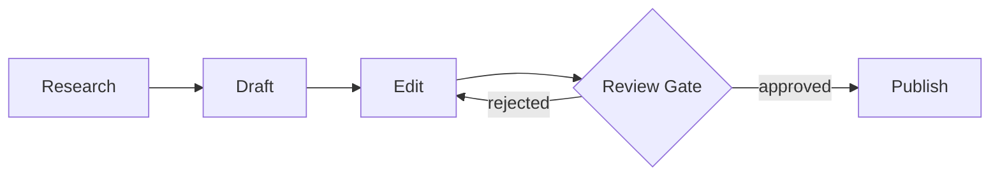

In this tutorial you will build a **content-review** pipeline — a workflow that researches a topic, drafts an article, edits it, routes it through an approval gate, and publishes the final result. The approval gate loops back to the edit step on rejection, creating a review cycle.

The finished workflow graph looks like this:



<Callout type="info">
This tutorial assumes you have the AgentFlow studio running locally. If not, run `npm run dev` from the project root and open `http://localhost:3000`.
</Callout>

## What you will build

<Files>
  <Folder name=".agentflow" defaultOpen>
    <Folder name="content-review" defaultOpen>
      <File name="AGENTS.md" />
      <Folder name="research">
        <File name="SKILL.md" />
      </Folder>
      <Folder name="draft">
        <File name="SKILL.md" />
      </Folder>
      <Folder name="edit">
        <File name="SKILL.md" />
      </Folder>
      <Folder name="review-gate">
        <File name="SKILL.md" />
      </Folder>
      <Folder name="publish">
        <File name="SKILL.md" />
      </Folder>
    </Folder>
  </Folder>
</Files>

<Steps>

<Step>
## Create the workflow descriptor

Every workflow needs an `AGENTS.md` file at its root. This defines the workflow identity, its purpose, and the execution order.

Create `.agentflow/content-review/AGENTS.md`:

```markdown
---
name: content-review
description: A content review pipeline that researches, drafts, edits, and publishes articles with an approval gate.
nodes:
  - research
  - draft
  - edit
  - review-gate
  - publish
edges:
  - from: research
    to: draft
  - from: draft
    to: edit
  - from: edit
    to: review-gate
  - from: review-gate
    to: publish
    condition: The article meets all quality criteria and is approved
  - from: review-gate
    to: edit
    condition: The article needs further editing based on reviewer feedback
---

# Content Review Pipeline

This workflow orchestrates a full content lifecycle. Articles are researched, drafted, edited, and then routed through a review gate. Approved content is published. Rejected content loops back to the edit step for revision.
```

</Step>

<Step>
## Create the research node

The first node gathers information on the given topic. Create `.agentflow/content-review/research/SKILL.md`:

```markdown
---
name: research
type: step
description: Gather information and sources on the assigned topic.
inputs:
  - name: topic
    type: string
    required: true
    description: The subject to research.
outputs:
  - name: findings
    type: string
    description: Compiled research notes and source references.
---

# Research

You are a research specialist. Given a topic, gather relevant facts, statistics, and source references. Produce structured research notes that a writer can use to draft an article.

## Instructions

1. Identify 3-5 authoritative sources on the topic.
2. Extract key facts, quotes, and data points.
3. Organize findings into themed sections.
4. Include source URLs for attribution.
```

</Step>

<Step>
## Create the draft node

This node takes research findings and produces a first draft. Create `.agentflow/content-review/draft/SKILL.md`:

```markdown
---
name: draft
type: step
description: Write a first draft article from research findings.
inputs:
  - name: findings
    type: string
    required: true
    description: Research notes from the previous step.
outputs:
  - name: article
    type: string
    description: The first draft of the article.
---

# Draft

You are a content writer. Using the provided research findings, write a clear and engaging first draft. Focus on structure and completeness over polish.

## Instructions

1. Create a compelling headline.
2. Write an introduction that hooks the reader.
3. Organize the body into logical sections using the research.
4. End with a conclusion that summarizes key takeaways.
5. Aim for 800-1200 words.
```

</Step>

<Step>
## Create the edit node

The editor refines the draft. This node may be visited multiple times if the review gate rejects the article. Create `.agentflow/content-review/edit/SKILL.md`:

```markdown
---
name: edit
type: step
description: Refine and improve the article draft.
inputs:
  - name: article
    type: string
    required: true
    description: The current article draft.
  - name: feedback
    type: string
    required: false
    description: Reviewer feedback from a previous rejection, if any.
outputs:
  - name: article
    type: string
    description: The edited article ready for review.
---

# Edit

You are a professional editor. Improve the article for clarity, grammar, tone, and factual accuracy. If reviewer feedback is provided, address each point specifically.

## Instructions

1. Fix grammatical and spelling errors.
2. Improve sentence flow and readability.
3. Verify factual claims against the research.
4. If feedback is present, address every item raised by the reviewer.
5. Ensure consistent tone throughout.
```

</Step>

<Step>
## Create the review-gate node

This is a step node with conditional edges — it evaluates the article and decides whether to approve or reject it. Create `.agentflow/content-review/review-gate/SKILL.md`:

```markdown
---
name: review-gate
type: step
description: Evaluate the article and approve or reject it for publication.
inputs:
  - name: article
    type: string
    required: true
    description: The edited article to review.
outputs:
  - name: approved
    type: boolean
    description: Whether the article passes review.
  - name: feedback
    type: string
    description: Feedback for the editor if rejected.
---

# Review Gate

You are a senior content reviewer. Evaluate the article against quality standards. Approve it if it meets all criteria, or reject it with specific feedback.

## Approval Criteria

- Factually accurate with proper attribution
- Clear structure with logical flow
- Free of grammatical errors
- Engaging and appropriate tone
- Meets the target word count (800-1200 words)

## Instructions

1. Read the article carefully against each criterion.
2. If all criteria are met, set approved to true.
3. If any criterion fails, set approved to false and provide actionable feedback explaining what needs to change.

## Routing

- If approved → publish
- If rejected → edit with feedback
```

<Callout type="info">
💡 You don't need to declare `type: router`. Add conditional edges and the node automatically becomes a gateway.
</Callout>

</Step>

<Step>
## Create the publish node

The final node handles publication of the approved article. Create `.agentflow/content-review/publish/SKILL.md`:

```markdown
---
name: publish
type: step
description: Publish the approved article to the target platform.
inputs:
  - name: article
    type: string
    required: true
    description: The approved article to publish.
outputs:
  - name: url
    type: string
    description: The published article URL.
---

# Publish

You are a publishing assistant. Take the approved article and prepare it for publication. Format it according to platform requirements and confirm successful publication.

## Instructions

1. Format the article with proper headings and metadata.
2. Add relevant tags and categories.
3. Publish to the configured platform.
4. Return the published URL for confirmation.
```

</Step>

<Step>
## Update the workflow descriptor with conditional edges

The review gate uses inline conditions in the edge definitions. Update `.agentflow/content-review/AGENTS.md` to use conditional edge text:

```markdown
---
name: content-review
description: A content review pipeline that researches, drafts, edits, and publishes articles with an approval gate.
nodes:
  - research
  - draft
  - edit
  - review-gate
  - publish
edges:
  - from: research
    to: draft
  - from: draft
    to: edit
  - from: edit
    to: review-gate
  - from: review-gate
    to: publish
    condition: The article meets all quality criteria and is approved
  - from: review-gate
    to: edit
    condition: The article needs further editing based on reviewer feedback
---

# Content Review Pipeline

This workflow orchestrates a full content lifecycle. Articles are researched, drafted, edited, and then routed through a review gate. Approved content is published. Rejected content loops back to the edit step for revision.
```

Conditions are written as inline text in the edge definitions — no separate skill files needed.

</Step>

<Step>
## Validate the workflow

Run the AgentFlow validator to confirm your workflow is correctly structured:

```bash
npm run validate -- .agentflow/content-review
```

You should see output like this:

```
Validating workflow: content-review
  [pass] AGENTS.md descriptor is valid
  [pass] Node: research (step) — inputs/outputs valid
  [pass] Node: draft (step) — inputs/outputs valid
  [pass] Node: edit (step) — inputs/outputs valid
  [pass] Node: review-gate (step) — conditional edges valid
  [pass] Node: publish (step) — inputs/outputs valid
  [pass] Edge: research -> draft
  [pass] Edge: draft -> edit
  [pass] Edge: edit -> review-gate
  [pass] Edge: review-gate -> publish (conditional)
  [pass] Edge: review-gate -> edit (conditional)

Workflow "content-review" is valid. 5 nodes, 5 edges.
```

</Step>

</Steps>

## Explore a more complex workflow

<Callout type="info">
💡 The build-feature workflow in the library demonstrates all AgentFlow features — conditional edges, data flow, sub-workflows, and resource references.
</Callout>

Now that you have built a linear pipeline with a review loop, explore the `build-feature` workflow in the playground below. It demonstrates a larger graph with multiple router nodes, parallel paths, and sub-workflows. Use the explorer panel to navigate nodes and the validation panel to inspect the structure.

<ComponentPreview height="lg">
  <DocsPlayground workflow="build-feature" panels={['validation', 'explorer', 'elements']} />
</ComponentPreview>

## Next steps


The editor and frontmatter form below show what editing a SKILL.md looks like in the studio. The editor renders reference badges inline, and the form provides structured controls for frontmatter fields.


<PreviewGrid>
  <ComponentPreview title="Editor" height="lg">
    <DocsPlayground panel="editor" />
  </ComponentPreview>
  <ComponentPreview title="Frontmatter" height="lg">
    <DocsPlayground panel="frontmatter" />
  </ComponentPreview>
</PreviewGrid>


<Cards>
  <Card title="Workflow Patterns" href="/docs/authoring/patterns" description="Common patterns like loops, fan-out, and conditional branching." />
  <Card title="Writing Nodes" href="/docs/authoring/writing-nodes" description="Deep dive into node types, inputs, outputs, and configuration." />
  <Card title="Workflow Concepts" href="/docs/concepts/workflows" description="Understand the execution model, edges, and conditions." />
</Cards>
