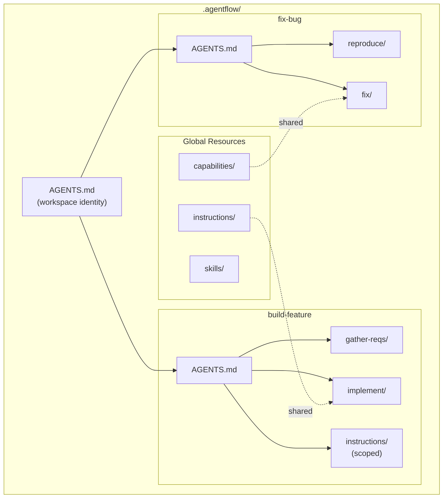
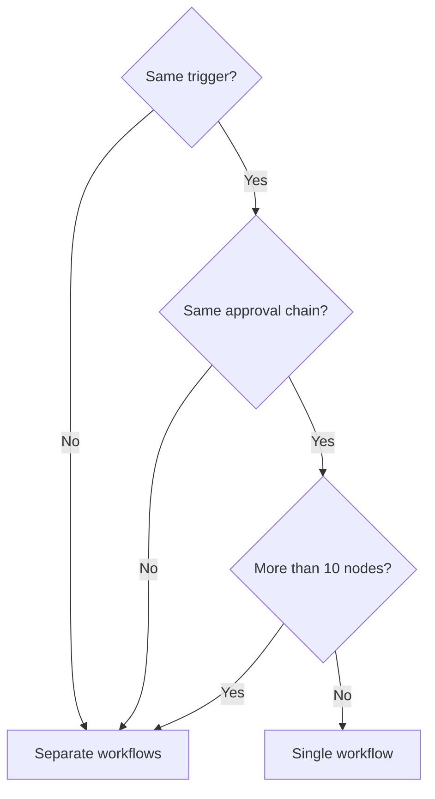
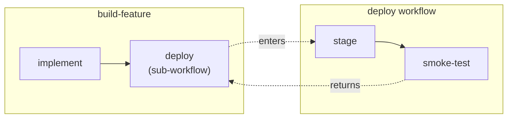
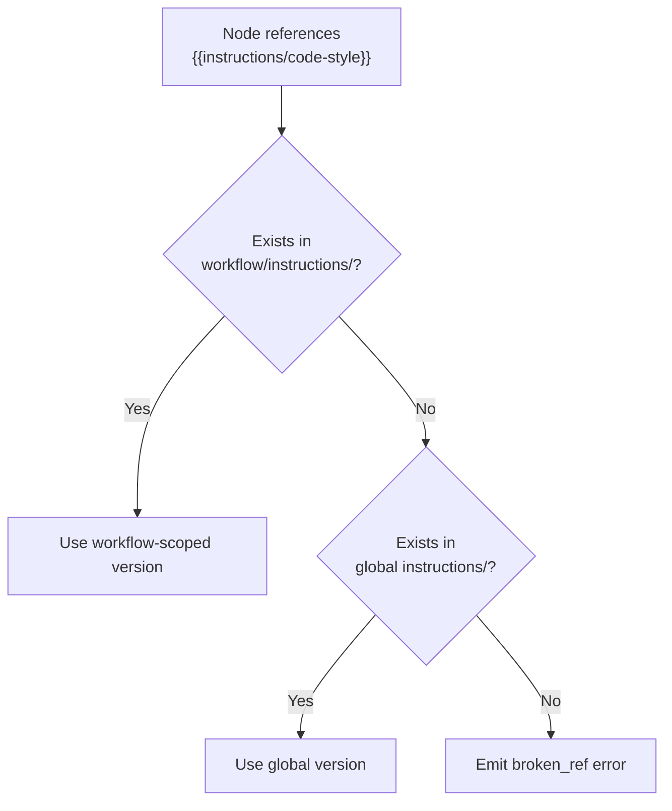

A workspace can contain any number of workflows. They share global resources but are otherwise independent — each has its own `AGENTS.md`, nodes, and optionally its own scoped resources.

## Workspace architecture



## What you will build

<Files>
  <Folder name=".agentflow" defaultOpen>
    <File name="AGENTS.md" />
    <Folder name="instructions" defaultOpen>
      <File name="code-style.md" />
    </Folder>
    <Folder name="capabilities" defaultOpen>
      <File name="write-file.md" />
      <File name="run-tests.md" />
    </Folder>
    <Folder name="build-feature" defaultOpen>
      <File name="AGENTS.md" />
      <Folder name="instructions">
        <File name="requirements-elicitation.md" />
      </Folder>
      <Folder name="gather-requirements">
        <File name="SKILL.md" />
      </Folder>
      <Folder name="implement">
        <File name="SKILL.md" />
      </Folder>
      <Folder name="deploy">
        <File name="SKILL.md" />
      </Folder>
    </Folder>
    <Folder name="fix-bug" defaultOpen>
      <File name="AGENTS.md" />
      <Folder name="reproduce">
        <File name="SKILL.md" />
      </Folder>
      <Folder name="fix">
        <File name="SKILL.md" />
      </Folder>
    </Folder>
    <Folder name="deploy" defaultOpen>
      <File name="AGENTS.md" />
      <Folder name="stage">
        <File name="SKILL.md" />
      </Folder>
      <Folder name="smoke-test">
        <File name="SKILL.md" />
      </Folder>
    </Folder>
  </Folder>
</Files>

<Steps>

<Step>
## Define the workspace identity

The root `AGENTS.md` applies to every workflow:

```yaml
---
name: Widget Platform
description: A SaaS platform for widget management.
identity:
  name: Platform Engineer
  role: Senior full-stack engineer. React, Node.js, PostgreSQL.
  constraints:
    - Always write tests before implementation
    - Follow existing patterns in the codebase
    - Use TypeScript strict mode
---
```

These constraints apply to every node in every workflow.
</Step>

<Step>
## Create shared global resources

Both workflows reference these:

```yaml
# .agentflow/instructions/code-style.md
---
name: Code Style
---

- Use strict mode
- Prefer functional patterns over classes
- No `any` types — use `unknown` and narrow
- Explicit return types on exported functions
```

```yaml
# .agentflow/capabilities/write-file.md
---
name: write-file
type: builtin
description: Create or modify files in the project.
allowed-tools: Write
---
```
</Step>

<Step>
## Create workflow-scoped resources

Resources specific to one workflow go inside its directory:

```yaml
# .agentflow/build-feature/instructions/requirements-elicitation.md
---
name: Requirements Elicitation
---

When gathering requirements:
1. Ask about the user's goal, not their proposed solution.
2. Identify acceptance criteria for each requirement.
3. Clarify edge cases and error scenarios.
```

Only `build-feature` nodes can reference this file.

<Callout type="info">
If both global and workflow-scoped directories have a file with the same name, the workflow-scoped version takes precedence for nodes in that workflow.
</Callout>
</Step>

<Step>
## When to split vs combine



| Signal | Action |
|--------|--------|
| Different triggers (feature request vs bug report) | Split |
| Different approval chains or reviewers | Split |
| Combined node count exceeds 10 | Split, use sub-workflows |
| Reusable process (deploy, test, review) | Extract as sub-workflow |
| Different team ownership | Split |
</Step>

<Step>
## Add a sub-workflow

A sub-workflow lets one workflow delegate to another. Create a reusable deploy workflow:

```yaml
# .agentflow/deploy/AGENTS.md
---
type: agents
name: deploy
description: Deploy to staging and run smoke tests.
---
```

```yaml
# .agentflow/deploy/stage/SKILL.md
---
name: stage
type: step
entry: true
---

# Deploy to Staging

1. Run {{capabilities/deploy-staging}}.
2. Wait for health checks to pass.

{{-> nodes/smoke-test}}
```

```yaml
# .agentflow/deploy/smoke-test/SKILL.md
---
name: smoke-test
type: step
---

# Run Smoke Tests

Run {{capabilities/run-tests}} against the staging deployment.
```

Reference it from `build-feature` as a sub-workflow node:

```yaml
# .agentflow/build-feature/deploy/SKILL.md
---
name: deploy
type: sub-workflow
workflow: deploy
---
```



The `workflow: deploy` field tells the runtime to execute the entire `deploy` workflow. After completion, execution returns to the parent.
</Step>

<Step>
## Validate the full workspace

```bash
agentflow validate
```

```
build-feature: 0 errors, 0 warnings
fix-bug: 0 errors, 0 warnings
deploy: 0 errors, 0 warnings
```

The validator checks all workflows at once, confirming sub-workflow references resolve and no cross-workflow conflicts exist.
</Step>

</Steps>

## Resource resolution order



## Sub-workflow reuse

Multiple parent workflows can reference the same sub-workflow by using `type: sub-workflow` with `workflow: deploy`. Click a sub-workflow node on the canvas to "Step Into" the referenced workflow's graph.

## Scaling guidelines

| Size | Workflows | Guidance |
|------|-----------|----------|
| Small (1-2) | Few shared resources | Keep everything global |
| Medium (3-5) | Moderate sharing | Use workflow-scoped resources for specifics |
| Large (6+) | Many resources | Extract sub-workflows, enforce naming conventions |

<Callout type="warn">
Watch for resource name collisions as workspaces grow. Two workflows with different `instructions/review-criteria.md` files will shadow each other. Use distinct names or workflow-scoped directories.
</Callout>

<Cards>
  <Card title="Workspaces" href="/docs/concepts/workspaces" description="The .agentflow/ directory structure" />
  <Card title="Workflows" href="/docs/concepts/workflows" description="Directed graphs of nodes" />
  <Card title="Resources" href="/docs/concepts/resources" description="Global vs workflow-scoped resources" />
  <Card title="Directory Layout" href="/docs/authoring/directory-layout" description="Full conventions for file structure" />
</Cards>
